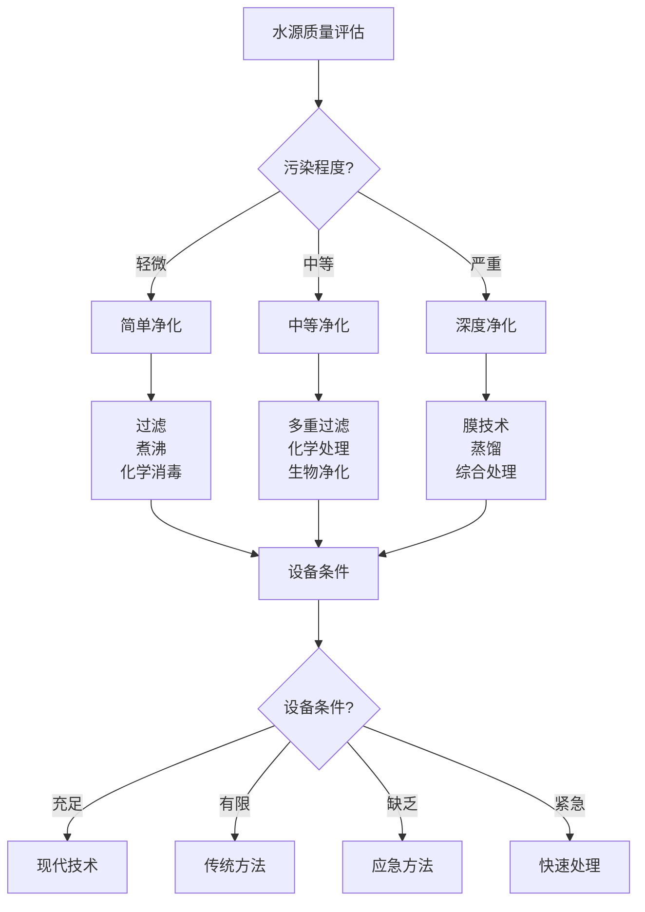

# 水源寻找与净化

## 💧 水源寻找技巧

### 1. 自然水源识别
- **地表水**：河流、湖泊、池塘、溪流
- **地下水**：泉水、井水、地下河
- **降水**：雨水、雪水、露水、雾水
- **植物水**：植物汁液、果实水分、树洞积水
- **动物水源**：动物饮水点、动物足迹、动物行为
- **人工水源**：水井、水塔、管道、储水设施

### 2. 地形水源判断
- **低洼地区**：山谷、盆地、洼地、积水区
- **岩石缝隙**：岩石裂缝、洞穴、岩壁渗水
- **植被茂密**：植被茂密区、湿地、沼泽
- **动物痕迹**：动物足迹、动物粪便、动物聚集
- **地质特征**：地质构造、岩石类型、土壤湿度
- **气候特征**：降雨分布、蒸发量、湿度变化

### 3. 植物水源指示
- **喜水植物**：芦苇、香蒲、水草、湿地植物
- **植物生长**：植物茂密、植物高大、植物分布
- **植物状态**：植物新鲜、植物茂盛、植物健康
- **植物种类**：植物多样性、植物群落、植物生态
- **植物变化**：植物季节变化、植物生长周期
- **植物环境**：植物环境、植物栖息地、植物生态

### 4. 动物水源指示
- **动物足迹**：动物足迹、动物路径、动物活动
- **动物粪便**：动物粪便、动物排泄、动物活动
- **动物聚集**：动物聚集、动物栖息、动物活动
- **动物行为**：动物饮水、动物觅食、动物活动
- **动物种类**：动物多样性、动物群落、动物生态
- **动物时间**：动物活动时间、动物规律、动物习性

## 🔍 水源质量评估

### 1. 物理指标评估
- **颜色**：清澈透明、微黄、浑浊、有色
- **透明度**：完全透明、半透明、不透明
- **气味**：无味、微味、异味、恶臭
- **味道**：无味、微甜、微咸、苦涩、异味
- **温度**：温度适宜、温度异常、温度变化
- **悬浮物**：无悬浮物、少量悬浮物、大量悬浮物

### 2. 化学指标评估
- **pH值**：中性、酸性、碱性、pH范围
- **硬度**：软水、硬水、硬度等级
- **矿物质**：矿物质含量、矿物质类型、矿物质平衡
- **污染物**：化学污染物、重金属、农药残留
- **溶解氧**：溶解氧含量、氧气饱和度、水质指标
- **营养盐**：营养盐含量、富营养化、水质指标

### 3. 生物指标评估
- **细菌**：细菌数量、细菌类型、细菌污染
- **病毒**：病毒存在、病毒类型、病毒污染
- **寄生虫**：寄生虫存在、寄生虫类型、寄生虫污染
- **藻类**：藻类存在、藻类类型、藻类污染
- **水生生物**：水生生物、生物多样性、生态平衡
- **生物活性**：生物活性、生物指标、水质指标

### 4. 安全风险评估
- **污染风险**：污染源、污染程度、污染类型
- **健康风险**：健康影响、疾病风险、安全风险
- **环境风险**：环境影响、生态风险、环境安全
- **使用风险**：使用安全、使用风险、使用建议
- **处理风险**：处理难度、处理成本、处理效果
- **应急风险**：应急处理、应急风险、应急预案

## 🧪 水源净化技术

### 1. 物理净化方法
- **过滤**：粗过滤、细过滤、超滤、反渗透
- **沉淀**：自然沉淀、化学沉淀、絮凝沉淀
- **吸附**：活性炭吸附、树脂吸附、天然吸附
- **蒸馏**：简单蒸馏、分馏、真空蒸馏
- **冷冻**：冷冻分离、冷冻净化、冷冻处理
- **离心**：离心分离、离心净化、离心处理

### 2. 化学净化方法
- **消毒**：氯消毒、臭氧消毒、紫外线消毒
- **氧化**：化学氧化、生物氧化、催化氧化
- **还原**：化学还原、生物还原、催化还原
- **中和**：酸碱中和、pH调节、缓冲处理
- **絮凝**：化学絮凝、生物絮凝、物理絮凝
- **沉淀**：化学沉淀、生物沉淀、物理沉淀

### 3. 生物净化方法
- **生物过滤**：生物膜过滤、生物活性过滤
- **生物降解**：有机物降解、污染物降解
- **生物吸附**：生物吸附、生物富集、生物处理
- **生物转化**：生物转化、生物代谢、生物处理
- **生物修复**：生物修复、生态修复、环境修复
- **生物监测**：生物监测、生物指标、生物评价

### 4. 现代净化技术
- **膜技术**：超滤膜、反渗透膜、纳滤膜
- **光催化**：光催化氧化、光催化降解
- **电化学**：电化学氧化、电化学还原
- **超声波**：超声波处理、超声波净化
- **微波**：微波处理、微波净化、微波消毒
- **等离子体**：等离子体处理、等离子体净化

## 🛠️ 净化设备使用

### 1. 便携式净水器
- **滤芯类型**：陶瓷滤芯、活性炭滤芯、超滤膜
- **过滤精度**：粗过滤、细过滤、超滤、反渗透
- **流量大小**：流量大小、处理能力、使用效率
- **使用寿命**：滤芯寿命、设备寿命、维护周期
- **维护保养**：清洁保养、更换滤芯、故障处理
- **使用技巧**：使用技巧、注意事项、安全使用

### 2. 化学净水剂
- **消毒剂**：氯片、碘片、二氧化氯、臭氧
- **絮凝剂**：明矾、聚合氯化铝、聚丙烯酰胺
- **pH调节剂**：石灰、苏打、酸类、碱类
- **除味剂**：活性炭、除味剂、香味剂
- **营养剂**：矿物质、维生素、微量元素
- **使用剂量**：使用剂量、浓度控制、效果评估

### 3. 自制净化设备
- **简易过滤器**：沙石过滤、布过滤、纸过滤
- **蒸馏器**：简易蒸馏、太阳能蒸馏、火蒸馏
- **沉淀池**：简易沉淀、自然沉淀、化学沉淀
- **吸附器**：活性炭吸附、天然吸附、自制吸附
- **消毒器**：紫外线消毒、加热消毒、化学消毒
- **储存器**：储存容器、储存环境、储存管理

### 4. 应急净化方法
- **煮沸消毒**：煮沸时间、煮沸温度、消毒效果
- **化学消毒**：化学消毒剂、消毒剂量、消毒时间
- **物理过滤**：物理过滤、过滤材料、过滤效果
- **自然净化**：自然净化、时间净化、环境净化
- **混合处理**：多种方法、综合处理、效果提升
- **应急储存**：应急储存、储存容器、储存环境

## 📊 水源净化对比

| 净化方法 | 净化效果 | 处理速度 | 设备需求 | 成本 | 适用性 | 推荐指数 |
|----------|----------|----------|----------|------|--------|----------|
| **煮沸** | 高 | 慢 | 低 | 低 | 高 | ⭐⭐⭐⭐⭐ |
| **过滤** | 中 | 中 | 中 | 中 | 高 | ⭐⭐⭐⭐ |
| **化学消毒** | 高 | 快 | 低 | 低 | 中 | ⭐⭐⭐⭐ |
| **膜技术** | 极高 | 快 | 高 | 高 | 中 | ⭐⭐⭐⭐ |
| **蒸馏** | 极高 | 慢 | 中 | 中 | 低 | ⭐⭐⭐ |
| **生物净化** | 中 | 慢 | 低 | 低 | 低 | ⭐⭐⭐ |

## 🎯 水源净化决策树

## 🎓 费曼学习法应用

### 第一步：选择概念
选择"水源寻找与净化"作为学习概念

### 第二步：教授他人
用简单语言解释：
> "野外找水要看地形、植物、动物指示，找到水源后要评估质量，然后选择合适的方法净化：煮沸最安全，过滤最常用，化学消毒最快速，现代膜技术最彻底。"

### 第三步：回顾简化
- **水源寻找**：自然水源、地形判断、植物指示、动物指示
- **质量评估**：物理指标、化学指标、生物指标、安全风险
- **净化技术**：物理净化、化学净化、生物净化、现代技术
- **设备使用**：便携设备、化学药剂、自制设备、应急方法

### 第四步：组织优化
建立水源管理与技能的关系：
- 水源寻找 → [[01-方向识别技能|方向识别]]
- 质量评估 → [[02-理解层-原理机制/04-环境保护理念/01-生态影响评估|生态评估]]
- 净化技术 → [[04-创新层-进阶发展/02-专业配置/03-技术装备集成|技术集成]]
- 设备使用 → [[01-装备准备/01-基础装备清单|基础装备]]

## 🏃‍♂️ 刻意练习要点

### 水源管理练习
1. **寻找技能**：练习水源寻找技能
2. **评估技能**：练习水源质量评估
3. **净化技能**：练习水源净化技能
4. **设备使用**：练习净化设备使用

### 实践验证
- **寻找测试**：测试水源寻找技能
- **评估测试**：测试质量评估技能
- **净化测试**：测试净化技能
- **持续改进**：持续改进技能

## 🔗 水源管理与技能的关系

### 水源寻找技能
- **观察技能**：[[03-野外生存|野外生存]]
- **识别技能**：[[03-野外生存|野外生存]]
- **判断技能**：[[04-创新层-进阶发展/03-领导力培养/06-责任与担当|责任担当]]
- **分析技能**：[[04-创新层-进阶发展/01-高级技巧/07-跨学科知识整合|跨学科知识]]

### 质量评估技能
- **检测技能**：[[04-创新层-进阶发展/02-专业配置/03-技术装备集成|技术集成]]
- **分析技能**：[[04-创新层-进阶发展/01-高级技巧/07-跨学科知识整合|跨学科知识]]
- **评估技能**：[[02-理解层-原理机制/04-环境保护理念/01-生态影响评估|生态评估]]
- **判断技能**：[[04-创新层-进阶发展/03-领导力培养/06-责任与担当|责任担当]]

### 净化技术技能
- **操作技能**：[[03-野外生存|野外生存]]
- **设备技能**：[[01-装备准备/01-基础装备清单|基础装备]]
- **化学技能**：[[04-创新层-进阶发展/01-高级技巧/07-跨学科知识整合|跨学科知识]]
- **创新技能**：[[04-创新层-进阶发展/01-高级技巧|高级技巧]]

### 设备使用技能
- **操作技能**：[[03-野外生存|野外生存]]
- **维护技能**：[[04-创新层-进阶发展/02-专业配置/04-维护保养体系|维护保养]]
- **故障处理**：[[04-创新层-进阶发展/02-专业配置/04-维护保养体系|维护保养]]
- **优化技能**：[[04-创新层-进阶发展/02-专业配置/05-升级优化策略|升级优化]]

## 📋 水源管理检查清单

### 水源寻找
- [ ] 识别自然水源
- [ ] 判断地形水源
- [ ] 观察植物指示
- [ ] 观察动物指示

### 质量评估
- [ ] 评估物理指标
- [ ] 评估化学指标
- [ ] 评估生物指标
- [ ] 评估安全风险

### 净化技术
- [ ] 选择净化方法
- [ ] 掌握净化技术
- [ ] 使用净化设备
- [ ] 评估净化效果

### 设备使用
- [ ] 选择合适设备
- [ ] 掌握设备使用
- [ ] 维护设备状态
- [ ] 处理设备故障

## 🎯 水源管理策略

### 系统性策略
1. **需求分析**：分析水源需求
2. **寻找定位**：寻找水源位置
3. **质量评估**：评估水源质量
4. **净化处理**：净化水源质量

### 安全性策略
- **安全第一**：安全始终是第一优先级
- **质量保证**：保证水源质量
- **应急准备**：准备应急方案
- **持续监控**：持续监控水源状态

## 🔗 相关链接
- [[01-方向识别技能|方向识别技能]]
- [[03-食物获取技能|食物获取技能]]
- [[04-生火技术|生火技术]]
- [[05-高海拔适应|高海拔适应]]