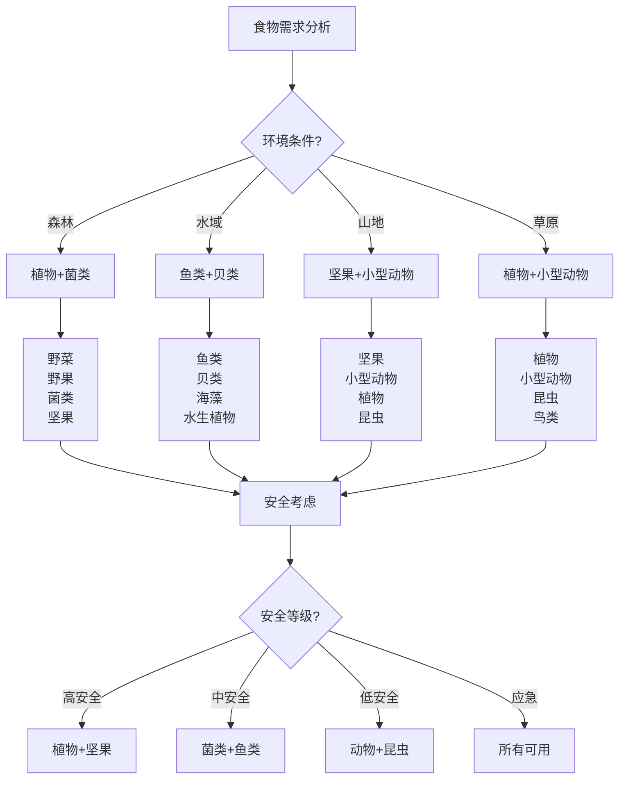

# 食物获取技能

## 🌿 植物性食物获取

### 1. 可食用植物识别
- **野菜类**：蒲公英、荠菜、马齿苋、车前草
- **野果类**：野草莓、野葡萄、野苹果、野梨
- **坚果类**：松子、榛子、核桃、栗子
- **根茎类**：山药、莲藕、竹笋、蕨菜
- **菌类**：蘑菇、木耳、银耳、灵芝
- **海藻类**：海带、紫菜、海苔、海草

### 2. 植物识别技巧
- **形态特征**：叶片形状、花朵特征、果实特征
- **生长环境**：生长环境、土壤条件、气候要求
- **季节特征**：生长季节、成熟时间、采集时间
- **毒性识别**：有毒植物、毒性特征、中毒症状
- **相似植物**：相似植物、区别特征、识别要点
- **安全原则**：安全原则、谨慎原则、确认原则

### 3. 植物采集技巧
- **采集时间**：最佳采集时间、季节选择、天气条件
- **采集方法**：采集方法、工具使用、保护措施
- **采集数量**：适量采集、可持续采集、保护资源
- **采集部位**：可食用部位、营养价值、采集技巧
- **储存方法**：储存方法、保鲜技巧、储存环境
- **处理技巧**：清洗处理、烹饪方法、食用技巧

### 4. 植物营养价值
- **营养成分**：蛋白质、碳水化合物、脂肪、维生素
- **矿物质**：钙、铁、锌、镁、钾、磷
- **维生素**：维生素A、B、C、D、E、K
- **膳食纤维**：膳食纤维、消化功能、健康作用
- **抗氧化物质**：抗氧化物质、抗衰老、健康保护
- **药用价值**：药用价值、保健作用、治疗功效

## 🐟 动物性食物获取

### 1. 鱼类获取
- **鱼类识别**：淡水鱼、海水鱼、鱼类特征、栖息环境
- **捕鱼方法**：钓鱼、网鱼、叉鱼、陷阱捕鱼
- **捕鱼工具**：鱼竿、鱼线、鱼钩、鱼网、鱼叉
- **捕鱼技巧**：钓鱼技巧、网鱼技巧、叉鱼技巧
- **鱼类处理**：鱼类处理、去鳞去内脏、清洗保存
- **鱼类烹饪**：鱼类烹饪、烹饪方法、营养保持

### 2. 小型动物获取
- **小型动物**：兔子、松鼠、鸟类、爬行动物
- **捕猎方法**：陷阱捕猎、弓箭捕猎、投掷捕猎
- **捕猎工具**：陷阱、弓箭、投掷器、捕猎网
- **捕猎技巧**：设置陷阱、瞄准技巧、投掷技巧
- **动物处理**：动物处理、去皮去内脏、清洗保存
- **动物烹饪**：动物烹饪、烹饪方法、营养保持

### 3. 昆虫获取
- **可食用昆虫**：蚂蚁、蜜蜂、蝗虫、蝉、蚕蛹
- **昆虫识别**：昆虫特征、栖息环境、活动时间
- **采集方法**：采集方法、工具使用、安全措施
- **采集技巧**：采集技巧、时间选择、地点选择
- **昆虫处理**：昆虫处理、清洗处理、烹饪方法
- **昆虫营养**：昆虫营养、蛋白质含量、营养价值

### 4. 贝类获取
- **贝类识别**：贝类特征、栖息环境、可食用种类
- **采集方法**：采集方法、工具使用、安全措施
- **采集技巧**：采集技巧、时间选择、地点选择
- **贝类处理**：贝类处理、清洗处理、烹饪方法
- **贝类营养**：贝类营养、蛋白质含量、营养价值
- **安全考虑**：安全考虑、毒素风险、食用安全

## 🍄 菌类食物获取

### 1. 可食用菌类识别
- **常见菌类**：香菇、平菇、金针菇、杏鲍菇
- **野生菌类**：松茸、牛肝菌、鸡枞菌、羊肚菌
- **菌类特征**：菌盖特征、菌柄特征、菌褶特征
- **生长环境**：生长环境、土壤条件、气候要求
- **季节特征**：生长季节、成熟时间、采集时间
- **营养价值**：营养价值、营养成分、健康作用

### 2. 有毒菌类识别
- **有毒菌类**：毒蘑菇、有毒菌类、毒性特征
- **毒性症状**：中毒症状、毒性反应、中毒处理
- **识别要点**：识别要点、区别特征、安全原则
- **预防措施**：预防措施、安全原则、谨慎原则
- **应急处理**：中毒处理、急救措施、医疗救治
- **安全原则**：安全原则、确认原则、谨慎原则

### 3. 菌类采集技巧
- **采集时间**：最佳采集时间、季节选择、天气条件
- **采集方法**：采集方法、工具使用、保护措施
- **采集数量**：适量采集、可持续采集、保护资源
- **采集部位**：可食用部位、营养价值、采集技巧
- **储存方法**：储存方法、保鲜技巧、储存环境
- **处理技巧**：清洗处理、烹饪方法、食用技巧

### 4. 菌类烹饪技巧
- **烹饪方法**：炒制、炖煮、蒸制、烤制
- **调味技巧**：调味技巧、口感提升、营养保持
- **搭配技巧**：搭配技巧、营养搭配、口感搭配
- **安全考虑**：安全考虑、烹饪安全、食用安全
- **营养保持**：营养保持、营养损失、营养最大化
- **创新烹饪**：创新烹饪、新方法、新口味

## 🥜 坚果类食物获取

### 1. 坚果类识别
- **常见坚果**：松子、榛子、核桃、栗子、杏仁
- **坚果特征**：坚果特征、外壳特征、果仁特征
- **生长环境**：生长环境、土壤条件、气候要求
- **季节特征**：生长季节、成熟时间、采集时间
- **营养价值**：营养价值、营养成分、健康作用
- **储存特性**：储存特性、保质期、储存条件

### 2. 坚果采集技巧
- **采集时间**：最佳采集时间、季节选择、成熟度
- **采集方法**：采集方法、工具使用、保护措施
- **采集数量**：适量采集、可持续采集、保护资源
- **采集部位**：可食用部位、营养价值、采集技巧
- **储存方法**：储存方法、保鲜技巧、储存环境
- **处理技巧**：清洗处理、去壳技巧、食用技巧

### 3. 坚果营养价值
- **营养成分**：蛋白质、脂肪、碳水化合物、维生素
- **矿物质**：钙、铁、锌、镁、钾、磷
- **维生素**：维生素A、B、C、D、E、K
- **不饱和脂肪酸**：不饱和脂肪酸、健康脂肪、心血管保护
- **抗氧化物质**：抗氧化物质、抗衰老、健康保护
- **膳食纤维**：膳食纤维、消化功能、健康作用

### 4. 坚果食用技巧
- **食用方法**：生食、烤制、炒制、制作食品
- **搭配技巧**：搭配技巧、营养搭配、口感搭配
- **安全考虑**：安全考虑、过敏风险、食用安全
- **营养保持**：营养保持、营养损失、营养最大化
- **创新食用**：创新食用、新方法、新口味
- **健康建议**：健康建议、适量食用、健康饮食

## 📊 食物获取对比

| 食物类型 | 获取难度 | 营养价值 | 安全性 | 储存性 | 适用性 | 推荐指数 |
|----------|----------|----------|--------|--------|--------|----------|
| **植物性** | 低 | 中 | 高 | 中 | 高 | ⭐⭐⭐⭐⭐ |
| **动物性** | 高 | 高 | 中 | 低 | 中 | ⭐⭐⭐ |
| **菌类** | 中 | 高 | 低 | 低 | 中 | ⭐⭐⭐ |
| **坚果类** | 低 | 高 | 高 | 高 | 高 | ⭐⭐⭐⭐⭐ |

## 🎯 食物获取决策树

## 🎓 费曼学习法应用

### 第一步：选择概念
选择"食物获取技能"作为学习概念

### 第二步：教授他人
用简单语言解释：
> "野外获取食物要分四类：植物性食物最安全，包括野菜野果坚果；动物性食物营养高，包括鱼类小型动物；菌类食物要小心，必须确认无毒；坚果类食物最可靠，营养丰富易储存。"

### 第三步：回顾简化
- **植物性食物**：野菜野果、识别技巧、采集技巧、营养价值
- **动物性食物**：鱼类小型动物、捕猎方法、处理技巧、烹饪方法
- **菌类食物**：可食用菌类、有毒菌类、采集技巧、烹饪技巧
- **坚果类食物**：坚果识别、采集技巧、营养价值、食用技巧

### 第四步：组织优化
建立食物获取与技能的关系：
- 植物性食物 → [[02-理解层-原理机制/04-环境保护理念/01-生态影响评估|生态评估]]
- 动物性食物 → [[03-野外生存|野外生存]]
- 菌类食物 → [[04-应急处理/01-常见伤病处理|伤病处理]]
- 坚果类食物 → [[01-装备准备/01-基础装备清单|基础装备]]

## 🏃‍♂️ 刻意练习要点

### 食物获取练习
1. **识别技能**：练习食物识别技能
2. **采集技能**：练习食物采集技能
3. **处理技能**：练习食物处理技能
4. **烹饪技能**：练习食物烹饪技能

### 实践验证
- **识别测试**：测试食物识别技能
- **采集测试**：测试食物采集技能
- **处理测试**：测试食物处理技能
- **持续改进**：持续改进技能

## 🔗 食物获取与技能的关系

### 植物性食物技能
- **识别技能**：[[03-野外生存|野外生存]]
- **采集技能**：[[03-野外生存|野外生存]]
- **处理技能**：[[02-营地建设/05-户外烹饪技巧|户外烹饪]]
- **营养技能**：[[01-认知层-基础概念/04-价值与意义/01-身心健康益处|身心健康]]

### 动物性食物技能
- **捕猎技能**：[[03-野外生存|野外生存]]
- **处理技能**：[[03-野外生存|野外生存]]
- **烹饪技能**：[[02-营地建设/05-户外烹饪技巧|户外烹饪]]
- **安全技能**：[[04-应急处理/01-常见伤病处理|伤病处理]]

### 菌类食物技能
- **识别技能**：[[03-野外生存|野外生存]]
- **安全技能**：[[04-应急处理/01-常见伤病处理|伤病处理]]
- **采集技能**：[[03-野外生存|野外生存]]
- **烹饪技能**：[[02-营地建设/05-户外烹饪技巧|户外烹饪]]

### 坚果类食物技能
- **识别技能**：[[03-野外生存|野外生存]]
- **采集技能**：[[03-野外生存|野外生存]]
- **储存技能**：[[01-装备准备/01-基础装备清单|基础装备]]
- **营养技能**：[[01-认知层-基础概念/04-价值与意义/01-身心健康益处|身心健康]]

## 📋 食物获取检查清单

### 植物性食物
- [ ] 识别可食用植物
- [ ] 掌握采集技巧
- [ ] 了解营养价值
- [ ] 学会储存方法

### 动物性食物
- [ ] 识别可食用动物
- [ ] 掌握捕猎方法
- [ ] 学会处理技巧
- [ ] 掌握烹饪方法

### 菌类食物
- [ ] 识别可食用菌类
- [ ] 识别有毒菌类
- [ ] 掌握采集技巧
- [ ] 学会烹饪方法

### 坚果类食物
- [ ] 识别坚果种类
- [ ] 掌握采集技巧
- [ ] 了解营养价值
- [ ] 学会储存方法

## 🎯 食物获取策略

### 安全性策略
1. **安全第一**：安全始终是第一优先级
2. **谨慎识别**：谨慎识别食物种类
3. **确认无毒**：确认食物无毒无害
4. **适量食用**：适量食用，避免过量

### 可持续策略
- **保护资源**：保护自然资源
- **适量采集**：适量采集，避免过度
- **生态平衡**：维护生态平衡
- **持续发展**：可持续发展

## 🔗 相关链接
- [[01-方向识别技能|方向识别技能]]
- [[02-水源寻找与净化|水源寻找与净化]]
- [[04-生火技术|生火技术]]
- [[05-高海拔适应|高海拔适应]]