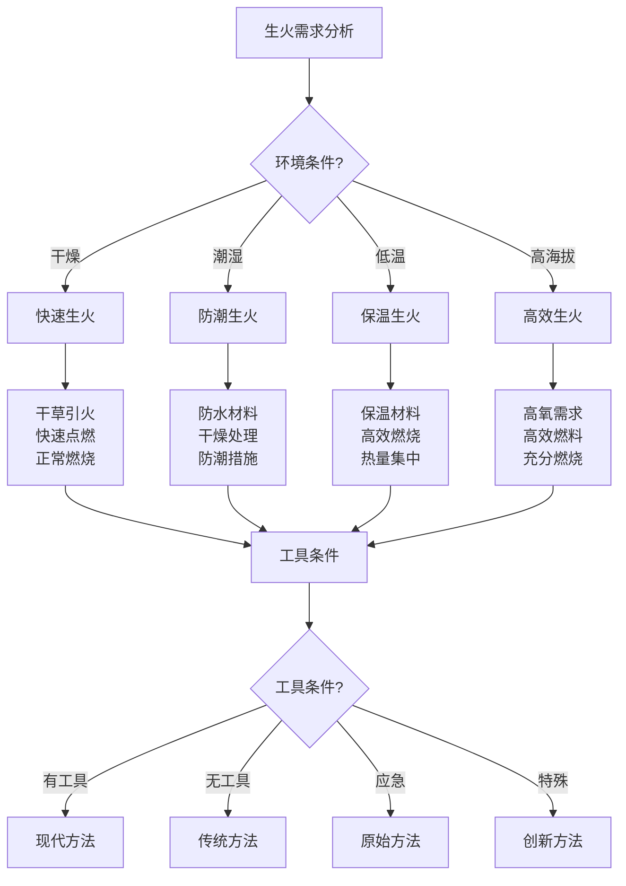

# 生火技术

## 🔥 生火原理与方法

### 1. 生火基本原理
- **燃烧三要素**：燃料、氧气、温度
- **燃烧过程**：预热、点燃、燃烧、维持
- **热量传递**：传导、对流、辐射
- **燃烧效率**：燃烧效率、热量利用、燃料消耗
- **燃烧控制**：火势控制、温度控制、燃烧时间
- **安全燃烧**：安全燃烧、防火措施、应急处理

### 2. 生火方法分类
- **摩擦生火**：钻木取火、摩擦生火、原始方法
- **撞击生火**：火石撞击、火花生火、传统方法
- **化学生火**：化学反应、氧化反应、现代方法
- **电热生火**：电热丝、电火花、现代技术
- **太阳能生火**：聚光生火、太阳能、环保方法
- **机械生火**：打火机、火柴、现代工具

### 3. 生火环境适应
- **干燥环境**：干燥环境、易燃材料、快速生火
- **潮湿环境**：潮湿环境、防水措施、干燥材料
- **低温环境**：低温环境、保温措施、高效燃烧
- **高海拔环境**：高海拔、氧气稀薄、燃烧困难
- **强风环境**：强风环境、防风措施、稳定燃烧
- **雨雪环境**：雨雪环境、防雨措施、保护火源

### 4. 生火安全原则
- **安全第一**：安全始终是第一优先级
- **环境安全**：选择安全环境、远离易燃物
- **火源控制**：控制火源、防止蔓延
- **人员安全**：保护人员安全、防止烧伤
- **应急准备**：准备应急设备、快速响应
- **环境保护**：保护环境、减少影响

## 🪵 燃料选择与准备

### 1. 燃料类型选择
- **引火材料**：干草、纸张、木屑、树皮
- **小燃料**：细树枝、小木块、干燥材料
- **中燃料**：中等木块、树枝、燃烧材料
- **大燃料**：大木块、树干、持久燃烧
- **特殊燃料**：煤炭、木炭、固体燃料
- **应急燃料**：塑料、橡胶、应急材料

### 2. 燃料特性分析
- **易燃性**：易燃程度、点燃难度、燃烧速度
- **燃烧时间**：燃烧时间、持久性、热量输出
- **热量输出**：热量大小、温度高低、燃烧效率
- **烟雾产生**：烟雾多少、环境影响、健康影响
- **燃烧残留**：燃烧残留、灰烬多少、清理难度
- **获取难度**：获取难度、成本高低、可持续性

### 3. 燃料准备技巧
- **干燥处理**：干燥处理、去除水分、提高易燃性
- **尺寸选择**：尺寸选择、大小搭配、燃烧效率
- **数量控制**：数量控制、适量准备、避免浪费
- **储存管理**：储存管理、防潮保护、保质期
- **安全储存**：安全储存、防火措施、安全距离
- **循环利用**：循环利用、节约资源、可持续发展

### 4. 燃料优化策略
- **搭配使用**：不同燃料搭配、提高效率
- **分层燃烧**：分层燃烧、控制火势、延长燃烧
- **时间控制**：时间控制、按需燃烧、节约燃料
- **温度调节**：温度调节、控制火势、适应需求
- **效率提升**：效率提升、优化燃烧、减少浪费
- **环保考虑**：环保考虑、减少污染、保护环境

## 🛠️ 生火工具使用

### 1. 传统生火工具
- **火石**：火石、燧石、撞击生火
- **火镰**：火镰、金属工具、撞击生火
- **火钻**：火钻、钻木取火、摩擦生火
- **火弓**：火弓、机械摩擦、效率提升
- **火锯**：火锯、摩擦生火、快速生火
- **火板**：火板、摩擦生火、基础工具

### 2. 现代生火工具
- **打火机**：打火机、气体打火、方便快捷
- **火柴**：火柴、化学点火、传统工具
- **电热丝**：电热丝、电热生火、现代技术
- **电火花**：电火花、电击生火、现代技术
- **化学点火**：化学点火、化学反应、现代方法
- **太阳能点火**：太阳能点火、环保技术、现代方法

### 3. 辅助工具
- **吹火管**：吹火管、增加氧气、促进燃烧
- **火钳**：火钳、调整燃料、控制火势
- **火铲**：火铲、清理灰烬、管理火源
- **灭火器**：灭火器、应急灭火、安全保护
- **防护用品**：防护用品、安全保护、防止烧伤
- **储存容器**：储存容器、燃料储存、工具储存

### 4. 工具维护保养
- **清洁保养**：清洁保养、去除污垢、保持功能
- **功能检查**：功能检查、确保正常、及时维修
- **储存管理**：储存管理、防潮保护、延长寿命
- **安全使用**：安全使用、正确操作、防止意外
- **定期更换**：定期更换、及时更新、保持性能
- **应急备用**：应急备用、备用工具、应急准备

## 🔥 生火技巧与方法

### 1. 基础生火技巧
- **火种准备**：火种准备、引火材料、点燃基础
- **燃料堆叠**：燃料堆叠、大小搭配、燃烧效率
- **氧气供应**：氧气供应、通风设计、促进燃烧
- **火势控制**：火势控制、温度调节、燃烧时间
- **火源维持**：火源维持、持续燃烧、热量输出
- **安全监控**：安全监控、防止意外、应急处理

### 2. 高级生火技巧
- **无工具生火**：无工具生火、原始方法、应急技能
- **恶劣环境生火**：恶劣环境、特殊技巧、适应能力
- **快速生火**：快速生火、效率技巧、时间控制
- **持久生火**：持久生火、长时间燃烧、热量维持
- **多火源管理**：多火源、同时管理、效率提升
- **火源转移**：火源转移、安全转移、应急处理

### 3. 特殊环境生火
- **雪地生火**：雪地生火、防雪措施、保温技巧
- **沙地生火**：沙地生火、防风措施、稳定技巧
- **岩石生火**：岩石生火、固定技巧、安全措施
- **水中生火**：水中生火、防水措施、特殊技巧
- **高空生火**：高空生火、氧气考虑、燃烧调整
- **密闭空间生火**：密闭空间、通风考虑、安全措施

### 4. 生火创新技巧
- **环保生火**：环保生火、减少污染、可持续发展
- **节能生火**：节能生火、提高效率、减少消耗
- **智能生火**：智能生火、现代技术、自动化控制
- **多功能生火**：多功能生火、一火多用、效率提升
- **艺术生火**：艺术生火、美观设计、体验提升
- **教育生火**：教育生火、技能传授、知识传播

## 🛡️ 生火安全管理

### 1. 防火安全措施
- **环境选择**：选择安全环境、远离易燃物
- **防火隔离**：防火隔离、安全距离、防护措施
- **火源控制**：火源控制、火势管理、防止蔓延
- **人员保护**：人员保护、安全距离、防护用品
- **设备准备**：灭火设备、应急工具、快速响应
- **监控管理**：监控管理、持续观察、及时处理

### 2. 应急处理措施
- **火势失控**：火势失控、立即灭火、应急处理
- **人员受伤**：人员受伤、立即救治、医疗处理
- **环境危险**：环境危险、立即撤离、安全转移
- **设备故障**：设备故障、立即处理、应急替代
- **天气变化**：天气变化、立即调整、适应变化
- **其他意外**：其他意外、立即处理、应急响应

### 3. 环境保护措施
- **最小影响**：最小化对环境的影响
- **生态保护**：保护生态环境、植被保护
- **土壤保护**：保护土壤、避免破坏
- **空气保护**：保护空气质量、减少污染
- **水源保护**：保护水源、避免污染
- **生物保护**：保护生物、避免伤害

### 4. 安全培训教育
- **安全知识**：安全知识、防火知识、应急知识
- **技能培训**：技能培训、操作培训、安全培训
- **应急演练**：应急演练、实战演练、技能提升
- **安全意识**：安全意识、安全文化、安全习惯
- **持续教育**：持续教育、知识更新、技能提升
- **经验分享**：经验分享、案例学习、教训总结

## 📊 生火方法对比

| 生火方法 | 难度 | 成功率 | 速度 | 设备需求 | 适用环境 | 推荐指数 |
|----------|------|--------|------|----------|----------|----------|
| **钻木取火** | 极高 | 低 | 慢 | 无 | 通用 | ⭐⭐ |
| **火石撞击** | 高 | 中 | 中 | 低 | 通用 | ⭐⭐⭐ |
| **打火机** | 低 | 高 | 快 | 低 | 通用 | ⭐⭐⭐⭐⭐ |
| **火柴** | 低 | 高 | 快 | 低 | 通用 | ⭐⭐⭐⭐ |
| **电热生火** | 低 | 高 | 快 | 高 | 有电 | ⭐⭐⭐ |
| **太阳能生火** | 中 | 中 | 慢 | 中 | 晴天 | ⭐⭐⭐ |

## 🎯 生火技术决策树

## 🎓 费曼学习法应用

### 第一步：选择概念
选择"生火技术"作为学习概念

### 第二步：教授他人
用简单语言解释：
> "生火需要燃料、氧气、温度三个要素。选择合适燃料，准备引火材料，使用工具点燃，控制火势维持燃烧。不同环境要用不同方法，安全始终是第一位的。"

### 第三步：回顾简化
- **生火原理**：燃烧三要素、燃烧过程、热量传递
- **燃料管理**：燃料选择、特性分析、准备技巧、优化策略
- **工具使用**：传统工具、现代工具、辅助工具、维护保养
- **生火技巧**：基础技巧、高级技巧、特殊环境、创新技巧

### 第四步：组织优化
建立生火与技能的关系：
- 生火原理 → [[02-理解层-原理机制/01-户外生存原理/01-人体生理适应|人体适应]]
- 燃料管理 → [[01-装备准备/06-燃料与能源|燃料管理]]
- 工具使用 → [[01-装备准备/01-基础装备清单|基础装备]]
- 生火技巧 → [[03-野外生存|野外生存]]

## 🏃‍♂️ 刻意练习要点

### 生火技能练习
1. **理论学习**：学习生火理论知识
2. **工具使用**：练习工具使用技能
3. **技巧练习**：练习生火技巧
4. **环境适应**：适应不同环境

### 实践验证
- **生火测试**：测试生火技能
- **环境测试**：测试不同环境
- **安全测试**：测试安全技能
- **持续改进**：持续改进技能

## 🔗 生火与技能的关系

### 生火原理技能
- **物理知识**：[[04-创新层-进阶发展/01-高级技巧/07-跨学科知识整合|跨学科知识]]
- **化学知识**：[[04-创新层-进阶发展/01-高级技巧/07-跨学科知识整合|跨学科知识]]
- **环境知识**：[[02-理解层-原理机制/01-户外生存原理/02-环境因素影响|环境因素]]
- **安全知识**：[[02-理解层-原理机制/03-安全防护机制|安全防护]]

### 燃料管理技能
- **选择技能**：[[03-野外生存|野外生存]]
- **分析技能**：[[04-创新层-进阶发展/01-高级技巧/07-跨学科知识整合|跨学科知识]]
- **准备技能**：[[03-野外生存|野外生存]]
- **优化技能**：[[04-创新层-进阶发展/02-专业配置/05-升级优化策略|升级优化]]

### 工具使用技能
- **操作技能**：[[03-野外生存|野外生存]]
- **维护技能**：[[04-创新层-进阶发展/02-专业配置/04-维护保养体系|维护保养]]
- **安全技能**：[[02-理解层-原理机制/03-安全防护机制|安全防护]]
- **创新技能**：[[04-创新层-进阶发展/01-高级技巧|高级技巧]]

### 生火技巧技能
- **基础技能**：[[03-野外生存|野外生存]]
- **高级技能**：[[04-创新层-进阶发展/01-高级技巧|高级技巧]]
- **环境技能**：[[02-理解层-原理机制/01-户外生存原理/02-环境因素影响|环境因素]]
- **安全技能**：[[02-理解层-原理机制/03-安全防护机制|安全防护]]

## 📋 生火技术检查清单

### 生火原理
- [ ] 了解燃烧三要素
- [ ] 掌握燃烧过程
- [ ] 理解热量传递
- [ ] 学会燃烧控制

### 燃料管理
- [ ] 选择合适的燃料
- [ ] 分析燃料特性
- [ ] 掌握准备技巧
- [ ] 学会优化策略

### 工具使用
- [ ] 选择合适的工具
- [ ] 掌握工具使用
- [ ] 学会工具维护
- [ ] 准备应急工具

### 生火技巧
- [ ] 掌握基础技巧
- [ ] 学会高级技巧
- [ ] 适应特殊环境
- [ ] 创新生火方法

## 🎯 生火技术策略

### 安全性策略
1. **安全第一**：安全始终是第一优先级
2. **预防为主**：预防为主、防治结合
3. **应急准备**：准备应急设备、快速响应
4. **持续监控**：持续监控、及时处理

### 效率性策略
- **效率优先**：提高生火效率
- **燃料节约**：节约燃料、减少浪费
- **时间控制**：控制时间、快速生火
- **持续优化**：持续优化、提高技能

## 🔗 相关链接
- [[01-方向识别技能|方向识别技能]]
- [[02-水源寻找与净化|水源寻找与净化]]
- [[03-食物获取技能|食物获取技能]]
- [[05-高海拔适应|高海拔适应]]