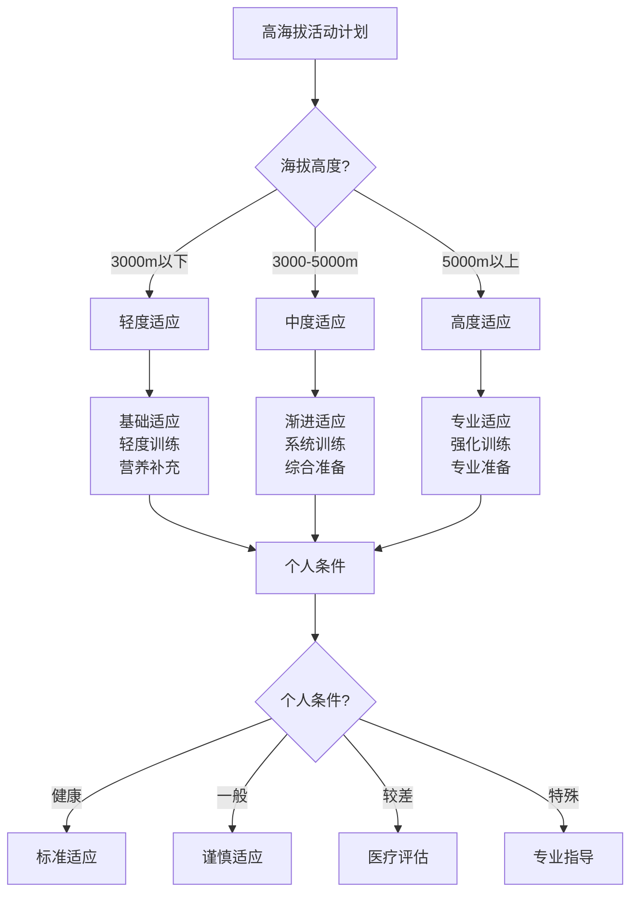

# 高海拔适应

## ⛰️ 高海拔生理影响

### 1. 氧气稀薄影响
- **氧气浓度**：海拔升高、氧气浓度降低、呼吸困难
- **血氧饱和度**：血氧饱和度下降、缺氧症状、身体反应
- **呼吸频率**：呼吸频率加快、呼吸加深、代偿反应
- **心率变化**：心率加快、心脏负担增加、循环系统反应
- **血压变化**：血压升高、血管收缩、循环系统调节
- **代谢变化**：代谢率提高、能量消耗增加、营养需求增加

### 2. 气压降低影响
- **大气压力**：大气压力降低、气体膨胀、身体反应
- **耳压变化**：耳压变化、耳鸣、听力影响
- **血管压力**：血管压力变化、血液循环、身体调节
- **液体平衡**：液体平衡变化、水分流失、电解质失衡
- **消化系统**：消化系统影响、食欲变化、消化功能
- **神经系统**：神经系统影响、认知功能、反应能力

### 3. 温度变化影响
- **环境温度**：环境温度降低、体感温度、保暖需求
- **体温调节**：体温调节困难、热量散失、保温措施
- **代谢产热**：代谢产热增加、能量消耗、营养需求
- **血液循环**：血液循环变化、末梢循环、保暖效果
- **呼吸散热**：呼吸散热增加、热量损失、保温需求
- **衣物调节**：衣物调节、保温措施、舒适度

### 4. 紫外线增强影响
- **紫外线强度**：紫外线强度增加、皮肤损伤、防护需求
- **皮肤反应**：皮肤晒伤、皮肤老化、皮肤癌风险
- **眼睛保护**：眼睛保护、雪盲症、视力影响
- **免疫系统**：免疫系统影响、抵抗力下降、健康风险
- **维生素D**：维生素D合成增加、钙质吸收、骨骼健康
- **防护措施**：防护措施、防晒用品、保护设备

## 🏔️ 高海拔适应策略

### 1. 渐进式适应
- **海拔梯度**：逐步升高海拔、适应梯度、身体调节
- **适应时间**：充分适应时间、身体调节、功能恢复
- **适应周期**：适应周期、生理变化、功能提升
- **适应评估**：适应评估、身体状态、功能水平
- **适应调整**：适应调整、策略优化、效果提升
- **适应维持**：适应维持、状态保持、功能稳定

### 2. 生理调节训练
- **呼吸训练**：呼吸训练、肺活量、呼吸效率
- **心血管训练**：心血管训练、心脏功能、循环系统
- **肌肉训练**：肌肉训练、肌肉力量、耐力提升
- **平衡训练**：平衡训练、协调能力、稳定性
- **心理训练**：心理训练、心理素质、适应能力
- **综合训练**：综合训练、整体提升、功能优化

### 3. 营养补充策略
- **能量补充**：能量补充、热量需求、营养平衡
- **水分补充**：水分补充、水分平衡、电解质平衡
- **维生素补充**：维生素补充、抗氧化、免疫支持
- **矿物质补充**：矿物质补充、电解质平衡、功能支持
- **蛋白质补充**：蛋白质补充、肌肉修复、功能维持
- **特殊营养**：特殊营养、高海拔需求、功能支持

### 4. 环境适应措施
- **温度适应**：温度适应、保暖措施、舒适度
- **湿度适应**：湿度适应、水分管理、皮肤保护
- **气压适应**：气压适应、压力调节、身体适应
- **紫外线适应**：紫外线适应、防护措施、皮肤保护
- **风力适应**：风力适应、防风措施、稳定性
- **综合适应**：综合适应、多因素考虑、整体优化

## 🧗‍♂️ 高海拔活动技巧

### 1. 登山技巧
- **步伐节奏**：步伐节奏、呼吸配合、体力分配
- **休息策略**：休息策略、恢复时间、体力恢复
- **负重管理**：负重管理、重量分配、体力节约
- **路线选择**：路线选择、难度评估、安全考虑
- **团队协作**：团队协作、相互支持、安全保障
- **应急处理**：应急处理、风险应对、安全措施

### 2. 呼吸技巧
- **深呼吸**：深呼吸、肺活量、氧气摄取
- **节奏呼吸**：节奏呼吸、步伐配合、体力分配
- **腹式呼吸**：腹式呼吸、呼吸效率、氧气利用
- **间歇呼吸**：间歇呼吸、恢复时间、体力恢复
- **呼吸训练**：呼吸训练、肺功能、适应能力
- **呼吸调节**：呼吸调节、环境适应、功能优化

### 3. 体力管理
- **体力分配**：体力分配、能量管理、持久性
- **节奏控制**：节奏控制、速度调节、体力节约
- **恢复策略**：恢复策略、休息时间、体力恢复
- **营养补充**：营养补充、能量补充、体力维持
- **水分管理**：水分管理、水分平衡、体力支持
- **心理调节**：心理调节、意志力、坚持能力

### 4. 安全防护
- **安全装备**：安全装备、防护用品、安全保障
- **风险评估**：风险评估、危险识别、预防措施
- **应急准备**：应急准备、应急设备、应急处理
- **团队安全**：团队安全、相互照顾、安全保障
- **环境安全**：环境安全、天气变化、安全措施
- **健康监控**：健康监控、身体状态、安全评估

## 🏥 高海拔健康管理

### 1. 健康监测
- **血氧监测**：血氧监测、血氧饱和度、缺氧评估
- **心率监测**：心率监测、心率变化、心脏功能
- **血压监测**：血压监测、血压变化、循环系统
- **体温监测**：体温监测、体温变化、体温调节
- **呼吸监测**：呼吸监测、呼吸频率、呼吸功能
- **综合评估**：综合评估、整体状态、健康水平

### 2. 症状识别
- **高原反应**：高原反应、症状识别、严重程度
- **急性高山病**：急性高山病、症状识别、应急处理
- **肺水肿**：肺水肿、症状识别、紧急处理
- **脑水肿**：脑水肿、症状识别、紧急处理
- **冻伤**：冻伤、症状识别、预防治疗
- **晒伤**：晒伤、症状识别、预防治疗

### 3. 预防措施
- **渐进适应**：渐进适应、海拔梯度、身体调节
- **充分休息**：充分休息、恢复时间、体力恢复
- **营养补充**：营养补充、营养平衡、功能支持
- **水分补充**：水分补充、水分平衡、电解质平衡
- **防护措施**：防护措施、环境保护、健康保护
- **健康检查**：健康检查、身体状态、风险评估

### 4. 应急处理
- **症状处理**：症状处理、对症治疗、缓解措施
- **紧急下降**：紧急下降、海拔降低、安全措施
- **医疗救助**：医疗救助、专业治疗、紧急处理
- **氧气治疗**：氧气治疗、氧气补充、呼吸支持
- **药物治疗**：药物治疗、对症用药、专业指导
- **康复恢复**：康复恢复、功能恢复、健康重建

## 📊 高海拔适应对比

| 适应方法 | 效果 | 时间 | 难度 | 安全性 | 适用性 | 推荐指数 |
|----------|------|------|------|--------|--------|----------|
| **渐进适应** | 高 | 长 | 中 | 高 | 高 | ⭐⭐⭐⭐⭐ |
| **生理训练** | 中 | 中 | 高 | 中 | 中 | ⭐⭐⭐⭐ |
| **营养补充** | 中 | 短 | 低 | 高 | 高 | ⭐⭐⭐⭐ |
| **药物辅助** | 高 | 短 | 低 | 中 | 中 | ⭐⭐⭐ |
| **氧气补充** | 极高 | 极短 | 低 | 高 | 低 | ⭐⭐⭐ |
| **综合策略** | 极高 | 中 | 中 | 高 | 高 | ⭐⭐⭐⭐⭐ |

## 🎯 高海拔适应决策树

## 🎓 费曼学习法应用

### 第一步：选择概念
选择"高海拔适应"作为学习概念

### 第二步：教授他人
用简单语言解释：
> "高海拔氧气稀薄，身体需要适应：要渐进式升高海拔，训练心肺功能，补充营养水分，监测身体状况。适应得好就能安全享受高海拔活动，适应不好会有高原反应。"

### 第三步：回顾简化
- **生理影响**：氧气稀薄、气压降低、温度变化、紫外线增强
- **适应策略**：渐进适应、生理训练、营养补充、环境适应
- **活动技巧**：登山技巧、呼吸技巧、体力管理、安全防护
- **健康管理**：健康监测、症状识别、预防措施、应急处理

### 第四步：组织优化
建立高海拔适应与技能的关系：
- 生理影响 → [[02-理解层-原理机制/01-户外生存原理/01-人体生理适应|人体适应]]
- 适应策略 → [[03-野外生存|野外生存]]
- 活动技巧 → [[04-创新层-进阶发展/03-领导力培养/02-时间管理技能|时间管理]]
- 健康管理 → [[04-应急处理/01-常见伤病处理|伤病处理]]

## 🏃‍♂️ 刻意练习要点

### 高海拔适应练习
1. **理论学习**：学习高海拔适应理论
2. **生理训练**：进行生理适应训练
3. **实地练习**：实地进行高海拔活动
4. **健康管理**：管理高海拔健康

### 实践验证
- **适应测试**：测试高海拔适应能力
- **健康测试**：测试高海拔健康状况
- **技能测试**：测试高海拔活动技能
- **持续改进**：持续改进适应能力

## 🔗 高海拔适应与技能的关系

### 生理影响技能
- **生理知识**：[[02-理解层-原理机制/01-户外生存原理/01-人体生理适应|人体适应]]
- **环境知识**：[[02-理解层-原理机制/01-户外生存原理/02-环境因素影响|环境因素]]
- **健康知识**：[[01-认知层-基础概念/04-价值与意义/01-身心健康益处|身心健康]]
- **安全知识**：[[02-理解层-原理机制/03-安全防护机制|安全防护]]

### 适应策略技能
- **训练技能**：[[03-野外生存|野外生存]]
- **营养技能**：[[03-野外生存/03-食物获取技能|食物获取]]
- **管理技能**：[[04-创新层-进阶发展/03-领导力培养/02-时间管理技能|时间管理]]
- **评估技能**：[[04-创新层-进阶发展/02-专业配置/05-升级优化策略|升级优化]]

### 活动技巧技能
- **登山技能**：[[03-野外生存|野外生存]]
- **呼吸技能**：[[03-野外生存|野外生存]]
- **体力技能**：[[03-野外生存|野外生存]]
- **安全技能**：[[02-理解层-原理机制/03-安全防护机制|安全防护]]

### 健康管理技能
- **监测技能**：[[04-创新层-进阶发展/02-专业配置/03-技术装备集成|技术集成]]
- **识别技能**：[[04-应急处理/01-常见伤病处理|伤病处理]]
- **预防技能**：[[02-理解层-原理机制/03-安全防护机制|安全防护]]
- **应急技能**：[[04-应急处理|应急处理]]

## 📋 高海拔适应检查清单

### 生理影响
- [ ] 了解氧气稀薄影响
- [ ] 了解气压降低影响
- [ ] 了解温度变化影响
- [ ] 了解紫外线增强影响

### 适应策略
- [ ] 制定渐进适应计划
- [ ] 进行生理调节训练
- [ ] 制定营养补充策略
- [ ] 采取环境适应措施

### 活动技巧
- [ ] 掌握登山技巧
- [ ] 掌握呼吸技巧
- [ ] 掌握体力管理
- [ ] 掌握安全防护

### 健康管理
- [ ] 建立健康监测
- [ ] 学会症状识别
- [ ] 采取预防措施
- [ ] 掌握应急处理

## 🎯 高海拔适应策略

### 系统性策略
1. **计划制定**：制定高海拔适应计划
2. **渐进实施**：渐进式实施适应计划
3. **健康监控**：持续监控健康状况
4. **持续优化**：持续优化适应策略

### 安全性策略
- **安全第一**：安全始终是第一优先级
- **预防为主**：预防为主、防治结合
- **健康监控**：持续监控健康状况
- **应急准备**：准备应急处理方案

## 🔗 相关链接
- [[01-方向识别技能|方向识别技能]]
- [[02-水源寻找与净化|水源寻找与净化]]
- [[03-食物获取技能|食物获取技能]]
- [[04-生火技术|生火技术]]
