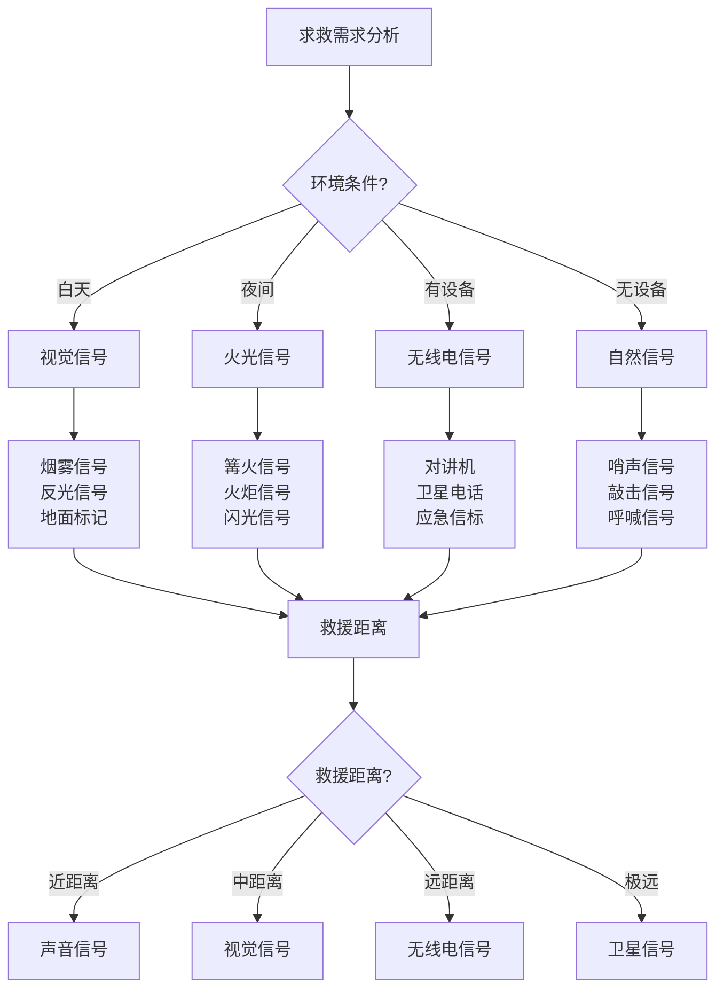

# 信号与求救

## 📡 信号发送技术

### 1. 视觉信号
- **烟雾信号**：篝火烟雾、彩色烟雾、定时烟雾
- **火光信号**：篝火火光、火炬信号、闪光信号
- **反光信号**：镜子反光、金属反光、反光板
- **旗帜信号**：彩色旗帜、布条信号、旗帜组合
- **地面信号**：地面标记、SOS标记、箭头标记
- **空中信号**：气球信号、风筝信号、空中标记

### 2. 声音信号
- **哨声信号**：哨子信号、口哨信号、节奏信号
- **敲击信号**：敲击金属、敲击石头、敲击树木
- **呼喊信号**：大声呼喊、节奏呼喊、方向呼喊
- **乐器信号**：号角信号、鼓声信号、音乐信号
- **爆炸信号**：鞭炮信号、爆炸物信号、声音信号
- **电子信号**：电子哨、电子喇叭、电子设备

### 3. 无线电信号
- **对讲机**：对讲机通讯、频道选择、距离限制
- **卫星电话**：卫星电话、全球覆盖、应急通讯
- **业余电台**：业余电台、专业通讯、远距离通讯
- **应急频率**：应急频率、国际频率、救援频率
- **GPS定位**：GPS定位、位置发送、救援指导
- **应急信标**：应急信标、自动发送、救援信号

### 4. 数字信号
- **手机信号**：手机通讯、短信发送、位置分享
- **网络信号**：网络通讯、社交媒体、在线求助
- **APP应用**：救援APP、位置分享、应急通讯
- **卫星通讯**：卫星通讯、全球覆盖、应急联系
- **数字信标**：数字信标、自动发送、救援信号
- **智能设备**：智能设备、自动求救、位置追踪

## 🆘 求救信号标准

### 1. 国际求救信号
- **SOS信号**：SOS、三短三长三短、国际标准
- **Mayday信号**：Mayday、紧急求救、国际标准
- **Pan-Pan信号**：Pan-Pan、紧急情况、国际标准
- **Securite信号**：Securite、安全信息、国际标准
- **国际频率**：国际频率、应急频率、救援频率
- **国际标准**：国际标准、统一标准、全球通用

### 2. 地面求救信号
- **SOS标记**：地面SOS、大型标记、空中可见
- **HELP标记**：地面HELP、求救标记、清晰可见
- **箭头标记**：方向箭头、指向标记、方向指示
- **数字标记**：数字标记、人数标记、需求标记
- **颜色标记**：颜色标记、对比标记、醒目标记
- **尺寸标记**：尺寸标记、大型标记、远距离可见

### 3. 空中求救信号
- **烟雾信号**：彩色烟雾、定时烟雾、空中可见
- **火光信号**：篝火火光、定时火光、夜间可见
- **反光信号**：镜子反光、定时反光、阳光反射
- **旗帜信号**：彩色旗帜、大型旗帜、空中可见
- **气球信号**：彩色气球、大型气球、空中漂浮
- **风筝信号**：彩色风筝、大型风筝、空中飞行

### 4. 声音求救信号
- **哨声信号**：三短三长三短、SOS节奏、国际标准
- **敲击信号**：三短三长三短、SOS节奏、国际标准
- **呼喊信号**：大声呼喊、节奏呼喊、方向呼喊
- **号角信号**：号角声音、节奏信号、远距离传播
- **鼓声信号**：鼓声节奏、SOS节奏、国际标准
- **电子信号**：电子设备、自动信号、救援信号

## 📍 位置定位技术

### 1. GPS定位
- **GPS设备**：GPS设备、卫星信号、精确定位
- **坐标系统**：经纬度、UTM坐标、坐标转换
- **精度等级**：定位精度、误差范围、精度要求
- **信号强度**：信号强度、信号质量、信号稳定
- **电池续航**：电池续航、电源管理、应急使用
- **功能应用**：导航功能、记录功能、分享功能

### 2. 地图定位
- **地形定位**：地形特征、地标识别、位置确定
- **地标定位**：地标识别、地标特征、位置确定
- **交叉定位**：多方向定位、交叉定位、位置确定
- **距离定位**：距离测量、距离计算、位置推算
- **角度定位**：角度测量、角度计算、位置计算
- **综合定位**：综合方法、多种定位、位置确定

### 3. 自然定位
- **太阳定位**：太阳位置、影子方向、方向判断
- **星星定位**：北极星、星座识别、方向判断
- **月亮定位**：月亮位置、月亮轨迹、方向判断
- **风向定位**：风向变化、风向判断、方向识别
- **水流定位**：水流方向、河流走向、方向判断
- **植物定位**：植物生长、阳光方向、方向判断

### 4. 人工定位
- **路标定位**：路标识别、路标特征、位置确定
- **建筑定位**：建筑识别、建筑特征、位置确定
- **设施定位**：设施识别、设施特征、位置确定
- **标识定位**：标识识别、标识特征、位置确定
- **地名牌定位**：地名牌识别、地名特征、位置确定
- **坐标定位**：坐标识别、坐标特征、位置确定

## 📞 通讯设备使用

### 1. 对讲机使用
- **频道选择**：频道选择、频率设置、通讯距离
- **功率调节**：功率调节、信号强度、通讯质量
- **天线使用**：天线使用、信号接收、通讯效果
- **电池管理**：电池管理、电源续航、应急使用
- **使用技巧**：使用技巧、通讯技巧、效果提升
- **维护保养**：维护保养、设备保护、功能保持

### 2. 卫星电话使用
- **卫星选择**：卫星选择、信号质量、通讯效果
- **天线对准**：天线对准、信号接收、通讯质量
- **通话技巧**：通话技巧、语音清晰、通讯效果
- **费用管理**：费用管理、通话费用、成本控制
- **应急使用**：应急使用、紧急通讯、救援联系
- **维护保养**：维护保养、设备保护、功能保持

### 3. 手机通讯
- **信号接收**：信号接收、信号强度、通讯质量
- **位置分享**：位置分享、GPS定位、救援指导
- **短信发送**：短信发送、信息传递、救援联系
- **网络通讯**：网络通讯、在线求助、社交媒体
- **电池管理**：电池管理、电源续航、应急使用
- **应急功能**：应急功能、紧急呼叫、救援联系

### 4. 应急信标
- **信标类型**：信标类型、功能特点、使用范围
- **激活方式**：激活方式、自动激活、手动激活
- **信号发送**：信号发送、位置信息、救援信号
- **电池续航**：电池续航、使用时间、应急使用
- **维护保养**：维护保养、设备保护、功能保持
- **应急使用**：应急使用、紧急求救、救援联系

## 📊 求救方法对比

| 求救方法 | 可见性 | 距离 | 设备需求 | 成功率 | 适用环境 | 推荐指数 |
|----------|--------|------|----------|--------|----------|----------|
| **烟雾信号** | 高 | 远 | 低 | 高 | 通用 | ⭐⭐⭐⭐⭐ |
| **火光信号** | 高 | 远 | 低 | 高 | 通用 | ⭐⭐⭐⭐⭐ |
| **反光信号** | 高 | 远 | 低 | 高 | 晴天 | ⭐⭐⭐⭐ |
| **声音信号** | 中 | 中 | 低 | 中 | 通用 | ⭐⭐⭐ |
| **无线电信号** | 极高 | 极远 | 高 | 极高 | 通用 | ⭐⭐⭐⭐⭐ |
| **数字信号** | 极高 | 极远 | 高 | 极高 | 有信号 | ⭐⭐⭐⭐⭐ |

## 🎯 求救技术决策树

## 🎓 费曼学习法应用

### 第一步：选择概念
选择"信号与求救"作为学习概念

### 第二步：教授他人
用简单语言解释：
> "野外求救要发送信号：白天用烟雾反光，夜间用火光，有设备用无线电，没设备用声音敲击。要按国际标准发送SOS信号，同时要准确定位自己的位置。"

### 第三步：回顾简化
- **信号发送**：视觉信号、声音信号、无线电信号、数字信号
- **求救标准**：国际信号、地面信号、空中信号、声音信号
- **位置定位**：GPS定位、地图定位、自然定位、人工定位
- **通讯设备**：对讲机、卫星电话、手机、应急信标

### 第四步：组织优化
建立求救与技能的关系：
- 信号发送 → [[03-野外生存|野外生存]]
- 求救标准 → [[02-理解层-原理机制/03-安全防护机制/03-应急响应机制|应急响应]]
- 位置定位 → [[01-方向识别技能|方向识别]]
- 通讯设备 → [[01-装备准备/01-基础装备清单|基础装备]]

## 🏃‍♂️ 刻意练习要点

### 求救技能练习
1. **信号练习**：练习各种信号发送
2. **定位练习**：练习位置定位技能
3. **设备使用**：练习通讯设备使用
4. **应急演练**：进行应急求救演练

### 实践验证
- **信号测试**：测试信号发送效果
- **定位测试**：测试位置定位精度
- **设备测试**：测试通讯设备功能
- **持续改进**：持续改进求救技能

## 🔗 求救与技能的关系

### 信号发送技能
- **信号技能**：[[03-野外生存|野外生存]]
- **设备技能**：[[01-装备准备/01-基础装备清单|基础装备]]
- **创新技能**：[[04-创新层-进阶发展/01-高级技巧|高级技巧]]
- **安全技能**：[[02-理解层-原理机制/03-安全防护机制|安全防护]]

### 求救标准技能
- **标准技能**：[[02-理解层-原理机制/03-安全防护机制/03-应急响应机制|应急响应]]
- **国际技能**：[[04-创新层-进阶发展/04-文化传承|文化传承]]
- **沟通技能**：[[04-创新层-进阶发展/03-领导力培养/04-沟通协调技巧|沟通协调]]
- **应急技能**：[[04-应急处理|应急处理]]

### 位置定位技能
- **定位技能**：[[01-方向识别技能|方向识别]]
- **技术技能**：[[04-创新层-进阶发展/02-专业配置/03-技术装备集成|技术集成]]
- **分析技能**：[[04-创新层-进阶发展/01-高级技巧/07-跨学科知识整合|跨学科知识]]
- **判断技能**：[[04-创新层-进阶发展/03-领导力培养/06-责任与担当|责任担当]]

### 通讯设备技能
- **操作技能**：[[03-野外生存|野外生存]]
- **维护技能**：[[04-创新层-进阶发展/02-专业配置/04-维护保养体系|维护保养]]
- **故障处理**：[[04-创新层-进阶发展/02-专业配置/04-维护保养体系|维护保养]]
- **优化技能**：[[04-创新层-进阶发展/02-专业配置/05-升级优化策略|升级优化]]

## 📋 信号与求救检查清单

### 信号发送
- [ ] 掌握视觉信号
- [ ] 掌握声音信号
- [ ] 掌握无线电信号
- [ ] 掌握数字信号

### 求救标准
- [ ] 了解国际求救信号
- [ ] 掌握地面求救信号
- [ ] 掌握空中求救信号
- [ ] 掌握声音求救信号

### 位置定位
- [ ] 掌握GPS定位
- [ ] 掌握地图定位
- [ ] 掌握自然定位
- [ ] 掌握人工定位

### 通讯设备
- [ ] 掌握对讲机使用
- [ ] 掌握卫星电话使用
- [ ] 掌握手机通讯
- [ ] 掌握应急信标

## 🎯 信号与求救策略

### 系统性策略
1. **需求分析**：分析求救需求
2. **方法选择**：选择合适的求救方法
3. **信号发送**：发送求救信号
4. **持续监控**：持续监控救援状态

### 应急性策略
- **快速响应**：快速响应、及时求救
- **多种方法**：多种方法、提高成功率
- **持续发送**：持续发送、保持信号
- **位置准确**：位置准确、便于救援

## 🔗 相关链接
- [[01-方向识别技能|方向识别技能]]
- [[02-水源寻找与净化|水源寻找与净化]]
- [[03-食物获取技能|食物获取技能]]
- [[04-生火技术|生火技术]]