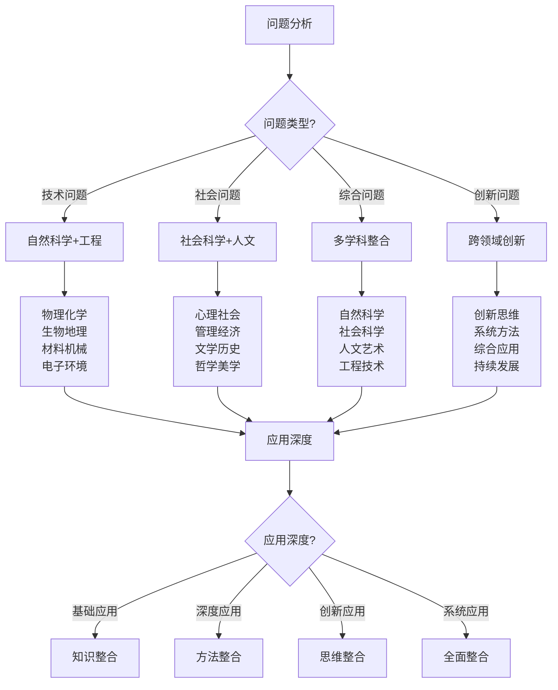

# 跨学科知识整合

## 🔬 自然科学整合

### 1. 物理学应用
- **力学原理**：重力、摩擦力、杠杆原理、机械效率
- **热力学**：热量传递、燃烧原理、保温原理、制冷原理
- **光学原理**：光线传播、反射折射、光学仪器、视觉原理
- **声学原理**：声音传播、声波特性、听觉原理、通讯原理
- **电磁学**：电磁感应、电子设备、通讯技术、导航技术
- **流体力学**：水流特性、空气流动、风力利用、阻力分析

### 2. 化学知识应用
- **燃烧化学**：燃烧反应、燃料特性、氧化还原、化学反应
- **材料化学**：材料特性、腐蚀防护、材料选择、性能优化
- **环境化学**：环境污染、水质分析、空气污染、生态化学
- **生物化学**：营养代谢、能量转换、生理反应、健康化学
- **分析化学**：成分分析、质量检测、安全评估、质量控制
- **有机化学**：有机材料、天然产物、药物化学、生物化学

### 3. 生物学应用
- **植物学**：植物识别、植物分类、植物生态、植物利用
- **动物学**：动物行为、动物生态、动物保护、动物利用
- **生态学**：生态系统、生态平衡、环境保护、可持续发展
- **生理学**：人体生理、适应机制、健康管理、运动生理
- **营养学**：营养需求、营养平衡、食物营养、健康饮食
- **病理学**：疾病预防、健康管理、应急处理、医疗知识

### 4. 地理学应用
- **自然地理**：地形地貌、气候气象、水文地理、土壤地理
- **人文地理**：人口分布、文化地理、经济地理、政治地理
- **地图学**：地图制作、地图阅读、导航技术、空间分析
- **遥感技术**：卫星遥感、地理信息、环境监测、资源调查
- **地质学**：地质构造、岩石矿物、地质灾害、地质资源
- **气象学**：天气预测、气候分析、气象灾害、环境气象

## 🧠 社会科学整合

### 1. 心理学应用
- **认知心理学**：认知过程、学习记忆、思维决策、问题解决
- **社会心理学**：群体行为、团队合作、沟通交流、领导力
- **发展心理学**：心理发展、适应能力、成长规律、教育心理
- **健康心理学**：心理健康、压力管理、情绪调节、心理韧性
- **环境心理学**：环境适应、空间感知、环境行为、环境设计
- **应用心理学**：心理评估、心理干预、心理治疗、心理教育

### 2. 社会学应用
- **社会结构**：社会分层、社会关系、社会网络、社会组织
- **社会行为**：社会互动、社会规范、社会控制、社会变迁
- **社会问题**：社会问题、社会政策、社会服务、社会发展
- **文化社会学**：文化传承、文化变迁、文化冲突、文化融合
- **环境社会学**：环境问题、环境政策、环境行为、环境教育
- **教育社会学**：教育制度、教育公平、教育效果、教育改革

### 3. 管理学应用
- **组织管理**：组织结构、组织行为、组织文化、组织发展
- **人力资源管理**：人员招聘、培训发展、绩效管理、激励管理
- **项目管理**：项目规划、项目执行、项目控制、项目评估
- **风险管理**：风险识别、风险评估、风险控制、风险应对
- **质量管理**：质量标准、质量控制、质量改进、质量保证
- **创新管理**：创新思维、创新方法、创新管理、创新发展

### 4. 经济学应用
- **微观经济学**：供需关系、价格机制、市场结构、消费者行为
- **宏观经济学**：经济周期、经济增长、经济政策、经济分析
- **资源经济学**：资源配置、资源利用、资源保护、可持续发展
- **环境经济学**：环境成本、环境效益、环境政策、环境市场
- **行为经济学**：行为决策、心理因素、认知偏差、决策优化
- **发展经济学**：经济发展、发展模式、发展政策、发展评估

## 🎨 人文艺术整合

### 1. 文学艺术
- **文学作品**：文学作品、文学欣赏、文学创作、文学教育
- **艺术欣赏**：艺术欣赏、艺术评价、艺术教育、艺术文化
- **创作技巧**：创作技巧、艺术表达、创意设计、艺术创新
- **文化传承**：文化传承、文化保护、文化发展、文化交流
- **语言艺术**：语言表达、沟通技巧、演讲艺术、写作技巧
- **表演艺术**：表演技巧、舞台艺术、音乐艺术、舞蹈艺术

### 2. 历史文化
- **历史知识**：历史事件、历史人物、历史发展、历史教训
- **文化传统**：文化传统、文化习俗、文化节日、文化仪式
- **文化遗产**：文化遗产、文化保护、文化传承、文化发展
- **文化交流**：文化交流、文化融合、文化冲突、文化理解
- **文化教育**：文化教育、文化传播、文化学习、文化培养
- **文化创新**：文化创新、文化发展、文化适应、文化变革

### 3. 哲学思考
- **哲学原理**：哲学思想、哲学方法、哲学思维、哲学教育
- **伦理道德**：伦理原则、道德标准、价值观念、行为规范
- **逻辑思维**：逻辑推理、思维方法、问题分析、决策思维
- **批判思维**：批判分析、独立思考、理性判断、创新思维
- **系统思维**：系统分析、整体思维、综合思维、系统方法
- **创新思维**：创新理念、创新方法、创新实践、创新发展

### 4. 美学教育
- **美学原理**：美学理论、美学欣赏、美学教育、美学实践
- **审美能力**：审美感知、审美判断、审美创造、审美教育
- **艺术教育**：艺术教育、艺术培养、艺术发展、艺术创新
- **美育实践**：美育实践、美育方法、美育效果、美育评估
- **文化美学**：文化美学、文化审美、文化教育、文化发展
- **环境美学**：环境美学、环境审美、环境设计、环境教育

## 🔧 工程技术整合

### 1. 材料工程
- **材料科学**：材料特性、材料选择、材料设计、材料优化
- **材料工艺**：材料加工、材料成型、材料处理、材料改性
- **材料测试**：材料检测、材料分析、材料评估、材料标准
- **材料应用**：材料应用、材料创新、材料发展、材料工程
- **材料环保**：材料环保、材料回收、材料再利用、材料可持续
- **材料安全**：材料安全、材料风险、材料防护、材料管理

### 2. 机械工程
- **机械设计**：机械设计、机械原理、机械结构、机械优化
- **机械制造**：机械制造、机械加工、机械装配、机械测试
- **机械控制**：机械控制、自动化控制、智能控制、控制系统
- **机械维护**：机械维护、故障诊断、维修技术、维护管理
- **机械创新**：机械创新、技术创新、产品创新、系统创新
- **机械安全**：机械安全、安全设计、安全操作、安全管理

### 3. 电子工程
- **电子技术**：电子技术、电子设备、电子系统、电子应用
- **通信技术**：通信技术、通信系统、通信协议、通信安全
- **控制技术**：控制技术、控制系统、控制算法、控制优化
- **信息技术**：信息技术、信息系统、信息处理、信息安全
- **电子创新**：电子创新、技术创新、产品创新、应用创新
- **电子安全**：电子安全、信息安全、系统安全、网络安全

### 4. 环境工程
- **环境科学**：环境科学、环境问题、环境监测、环境评估
- **环境技术**：环境技术、环境工程、环境治理、环境修复
- **环境管理**：环境管理、环境政策、环境法规、环境标准
- **环境教育**：环境教育、环境意识、环境行为、环境文化
- **环境创新**：环境创新、技术创新、管理创新、教育创新
- **环境可持续**：环境可持续、可持续发展、绿色技术、生态工程

## 📊 跨学科整合对比

| 学科领域 | 应用程度 | 整合难度 | 实用价值 | 创新潜力 | 发展前景 | 推荐指数 |
|----------|----------|----------|----------|----------|----------|----------|
| **自然科学** | 高 | 中 | 高 | 高 | 高 | ⭐⭐⭐⭐⭐ |
| **社会科学** | 中 | 高 | 中 | 中 | 中 | ⭐⭐⭐⭐ |
| **人文艺术** | 中 | 高 | 中 | 高 | 中 | ⭐⭐⭐⭐ |
| **工程技术** | 高 | 中 | 高 | 高 | 高 | ⭐⭐⭐⭐⭐ |

## 🎯 跨学科整合决策树

## 🎓 费曼学习法应用

### 第一步：选择概念
选择"跨学科知识整合"作为学习概念

### 第二步：教授他人
用简单语言解释：
> "跨学科整合就是把不同学科的知识结合起来解决问题：自然科学提供原理和技术，社会科学提供管理和心理，人文艺术提供文化和创新，工程技术提供实现和应用。"

### 第三步：回顾简化
- **自然科学**：物理化学、生物地理、原理应用、技术实现
- **社会科学**：心理社会、管理经济、行为分析、决策支持
- **人文艺术**：文学历史、哲学美学、文化传承、创新思维
- **工程技术**：材料机械、电子环境、系统设计、工程实现

### 第四步：组织优化
建立跨学科整合与技能的关系：
- 自然科学 → [[02-理解层-原理机制/01-户外生存原理|户外生存原理]]
- 社会科学 → [[04-创新层-进阶发展/03-领导力培养|领导力培养]]
- 人文艺术 → [[04-创新层-进阶发展/04-文化传承|文化传承]]
- 工程技术 → [[04-创新层-进阶发展/02-专业配置|专业配置]]

## 🏃‍♂️ 刻意练习要点

### 跨学科整合练习
1. **知识学习**：学习各学科基础知识
2. **方法掌握**：掌握跨学科整合方法
3. **实践应用**：实践跨学科整合应用
4. **创新思维**：培养跨学科创新思维

### 实践验证
- **整合测试**：测试跨学科整合能力
- **应用测试**：测试跨学科应用效果
- **创新测试**：测试跨学科创新能力
- **持续改进**：持续改进整合能力

## 🔗 跨学科整合与技能的关系

### 自然科学技能
- **原理技能**：[[02-理解层-原理机制/01-户外生存原理|户外生存原理]]
- **技术技能**：[[04-创新层-进阶发展/02-专业配置/03-技术装备集成|技术集成]]
- **分析技能**：[[04-创新层-进阶发展/01-高级技巧/07-跨学科知识整合|跨学科知识]]
- **应用技能**：[[03-野外生存|野外生存]]

### 社会科学技能
- **管理技能**：[[04-创新层-进阶发展/03-领导力培养|领导力培养]]
- **心理技能**：[[02-理解层-原理机制/01-户外生存原理/04-心理适应机制|心理适应]]
- **沟通技能**：[[04-创新层-进阶发展/03-领导力培养/04-沟通协调技巧|沟通协调]]
- **决策技能**：[[04-创新层-进阶发展/03-领导力培养/06-责任与担当|责任担当]]

### 人文艺术技能
- **文化技能**：[[04-创新层-进阶发展/04-文化传承|文化传承]]
- **创新技能**：[[04-创新层-进阶发展/01-高级技巧|高级技巧]]
- **表达技能**：[[04-创新层-进阶发展/03-领导力培养/04-沟通协调技巧|沟通协调]]
- **审美技能**：[[04-创新层-进阶发展/04-文化传承|文化传承]]

### 工程技术技能
- **设计技能**：[[04-创新层-进阶发展/02-专业配置/02-定制化配置|定制配置]]
- **制造技能**：[[04-创新层-进阶发展/02-专业配置/04-维护保养体系|维护保养]]
- **控制技能**：[[04-创新层-进阶发展/02-专业配置/05-升级优化策略|升级优化]]
- **创新技能**：[[04-创新层-进阶发展/01-高级技巧|高级技巧]]

## 📋 跨学科整合检查清单

### 自然科学
- [ ] 掌握物理化学原理
- [ ] 了解生物地理知识
- [ ] 学会原理应用方法
- [ ] 掌握技术实现技能

### 社会科学
- [ ] 掌握心理社会知识
- [ ] 了解管理经济原理
- [ ] 学会行为分析方法
- [ ] 掌握决策支持技能

### 人文艺术
- [ ] 掌握文学历史知识
- [ ] 了解哲学美学原理
- [ ] 学会文化传承方法
- [ ] 掌握创新思维技能

### 工程技术
- [ ] 掌握材料机械知识
- [ ] 了解电子环境技术
- [ ] 学会系统设计方法
- [ ] 掌握工程实现技能

## 🎯 跨学科整合策略

### 系统性策略
1. **知识整合**：整合各学科知识
2. **方法整合**：整合各学科方法
3. **思维整合**：整合各学科思维
4. **应用整合**：整合各学科应用

### 创新性策略
- **创新思维**：培养创新思维
- **系统方法**：运用系统方法
- **综合应用**：综合应用各学科
- **持续发展**：持续发展整合能力

## 🔗 相关链接
- [[01-方向识别技能|方向识别技能]]
- [[02-水源寻找与净化|水源寻找与净化]]
- [[03-食物获取技能|食物获取技能]]
- [[04-生火技术|生火技术]]