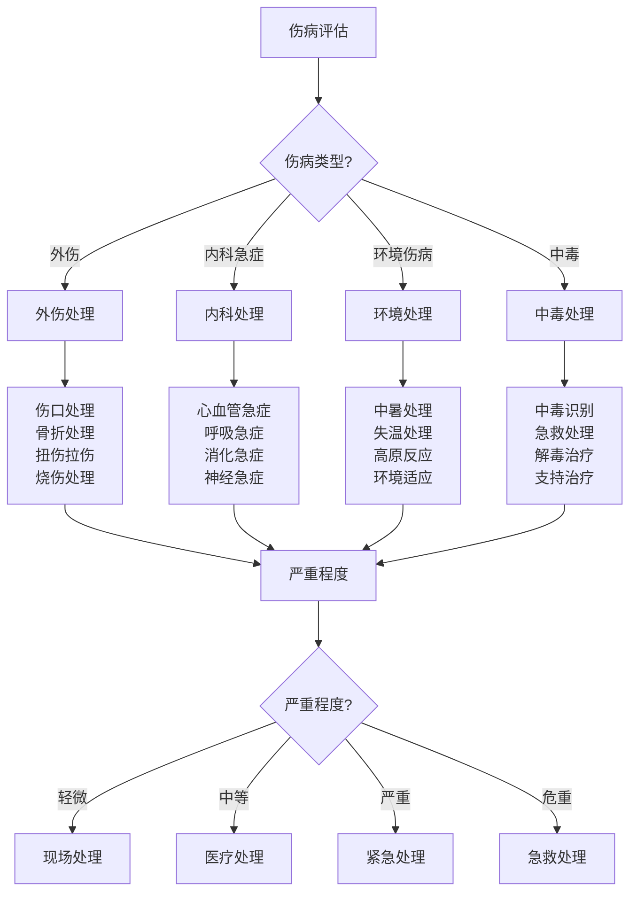

# 常见伤病处理

## 🩹 外伤处理技术

### 1. 伤口处理
- **伤口评估**：伤口类型、严重程度、感染风险、处理优先级
- **清洁消毒**：伤口清洁、消毒处理、异物清除、感染预防
- **止血技术**：直接压迫、抬高肢体、压力点止血、止血带使用
- **包扎技术**：敷料选择、包扎方法、固定技巧、压力控制
- **缝合技术**：简单缝合、伤口闭合、愈合促进、疤痕最小化
- **感染预防**：抗生素使用、感染监测、预防措施、并发症处理

### 2. 骨折处理
- **骨折识别**：骨折症状、体征识别、类型判断、严重程度
- **固定技术**：夹板固定、石膏固定、牵引固定、外固定器
- **搬运技术**：安全搬运、脊柱保护、骨折保护、二次损伤预防
- **疼痛管理**：疼痛评估、止痛药物、非药物止痛、疼痛控制
- **并发症预防**：感染预防、血栓预防、肌肉萎缩、关节僵硬
- **康复指导**：功能锻炼、康复计划、恢复评估、长期管理

### 3. 扭伤拉伤
- **损伤评估**：损伤程度、损伤类型、功能影响、恢复时间
- **RICE原则**：休息、冰敷、压迫、抬高、急性期处理
- **功能评估**：关节活动度、肌肉力量、平衡能力、功能测试
- **康复训练**：渐进训练、功能恢复、力量重建、协调训练
- **预防措施**：热身准备、防护装备、技术改进、环境安全
- **长期管理**：慢性疼痛、功能限制、复发预防、健康维护

### 4. 烧伤处理
- **烧伤评估**：烧伤深度、烧伤面积、烧伤类型、严重程度
- **急救处理**：冷却处理、清洁处理、保护创面、疼痛控制
- **感染预防**：无菌处理、抗生素使用、感染监测、预防措施
- **愈合促进**：营养支持、创面护理、功能保护、疤痕预防
- **并发症处理**：休克处理、感染处理、功能障碍、心理支持
- **康复管理**：功能康复、心理康复、社会康复、长期随访

## 🧠 内科急症处理

### 1. 心血管急症
- **心肌梗死**：症状识别、急救处理、药物使用、医疗转运
- **心律失常**：心律识别、急救处理、除颤技术、药物使用
- **高血压危象**：血压监测、药物使用、并发症处理、长期管理
- **心力衰竭**：症状识别、急救处理、药物治疗、生活方式
- **休克处理**：休克识别、病因处理、液体复苏、血管活性药物
- **心脏骤停**：心肺复苏、除颤技术、高级生命支持、预后评估

### 2. 呼吸系统急症
- **呼吸困难**：病因识别、症状评估、急救处理、氧疗使用
- **哮喘发作**：症状识别、急救处理、药物使用、环境控制
- **肺炎处理**：症状识别、诊断评估、抗生素使用、支持治疗
- **气胸处理**：症状识别、急救处理、胸腔引流、手术治疗
- **肺栓塞**：症状识别、风险评估、抗凝治疗、溶栓治疗
- **呼吸衰竭**：机械通气、氧疗管理、病因治疗、并发症处理

### 3. 消化系统急症
- **急性腹痛**：病因诊断、症状评估、急救处理、手术治疗
- **消化道出血**：出血评估、止血处理、输血治疗、内镜治疗
- **急性胰腺炎**：症状识别、诊断评估、支持治疗、并发症处理
- **肠梗阻**：症状识别、影像诊断、保守治疗、手术治疗
- **急性胆囊炎**：症状识别、诊断评估、抗生素治疗、手术治疗
- **急性阑尾炎**：症状识别、诊断评估、手术治疗、并发症处理

### 4. 神经系统急症
- **脑卒中**：症状识别、急救处理、溶栓治疗、康复治疗
- **癫痫发作**：症状识别、急救处理、药物使用、安全保护
- **脑外伤**：损伤评估、急救处理、颅内压管理、手术治疗
- **脊髓损伤**：损伤评估、急救处理、功能保护、康复治疗
- **头痛处理**：病因诊断、症状评估、药物治疗、非药物治疗
- **意识障碍**：意识评估、病因诊断、支持治疗、预后评估

## 🌡️ 环境相关伤病

### 1. 中暑处理
- **中暑识别**：症状识别、严重程度、危险因素、高危人群
- **急救处理**：降温处理、液体补充、电解质平衡、生命支持
- **预防措施**：环境控制、个人防护、水分补充、时间管理
- **并发症处理**：器官损伤、电解质紊乱、凝血异常、感染风险
- **康复管理**：功能恢复、健康监测、预防复发、生活方式
- **教育指导**：健康宣教、预防知识、应急处理、长期管理

### 2. 失温处理
- **失温识别**：症状识别、严重程度、危险因素、高危环境
- **急救处理**：复温处理、保温措施、液体补充、生命支持
- **预防措施**：环境适应、个人防护、营养支持、活动管理
- **并发症处理**：心律失常、凝血异常、感染风险、器官损伤
- **康复管理**：功能恢复、健康监测、预防复发、环境适应
- **教育指导**：健康宣教、预防知识、应急处理、环境安全

### 3. 高原反应
- **症状识别**：急性高山病、肺水肿、脑水肿、症状评估
- **急救处理**：氧疗使用、药物治疗、下降处理、生命支持
- **预防措施**：渐进适应、药物预防、环境控制、个人防护
- **并发症处理**：器官损伤、功能衰竭、感染风险、心理问题
- **康复管理**：功能恢复、健康监测、预防复发、适应训练
- **教育指导**：健康宣教、预防知识、应急处理、环境适应

### 4. 中毒处理
- **中毒识别**：中毒类型、中毒途径、症状表现、严重程度
- **急救处理**：毒物清除、解毒治疗、支持治疗、生命支持
- **预防措施**：环境安全、个人防护、安全知识、应急准备
- **并发症处理**：器官损伤、功能衰竭、感染风险、心理问题
- **康复管理**：功能恢复、健康监测、预防复发、安全防护
- **教育指导**：安全宣教、预防知识、应急处理、环境安全

## 💊 急救药物使用

### 1. 常用急救药物
- **止痛药物**：阿司匹林、布洛芬、对乙酰氨基酚、吗啡
- **抗感染药物**：抗生素、抗病毒药物、抗真菌药物、抗寄生虫药物
- **心血管药物**：硝酸甘油、阿司匹林、肾上腺素、多巴胺
- **呼吸系统药物**：支气管扩张剂、糖皮质激素、抗组胺药物
- **消化系统药物**：止吐药物、止泻药物、抗酸药物、胃动力药物
- **神经系统药物**：镇静药物、抗癫痫药物、抗焦虑药物、抗抑郁药物

### 2. 药物使用原则
- **适应症**：药物适应症、禁忌症、相对禁忌症、特殊人群
- **剂量控制**：剂量计算、给药途径、给药频率、疗程管理
- **不良反应**：不良反应监测、过敏反应、药物相互作用、毒性反应
- **药物储存**：储存条件、有效期管理、质量保证、安全储存
- **用药教育**：用药指导、依从性教育、不良反应教育、安全用药
- **监测评估**：疗效监测、不良反应监测、药物浓度监测、调整方案

### 3. 特殊药物使用
- **急救药物**：肾上腺素、阿托品、利多卡因、多巴胺
- **解毒药物**：纳洛酮、氟马西尼、乙酰半胱氨酸、二巯丙醇
- **抗过敏药物**：肾上腺素、抗组胺药物、糖皮质激素、支气管扩张剂
- **抗感染药物**：青霉素、头孢菌素、氨基糖苷类、喹诺酮类
- **心血管药物**：硝酸甘油、阿司匹林、ACE抑制剂、β受体阻滞剂
- **神经系统药物**：地西泮、苯巴比妥、卡马西平、丙戊酸钠

### 4. 药物安全管理
- **药物选择**：药物选择、适应症匹配、禁忌症筛查、风险评估
- **剂量管理**：剂量计算、给药途径、给药频率、疗程管理
- **监测管理**：疗效监测、不良反应监测、药物浓度监测、调整方案
- **储存管理**：储存条件、有效期管理、质量保证、安全储存
- **教育管理**：用药指导、依从性教育、不良反应教育、安全用药
- **质量管理**：质量保证、质量控制、质量改进、持续改进

## 📊 伤病处理对比

| 伤病类型 | 处理难度 | 紧急程度 | 设备需求 | 专业要求 | 预后 | 推荐指数 |
|----------|----------|----------|----------|----------|------|----------|
| **外伤** | 中 | 高 | 中 | 中 | 好 | ⭐⭐⭐⭐ |
| **内科急症** | 高 | 极高 | 高 | 高 | 中 | ⭐⭐⭐ |
| **环境伤病** | 中 | 高 | 低 | 中 | 好 | ⭐⭐⭐⭐ |
| **中毒** | 高 | 极高 | 中 | 高 | 中 | ⭐⭐⭐ |

## 🎯 伤病处理决策树

## 🎓 费曼学习法应用

### 第一步：选择概念
选择"常见伤病处理"作为学习概念

### 第二步：教授他人
用简单语言解释：
> "野外伤病处理要分四类：外伤要清洁止血包扎，内科急症要识别症状急救，环境伤病要适应环境预防，中毒要清除毒物解毒。严重情况要立即送医。"

### 第三步：回顾简化
- **外伤处理**：伤口处理、骨折处理、扭伤拉伤、烧伤处理
- **内科急症**：心血管急症、呼吸急症、消化急症、神经急症
- **环境伤病**：中暑处理、失温处理、高原反应、中毒处理
- **药物使用**：常用药物、使用原则、特殊药物、安全管理

### 第四步：组织优化
建立伤病处理与技能的关系：
- 外伤处理 → [[03-野外生存|野外生存]]
- 内科急症 → [[02-理解层-原理机制/01-户外生存原理/01-人体生理适应|人体适应]]
- 环境伤病 → [[02-理解层-原理机制/01-户外生存原理/02-环境因素影响|环境因素]]
- 药物使用 → [[04-创新层-进阶发展/02-专业配置/03-技术装备集成|技术集成]]

## 🏃‍♂️ 刻意练习要点

### 伤病处理练习
1. **理论学习**：学习伤病处理理论知识
2. **技能练习**：练习伤病处理技能
3. **模拟训练**：进行模拟伤病处理训练
4. **实战演练**：进行实战伤病处理演练

### 实践验证
- **技能测试**：测试伤病处理技能
- **应急测试**：测试应急处理能力
- **安全测试**：测试安全处理技能
- **持续改进**：持续改进处理技能

## 🔗 伤病处理与技能的关系

### 外伤处理技能
- **处理技能**：[[03-野外生存|野外生存]]
- **设备技能**：[[01-装备准备/01-基础装备清单|基础装备]]
- **安全技能**：[[02-理解层-原理机制/03-安全防护机制|安全防护]]
- **应急技能**：[[04-应急处理|应急处理]]

### 内科急症技能
- **识别技能**：[[02-理解层-原理机制/01-户外生存原理/01-人体生理适应|人体适应]]
- **处理技能**：[[04-应急处理|应急处理]]
- **药物技能**：[[04-创新层-进阶发展/02-专业配置/03-技术装备集成|技术集成]]
- **急救技能**：[[04-应急处理|应急处理]]

### 环境伤病技能
- **环境技能**：[[02-理解层-原理机制/01-户外生存原理/02-环境因素影响|环境因素]]
- **适应技能**：[[03-野外生存/05-高海拔适应|高海拔适应]]
- **预防技能**：[[02-理解层-原理机制/03-安全防护机制|安全防护]]
- **处理技能**：[[04-应急处理|应急处理]]

### 药物使用技能
- **药物知识**：[[04-创新层-进阶发展/01-高级技巧/07-跨学科知识整合|跨学科知识]]
- **使用技能**：[[04-创新层-进阶发展/02-专业配置/03-技术装备集成|技术集成]]
- **管理技能**：[[04-创新层-进阶发展/02-专业配置/04-维护保养体系|维护保养]]
- **安全技能**：[[02-理解层-原理机制/03-安全防护机制|安全防护]]

## 📋 伤病处理检查清单

### 外伤处理
- [ ] 掌握伤口处理技术
- [ ] 学会骨折固定技术
- [ ] 掌握扭伤拉伤处理
- [ ] 学会烧伤处理技术

### 内科急症
- [ ] 识别心血管急症
- [ ] 处理呼吸系统急症
- [ ] 识别消化系统急症
- [ ] 处理神经系统急症

### 环境伤病
- [ ] 掌握中暑处理技术
- [ ] 学会失温处理技术
- [ ] 掌握高原反应处理
- [ ] 学会中毒处理技术

### 药物使用
- [ ] 了解常用急救药物
- [ ] 掌握药物使用原则
- [ ] 学会特殊药物使用
- [ ] 掌握药物安全管理

## 🎯 伤病处理策略

### 系统性策略
1. **预防为主**：预防为主、防治结合
2. **快速识别**：快速识别、及时处理
3. **科学处理**：科学处理、规范操作
4. **持续监测**：持续监测、及时调整

### 安全性策略
- **安全第一**：安全始终是第一优先级
- **规范操作**：规范操作、避免二次伤害
- **专业指导**：专业指导、医疗支持
- **持续改进**：持续改进、技能提升

## 🔗 相关链接
- [[02-恶劣天气应对|恶劣天气应对]]
- [[03-应急通讯与救援|应急通讯与救援]]
- [[04-安全撤离与避险|安全撤离与避险]]
- [[03-野外生存|野外生存]]