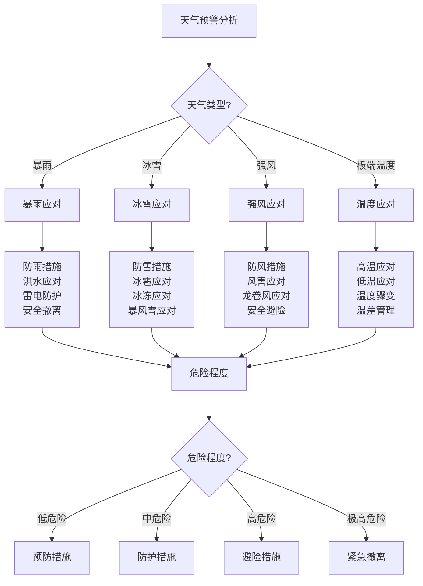

# 恶劣天气应对

## 🌧️ 暴雨天气应对

### 1. 暴雨预警识别
- **气象预警**：暴雨预警、预警等级、预警时间、影响范围
- **天气变化**：云层变化、气压变化、湿度变化、温度变化
- **环境信号**：动物行为、植物反应、环境变化、自然信号
- **时间判断**：降雨时间、降雨强度、持续时间、结束时间
- **风险评估**：洪水风险、滑坡风险、雷电风险、能见度风险
- **应对准备**：应对准备、防护措施、应急设备、安全计划

### 2. 防雨措施
- **个人防护**：雨衣雨裤、防水鞋、防水帽、防水手套
- **装备保护**：装备防水、设备保护、电子设备、重要物品
- **营地防护**：帐篷防水、排水系统、地面处理、防风措施
- **食物保护**：食物防水、储存保护、烹饪保护、饮水保护
- **火源保护**：火源保护、燃料保护、点火设备、取暖设备
- **通讯保护**：通讯设备、电子设备、备用设备、应急设备

### 3. 洪水应对
- **洪水识别**：洪水预警、水位变化、水流变化、危险信号
- **撤离准备**：撤离路线、撤离时间、撤离物品、撤离人员
- **高地避险**：高地选择、避险位置、安全距离、避险时间
- **水中安全**：水中行走、水流判断、深度判断、安全距离
- **救援准备**：救援信号、救援设备、救援联系、救援等待
- **后续处理**：后续处理、安全检查、环境评估、恢复计划

### 4. 雷电防护
- **雷电识别**：雷电预警、雷电距离、雷电强度、危险程度
- **避雷措施**：避雷位置、避雷设备、避雷方法、安全距离
- **金属防护**：金属物品、电子设备、通讯设备、安全处理
- **人员安全**：人员位置、安全姿势、安全距离、安全时间
- **设备保护**：设备保护、电子设备、通讯设备、备用设备
- **应急处理**：应急处理、受伤处理、设备损坏、通讯中断

## ❄️ 冰雪天气应对

### 1. 雪天应对
- **雪天识别**：降雪预警、降雪强度、降雪时间、积雪深度
- **防雪措施**：防雪装备、防雪设备、防雪方法、防雪技巧
- **行走安全**：雪地行走、防滑措施、行走技巧、安全距离
- **保暖措施**：保暖装备、保暖方法、保暖技巧、保暖设备
- **能见度**：能见度影响、导航困难、方向识别、安全距离
- **应急准备**：应急准备、应急设备、应急计划、应急联系

### 2. 冰雹应对
- **冰雹识别**：冰雹预警、冰雹大小、冰雹强度、冰雹时间
- **防护措施**：头部防护、身体防护、设备防护、车辆防护
- **避险措施**：避险位置、避险时间、避险方法、安全距离
- **伤害预防**：伤害预防、安全姿势、安全距离、安全时间
- **设备保护**：设备保护、电子设备、通讯设备、备用设备
- **应急处理**：应急处理、受伤处理、设备损坏、通讯中断

### 3. 冰冻应对
- **冰冻识别**：冰冻预警、冰冻程度、冰冻时间、冰冻范围
- **防滑措施**：防滑装备、防滑设备、防滑方法、防滑技巧
- **行走安全**：冰面行走、防滑措施、行走技巧、安全距离
- **设备保护**：设备保护、电子设备、通讯设备、备用设备
- **保暖措施**：保暖装备、保暖方法、保暖技巧、保暖设备
- **应急准备**：应急准备、应急设备、应急计划、应急联系

### 4. 暴风雪应对
- **暴风雪识别**：暴风雪预警、风力强度、降雪强度、能见度
- **防护措施**：防护装备、防护设备、防护方法、防护技巧
- **避险措施**：避险位置、避险时间、避险方法、安全距离
- **保暖措施**：保暖装备、保暖方法、保暖技巧、保暖设备
- **通讯保持**：通讯保持、通讯设备、通讯方法、应急联系
- **救援准备**：救援准备、救援信号、救援设备、救援等待

## 🌪️ 强风天气应对

### 1. 强风识别
- **风力等级**：风力等级、风力强度、风力方向、风力变化
- **风害影响**：风害影响、安全风险、设备风险、环境风险
- **预警信号**：预警信号、预警时间、预警范围、预警等级
- **风险评估**：风险评估、风险等级、风险因素、风险控制
- **应对准备**：应对准备、防护措施、应急设备、安全计划
- **监测跟踪**：监测跟踪、风力变化、风向变化、影响评估

### 2. 防风措施
- **个人防护**：防风装备、防风设备、防风方法、防风技巧
- **营地防护**：营地加固、帐篷加固、设备固定、物品固定
- **设备保护**：设备保护、电子设备、通讯设备、备用设备
- **火源保护**：火源保护、燃料保护、点火设备、取暖设备
- **通讯保护**：通讯设备、电子设备、备用设备、应急设备
- **安全措施**：安全措施、安全距离、安全位置、安全时间

### 3. 风害应对
- **风害识别**：风害类型、风害程度、风害影响、风害风险
- **避险措施**：避险位置、避险时间、避险方法、安全距离
- **伤害预防**：伤害预防、安全姿势、安全距离、安全时间
- **设备保护**：设备保护、电子设备、通讯设备、备用设备
- **应急处理**：应急处理、受伤处理、设备损坏、通讯中断
- **后续处理**：后续处理、安全检查、环境评估、恢复计划

### 4. 龙卷风应对
- **龙卷风识别**：龙卷风预警、龙卷风强度、龙卷风路径、龙卷风时间
- **避险措施**：避险位置、避险时间、避险方法、安全距离
- **防护措施**：防护装备、防护设备、防护方法、防护技巧
- **伤害预防**：伤害预防、安全姿势、安全距离、安全时间
- **应急处理**：应急处理、受伤处理、设备损坏、通讯中断
- **救援准备**：救援准备、救援信号、救援设备、救援等待

## 🌡️ 极端温度应对

### 1. 极端高温
- **高温识别**：高温预警、温度等级、高温时间、高温范围
- **中暑预防**：中暑预防、中暑识别、中暑处理、中暑康复
- **降温措施**：降温装备、降温设备、降温方法、降温技巧
- **水分补充**：水分补充、电解质平衡、水分管理、水分安全
- **防晒措施**：防晒装备、防晒设备、防晒方法、防晒技巧
- **时间管理**：时间管理、活动安排、休息时间、安全时间

### 2. 极端低温
- **低温识别**：低温预警、温度等级、低温时间、低温范围
- **失温预防**：失温预防、失温识别、失温处理、失温康复
- **保暖措施**：保暖装备、保暖设备、保暖方法、保暖技巧
- **热量补充**：热量补充、能量管理、营养补充、热量安全
- **防冻措施**：防冻装备、防冻设备、防冻方法、防冻技巧
- **时间管理**：时间管理、活动安排、休息时间、安全时间

### 3. 温度骤变
- **骤变识别**：温度骤变、骤变程度、骤变时间、骤变影响
- **适应措施**：适应措施、适应时间、适应方法、适应技巧
- **防护措施**：防护装备、防护设备、防护方法、防护技巧
- **健康监测**：健康监测、身体状态、健康评估、健康管理
- **应急处理**：应急处理、健康问题、设备问题、通讯问题
- **后续处理**：后续处理、健康恢复、设备恢复、环境适应

### 4. 温差管理
- **温差识别**：温差变化、温差程度、温差时间、温差影响
- **调节措施**：调节措施、调节方法、调节技巧、调节设备
- **适应训练**：适应训练、适应方法、适应技巧、适应评估
- **健康管理**：健康管理、健康监测、健康评估、健康维护
- **设备管理**：设备管理、设备保护、设备维护、设备更新
- **环境管理**：环境管理、环境适应、环境保护、环境优化

## 📊 恶劣天气应对对比

| 天气类型 | 应对难度 | 危险程度 | 设备需求 | 时间要求 | 成功率 | 推荐指数 |
|----------|----------|----------|----------|----------|--------|----------|
| **暴雨** | 中 | 高 | 中 | 中 | 高 | ⭐⭐⭐⭐ |
| **冰雪** | 高 | 高 | 高 | 长 | 中 | ⭐⭐⭐ |
| **强风** | 中 | 中 | 中 | 中 | 高 | ⭐⭐⭐⭐ |
| **极端温度** | 高 | 高 | 高 | 长 | 中 | ⭐⭐⭐ |

## 🎯 恶劣天气应对决策树

## 🎓 费曼学习法应用

### 第一步：选择概念
选择"恶劣天气应对"作为学习概念

### 第二步：教授他人
用简单语言解释：
> "恶劣天气应对要分四类：暴雨要防雨防洪防雷，冰雪要防雪防滑保暖，强风要防风固定设备，极端温度要防中暑防失温。关键是提前预警，及时防护，安全第一。"

### 第三步：回顾简化
- **暴雨应对**：暴雨预警、防雨措施、洪水应对、雷电防护
- **冰雪应对**：雪天应对、冰雹应对、冰冻应对、暴风雪应对
- **强风应对**：强风识别、防风措施、风害应对、龙卷风应对
- **极端温度**：极端高温、极端低温、温度骤变、温差管理

### 第四步：组织优化
建立天气应对与技能的关系：
- 暴雨应对 → [[02-理解层-原理机制/01-户外生存原理/02-环境因素影响|环境因素]]
- 冰雪应对 → [[03-野外生存/05-高海拔适应|高海拔适应]]
- 强风应对 → [[02-营地建设/02-帐篷搭建技术|帐篷搭建]]
- 极端温度 → [[02-理解层-原理机制/01-户外生存原理/01-人体生理适应|人体适应]]

## 🏃‍♂️ 刻意练习要点

### 天气应对练习
1. **预警识别**：练习天气预警识别
2. **防护措施**：练习防护措施实施
3. **应急处理**：练习应急处理技能
4. **安全撤离**：练习安全撤离技能

### 实践验证
- **预警测试**：测试天气预警识别
- **防护测试**：测试防护措施效果
- **应急测试**：测试应急处理能力
- **持续改进**：持续改进应对技能

## 🔗 天气应对与技能的关系

### 暴雨应对技能
- **预警技能**：[[02-理解层-原理机制/01-户外生存原理/02-环境因素影响|环境因素]]
- **防护技能**：[[01-装备准备/02-服装选择与搭配|服装选择]]
- **应急技能**：[[04-应急处理|应急处理]]
- **撤离技能**：[[04-安全撤离与避险|安全撤离]]

### 冰雪应对技能
- **环境技能**：[[02-理解层-原理机制/01-户外生存原理/02-环境因素影响|环境因素]]
- **适应技能**：[[03-野外生存/05-高海拔适应|高海拔适应]]
- **防护技能**：[[01-装备准备/02-服装选择与搭配|服装选择]]
- **应急技能**：[[04-应急处理|应急处理]]

### 强风应对技能
- **防护技能**：[[02-营地建设/02-帐篷搭建技术|帐篷搭建]]
- **固定技能**：[[02-营地建设/03-篝火建设与管理|篝火管理]]
- **应急技能**：[[04-应急处理|应急处理]]
- **撤离技能**：[[04-安全撤离与避险|安全撤离]]

### 极端温度技能
- **适应技能**：[[02-理解层-原理机制/01-户外生存原理/01-人体生理适应|人体适应]]
- **防护技能**：[[01-装备准备/02-服装选择与搭配|服装选择]]
- **管理技能**：[[04-创新层-进阶发展/03-领导力培养/02-时间管理技能|时间管理]]
- **应急技能**：[[04-应急处理|应急处理]]

## 📋 恶劣天气应对检查清单

### 暴雨应对
- [ ] 识别暴雨预警
- [ ] 采取防雨措施
- [ ] 应对洪水风险
- [ ] 防护雷电危险

### 冰雪应对
- [ ] 识别雪天预警
- [ ] 采取防雪措施
- [ ] 应对冰雹危险
- [ ] 防护冰冻风险

### 强风应对
- [ ] 识别强风预警
- [ ] 采取防风措施
- [ ] 应对风害风险
- [ ] 防护龙卷风危险

### 极端温度
- [ ] 识别温度预警
- [ ] 应对极端高温
- [ ] 应对极端低温
- [ ] 管理温度骤变

## 🎯 恶劣天气应对策略

### 预防性策略
1. **预警监测**：持续监测天气预警
2. **预防准备**：提前准备防护措施
3. **风险评估**：评估天气风险等级
4. **应急准备**：准备应急处理方案

### 应对性策略
- **快速响应**：快速响应天气变化
- **科学防护**：科学实施防护措施
- **安全第一**：安全始终是第一优先级
- **持续改进**：持续改进应对技能

## 🔗 相关链接
- [[01-常见伤病处理|常见伤病处理]]
- [[03-应急通讯与救援|应急通讯与救援]]
- [[04-安全撤离与避险|安全撤离与避险]]
- [[02-理解层-原理机制/01-户外生存原理/02-环境因素影响|环境因素影响]]