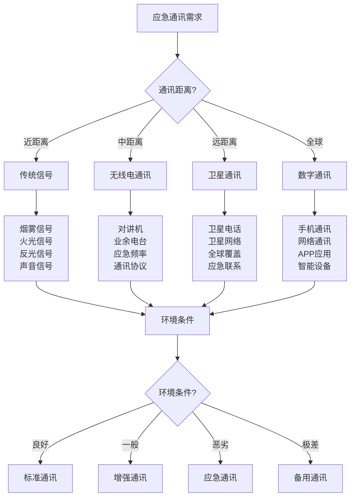

# 应急通讯与救援

## 📡 应急通讯技术

### 1. 无线电通讯
- **对讲机使用**：频道选择、功率调节、通讯距离、信号质量
- **业余电台**：频率使用、呼号规范、通讯协议、应急频率
- **卫星通讯**：卫星电话、卫星网络、全球覆盖、应急联系
- **应急频率**：国际应急频率、救援频率、紧急通讯、标准协议
- **通讯协议**：通讯规范、呼号使用、信息传递、确认机制
- **设备维护**：设备保养、电池管理、天线维护、功能检查

### 2. 数字通讯
- **手机通讯**：信号接收、位置分享、短信发送、网络通讯
- **卫星通讯**：卫星电话、卫星网络、全球覆盖、应急联系
- **网络通讯**：网络连接、在线求助、社交媒体、信息传递
- **APP应用**：救援APP、位置追踪、应急联系、信息分享
- **数字信标**：数字信标、自动发送、位置信息、救援信号
- **智能设备**：智能设备、自动求救、位置追踪、应急功能

### 3. 传统通讯
- **信号发送**：烟雾信号、火光信号、反光信号、声音信号
- **地面标记**：地面标记、SOS标记、方向标记、信息标记
- **旗帜信号**：彩色旗帜、布条信号、旗帜组合、空中可见
- **声音信号**：哨声信号、敲击信号、呼喊信号、节奏信号
- **光学信号**：镜子反光、激光信号、闪光信号、光学通讯
- **应急信标**：应急信标、自动发送、救援信号、位置信息

### 4. 通讯管理
- **通讯计划**：通讯计划、频率分配、时间安排、人员分工
- **信息管理**：信息收集、信息整理、信息传递、信息确认
- **设备管理**：设备分配、设备维护、设备更新、设备备份
- **人员管理**：人员培训、人员分工、人员协调、人员安全
- **时间管理**：通讯时间、频率时间、应急时间、救援时间
- **质量管理**：通讯质量、信息质量、服务质量、效果评估

## 🆘 救援协调机制

### 1. 救援组织
- **救援机构**：救援机构、救援组织、救援队伍、救援网络
- **救援人员**：救援人员、专业人员、志愿者、协调人员
- **救援设备**：救援设备、专业设备、应急设备、通讯设备
- **救援资源**：救援资源、人力资源、物资资源、技术资源
- **救援能力**：救援能力、专业能力、应急能力、协调能力
- **救援标准**：救援标准、操作标准、质量标准、安全标准

### 2. 协调机制
- **指挥体系**：指挥体系、指挥结构、指挥关系、指挥流程
- **协调机制**：协调机制、协调方式、协调流程、协调标准
- **信息共享**：信息共享、信息传递、信息确认、信息更新
- **资源调配**：资源调配、资源分配、资源使用、资源管理
- **任务分工**：任务分工、责任分工、工作分工、协调分工
- **进度管理**：进度管理、时间管理、进度跟踪、进度调整

### 3. 应急响应
- **响应等级**：响应等级、应急等级、危险等级、救援等级
- **响应时间**：响应时间、到达时间、救援时间、完成时间
- **响应流程**：响应流程、应急流程、救援流程、协调流程
- **响应标准**：响应标准、操作标准、质量标准、安全标准
- **响应评估**：响应评估、效果评估、效率评估、质量评估
- **响应改进**：响应改进、流程改进、标准改进、能力改进

### 4. 救援管理
- **救援计划**：救援计划、应急计划、协调计划、执行计划
- **救援执行**：救援执行、任务执行、协调执行、监督执行
- **救援监控**：救援监控、进度监控、质量监控、安全监控
- **救援评估**：救援评估、效果评估、效率评估、质量评估
- **救援总结**：救援总结、经验总结、教训总结、改进总结
- **救援改进**：救援改进、流程改进、标准改进、能力改进

## 🚁 救援资源调配

### 1. 人力资源
- **救援人员**：救援人员、专业人员、志愿者、协调人员
- **技能要求**：技能要求、专业要求、经验要求、培训要求
- **人员分配**：人员分配、任务分配、责任分配、协调分配
- **人员管理**：人员管理、培训管理、考核管理、激励管理
- **人员安全**：人员安全、安全防护、安全培训、安全管理
- **人员发展**：人员发展、技能发展、职业发展、能力发展

### 2. 物资资源
- **救援物资**：救援物资、应急物资、医疗物资、生活物资
- **物资储备**：物资储备、储备管理、储备更新、储备维护
- **物资调配**：物资调配、物资分配、物资运输、物资使用
- **物资管理**：物资管理、库存管理、质量管理、安全管理
- **物资更新**：物资更新、物资补充、物资维护、物资升级
- **物资优化**：物资优化、资源配置、效率优化、成本优化

### 3. 技术资源
- **救援技术**：救援技术、应急技术、通讯技术、医疗技术
- **技术设备**：技术设备、通讯设备、医疗设备、救援设备
- **技术标准**：技术标准、操作标准、质量标准、安全标准
- **技术培训**：技术培训、技能培训、操作培训、安全培训
- **技术更新**：技术更新、设备更新、标准更新、能力更新
- **技术优化**：技术优化、流程优化、标准优化、能力优化

### 4. 信息资源
- **信息收集**：信息收集、信息整理、信息分析、信息评估
- **信息传递**：信息传递、信息共享、信息确认、信息更新
- **信息管理**：信息管理、信息存储、信息安全、信息维护
- **信息应用**：信息应用、决策支持、协调支持、救援支持
- **信息更新**：信息更新、信息补充、信息维护、信息升级
- **信息优化**：信息优化、信息质量、信息效率、信息价值

## 📍 救援定位技术

### 1. GPS定位
- **GPS设备**：GPS设备、卫星信号、精确定位、位置信息
- **坐标系统**：经纬度、UTM坐标、坐标转换、坐标精度
- **定位精度**：定位精度、误差范围、精度要求、精度评估
- **信号质量**：信号强度、信号质量、信号稳定、信号可用
- **设备管理**：设备管理、电池管理、维护管理、更新管理
- **应用功能**：导航功能、记录功能、分享功能、应急功能

### 2. 地图定位
- **地形定位**：地形特征、地标识别、位置确定、地图配合
- **地标定位**：地标识别、地标特征、位置确定、地图标记
- **交叉定位**：多方向定位、交叉定位、位置确定、精度提高
- **距离定位**：距离测量、距离计算、位置推算、精度评估
- **角度定位**：角度测量、角度计算、位置计算、精度评估
- **综合定位**：综合方法、多种定位、位置确定、精度优化

### 3. 自然定位
- **太阳定位**：太阳位置、影子方向、方向判断、时间计算
- **星星定位**：北极星、星座识别、方向判断、位置推算
- **月亮定位**：月亮位置、月亮轨迹、方向判断、时间计算
- **风向定位**：风向变化、风向判断、方向识别、位置推算
- **水流定位**：水流方向、河流走向、方向判断、位置推算
- **植物定位**：植物生长、阳光方向、方向判断、位置推算

### 4. 人工定位
- **路标定位**：路标识别、路标特征、位置确定、地图配合
- **建筑定位**：建筑识别、建筑特征、位置确定、地图标记
- **设施定位**：设施识别、设施特征、位置确定、地图标记
- **标识定位**：标识识别、标识特征、位置确定、地图标记
- **地名牌定位**：地名牌识别、地名特征、位置确定、地图标记
- **坐标定位**：坐标识别、坐标特征、位置确定、精度评估

## 📊 应急通讯对比

| 通讯方式 | 覆盖范围 | 可靠性 | 设备需求 | 成本 | 适用性 | 推荐指数 |
|----------|----------|--------|----------|------|--------|----------|
| **无线电** | 中 | 高 | 中 | 中 | 高 | ⭐⭐⭐⭐ |
| **卫星通讯** | 极广 | 极高 | 高 | 高 | 中 | ⭐⭐⭐⭐⭐ |
| **手机通讯** | 广 | 中 | 低 | 低 | 高 | ⭐⭐⭐⭐ |
| **传统信号** | 近 | 中 | 低 | 低 | 高 | ⭐⭐⭐ |
| **数字通讯** | 广 | 高 | 中 | 中 | 高 | ⭐⭐⭐⭐ |

## 🎯 应急通讯决策树

## 🎓 费曼学习法应用

### 第一步：选择概念
选择"应急通讯与救援"作为学习概念

### 第二步：教授他人
用简单语言解释：
> "应急通讯要选择合适的通讯方式：近距离用传统信号，中距离用无线电，远距离用卫星通讯，全球用数字通讯。救援要协调资源，准确定位，快速响应。"

### 第三步：回顾简化
- **应急通讯**：无线电通讯、数字通讯、传统通讯、通讯管理
- **救援协调**：救援组织、协调机制、应急响应、救援管理
- **资源调配**：人力资源、物资资源、技术资源、信息资源
- **救援定位**：GPS定位、地图定位、自然定位、人工定位

### 第四步：组织优化
建立通讯救援与技能的关系：
- 应急通讯 → [[03-野外生存/06-信号与求救|信号求救]]
- 救援协调 → [[04-创新层-进阶发展/03-领导力培养|领导力培养]]
- 资源调配 → [[04-创新层-进阶发展/03-领导力培养/01-团队管理技能|团队管理]]
- 救援定位 → [[03-野外生存/01-方向识别技能|方向识别]]

## 🏃‍♂️ 刻意练习要点

### 通讯救援练习
1. **通讯技能**：练习各种通讯技能
2. **协调技能**：练习救援协调技能
3. **定位技能**：练习救援定位技能
4. **应急演练**：进行应急通讯救援演练

### 实践验证
- **通讯测试**：测试通讯技能效果
- **协调测试**：测试协调技能效果
- **定位测试**：测试定位技能精度
- **持续改进**：持续改进通讯救援技能

## 🔗 通讯救援与技能的关系

### 应急通讯技能
- **通讯技能**：[[03-野外生存/06-信号与求救|信号求救]]
- **设备技能**：[[01-装备准备/01-基础装备清单|基础装备]]
- **技术技能**：[[04-创新层-进阶发展/02-专业配置/03-技术装备集成|技术集成]]
- **管理技能**：[[04-创新层-进阶发展/03-领导力培养/02-时间管理技能|时间管理]]

### 救援协调技能
- **协调技能**：[[04-创新层-进阶发展/03-领导力培养/04-沟通协调技巧|沟通协调]]
- **管理技能**：[[04-创新层-进阶发展/03-领导力培养/01-团队管理技能|团队管理]]
- **领导技能**：[[04-创新层-进阶发展/03-领导力培养|领导力培养]]
- **应急技能**：[[04-应急处理|应急处理]]

### 资源调配技能
- **管理技能**：[[04-创新层-进阶发展/03-领导力培养/01-团队管理技能|团队管理]]
- **协调技能**：[[04-创新层-进阶发展/03-领导力培养/04-沟通协调技巧|沟通协调]]
- **优化技能**：[[04-创新层-进阶发展/02-专业配置/05-升级优化策略|升级优化]]
- **创新技能**：[[04-创新层-进阶发展/01-高级技巧|高级技巧]]

### 救援定位技能
- **定位技能**：[[03-野外生存/01-方向识别技能|方向识别]]
- **技术技能**：[[04-创新层-进阶发展/02-专业配置/03-技术装备集成|技术集成]]
- **分析技能**：[[04-创新层-进阶发展/01-高级技巧/07-跨学科知识整合|跨学科知识]]
- **判断技能**：[[04-创新层-进阶发展/03-领导力培养/06-责任与担当|责任担当]]

## 📋 应急通讯与救援检查清单

### 应急通讯
- [ ] 掌握无线电通讯
- [ ] 掌握数字通讯
- [ ] 掌握传统通讯
- [ ] 掌握通讯管理

### 救援协调
- [ ] 了解救援组织
- [ ] 掌握协调机制
- [ ] 学会应急响应
- [ ] 掌握救援管理

### 资源调配
- [ ] 掌握人力资源调配
- [ ] 掌握物资资源调配
- [ ] 掌握技术资源调配
- [ ] 掌握信息资源调配

### 救援定位
- [ ] 掌握GPS定位
- [ ] 掌握地图定位
- [ ] 掌握自然定位
- [ ] 掌握人工定位

## 🎯 应急通讯与救援策略

### 系统性策略
1. **通讯准备**：准备多种通讯方式
2. **协调机制**：建立有效协调机制
3. **资源调配**：合理调配救援资源
4. **定位准确**：确保救援定位准确

### 应急性策略
- **快速响应**：快速响应应急需求
- **多种方式**：多种通讯方式备用
- **协调高效**：高效协调救援行动
- **持续改进**：持续改进通讯救援能力

## 🔗 相关链接
- [[01-常见伤病处理|常见伤病处理]]
- [[02-恶劣天气应对|恶劣天气应对]]
- [[04-安全撤离与避险|安全撤离与避险]]
- [[03-野外生存/06-信号与求救|信号与求救]]
