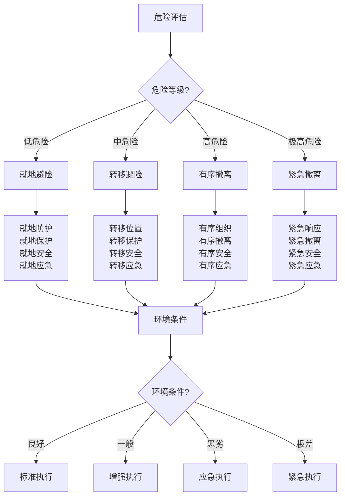

# 安全撤离与避险

## 🚨 撤离决策机制

### 1. 风险评估
- **危险识别**：危险类型、危险程度、危险范围、危险时间
- **风险分析**：风险等级、风险因素、风险影响、风险概率
- **环境评估**：环境条件、天气状况、地形条件、安全距离
- **人员评估**：人员状态、人员能力、人员安全、人员需求
- **资源评估**：资源状况、资源需求、资源可用、资源限制
- **时间评估**：撤离时间、安全时间、应急时间、救援时间

### 2. 撤离标准
- **撤离触发**：撤离条件、撤离标准、撤离时机、撤离决定
- **撤离等级**：撤离等级、紧急程度、危险程度、响应等级
- **撤离范围**：撤离范围、影响范围、安全范围、保护范围
- **撤离人员**：撤离人员、人员名单、人员状态、人员安全
- **撤离物品**：重要物品、必需物品、应急物品、个人物品
- **撤离路线**：撤离路线、备用路线、安全路线、最优路线

### 3. 决策流程
- **信息收集**：信息收集、信息整理、信息分析、信息评估
- **方案制定**：方案制定、方案比较、方案选择、方案优化
- **决策执行**：决策执行、任务分配、责任分工、协调配合
- **执行监控**：执行监控、进度监控、质量监控、安全监控
- **效果评估**：效果评估、结果评估、效率评估、质量评估
- **经验总结**：经验总结、教训总结、改进建议、能力提升

### 4. 决策支持
- **技术支持**：技术支持、设备支持、系统支持、数据支持
- **人员支持**：人员支持、专业支持、协调支持、安全支持
- **资源支持**：资源支持、物资支持、资金支持、后勤支持
- **信息支持**：信息支持、通讯支持、情报支持、决策支持
- **培训支持**：培训支持、技能支持、知识支持、能力支持
- **持续支持**：持续支持、长期支持、发展支持、创新支持

## 🛣️ 撤离路线规划

### 1. 路线选择
- **安全路线**：安全路线、风险最低、时间最短、距离最近
- **备用路线**：备用路线、应急路线、替代路线、安全路线
- **地形考虑**：地形条件、地形优势、地形劣势、地形适应
- **天气考虑**：天气条件、天气影响、天气变化、天气适应
- **时间考虑**：撤离时间、安全时间、应急时间、救援时间
- **距离考虑**：撤离距离、安全距离、应急距离、救援距离

### 2. 路线评估
- **安全性评估**：安全风险、安全等级、安全措施、安全保证
- **可行性评估**：可行性分析、可行性等级、可行性措施、可行性保证
- **效率评估**：效率分析、效率等级、效率措施、效率保证
- **成本评估**：成本分析、成本等级、成本控制、成本优化
- **环境影响**：环境影响、环境适应、环境保护、环境可持续
- **社会影响**：社会影响、社会适应、社会责任、社会可持续

### 3. 路线优化
- **路线优化**：路线优化、路径优化、时间优化、效率优化
- **安全优化**：安全优化、风险优化、措施优化、保证优化
- **效率优化**：效率优化、时间优化、成本优化、资源优化
- **适应性优化**：适应性优化、灵活性优化、应变性优化、可持续性优化
- **创新优化**：创新优化、技术优化、方法优化、管理优化
- **持续优化**：持续优化、动态优化、实时优化、智能优化

### 4. 路线管理
- **路线维护**：路线维护、路线保养、路线更新、路线升级
- **路线监控**：路线监控、路线监测、路线跟踪、路线管理
- **路线更新**：路线更新、路线调整、路线改进、路线优化
- **路线备份**：路线备份、路线存储、路线恢复、路线保护
- **路线共享**：路线共享、路线交流、路线合作、路线协调
- **路线发展**：路线发展、路线规划、路线建设、路线完善

## 🏃‍♂️ 撤离执行技巧

### 1. 组织协调
- **人员组织**：人员组织、人员分工、人员协调、人员管理
- **任务分配**：任务分配、责任分配、工作分配、协调分配
- **时间管理**：时间管理、进度管理、时间控制、时间优化
- **资源调配**：资源调配、资源分配、资源使用、资源管理
- **通讯协调**：通讯协调、信息协调、指挥协调、执行协调
- **安全保障**：安全保障、安全措施、安全监控、安全管理

### 2. 执行策略
- **快速撤离**：快速撤离、紧急撤离、优先撤离、安全撤离
- **有序撤离**：有序撤离、组织撤离、协调撤离、管理撤离
- **安全撤离**：安全撤离、风险控制、安全措施、安全保证
- **高效撤离**：高效撤离、效率优化、时间控制、资源优化
- **灵活撤离**：灵活撤离、应变撤离、适应撤离、调整撤离
- **持续撤离**：持续撤离、长期撤离、稳定撤离、可持续撤离

### 3. 应急处理
- **突发情况**：突发情况、应急处理、快速响应、及时处理
- **障碍处理**：障碍处理、困难处理、问题处理、风险处理
- **人员问题**：人员问题、人员安全、人员协调、人员管理
- **设备问题**：设备问题、设备故障、设备维修、设备更换
- **环境问题**：环境问题、环境变化、环境适应、环境应对
- **通讯问题**：通讯问题、通讯中断、通讯恢复、通讯保障

### 4. 质量控制
- **质量监控**：质量监控、质量检查、质量评估、质量保证
- **进度控制**：进度控制、进度监控、进度调整、进度优化
- **安全控制**：安全控制、安全监控、安全措施、安全保证
- **效率控制**：效率控制、效率监控、效率优化、效率提升
- **成本控制**：成本控制、成本监控、成本优化、成本管理
- **风险控制**：风险控制、风险监控、风险措施、风险管理

## 🛡️ 避险策略

### 1. 避险原则
- **安全第一**：安全第一、生命至上、安全优先、安全保证
- **预防为主**：预防为主、防治结合、预防优先、预防措施
- **快速响应**：快速响应、及时处理、应急优先、应急措施
- **科学决策**：科学决策、理性决策、数据支持、专业判断
- **协调配合**：协调配合、团队合作、统一指挥、协调行动
- **持续改进**：持续改进、经验总结、能力提升、创新发展

### 2. 避险方法
- **就地避险**：就地避险、就地保护、就地安全、就地应急
- **转移避险**：转移避险、转移保护、转移安全、转移应急
- **疏散避险**：疏散避险、疏散保护、疏散安全、疏散应急
- **隔离避险**：隔离避险、隔离保护、隔离安全、隔离应急
- **防护避险**：防护避险、防护保护、防护安全、防护应急
- **应急避险**：应急避险、应急保护、应急安全、应急措施

### 3. 避险措施
- **个人防护**：个人防护、个人安全、个人保护、个人应急
- **集体防护**：集体防护、集体安全、集体保护、集体应急
- **环境防护**：环境防护、环境安全、环境保护、环境应急
- **设备防护**：设备防护、设备安全、设备保护、设备应急
- **通讯防护**：通讯防护、通讯安全、通讯保护、通讯应急
- **资源防护**：资源防护、资源安全、资源保护、资源应急

### 4. 避险管理
- **避险计划**：避险计划、避险规划、避险方案、避险措施
- **避险执行**：避险执行、避险实施、避险操作、避险行动
- **避险监控**：避险监控、避险监测、避险跟踪、避险管理
- **避险评估**：避险评估、避险检查、避险分析、避险改进
- **避险总结**：避险总结、避险经验、避险教训、避险改进
- **避险发展**：避险发展、避险完善、避险提升、避险创新

## 📊 撤离避险对比

| 应对方式 | 适用场景 | 执行难度 | 安全等级 | 时间要求 | 成功率 | 推荐指数 |
|----------|----------|----------|----------|----------|--------|----------|
| **快速撤离** | 紧急情况 | 高 | 中 | 短 | 高 | ⭐⭐⭐⭐ |
| **有序撤离** | 一般情况 | 中 | 高 | 中 | 高 | ⭐⭐⭐⭐⭐ |
| **就地避险** | 危险区域 | 低 | 中 | 短 | 中 | ⭐⭐⭐ |
| **转移避险** | 中等危险 | 中 | 高 | 中 | 高 | ⭐⭐⭐⭐ |

## 🎯 撤离避险决策树

## 🎓 费曼学习法应用

### 第一步：选择概念
选择"安全撤离与避险"作为学习概念

### 第二步：教授他人
用简单语言解释：
> "安全撤离要评估危险等级：低危险就地避险，中危险转移避险，高危险有序撤离，极高危险紧急撤离。关键是快速决策，科学执行，安全第一。"

### 第三步：回顾简化
- **撤离决策**：风险评估、撤离标准、决策流程、决策支持
- **路线规划**：路线选择、路线评估、路线优化、路线管理
- **执行技巧**：组织协调、执行策略、应急处理、质量控制
- **避险策略**：避险原则、避险方法、避险措施、避险管理

### 第四步：组织优化
建立撤离避险与技能的关系：
- 撤离决策 → [[04-创新层-进阶发展/03-领导力培养/06-责任与担当|责任担当]]
- 路线规划 → [[03-野外生存/01-方向识别技能|方向识别]]
- 执行技巧 → [[04-创新层-进阶发展/03-领导力培养/01-团队管理技能|团队管理]]
- 避险策略 → [[02-理解层-原理机制/03-安全防护机制|安全防护]]

## 🏃‍♂️ 刻意练习要点

### 撤离避险练习
1. **决策练习**：练习撤离决策技能
2. **规划练习**：练习路线规划技能
3. **执行练习**：练习撤离执行技能
4. **避险练习**：练习避险策略技能

### 实践验证
- **决策测试**：测试撤离决策能力
- **规划测试**：测试路线规划能力
- **执行测试**：测试撤离执行能力
- **持续改进**：持续改进撤离避险技能

## 🔗 撤离避险与技能的关系

### 撤离决策技能
- **决策技能**：[[04-创新层-进阶发展/03-领导力培养/06-责任与担当|责任担当]]
- **分析技能**：[[04-创新层-进阶发展/01-高级技巧/07-跨学科知识整合|跨学科知识]]
- **评估技能**：[[02-理解层-原理机制/04-环境保护理念/01-生态影响评估|生态评估]]
- **管理技能**：[[04-创新层-进阶发展/03-领导力培养/01-团队管理技能|团队管理]]

### 路线规划技能
- **规划技能**：[[04-创新层-进阶发展/03-领导力培养/02-时间管理技能|时间管理]]
- **定位技能**：[[03-野外生存/01-方向识别技能|方向识别]]
- **分析技能**：[[04-创新层-进阶发展/01-高级技巧/07-跨学科知识整合|跨学科知识]]
- **优化技能**：[[04-创新层-进阶发展/02-专业配置/05-升级优化策略|升级优化]]

### 执行技巧技能
- **组织技能**：[[04-创新层-进阶发展/03-领导力培养/01-团队管理技能|团队管理]]
- **协调技能**：[[04-创新层-进阶发展/03-领导力培养/04-沟通协调技巧|沟通协调]]
- **应急技能**：[[04-应急处理|应急处理]]
- **控制技能**：[[04-创新层-进阶发展/03-领导力培养/06-责任与担当|责任担当]]

### 避险策略技能
- **策略技能**：[[04-创新层-进阶发展/01-高级技巧|高级技巧]]
- **防护技能**：[[02-理解层-原理机制/03-安全防护机制|安全防护]]
- **管理技能**：[[04-创新层-进阶发展/03-领导力培养/01-团队管理技能|团队管理]]
- **创新技能**：[[04-创新层-进阶发展/01-高级技巧|高级技巧]]

## 📋 安全撤离与避险检查清单

### 撤离决策
- [ ] 进行风险评估
- [ ] 制定撤离标准
- [ ] 建立决策流程
- [ ] 提供决策支持

### 路线规划
- [ ] 选择安全路线
- [ ] 评估路线可行性
- [ ] 优化路线方案
- [ ] 管理路线维护

### 执行技巧
- [ ] 组织人员协调
- [ ] 制定执行策略
- [ ] 处理应急情况
- [ ] 控制执行质量

### 避险策略
- [ ] 制定避险原则
- [ ] 选择避险方法
- [ ] 实施避险措施
- [ ] 管理避险过程

## 🎯 安全撤离与避险策略

### 系统性策略
1. **预防为主**：预防为主、防治结合
2. **快速决策**：快速决策、科学决策
3. **有序执行**：有序执行、安全执行
4. **持续改进**：持续改进、能力提升

### 安全性策略
- **安全第一**：安全始终是第一优先级
- **科学决策**：科学决策、理性决策
- **有序执行**：有序执行、协调配合
- **持续监控**：持续监控、及时调整

## 🔗 相关链接
- [[01-常见伤病处理|常见伤病处理]]
- [[02-恶劣天气应对|恶劣天气应对]]
- [[03-应急通讯与救援|应急通讯与救援]]
- [[02-理解层-原理机制/03-安全防护机制|安全防护机制]]
