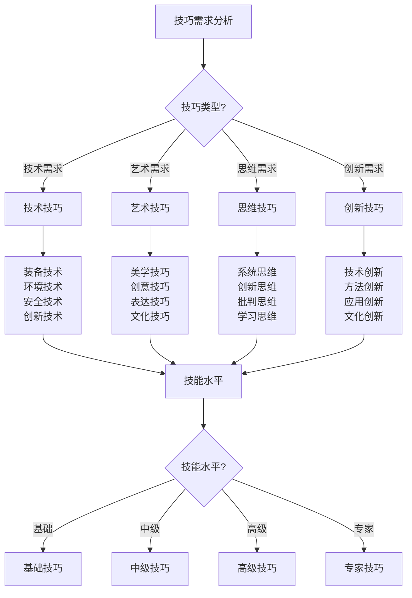

# 高级技巧

## 🎯 高级技巧概述

### 1. 技巧层次
- **基础技巧**：基础技能、基本操作、入门技巧、基础应用
- **中级技巧**：中级技能、熟练操作、进阶技巧、综合应用
- **高级技巧**：高级技能、精通操作、专业技巧、创新应用
- **专家技巧**：专家技能、大师操作、顶级技巧、突破应用
- **创新技巧**：创新技能、原创操作、突破技巧、前沿应用
- **传承技巧**：传承技能、教学操作、传授技巧、文化应用

### 2. 技巧特点
- **复杂性**：技巧复杂、操作复杂、应用复杂、环境复杂
- **专业性**：专业要求、专业标准、专业水平、专业认证
- **创新性**：创新思维、创新方法、创新应用、创新发展
- **实用性**：实用价值、实用效果、实用应用、实用推广
- **安全性**：安全要求、安全标准、安全操作、安全保障
- **环保性**：环保要求、环保标准、环保操作、环保理念

### 3. 技巧分类
- **技术技巧**：技术技能、技术操作、技术应用、技术创新
- **管理技巧**：管理技能、管理操作、管理应用、管理创新
- **沟通技巧**：沟通技能、沟通操作、沟通应用、沟通创新
- **创新技巧**：创新技能、创新操作、创新应用、创新发展
- **教学技巧**：教学技能、教学操作、教学应用、教学创新
- **文化技巧**：文化技能、文化操作、文化应用、文化传承

### 4. 技巧发展
- **学习路径**：学习路径、发展路径、成长路径、提升路径
- **技能提升**：技能提升、能力提升、水平提升、境界提升
- **经验积累**：经验积累、实践积累、知识积累、智慧积累
- **创新突破**：创新突破、技术突破、方法突破、理念突破
- **传承发展**：传承发展、文化发展、技能发展、创新发展
- **持续改进**：持续改进、不断改进、系统改进、全面改进

## 🔧 技术技巧

### 1. 装备技术
- **装备优化**：装备优化、性能优化、功能优化、效率优化
- **装备创新**：装备创新、技术创新、功能创新、设计创新
- **装备集成**：装备集成、系统集成、功能集成、技术集成
- **装备维护**：装备维护、保养维护、维修维护、升级维护
- **装备测试**：装备测试、性能测试、功能测试、安全测试
- **装备评估**：装备评估、性能评估、效果评估、价值评估

### 2. 环境技术
- **环境适应**：环境适应、气候适应、地形适应、生态适应
- **环境利用**：环境利用、资源利用、条件利用、优势利用
- **环境保护**：环境保护、生态保护、资源保护、可持续发展
- **环境监测**：环境监测、变化监测、影响监测、效果监测
- **环境评估**：环境评估、影响评估、风险评估、效果评估
- **环境管理**：环境管理、资源管理、生态管理、可持续发展

### 3. 安全技术
- **安全防护**：安全防护、风险防护、危险防护、应急防护
- **安全监测**：安全监测、风险监测、危险监测、应急监测
- **安全评估**：安全评估、风险评估、危险评估、应急评估
- **安全控制**：安全控制、风险控制、危险控制、应急控制
- **安全应急**：安全应急、风险应急、危险应急、应急处理
- **安全管理**：安全管理、风险管理、危险管理、应急管理

### 4. 创新技术
- **技术创新**：技术创新、方法创新、工艺创新、应用创新
- **产品创新**：产品创新、功能创新、设计创新、体验创新
- **服务创新**：服务创新、模式创新、流程创新、体验创新
- **管理创新**：管理创新、组织创新、制度创新、文化创新
- **教育创新**：教育创新、教学创新、学习创新、培训创新
- **文化创新**：文化创新、理念创新、价值创新、传承创新

## 🎨 艺术技巧

### 1. 美学技巧
- **美学原理**：美学原理、美学理论、美学方法、美学应用
- **审美能力**：审美能力、审美眼光、审美标准、审美品味
- **美学设计**：美学设计、视觉设计、空间设计、环境设计
- **美学表达**：美学表达、艺术表达、创意表达、文化表达
- **美学教育**：美学教育、审美教育、艺术教育、文化教育
- **美学创新**：美学创新、审美创新、艺术创新、文化创新

### 2. 创意技巧
- **创意思维**：创意思维、创新思维、发散思维、聚合思维
- **创意方法**：创意方法、创新方法、设计方法、解决问题方法
- **创意工具**：创意工具、创新工具、设计工具、思维工具
- **创意实践**：创意实践、创新实践、设计实践、应用实践
- **创意评估**：创意评估、创新评估、效果评估、价值评估
- **创意发展**：创意发展、创新发展、设计发展、应用发展

### 3. 表达技巧
- **语言表达**：语言表达、口头表达、书面表达、艺术表达
- **视觉表达**：视觉表达、图像表达、设计表达、艺术表达
- **行为表达**：行为表达、动作表达、表演表达、艺术表达
- **情感表达**：情感表达、情绪表达、感受表达、体验表达
- **文化表达**：文化表达、价值表达、理念表达、精神表达
- **创新表达**：创新表达、创意表达、突破表达、前沿表达

### 4. 文化技巧
- **文化理解**：文化理解、文化认知、文化认同、文化传承
- **文化表达**：文化表达、文化传播、文化分享、文化交流
- **文化创新**：文化创新、文化发展、文化融合、文化突破
- **文化教育**：文化教育、文化传承、文化培养、文化发展
- **文化管理**：文化管理、文化保护、文化发展、文化传承
- **文化价值**：文化价值、文化意义、文化作用、文化影响

## 🧠 思维技巧

### 1. 系统思维
- **系统分析**：系统分析、整体分析、结构分析、功能分析
- **系统设计**：系统设计、整体设计、结构设计、功能设计
- **系统优化**：系统优化、整体优化、结构优化、功能优化
- **系统管理**：系统管理、整体管理、结构管理、功能管理
- **系统创新**：系统创新、整体创新、结构创新、功能创新
- **系统发展**：系统发展、整体发展、结构发展、功能发展

### 2. 创新思维
- **创新理念**：创新理念、创新思维、创新方法、创新实践
- **创新方法**：创新方法、创新工具、创新技巧、创新应用
- **创新实践**：创新实践、创新应用、创新推广、创新发展
- **创新评估**：创新评估、效果评估、价值评估、影响评估
- **创新管理**：创新管理、创新组织、创新激励、创新发展
- **创新文化**：创新文化、创新氛围、创新精神、创新价值

### 3. 批判思维
- **批判分析**：批判分析、理性分析、逻辑分析、客观分析
- **批判评估**：批判评估、理性评估、逻辑评估、客观评估
- **批判判断**：批判判断、理性判断、逻辑判断、客观判断
- **批判决策**：批判决策、理性决策、逻辑决策、客观决策
- **批判创新**：批判创新、理性创新、逻辑创新、客观创新
- **批判发展**：批判发展、理性发展、逻辑发展、客观发展

### 4. 学习思维
- **学习策略**：学习策略、学习方法、学习技巧、学习应用
- **学习能力**：学习能力、学习效率、学习效果、学习质量
- **学习创新**：学习创新、学习方法创新、学习工具创新、学习应用创新
- **学习管理**：学习管理、学习组织、学习计划、学习评估
- **学习文化**：学习文化、学习氛围、学习精神、学习价值
- **学习发展**：学习发展、学习成长、学习提升、学习突破

## 📊 高级技巧对比

| 技巧类型 | 复杂度 | 专业度 | 创新度 | 实用度 | 发展潜力 | 推荐指数 |
|----------|--------|--------|--------|--------|----------|----------|
| **技术技巧** | 高 | 极高 | 高 | 极高 | 高 | ⭐⭐⭐⭐⭐ |
| **艺术技巧** | 中 | 高 | 极高 | 中 | 高 | ⭐⭐⭐⭐ |
| **思维技巧** | 极高 | 高 | 极高 | 高 | 极高 | ⭐⭐⭐⭐⭐ |
| **创新技巧** | 极高 | 极高 | 极高 | 高 | 极高 | ⭐⭐⭐⭐⭐ |

## 🎯 高级技巧决策树

## 🎓 费曼学习法应用

### 第一步：选择概念
选择"高级技巧"作为学习概念

### 第二步：教授他人
用简单语言解释：
> "高级技巧是露营技能的最高层次：技术技巧解决复杂问题，艺术技巧提升体验美感，思维技巧优化决策过程，创新技巧突破传统局限。需要系统学习，持续实践，不断创新。"

### 第三步：回顾简化
- **技术技巧**：装备技术、环境技术、安全技术、创新技术
- **艺术技巧**：美学技巧、创意技巧、表达技巧、文化技巧
- **思维技巧**：系统思维、创新思维、批判思维、学习思维
- **创新技巧**：技术创新、方法创新、应用创新、文化创新

### 第四步：组织优化
建立高级技巧与技能的关系：
- 技术技巧 → [[02-专业配置|专业配置]]
- 艺术技巧 → [[04-文化传承|文化传承]]
- 思维技巧 → [[03-领导力培养|领导力培养]]
- 创新技巧 → [[04-文化传承|文化传承]]

## 🏃‍♂️ 刻意练习要点

### 高级技巧练习
1. **理论学习**：学习高级技巧理论知识
2. **技能练习**：练习高级技巧技能
3. **创新实践**：进行创新实践应用
4. **持续提升**：持续提升技巧水平

### 实践验证
- **技巧测试**：测试高级技巧水平
- **创新测试**：测试创新能力
- **应用测试**：测试应用效果
- **持续改进**：持续改进技巧水平

## 🔗 高级技巧与技能的关系

### 技术技巧技能
- **技术技能**：[[02-专业配置/03-技术装备集成|技术集成]]
- **创新技能**：[[04-文化传承/03-创新文化发展|创新文化]]
- **管理技能**：[[02-专业配置/04-维护保养体系|维护保养]]
- **优化技能**：[[02-专业配置/05-升级优化策略|升级优化]]

### 艺术技巧技能
- **美学技能**：[[04-文化传承/02-美学教育实践|美学教育]]
- **创意技能**：[[04-文化传承/03-创新文化发展|创新文化]]
- **表达技能**：[[03-领导力培养/04-沟通协调技巧|沟通协调]]
- **文化技能**：[[04-文化传承|文化传承]]

### 思维技巧技能
- **系统技能**：[[03-领导力培养/01-团队管理技能|团队管理]]
- **创新技能**：[[04-文化传承/03-创新文化发展|创新文化]]
- **批判技能**：[[03-领导力培养/06-责任与担当|责任担当]]
- **学习技能**：[[04-文化传承/04-终身学习体系|终身学习]]

### 创新技巧技能
- **创新技能**：[[04-文化传承/03-创新文化发展|创新文化]]
- **技术技能**：[[02-专业配置/03-技术装备集成|技术集成]]
- **管理技能**：[[03-领导力培养/01-团队管理技能|团队管理]]
- **文化技能**：[[04-文化传承|文化传承]]

## 📋 高级技巧检查清单

### 技术技巧
- [ ] 掌握装备技术
- [ ] 掌握环境技术
- [ ] 掌握安全技术
- [ ] 掌握创新技术

### 艺术技巧
- [ ] 掌握美学技巧
- [ ] 掌握创意技巧
- [ ] 掌握表达技巧
- [ ] 掌握文化技巧

### 思维技巧
- [ ] 掌握系统思维
- [ ] 掌握创新思维
- [ ] 掌握批判思维
- [ ] 掌握学习思维

### 创新技巧
- [ ] 掌握技术创新
- [ ] 掌握方法创新
- [ ] 掌握应用创新
- [ ] 掌握文化创新

## 🎯 高级技巧策略

### 系统性策略
1. **技能提升**：系统提升技能水平
2. **创新实践**：积极进行创新实践
3. **持续学习**：持续学习新知识
4. **经验积累**：积累实践经验

### 创新性策略
- **创新思维**：培养创新思维
- **创新方法**：掌握创新方法
- **创新实践**：进行创新实践
- **创新发展**：持续创新发展

## 🔗 相关链接
- [[02-专业配置|专业配置]]
- [[03-领导力培养|领导力培养]]
- [[04-文化传承|文化传承]]
- [[03-应用层-实践技能|应用层实践技能]]
