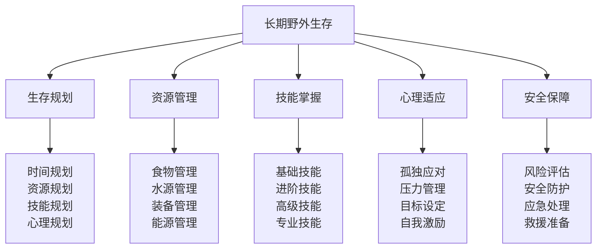
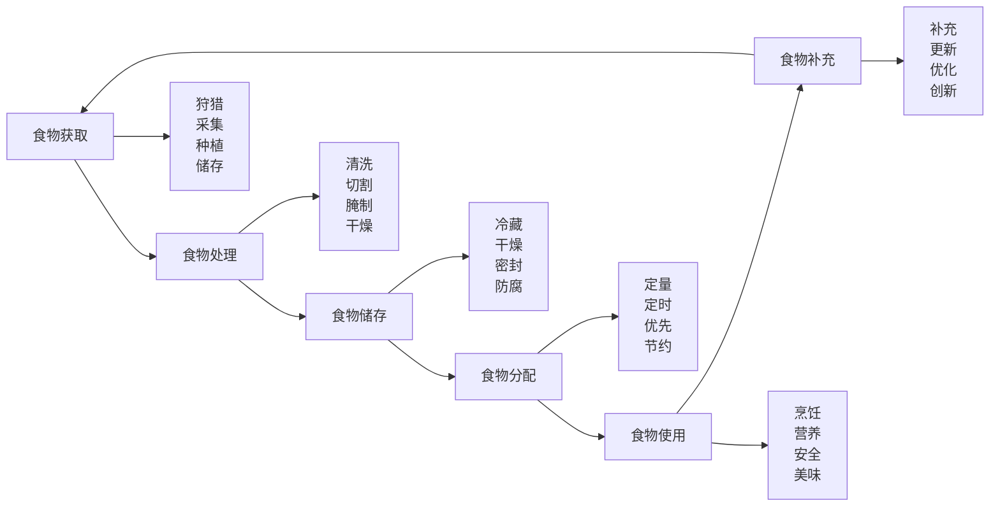
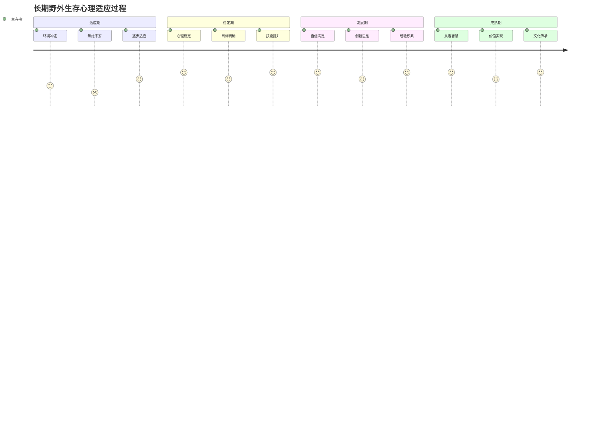

# 长期野外生存

## 🎯 长期生存核心框架

### 生存能力金字塔

## 📊 生存规划体系

### 时间规划策略
| 时间阶段 | 主要任务 | 时间分配 | 重点技能 | 预期成果 |
|----------|----------|----------|----------|----------|
| **第1-7天** | 环境适应、基础建立 | 100%适应 | 基础技能 | 环境适应 |
| **第8-30天** | 技能熟练、资源积累 | 80%技能 | 进阶技能 | 技能熟练 |
| **第31-90天** | 系统优化、长期规划 | 60%优化 | 高级技能 | 系统稳定 |
| **第91天以上** | 持续生存、创新发展 | 40%创新 | 专业技能 | 持续发展 |

### 资源规划管理
| 资源类型 | 规划内容 | 管理策略 | 储备标准 | 使用原则 |
|----------|----------|----------|----------|----------|
| **食物资源** | 食物获取、储存、分配 | 可持续获取 | 30天储备 | 节约使用 |
| **水资源** | 水源寻找、净化、储存 | 循环利用 | 7天储备 | 优先保障 |
| **装备资源** | 装备维护、更新、备用 | 维护优先 | 关键装备 | 合理使用 |
| **能源资源** | 燃料收集、储存、使用 | 高效利用 | 15天储备 | 按需使用 |

### 技能规划体系
| 技能层次 | 技能内容 | 掌握时间 | 熟练标准 | 应用场景 |
|----------|----------|----------|----------|----------|
| **基础技能** | 生火、搭建、烹饪 | 1-2周 | 90%成功率 | 日常生存 |
| **进阶技能** | 狩猎、采集、制作 | 2-4周 | 80%成功率 | 资源获取 |
| **高级技能** | 工具制作、建筑建造 | 1-2个月 | 70%成功率 | 长期建设 |
| **专业技能** | 医疗、导航、通讯 | 2-3个月 | 60%成功率 | 专业需求 |

### 心理规划策略
| 心理阶段 | 心理状态 | 应对策略 | 支持方法 | 预期效果 |
|----------|----------|----------|----------|----------|
| **适应期** | 焦虑、不安 | 环境适应 | 心理支持 | 心理稳定 |
| **稳定期** | 平静、专注 | 目标设定 | 自我激励 | 心理平衡 |
| **发展期** | 自信、满足 | 技能提升 | 成就感 | 心理成长 |
| **成熟期** | 从容、智慧 | 经验分享 | 价值实现 | 心理成熟 |

## 🔧 资源管理系统

### 食物管理系统

#### 食物管理策略
| 管理要素 | 管理内容 | 管理方法 | 管理标准 | 改进措施 |
|----------|----------|----------|----------|----------|
| **获取策略** | 多样化获取 | 狩猎+采集+种植 | 可持续性 | 技能提升 |
| **储存策略** | 长期储存 | 干燥+腌制+冷藏 | 保质期 | 技术改进 |
| **分配策略** | 合理分配 | 定量+定时+优先 | 营养均衡 | 计划优化 |
| **使用策略** | 高效使用 | 节约+营养+安全 | 利用率 | 方法创新 |

### 水源管理系统
| 水源类型 | 获取方法 | 净化技术 | 储存方式 | 使用效率 |
|----------|----------|----------|----------|----------|
| **地表水** | 河流、湖泊 | 过滤+煮沸 | 容器储存 | 80% |
| **地下水** | 井水、泉水 | 过滤+消毒 | 密封储存 | 90% |
| **雨水** | 收集系统 | 过滤+沉淀 | 大型储存 | 70% |
| **露水** | 收集装置 | 直接使用 | 即时使用 | 60% |

### 装备管理系统
| 装备类型 | 维护方法 | 更新策略 | 备用方案 | 使用效率 |
|----------|----------|----------|----------|----------|
| **工具装备** | 定期维护 | 磨损更换 | 备用工具 | 85% |
| **防护装备** | 清洁保养 | 损坏更换 | 备用装备 | 90% |
| **通讯装备** | 电池管理 | 技术更新 | 备用设备 | 75% |
| **医疗装备** | 定期检查 | 过期更换 | 备用药品 | 95% |

### 能源管理系统
| 能源类型 | 获取方式 | 储存方法 | 使用效率 | 管理策略 |
|----------|----------|----------|----------|----------|
| **木材燃料** | 收集+加工 | 干燥储存 | 70% | 可持续收集 |
| **太阳能** | 太阳能板 | 电池储存 | 60% | 天气依赖 |
| **风能** | 风力发电 | 电池储存 | 50% | 环境依赖 |
| **生物能** | 生物燃料 | 密封储存 | 80% | 自制燃料 |

## 🧠 心理适应机制

### 心理适应阶段

### 孤独应对策略
| 应对类型 | 应对方法 | 实施策略 | 预期效果 | 注意事项 |
|----------|----------|----------|----------|----------|
| **心理应对** | 自我对话 | 积极思维 | 心理稳定 | 避免消极 |
| **活动应对** | 技能练习 | 持续学习 | 技能提升 | 保持兴趣 |
| **创造应对** | 艺术创作 | 表达情感 | 情感释放 | 发挥创意 |
| **记录应对** | 日记记录 | 记录经历 | 经验积累 | 真实记录 |

### 压力管理技巧
| 压力类型 | 管理技巧 | 实施方法 | 缓解效果 | 适用场景 |
|----------|----------|----------|----------|----------|
| **生存压力** | 技能提升 | 持续练习 | 80%缓解 | 技能不足 |
| **环境压力** | 环境适应 | 逐步适应 | 70%缓解 | 环境变化 |
| **社交压力** | 自我调节 | 心理调节 | 60%缓解 | 孤独感 |
| **未来压力** | 目标设定 | 计划制定 | 75%缓解 | 不确定性 |

### 目标设定系统
| 目标类型 | 目标内容 | 设定原则 | 实现方法 | 评估标准 |
|----------|----------|----------|----------|----------|
| **短期目标** | 日常任务 | SMART原则 | 每日执行 | 完成率 |
| **中期目标** | 技能提升 | 可达成性 | 持续练习 | 技能水平 |
| **长期目标** | 生存发展 | 挑战性 | 系统规划 | 生存质量 |
| **终极目标** | 价值实现 | 意义性 | 持续努力 | 人生价值 |

### 自我激励方法
| 激励类型 | 激励方法 | 实施策略 | 激励效果 | 使用频率 |
|----------|----------|----------|----------|----------|
| **成就激励** | 技能突破 | 挑战自我 | 80%效果 | 每周 |
| **进步激励** | 能力提升 | 记录进步 | 75%效果 | 每日 |
| **价值激励** | 意义实现 | 价值追求 | 70%效果 | 每月 |
| **未来激励** | 希望憧憬 | 目标导向 | 65%效果 | 每季度 |

## 🛡️ 安全保障体系

### 风险评估矩阵
| 风险类型 | 风险等级 | 发生概率 | 影响程度 | 应对策略 | 预防措施 |
|----------|----------|----------|----------|----------|----------|
| **环境风险** | 高 | 80% | 严重 | 环境适应 | 环境监测 |
| **健康风险** | 中 | 60% | 中等 | 医疗防护 | 健康管理 |
| **装备风险** | 中 | 50% | 中等 | 装备维护 | 备用方案 |
| **心理风险** | 低 | 30% | 轻微 | 心理调节 | 心理支持 |

### 安全防护措施
| 防护类型 | 防护内容 | 防护方法 | 防护标准 | 检查频率 |
|----------|----------|----------|----------|----------|
| **环境防护** | 天气、地形 | 环境监测 | 安全第一 | 每日 |
| **健康防护** | 疾病、伤害 | 医疗防护 | 预防为主 | 每周 |
| **装备防护** | 工具、设备 | 装备维护 | 功能正常 | 每日 |
| **心理防护** | 压力、孤独 | 心理调节 | 心理稳定 | 每日 |

### 应急处理预案
| 应急类型 | 处理预案 | 处理步骤 | 处理时间 | 成功率 |
|----------|----------|----------|----------|--------|
| **伤病应急** | 医疗处理 | 评估→处理→恢复 | 24小时内 | 85% |
| **装备应急** | 装备修复 | 检查→修复→备用 | 48小时内 | 90% |
| **环境应急** | 环境适应 | 评估→适应→调整 | 72小时内 | 80% |
| **心理应急** | 心理干预 | 识别→干预→恢复 | 1周内 | 75% |

## 🎓 费曼学习法应用

### 第一步：选择概念
选择"长期野外生存"作为学习概念

### 第二步：教授他人
用简单语言解释：
> "长期野外生存就是在野外环境中生活很长时间，需要做好规划、管理资源、掌握技能、适应心理、保障安全。关键是建立可持续的生存系统。"

### 第三步：回顾简化
- **生存规划**：时间、资源、技能、心理规划
- **资源管理**：食物、水源、装备、能源管理
- **技能掌握**：基础、进阶、高级、专业技能
- **心理适应**：孤独应对、压力管理、目标设定、自我激励
- **安全保障**：风险评估、安全防护、应急处理

### 第四步：组织优化
建立长期生存与技能的关系：
- 生存规划 → [[03-应用层-实践技能/02-营地建设|营地建设]]
- 资源管理 → [[03-应用层-实践技能/03-野外生存|野外生存]]
- 技能掌握 → [[04-创新层-进阶发展/01-高级技巧|高级技巧]]
- 心理适应 → [[04-创新层-进阶发展/03-领导力培养|领导力培养]]
- 安全保障 → [[03-应用层-实践技能/04-应急处理|应急处理]]

## 🏃‍♂️ 刻意练习要点

### 长期生存练习
1. **规划练习**：练习制定长期生存规划
2. **管理练习**：练习管理各种资源
3. **技能练习**：练习掌握生存技能
4. **心理练习**：练习心理适应能力

### 练习方法
- **渐进练习**：从短期到长期逐步练习
- **系统练习**：系统性练习各项技能
- **综合练习**：综合练习多种能力
- **持续练习**：持续练习保持技能

### 实践验证
- **模拟练习**：模拟长期生存环境
- **实际练习**：实际长期生存实践
- **技能测试**：测试生存技能水平
- **心理评估**：评估心理适应能力

## 📋 长期生存检查清单

### 生存规划检查
- [ ] 时间规划是否合理
- [ ] 资源规划是否充分
- [ ] 技能规划是否完整
- [ ] 心理规划是否科学

### 资源管理检查
- [ ] 食物管理是否有效
- [ ] 水源管理是否安全
- [ ] 装备管理是否完善
- [ ] 能源管理是否高效

### 技能掌握检查
- [ ] 基础技能是否熟练
- [ ] 进阶技能是否掌握
- [ ] 高级技能是否精通
- [ ] 专业技能是否具备

### 心理适应检查
- [ ] 孤独应对是否有效
- [ ] 压力管理是否成功
- [ ] 目标设定是否合理
- [ ] 自我激励是否有效

### 安全保障检查
- [ ] 风险评估是否准确
- [ ] 安全防护是否到位
- [ ] 应急处理是否有效
- [ ] 救援准备是否充分

## 🎯 长期生存策略

### 生存策略
1. **可持续策略**：建立可持续的生存系统
2. **适应策略**：适应环境和条件变化
3. **发展策略**：持续发展和提升能力
4. **创新策略**：创新生存方法和技巧

### 发展策略
- **技能发展**：持续发展生存技能
- **能力发展**：全面发展各项能力
- **心理发展**：发展心理适应能力
- **文化发展**：发展生存文化价值

## 🔗 相关链接
- [[01-高级技巧概述|高级技巧概述]]
- [[03-专业导航技术|专业导航技术]]
- [[04-高级装备使用|高级装备使用]]
- [[05-团队协作技巧|团队协作技巧]]
- [[03-应用层-实践技能/03-野外生存|野外生存]]
- [[03-应用层-实践技能/04-应急处理|应急处理]]