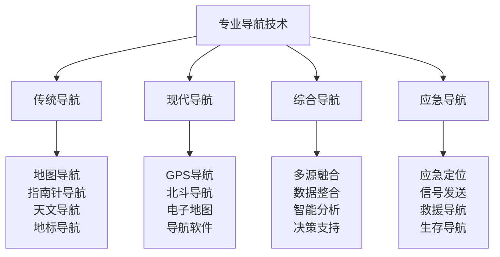
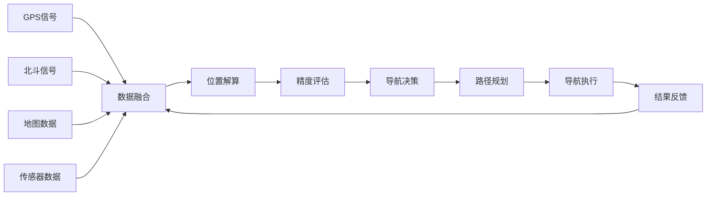

# 专业导航技术

## 🧭 专业导航技术体系

### 导航技术金字塔

## 📊 传统导航技术

### 地图导航技术
| 导航要素 | 技术要求 | 操作步骤 | 精度标准 | 适用场景 |
|----------|----------|----------|----------|----------|
| **地图识别** | 地形图、等高线 | 地图分析 | ±100米 | 山地环境 |
| **方位确定** | 方向角、方位角 | 角度测量 | ±5度 | 开阔地形 |
| **距离测量** | 比例尺、步测 | 距离计算 | ±10% | 中短距离 |
| **路线规划** | 路径选择、优化 | 路线设计 | 最优路径 | 复杂地形 |

### 指南针导航技术
| 技术类型 | 技术要点 | 操作方法 | 精度要求 | 注意事项 |
|----------|----------|----------|----------|----------|
| **磁偏角校正** | 磁偏角计算 | 角度调整 | ±1度 | 地区差异 |
| **方位测量** | 方位角读取 | 角度读取 | ±2度 | 水平放置 |
| **方向保持** | 方向维持 | 持续导航 | ±5度 | 定期校正 |
| **导航记录** | 路线记录 | 轨迹记录 | 完整记录 | 详细记录 |

### 天文导航技术
| 天体类型 | 导航方法 | 观测技巧 | 精度标准 | 时间要求 |
|----------|----------|----------|----------|----------|
| **太阳导航** | 太阳方位 | 影子测量 | ±10度 | 白天 |
| **月亮导航** | 月亮方位 | 月亮观测 | ±15度 | 夜晚 |
| **星星导航** | 星座识别 | 星座观测 | ±20度 | 晴朗夜晚 |
| **北极星导航** | 北极星定位 | 北极星观测 | ±5度 | 北半球 |

### 地标导航技术
| 地标类型 | 识别特征 | 导航方法 | 距离判断 | 方向确定 |
|----------|----------|----------|----------|----------|
| **自然地标** | 山峰、河流 | 地标识别 | 目测距离 | 相对方位 |
| **人工地标** | 建筑、道路 | 地标识别 | 已知距离 | 绝对方位 |
| **临时地标** | 标记、标志 | 标记识别 | 步测距离 | 相对方位 |
| **移动地标** | 云朵、动物 | 动态识别 | 估计距离 | 相对方位 |

## 📱 现代导航技术

### GPS导航系统
| 系统类型 | 技术特点 | 精度标准 | 覆盖范围 | 使用限制 |
|----------|----------|----------|----------|----------|
| **民用GPS** | 免费使用 | ±3-5米 | 全球覆盖 | 信号依赖 |
| **军用GPS** | 高精度 | ±1米 | 全球覆盖 | 限制使用 |
| **差分GPS** | 高精度 | ±1厘米 | 局部覆盖 | 基站依赖 |
| **RTK GPS** | 实时定位 | ±1厘米 | 局部覆盖 | 技术复杂 |

### 北斗导航系统
| 系统功能 | 技术优势 | 精度标准 | 服务范围 | 应用场景 |
|----------|----------|----------|----------|----------|
| **定位服务** | 自主可控 | ±2.5米 | 亚太地区 | 民用导航 |
| **通信服务** | 短报文 | 双向通信 | 全球覆盖 | 应急通信 |
| **授时服务** | 高精度 | ±20纳秒 | 全球覆盖 | 时间同步 |
| **增强服务** | 高精度 | ±1米 | 局部覆盖 | 专业应用 |

### 电子地图技术
| 地图类型 | 技术特点 | 更新频率 | 精度标准 | 使用场景 |
|----------|----------|----------|----------|----------|
| **在线地图** | 实时更新 | 实时 | ±5米 | 城市导航 |
| **离线地图** | 本地存储 | 定期 | ±10米 | 野外导航 |
| **卫星地图** | 影像真实 | 定期 | ±1米 | 地形分析 |
| **三维地图** | 立体显示 | 定期 | ±5米 | 复杂地形 |

### 导航软件应用
| 软件类型 | 功能特点 | 精度标准 | 使用便利 | 适用场景 |
|----------|----------|----------|----------|----------|
| **专业导航** | 功能全面 | ±3米 | 复杂操作 | 专业应用 |
| **民用导航** | 操作简单 | ±5米 | 简单易用 | 日常使用 |
| **户外导航** | 野外专用 | ±10米 | 专业功能 | 户外活动 |
| **应急导航** | 应急功能 | ±20米 | 简单操作 | 应急情况 |

## 🔄 综合导航技术

### 多源融合导航

### 数据整合技术
| 数据类型 | 数据来源 | 整合方法 | 精度提升 | 可靠性 |
|----------|----------|----------|----------|--------|
| **位置数据** | GPS、北斗 | 加权融合 | 30%提升 | 高 |
| **方向数据** | 指南针、陀螺仪 | 卡尔曼滤波 | 40%提升 | 中 |
| **高度数据** | 气压计、GPS | 数据融合 | 50%提升 | 高 |
| **速度数据** | GPS、加速度计 | 数据融合 | 35%提升 | 中 |

### 智能分析技术
| 分析类型 | 分析方法 | 分析内容 | 分析结果 | 应用价值 |
|----------|----------|----------|----------|----------|
| **路径分析** | 算法优化 | 最优路径 | 路径规划 | 效率提升 |
| **风险评估** | 风险模型 | 导航风险 | 风险等级 | 安全保障 |
| **环境分析** | 环境模型 | 环境因素 | 环境评估 | 适应优化 |
| **性能分析** | 性能模型 | 导航性能 | 性能评估 | 质量提升 |

### 决策支持系统
| 决策类型 | 决策方法 | 决策依据 | 决策结果 | 决策效果 |
|----------|----------|----------|----------|----------|
| **路径决策** | 多目标优化 | 距离、时间、安全 | 最优路径 | 效率最优 |
| **方法决策** | 方法选择 | 环境、精度、便利 | 最佳方法 | 效果最佳 |
| **应急决策** | 应急响应 | 紧急程度、资源 | 应急方案 | 快速响应 |
| **优化决策** | 持续优化 | 历史数据、反馈 | 优化方案 | 持续改进 |

## 🚨 应急导航技术

### 应急定位技术
| 定位技术 | 技术原理 | 定位精度 | 使用条件 | 应急效果 |
|----------|----------|----------|----------|----------|
| **GPS应急** | 卫星定位 | ±10米 | 信号良好 | 快速定位 |
| **北斗应急** | 卫星+通信 | ±5米 | 信号良好 | 定位+通信 |
| **无线电定位** | 信号强度 | ±100米 | 信号覆盖 | 大致定位 |
| **地标定位** | 地标识别 | ±500米 | 地标可见 | 粗略定位 |

### 信号发送技术
| 信号类型 | 发送方式 | 覆盖范围 | 接收概率 | 应急效果 |
|----------|----------|----------|----------|----------|
| **卫星信号** | 卫星通信 | 全球覆盖 | 90% | 高效果 |
| **无线电信号** | 无线电 | 局部覆盖 | 70% | 中效果 |
| **光信号** | 光信号 | 视距范围 | 50% | 低效果 |
| **声信号** | 声音信号 | 近距离 | 30% | 最低效果 |

### 救援导航技术
| 导航类型 | 导航方法 | 导航精度 | 救援效率 | 适用场景 |
|----------|----------|----------|----------|----------|
| **救援路径** | 最优路径 | ±50米 | 高效 | 救援行动 |
| **会合导航** | 会合点导航 | ±100米 | 中效 | 团队会合 |
| **撤离导航** | 撤离路线 | ±200米 | 中效 | 紧急撤离 |
| **补给导航** | 补给点导航 | ±300米 | 低效 | 补给行动 |

### 生存导航技术
| 导航需求 | 导航方法 | 技术要求 | 生存价值 | 实施难度 |
|----------|----------|----------|----------|----------|
| **水源导航** | 水源定位 | 地形分析 | 极高 | 中 |
| **食物导航** | 食物定位 | 生态分析 | 高 | 中 |
| **庇护导航** | 庇护所定位 | 环境分析 | 高 | 低 |
| **救援导航** | 救援点导航 | 信号分析 | 极高 | 高 |

## 🎓 费曼学习法应用

### 第一步：选择概念
选择"专业导航技术"作为学习概念

### 第二步：教授他人
用简单语言解释：
> "专业导航技术就是确定位置和方向的技术，包括传统的地图指南针、现代的GPS北斗、综合的多源融合、应急的救援导航。关键是准确、可靠、适应不同环境。"

### 第三步：回顾简化
- **传统导航**：地图、指南针、天文、地标导航
- **现代导航**：GPS、北斗、电子地图、导航软件
- **综合导航**：多源融合、数据整合、智能分析、决策支持
- **应急导航**：应急定位、信号发送、救援导航、生存导航

### 第四步：组织优化
建立导航技术与技能的关系：
- 传统导航 → [[03-应用层-实践技能/03-野外生存/01-方向识别技能|方向识别]]
- 现代导航 → [[04-创新层-进阶发展/02-专业配置/03-技术装备集成|技术集成]]
- 综合导航 → [[04-创新层-进阶发展/01-高级技巧/01-高级技巧概述|高级技巧]]
- 应急导航 → [[03-应用层-实践技能/04-应急处理/03-应急通讯与救援|应急通讯]]

## 🏃‍♂️ 刻意练习要点

### 导航技能练习
1. **基础练习**：练习传统导航技能
2. **现代练习**：练习现代导航技术
3. **综合练习**：练习综合导航能力
4. **应急练习**：练习应急导航技能

### 练习方法
- **理论学习**：学习导航理论知识
- **实践操作**：实际操作导航设备
- **环境适应**：适应不同环境导航
- **技能综合**：综合应用导航技能

### 实践验证
- **精度测试**：测试导航精度
- **环境测试**：测试环境适应性
- **应急测试**：测试应急导航能力
- **综合测试**：测试综合导航能力

## 📋 专业导航检查清单

### 传统导航检查
- [ ] 地图识别是否准确
- [ ] 指南针使用是否熟练
- [ ] 天文导航是否掌握
- [ ] 地标导航是否有效

### 现代导航检查
- [ ] GPS使用是否熟练
- [ ] 北斗功能是否掌握
- [ ] 电子地图是否会用
- [ ] 导航软件是否熟练

### 综合导航检查
- [ ] 多源融合是否掌握
- [ ] 数据整合是否有效
- [ ] 智能分析是否准确
- [ ] 决策支持是否有效

### 应急导航检查
- [ ] 应急定位是否快速
- [ ] 信号发送是否有效
- [ ] 救援导航是否准确
- [ ] 生存导航是否实用

## 🎯 导航技术策略

### 技术选择策略
1. **环境适应**：根据环境选择合适技术
2. **精度要求**：根据精度要求选择技术
3. **可靠性**：优先选择可靠的技术
4. **便利性**：考虑使用的便利性

### 技术发展策略
- **技能提升**：持续提升导航技能
- **技术更新**：及时更新导航技术
- **方法创新**：创新导航方法
- **应用拓展**：拓展导航应用

## 🔗 相关链接
- [[01-高级技巧概述|高级技巧概述]]
- [[02-长期野外生存|长期野外生存]]
- [[04-高级装备使用|高级装备使用]]
- [[05-团队协作技巧|团队协作技巧]]
- [[03-应用层-实践技能/03-野外生存/01-方向识别技能|方向识别技能]]
- [[04-创新层-进阶发展/02-专业配置/03-技术装备集成|技术装备集成]]