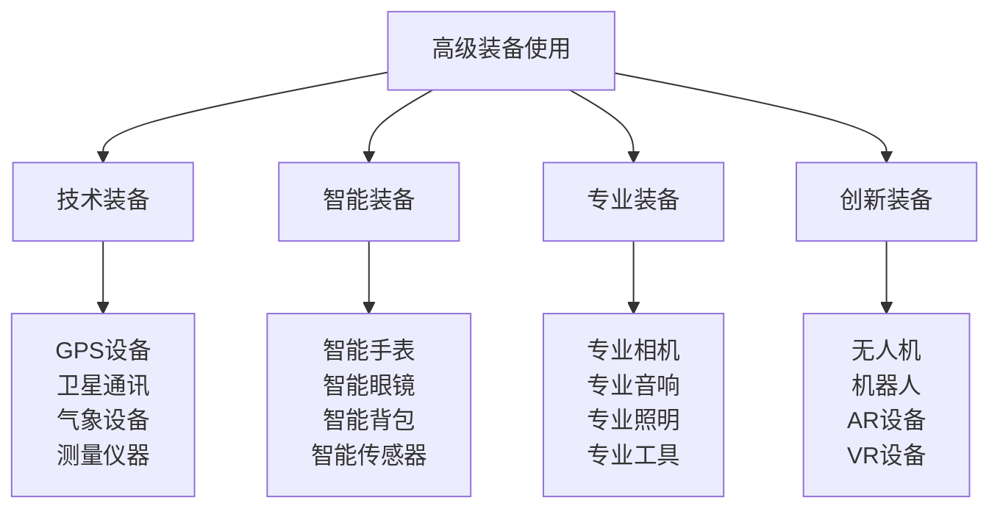

# 高级装备使用

## 🛠️ 高级装备技术体系

### 装备技术金字塔

## 📊 技术装备使用

### GPS设备技术
| 设备类型 | 技术特点 | 使用技巧 | 精度标准 | 应用场景 |
|----------|----------|----------|----------|----------|
| **手持GPS** | 便携、耐用 | 信号优化 | ±3米 | 野外导航 |
| **车载GPS** | 大屏、导航 | 路线规划 | ±5米 | 车辆导航 |
| **腕式GPS** | 轻便、运动 | 运动追踪 | ±10米 | 运动监测 |
| **专业GPS** | 高精度、专业 | 精密测量 | ±1米 | 专业测量 |

### 卫星通讯设备
| 设备类型 | 通讯方式 | 覆盖范围 | 使用技巧 | 应急效果 |
|----------|----------|----------|----------|----------|
| **卫星电话** | 语音通讯 | 全球覆盖 | 信号优化 | 高效 |
| **卫星短信** | 文字通讯 | 全球覆盖 | 信息简洁 | 中效 |
| **卫星数据** | 数据传输 | 全球覆盖 | 数据压缩 | 低效 |
| **应急信标** | 紧急信号 | 全球覆盖 | 自动发送 | 最高效 |

### 气象设备技术
| 设备类型 | 测量参数 | 精度标准 | 使用技巧 | 预警效果 |
|----------|----------|----------|----------|----------|
| **气象站** | 多参数 | 高精度 | 数据记录 | 高 |
| **风速仪** | 风速风向 | ±0.1m/s | 风向校准 | 中 |
| **气压计** | 气压高度 | ±1hPa | 高度校正 | 高 |
| **温度计** | 温度湿度 | ±0.1°C | 环境适应 | 中 |

### 测量仪器技术
| 仪器类型 | 测量内容 | 精度标准 | 使用技巧 | 应用价值 |
|----------|----------|----------|----------|----------|
| **激光测距** | 距离测量 | ±1mm | 目标选择 | 高 |
| **角度测量** | 角度测量 | ±0.1° | 水平校准 | 中 |
| **高度测量** | 高度测量 | ±1m | 基准设定 | 高 |
| **面积测量** | 面积测量 | ±1% | 边界确定 | 中 |

## 🤖 智能装备技术

### 智能手表技术
| 功能类型 | 技术特点 | 使用技巧 | 数据精度 | 应用价值 |
|----------|----------|----------|----------|----------|
| **健康监测** | 心率、血氧 | 佩戴正确 | ±2% | 健康管理 |
| **运动追踪** | 步数、卡路里 | 运动模式 | ±5% | 运动监测 |
| **GPS导航** | 位置、轨迹 | 信号优化 | ±10米 | 导航辅助 |
| **通讯功能** | 通话、短信 | 网络连接 | 实时 | 通讯便利 |

### 智能眼镜技术
| 功能类型 | 技术特点 | 使用技巧 | 显示效果 | 应用场景 |
|----------|----------|----------|----------|----------|
| **AR显示** | 增强现实 | 环境适应 | 清晰 | 信息叠加 |
| **导航显示** | 路线指引 | 方向校准 | 准确 | 导航辅助 |
| **信息显示** | 数据展示 | 信息筛选 | 简洁 | 信息获取 |
| **拍照录像** | 影像记录 | 稳定拍摄 | 高清 | 记录保存 |

### 智能背包技术
| 功能类型 | 技术特点 | 使用技巧 | 智能化程度 | 便利性 |
|----------|----------|----------|------------|--------|
| **重量监测** | 重量显示 | 负载平衡 | 高 | 高 |
| **防盗功能** | 防盗报警 | 距离设定 | 中 | 中 |
| **充电功能** | 移动充电 | 电量管理 | 高 | 高 |
| **定位功能** | GPS定位 | 信号优化 | 中 | 中 |

### 智能传感器技术
| 传感器类型 | 监测内容 | 精度标准 | 使用技巧 | 数据价值 |
|----------|----------|----------|----------|----------|
| **环境传感器** | 温湿度、气压 | 高精度 | 位置优化 | 高 |
| **运动传感器** | 加速度、陀螺仪 | 高精度 | 校准准确 | 中 |
| **生物传感器** | 心率、血氧 | 中精度 | 接触良好 | 高 |
| **化学传感器** | 气体、水质 | 中精度 | 环境适应 | 高 |

## 🎯 专业装备技术

### 专业相机技术
| 相机类型 | 技术特点 | 使用技巧 | 成像质量 | 应用场景 |
|----------|----------|----------|----------|----------|
| **单反相机** | 高画质、专业 | 参数调节 | 极高 | 专业摄影 |
| **微单相机** | 轻便、高画质 | 操作简便 | 高 | 便携摄影 |
| **运动相机** | 防抖、防水 | 固定稳定 | 中 | 运动记录 |
| **无人机相机** | 航拍、稳定 | 飞行控制 | 高 | 航拍摄影 |

### 专业音响技术
| 音响类型 | 技术特点 | 使用技巧 | 音质效果 | 应用场景 |
|----------|----------|----------|----------|----------|
| **便携音响** | 便携、耐用 | 音量控制 | 中 | 户外娱乐 |
| **专业音响** | 高音质、大功率 | 音场调节 | 高 | 团队活动 |
| **无线音响** | 无线连接 | 信号稳定 | 中 | 移动使用 |
| **应急音响** | 应急通讯 | 信号发送 | 低 | 应急情况 |

### 专业照明技术
| 照明类型 | 技术特点 | 使用技巧 | 照明效果 | 续航时间 |
|----------|----------|----------|----------|----------|
| **LED头灯** | 便携、节能 | 角度调节 | 高 | 长 |
| **强光手电** | 高亮度、远射 | 聚焦调节 | 极高 | 中 |
| **营地灯** | 大范围、柔和 | 高度调节 | 中 | 长 |
| **应急灯** | 应急、耐用 | 自动开关 | 中 | 极长 |

### 专业工具技术
| 工具类型 | 技术特点 | 使用技巧 | 使用效果 | 耐用性 |
|----------|----------|----------|----------|--------|
| **多功能工具** | 多功能、便携 | 正确使用 | 高 | 高 |
| **专业刀具** | 锋利、耐用 | 安全使用 | 极高 | 极高 |
| **测量工具** | 精确、专业 | 准确测量 | 高 | 高 |
| **维修工具** | 专业、齐全 | 技能要求 | 高 | 中 |

## 🚀 创新装备技术

### 无人机技术
| 无人机类型 | 技术特点 | 使用技巧 | 飞行能力 | 应用价值 |
|------------|----------|----------|----------|----------|
| **航拍无人机** | 航拍、稳定 | 飞行控制 | 高 | 极高 |
| **运输无人机** | 载重、运输 | 负载平衡 | 中 | 高 |
| **救援无人机** | 救援、搜索 | 应急操作 | 高 | 极高 |
| **测绘无人机** | 测绘、测量 | 精密控制 | 极高 | 高 |

### 机器人技术
| 机器人类型 | 技术特点 | 使用技巧 | 智能化程度 | 应用场景 |
|------------|----------|----------|------------|----------|
| **救援机器人** | 救援、搜索 | 远程控制 | 高 | 救援行动 |
| **运输机器人** | 载重、运输 | 路径规划 | 中 | 物资运输 |
| **监测机器人** | 监测、巡逻 | 自动运行 | 高 | 环境监测 |
| **服务机器人** | 服务、辅助 | 人机交互 | 极高 | 日常服务 |

### AR/VR设备技术
| 设备类型 | 技术特点 | 使用技巧 | 沉浸效果 | 应用价值 |
|----------|----------|----------|----------|----------|
| **AR眼镜** | 增强现实 | 环境适应 | 中 | 高 |
| **VR头盔** | 虚拟现实 | 空间要求 | 高 | 中 |
| **混合现实** | 虚实结合 | 技术复杂 | 极高 | 极高 |
| **全息投影** | 全息显示 | 环境要求 | 极高 | 极高 |

## 🎓 费曼学习法应用

### 第一步：选择概念
选择"高级装备使用"作为学习概念

### 第二步：教授他人
用简单语言解释：
> "高级装备使用就是熟练使用各种高科技装备，包括GPS、卫星通讯、智能设备、专业工具等。关键是了解装备特点，掌握使用技巧，发挥装备最大效能。"

### 第三步：回顾简化
- **技术装备**：GPS、卫星通讯、气象设备、测量仪器
- **智能装备**：智能手表、智能眼镜、智能背包、智能传感器
- **专业装备**：专业相机、专业音响、专业照明、专业工具
- **创新装备**：无人机、机器人、AR设备、VR设备

### 第四步：组织优化
建立装备使用与技能的关系：
- 技术装备 → [[03-应用层-实践技能/03-野外生存/01-方向识别技能|方向识别]]
- 智能装备 → [[04-创新层-进阶发展/02-专业配置/03-技术装备集成|技术集成]]
- 专业装备 → [[04-创新层-进阶发展/02-专业配置/01-专业配置概述|专业配置]]
- 创新装备 → [[04-创新层-进阶发展/01-高级技巧/01-高级技巧概述|高级技巧]]

## 🏃‍♂️ 刻意练习要点

### 装备使用练习
1. **理论学习**：学习装备技术原理
2. **操作练习**：练习装备操作方法
3. **环境适应**：适应不同环境使用
4. **技能综合**：综合应用装备技能

### 练习方法
- **基础练习**：掌握基础操作方法
- **进阶练习**：掌握高级功能使用
- **环境练习**：适应不同环境条件
- **应急练习**：掌握应急使用方法

### 实践验证
- **功能测试**：测试装备各项功能
- **精度测试**：测试装备精度性能
- **环境测试**：测试环境适应性
- **综合测试**：测试综合使用能力

## 📋 高级装备使用检查清单

### 技术装备检查
- [ ] GPS设备使用是否熟练
- [ ] 卫星通讯是否掌握
- [ ] 气象设备是否会用
- [ ] 测量仪器是否准确

### 智能装备检查
- [ ] 智能手表功能是否掌握
- [ ] 智能眼镜使用是否熟练
- [ ] 智能背包功能是否了解
- [ ] 智能传感器是否会用

### 专业装备检查
- [ ] 专业相机操作是否熟练
- [ ] 专业音响使用是否掌握
- [ ] 专业照明是否会用
- [ ] 专业工具使用是否安全

### 创新装备检查
- [ ] 无人机操作是否熟练
- [ ] 机器人使用是否掌握
- [ ] AR设备是否会用
- [ ] VR设备是否熟练

## 🎯 装备使用策略

### 选择策略
1. **需求导向**：根据需求选择装备
2. **环境适应**：根据环境选择装备
3. **技能匹配**：根据技能选择装备
4. **成本考虑**：考虑装备成本效益

### 使用策略
- **安全第一**：安全使用装备
- **效率优先**：高效使用装备
- **维护保养**：定期维护装备
- **技能提升**：持续提升使用技能

## 🔗 相关链接
- [[01-高级技巧概述|高级技巧概述]]
- [[02-长期野外生存|长期野外生存]]
- [[03-专业导航技术|专业导航技术]]
- [[05-团队协作技巧|团队协作技巧]]
- [[04-创新层-进阶发展/02-专业配置/01-专业配置概述|专业配置概述]]
- [[04-创新层-进阶发展/02-专业配置/03-技术装备集成|技术装备集成]]