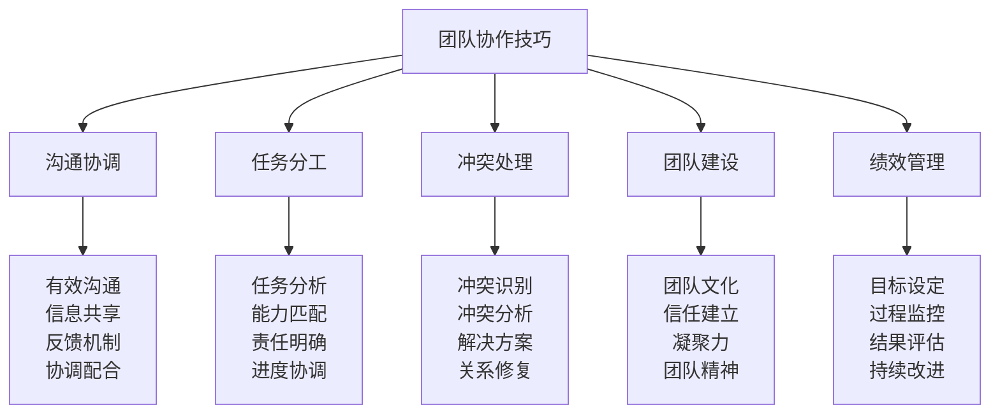
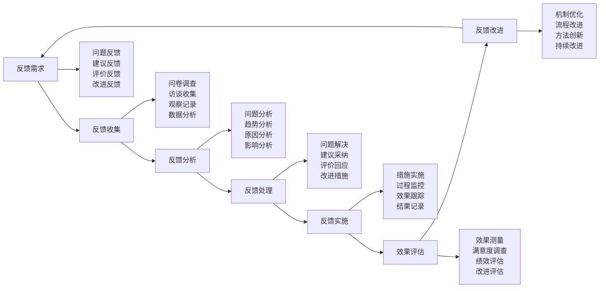
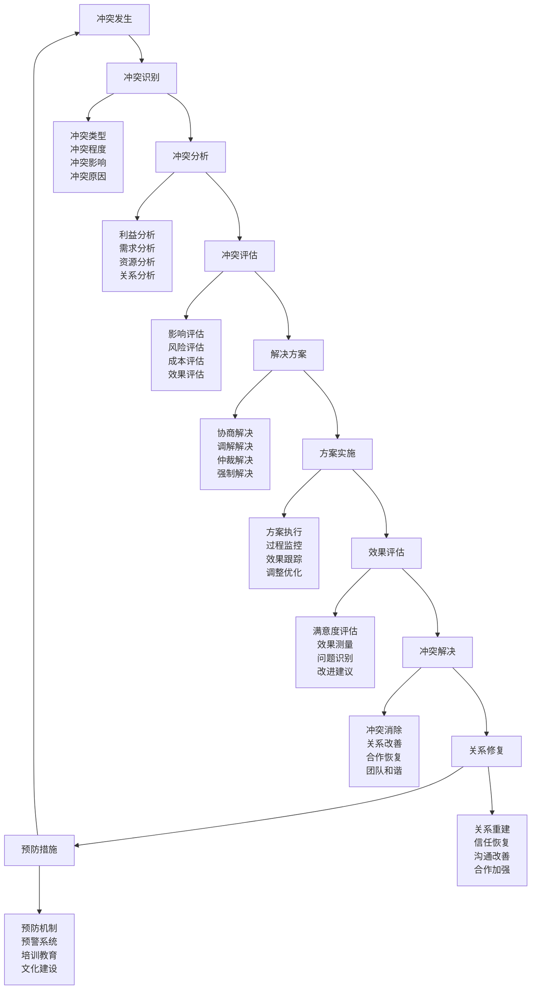
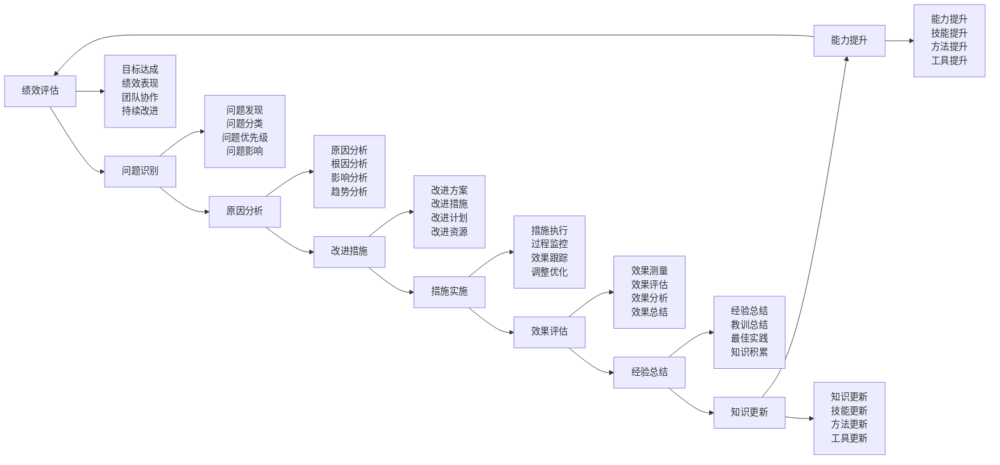

# 团队协作技巧

## 🤝 团队协作核心框架

### 协作能力金字塔

## 📊 沟通协调技巧

### 有效沟通技术
| 沟通要素 | 技术要求 | 实施方法 | 沟通效果 | 改进措施 |
|----------|----------|----------|----------|----------|
| **倾听技巧** | 主动倾听 | 专注、理解、回应 | 理解准确 | 练习倾听 |
| **表达技巧** | 清晰表达 | 简洁、准确、完整 | 信息传达 | 语言训练 |
| **反馈技巧** | 及时反馈 | 具体、建设性、及时 | 沟通闭环 | 反馈训练 |
| **非语言沟通** | 肢体语言 | 表情、手势、姿态 | 情感传达 | 观察训练 |

### 信息共享机制
| 共享类型 | 共享内容 | 共享方式 | 共享频率 | 共享效果 |
|----------|----------|----------|----------|----------|
| **任务信息** | 任务内容、进度 | 会议、文档 | 每日 | 任务同步 |
| **技能信息** | 技能、经验 | 分享会、培训 | 每周 | 技能提升 |
| **资源信息** | 资源、工具 | 资源库、清单 | 实时 | 资源共享 |
| **问题信息** | 问题、解决方案 | 讨论、记录 | 及时 | 问题解决 |

### 反馈机制设计

### 协调配合技巧
| 协调类型 | 协调内容 | 协调方法 | 协调效果 | 协调技巧 |
|----------|----------|----------|----------|----------|
| **任务协调** | 任务分配、进度 | 会议协调 | 高效 | 明确责任 |
| **资源协调** | 资源分配、使用 | 资源管理 | 优化 | 合理分配 |
| **时间协调** | 时间安排、同步 | 时间管理 | 准时 | 时间规划 |
| **关系协调** | 人际关系、冲突 | 关系管理 | 和谐 | 沟通技巧 |

## 🎯 任务分工技巧

### 任务分析技术
| 分析维度 | 分析内容 | 分析方法 | 分析结果 | 应用价值 |
|----------|----------|----------|----------|----------|
| **任务分解** | 任务结构、层次 | WBS方法 | 任务清单 | 任务清晰 |
| **任务评估** | 难度、时间、资源 | 评估矩阵 | 任务优先级 | 资源优化 |
| **任务依赖** | 任务关系、依赖 | 网络图 | 依赖关系 | 进度控制 |
| **任务风险** | 风险识别、评估 | 风险分析 | 风险等级 | 风险控制 |

### 能力匹配技术
| 匹配要素 | 匹配内容 | 匹配方法 | 匹配标准 | 匹配效果 |
|----------|----------|----------|----------|----------|
| **技能匹配** | 技能需求、能力 | 技能评估 | 能力匹配 | 高效执行 |
| **经验匹配** | 经验要求、背景 | 经验分析 | 经验匹配 | 质量保证 |
| **性格匹配** | 性格特点、团队 | 性格测试 | 性格匹配 | 团队和谐 |
| **兴趣匹配** | 兴趣偏好、任务 | 兴趣调查 | 兴趣匹配 | 积极性高 |

### 责任明确机制
| 责任类型 | 责任内容 | 明确方法 | 责任标准 | 责任效果 |
|----------|----------|----------|----------|----------|
| **任务责任** | 任务完成、质量 | 责任书 | 明确具体 | 责任清晰 |
| **过程责任** | 过程控制、协调 | 流程管理 | 过程标准 | 过程可控 |
| **结果责任** | 结果达成、评估 | 绩效管理 | 结果标准 | 结果导向 |
| **团队责任** | 团队协作、支持 | 团队文化 | 团队标准 | 团队凝聚 |

### 进度协调技术
| 协调要素 | 协调内容 | 协调方法 | 协调工具 | 协调效果 |
|----------|----------|----------|----------|----------|
| **进度计划** | 时间安排、里程碑 | 甘特图 | 项目管理工具 | 进度清晰 |
| **进度监控** | 进度跟踪、预警 | 进度报告 | 监控系统 | 进度可控 |
| **进度调整** | 计划调整、优化 | 变更管理 | 调整机制 | 进度优化 |
| **进度同步** | 任务同步、协调 | 同步机制 | 协调工具 | 进度一致 |

## ⚔️ 冲突处理技巧

### 冲突识别技术
| 冲突类型 | 冲突表现 | 识别方法 | 识别标准 | 处理策略 |
|----------|----------|----------|----------|----------|
| **任务冲突** | 目标分歧、方法不同 | 目标分析 | 目标不一致 | 目标统一 |
| **资源冲突** | 资源争夺、分配不均 | 资源分析 | 资源不足 | 资源优化 |
| **人际冲突** | 关系紧张、沟通不畅 | 关系观察 | 关系恶化 | 关系修复 |
| **价值观冲突** | 理念不同、文化差异 | 价值观分析 | 价值观冲突 | 价值观融合 |

### 冲突分析框架

### 解决方案设计
| 解决策略 | 适用场景 | 实施方法 | 成功标准 | 注意事项 |
|----------|----------|----------|----------|----------|
| **协商解决** | 利益冲突 | 双方协商 | 双方满意 | 公平公正 |
| **调解解决** | 关系冲突 | 第三方调解 | 关系改善 | 中立客观 |
| **仲裁解决** | 严重冲突 | 权威仲裁 | 问题解决 | 权威性 |
| **强制解决** | 紧急冲突 | 强制措施 | 问题控制 | 谨慎使用 |

### 关系修复技术
| 修复阶段 | 修复内容 | 修复方法 | 修复标准 | 修复效果 |
|----------|----------|----------|----------|----------|
| **关系评估** | 关系现状、问题 | 关系分析 | 问题明确 | 问题清晰 |
| **关系重建** | 信任重建、沟通 | 关系重建 | 信任恢复 | 关系改善 |
| **关系维护** | 关系巩固、发展 | 关系维护 | 关系稳定 | 关系和谐 |
| **关系预防** | 关系保护、预防 | 关系预防 | 关系健康 | 关系持续 |

## 🏗️ 团队建设技巧

### 团队文化构建
| 文化要素 | 文化内容 | 构建方法 | 文化标准 | 文化效果 |
|----------|----------|----------|----------|----------|
| **价值观** | 共同价值观 | 价值观讨论 | 价值观一致 | 价值认同 |
| **行为规范** | 行为准则 | 规范制定 | 行为标准 | 行为统一 |
| **团队精神** | 团队意识 | 精神培养 | 精神体现 | 精神凝聚 |
| **团队传统** | 团队习惯 | 传统建立 | 传统传承 | 传统延续 |

### 信任建立机制
| 信任类型 | 信任内容 | 建立方法 | 信任标准 | 信任效果 |
|----------|----------|----------|----------|----------|
| **能力信任** | 能力认可 | 能力展示 | 能力证明 | 能力认可 |
| **品格信任** | 品格认可 | 品格表现 | 品格证明 | 品格认可 |
| **承诺信任** | 承诺履行 | 承诺兑现 | 承诺实现 | 承诺可靠 |
| **信息信任** | 信息真实 | 信息透明 | 信息准确 | 信息可靠 |

### 凝聚力提升
| 凝聚要素 | 凝聚内容 | 提升方法 | 凝聚标准 | 凝聚效果 |
|----------|----------|----------|----------|----------|
| **共同目标** | 目标一致 | 目标设定 | 目标明确 | 目标统一 |
| **共同利益** | 利益共享 | 利益分配 | 利益公平 | 利益一致 |
| **共同经历** | 经历共享 | 活动组织 | 经历丰富 | 经历共鸣 |
| **共同情感** | 情感共鸣 | 情感交流 | 情感深厚 | 情感凝聚 |

### 团队精神培养
| 精神要素 | 精神内容 | 培养方法 | 精神标准 | 精神效果 |
|----------|----------|----------|----------|----------|
| **合作精神** | 合作意识 | 合作训练 | 合作主动 | 合作高效 |
| **奉献精神** | 奉献意识 | 奉献教育 | 奉献自觉 | 奉献无私 |
| **创新精神** | 创新意识 | 创新鼓励 | 创新积极 | 创新活跃 |
| **学习精神** | 学习意识 | 学习氛围 | 学习主动 | 学习持续 |

## 📈 绩效管理技巧

### 目标设定技术
| 目标类型 | 目标内容 | 设定方法 | 目标标准 | 目标效果 |
|----------|----------|----------|----------|----------|
| **团队目标** | 团队整体目标 | SMART原则 | 目标明确 | 目标导向 |
| **个人目标** | 个人目标 | 目标分解 | 目标具体 | 目标激励 |
| **过程目标** | 过程控制目标 | 过程管理 | 过程标准 | 过程可控 |
| **结果目标** | 结果达成目标 | 结果导向 | 结果标准 | 结果导向 |

### 过程监控技术
| 监控要素 | 监控内容 | 监控方法 | 监控标准 | 监控效果 |
|----------|----------|----------|----------|----------|
| **进度监控** | 进度跟踪 | 进度报告 | 进度标准 | 进度可控 |
| **质量监控** | 质量控制 | 质量检查 | 质量标准 | 质量保证 |
| **成本监控** | 成本控制 | 成本分析 | 成本标准 | 成本可控 |
| **风险监控** | 风险控制 | 风险评估 | 风险标准 | 风险可控 |

### 结果评估技术
| 评估维度 | 评估内容 | 评估方法 | 评估标准 | 评估效果 |
|----------|----------|----------|----------|----------|
| **目标达成** | 目标完成情况 | 目标对比 | 目标标准 | 目标导向 |
| **绩效表现** | 绩效水平 | 绩效评估 | 绩效标准 | 绩效提升 |
| **团队协作** | 协作效果 | 协作评估 | 协作标准 | 协作改善 |
| **持续改进** | 改进效果 | 改进评估 | 改进标准 | 持续改进 |

### 持续改进机制

## 🎓 费曼学习法应用

### 第一步：选择概念
选择"团队协作技巧"作为学习概念

### 第二步：教授他人
用简单语言解释：
> "团队协作技巧就是让团队成员能够有效合作的方法，包括沟通协调、任务分工、冲突处理、团队建设、绩效管理。关键是建立良好的沟通机制，合理分工，处理冲突，建设团队文化。"

### 第三步：回顾简化
- **沟通协调**：有效沟通、信息共享、反馈机制、协调配合
- **任务分工**：任务分析、能力匹配、责任明确、进度协调
- **冲突处理**：冲突识别、冲突分析、解决方案、关系修复
- **团队建设**：团队文化、信任建立、凝聚力、团队精神
- **绩效管理**：目标设定、过程监控、结果评估、持续改进

### 第四步：组织优化
建立团队协作与技能的关系：
- 沟通协调 → [[04-创新层-进阶发展/03-领导力培养/04-沟通协调技巧|沟通协调]]
- 任务分工 → [[04-创新层-进阶发展/03-领导力培养/01-团队管理技能|团队管理]]
- 冲突处理 → [[04-创新层-进阶发展/03-领导力培养/03-危机处理领导|危机处理]]
- 团队建设 → [[04-创新层-进阶发展/03-领导力培养/01-领导力概述|领导力]]
- 绩效管理 → [[05-实践与评估/01-技能评估体系|技能评估]]

## 🏃‍♂️ 刻意练习要点

### 团队协作练习
1. **沟通练习**：练习有效沟通技巧
2. **分工练习**：练习任务分工技巧
3. **冲突练习**：练习冲突处理技巧
4. **建设练习**：练习团队建设技巧

### 练习方法
- **角色扮演**：扮演不同角色练习
- **案例分析**：分析团队协作案例
- **实践项目**：参与团队实践项目
- **反思总结**：反思团队协作经验

### 实践验证
- **团队测试**：测试团队协作能力
- **沟通测试**：测试沟通协调能力
- **冲突测试**：测试冲突处理能力
- **建设测试**：测试团队建设能力

## 📋 团队协作检查清单

### 沟通协调检查
- [ ] 沟通是否有效
- [ ] 信息是否共享
- [ ] 反馈是否及时
- [ ] 协调是否到位

### 任务分工检查
- [ ] 任务是否分析清楚
- [ ] 能力是否匹配
- [ ] 责任是否明确
- [ ] 进度是否协调

### 冲突处理检查
- [ ] 冲突是否识别
- [ ] 冲突是否分析
- [ ] 解决方案是否有效
- [ ] 关系是否修复

### 团队建设检查
- [ ] 团队文化是否建立
- [ ] 信任是否建立
- [ ] 凝聚力是否提升
- [ ] 团队精神是否培养

### 绩效管理检查
- [ ] 目标是否设定
- [ ] 过程是否监控
- [ ] 结果是否评估
- [ ] 改进是否持续

## 🎯 团队协作策略

### 协作策略
1. **沟通优先**：优先建立沟通机制
2. **分工明确**：明确任务分工责任
3. **冲突预防**：预防冲突发生
4. **团队建设**：持续建设团队文化

### 发展策略
- **技能提升**：提升团队协作技能
- **方法创新**：创新团队协作方法
- **工具优化**：优化团队协作工具
- **文化发展**：发展团队协作文化

## 🔗 相关链接
- [[01-高级技巧概述|高级技巧概述]]
- [[02-长期野外生存|长期野外生存]]
- [[03-专业导航技术|专业导航技术]]
- [[04-高级装备使用|高级装备使用]]
- [[04-创新层-进阶发展/03-领导力培养/01-领导力概述|领导力概述]]
- [[04-创新层-进阶发展/03-领导力培养/04-沟通协调技巧|沟通协调技巧]]