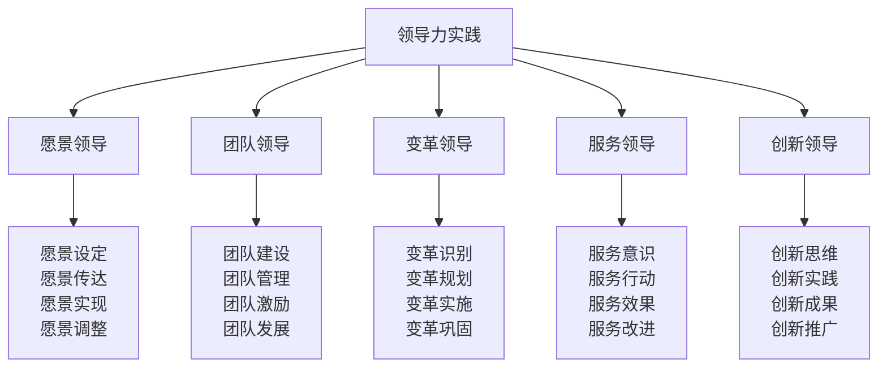
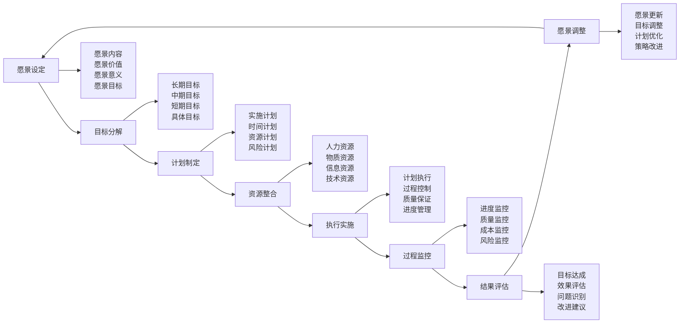

# 领导力实践

## 👑 领导力实践核心框架

### 领导力实践金字塔

## 🎯 愿景领导实践

### 愿景设定技术
| 愿景要素 | 设定内容 | 设定方法 | 设定标准 | 设定效果 |
|----------|----------|----------|----------|----------|
| **愿景内容** | 未来图景、目标 | 愿景工作坊 | 清晰具体 | 愿景明确 |
| **愿景价值** | 价值追求、意义 | 价值讨论 | 价值一致 | 价值认同 |
| **愿景实现** | 实现路径、方法 | 路径规划 | 路径可行 | 路径清晰 |
| **愿景调整** | 愿景更新、优化 | 定期评估 | 愿景适应 | 愿景持续 |

### 愿景传达技巧
| 传达方式 | 传达内容 | 传达技巧 | 传达效果 | 传达频率 |
|----------|----------|----------|----------|----------|
| **语言传达** | 愿景描述、故事 | 生动描述 | 理解深入 | 定期传达 |
| **行为传达** | 行为示范、榜样 | 以身作则 | 行为一致 | 持续示范 |
| **文化传达** | 文化体现、氛围 | 文化营造 | 文化认同 | 持续营造 |
| **制度传达** | 制度体现、规范 | 制度设计 | 制度支持 | 制度保障 |

### 愿景实现策略

### 愿景调整机制
| 调整类型 | 调整内容 | 调整方法 | 调整标准 | 调整效果 |
|----------|----------|----------|----------|----------|
| **环境调整** | 环境变化适应 | 环境分析 | 环境适应 | 愿景适应 |
| **目标调整** | 目标优化调整 | 目标评估 | 目标合理 | 目标优化 |
| **策略调整** | 策略改进调整 | 策略分析 | 策略有效 | 策略优化 |
| **方法调整** | 方法创新调整 | 方法创新 | 方法先进 | 方法优化 |

## 🤝 团队领导实践

### 团队建设实践
| 建设要素 | 建设内容 | 建设方法 | 建设标准 | 建设效果 |
|----------|----------|----------|----------|----------|
| **团队组建** | 人员选择、配置 | 能力匹配 | 团队完整 | 团队高效 |
| **团队文化** | 文化建立、传承 | 文化营造 | 文化认同 | 文化凝聚 |
| **团队规范** | 规范制定、执行 | 规范管理 | 规范统一 | 规范有效 |
| **团队发展** | 能力提升、发展 | 培训发展 | 能力提升 | 团队成长 |

### 团队管理实践
| 管理要素 | 管理内容 | 管理方法 | 管理标准 | 管理效果 |
|----------|----------|----------|----------|----------|
| **任务管理** | 任务分配、监控 | 任务管理 | 任务完成 | 任务高效 |
| **人员管理** | 人员激励、发展 | 人员管理 | 人员满意 | 人员稳定 |
| **资源管理** | 资源配置、优化 | 资源管理 | 资源优化 | 资源高效 |
| **绩效管理** | 绩效评估、改进 | 绩效管理 | 绩效提升 | 绩效优秀 |

### 团队激励实践
| 激励类型 | 激励内容 | 激励方法 | 激励标准 | 激励效果 |
|----------|----------|----------|----------|----------|
| **物质激励** | 薪酬、福利 | 薪酬管理 | 薪酬公平 | 激励有效 |
| **精神激励** | 认可、荣誉 | 精神鼓励 | 精神满足 | 激励持续 |
| **发展激励** | 培训、晋升 | 发展机会 | 发展空间 | 激励长远 |
| **参与激励** | 参与决策 | 参与管理 | 参与感 | 激励主动 |

### 团队发展实践
| 发展要素 | 发展内容 | 发展方法 | 发展标准 | 发展效果 |
|----------|----------|----------|----------|----------|
| **能力发展** | 技能提升、学习 | 培训学习 | 能力提升 | 能力增强 |
| **关系发展** | 关系改善、和谐 | 关系管理 | 关系和谐 | 关系融洽 |
| **文化发展** | 文化深化、创新 | 文化建设 | 文化先进 | 文化引领 |
| **创新发展** | 创新思维、实践 | 创新鼓励 | 创新活跃 | 创新成果 |

## 🔄 变革领导实践

### 变革识别技术
| 识别要素 | 识别内容 | 识别方法 | 识别标准 | 识别效果 |
|----------|----------|----------|----------|----------|
| **环境变化** | 外部环境变化 | 环境分析 | 变化明显 | 变化识别 |
| **内部变化** | 内部条件变化 | 内部分析 | 变化显著 | 变化识别 |
| **需求变化** | 需求变化趋势 | 需求分析 | 需求变化 | 需求识别 |
| **机会识别** | 发展机会识别 | 机会分析 | 机会明确 | 机会把握 |

### 变革规划技术
| 规划要素 | 规划内容 | 规划方法 | 规划标准 | 规划效果 |
|----------|----------|----------|----------|----------|
| **变革目标** | 变革目标设定 | 目标规划 | 目标明确 | 目标导向 |
| **变革策略** | 变革策略制定 | 策略规划 | 策略可行 | 策略有效 |
| **变革计划** | 变革计划制定 | 计划规划 | 计划详细 | 计划可行 |
| **变革资源** | 变革资源配置 | 资源规划 | 资源充足 | 资源保障 |

### 变革实施技术
| 实施要素 | 实施内容 | 实施方法 | 实施标准 | 实施效果 |
|----------|----------|----------|----------|----------|
| **变革启动** | 变革启动实施 | 启动管理 | 启动顺利 | 启动成功 |
| **变革推进** | 变革推进实施 | 推进管理 | 推进有序 | 推进有效 |
| **变革控制** | 变革控制实施 | 控制管理 | 控制有效 | 控制到位 |
| **变革调整** | 变革调整实施 | 调整管理 | 调整及时 | 调整有效 |

### 变革巩固技术
| 巩固要素 | 巩固内容 | 巩固方法 | 巩固标准 | 巩固效果 |
|----------|----------|----------|----------|----------|
| **成果巩固** | 变革成果巩固 | 成果管理 | 成果稳定 | 成果持续 |
| **文化巩固** | 变革文化巩固 | 文化管理 | 文化深入 | 文化认同 |
| **制度巩固** | 变革制度巩固 | 制度管理 | 制度完善 | 制度有效 |
| **能力巩固** | 变革能力巩固 | 能力管理 | 能力提升 | 能力持续 |

## 🛠️ 服务领导实践

### 服务意识培养
| 意识要素 | 意识内容 | 培养方法 | 培养标准 | 培养效果 |
|----------|----------|----------|----------|----------|
| **服务理念** | 服务理念建立 | 理念教育 | 理念认同 | 理念深入 |
| **服务态度** | 服务态度培养 | 态度训练 | 态度积极 | 态度良好 |
| **服务技能** | 服务技能提升 | 技能培训 | 技能熟练 | 技能专业 |
| **服务质量** | 服务质量提升 | 质量管理 | 质量优秀 | 质量持续 |

### 服务行动实践
| 行动要素 | 行动内容 | 行动方法 | 行动标准 | 行动效果 |
|----------|----------|----------|----------|----------|
| **主动服务** | 主动服务行动 | 主动服务 | 服务主动 | 服务及时 |
| **专业服务** | 专业服务行动 | 专业服务 | 服务专业 | 服务专业 |
| **创新服务** | 创新服务行动 | 创新服务 | 服务创新 | 服务创新 |
| **持续服务** | 持续服务行动 | 持续服务 | 服务持续 | 服务持续 |

### 服务效果评估
| 评估要素 | 评估内容 | 评估方法 | 评估标准 | 评估效果 |
|----------|----------|----------|----------|----------|
| **满意度评估** | 服务满意度 | 满意度调查 | 满意度高 | 满意度提升 |
| **效果评估** | 服务效果 | 效果测量 | 效果明显 | 效果持续 |
| **质量评估** | 服务质量 | 质量检查 | 质量优秀 | 质量提升 |
| **改进评估** | 服务改进 | 改进分析 | 改进有效 | 改进持续 |

### 服务改进实践
| 改进要素 | 改进内容 | 改进方法 | 改进标准 | 改进效果 |
|----------|----------|----------|----------|----------|
| **问题改进** | 问题识别改进 | 问题解决 | 问题消除 | 问题解决 |
| **方法改进** | 方法优化改进 | 方法创新 | 方法先进 | 方法优化 |
| **流程改进** | 流程优化改进 | 流程再造 | 流程高效 | 流程优化 |
| **系统改进** | 系统完善改进 | 系统优化 | 系统完善 | 系统优化 |

## 🚀 创新领导实践

### 创新思维培养
| 思维要素 | 思维内容 | 培养方法 | 培养标准 | 培养效果 |
|----------|----------|----------|----------|----------|
| **创新意识** | 创新意识培养 | 意识教育 | 意识强烈 | 意识深入 |
| **创新思维** | 创新思维训练 | 思维训练 | 思维活跃 | 思维创新 |
| **创新方法** | 创新方法学习 | 方法学习 | 方法掌握 | 方法熟练 |
| **创新实践** | 创新实践锻炼 | 实践锻炼 | 实践能力 | 实践创新 |

### 创新实践技术
| 实践要素 | 实践内容 | 实践方法 | 实践标准 | 实践效果 |
|----------|----------|----------|----------|----------|
| **创新项目** | 创新项目实施 | 项目管理 | 项目成功 | 项目成果 |
| **创新团队** | 创新团队建设 | 团队建设 | 团队创新 | 团队创新 |
| **创新环境** | 创新环境营造 | 环境营造 | 环境创新 | 环境创新 |
| **创新文化** | 创新文化建设 | 文化建设 | 文化创新 | 文化创新 |

### 创新成果管理
| 管理要素 | 管理内容 | 管理方法 | 管理标准 | 管理效果 |
|----------|----------|----------|----------|----------|
| **成果保护** | 创新成果保护 | 知识产权 | 保护有效 | 保护到位 |
| **成果转化** | 创新成果转化 | 成果转化 | 转化成功 | 转化有效 |
| **成果推广** | 创新成果推广 | 成果推广 | 推广广泛 | 推广有效 |
| **成果评价** | 创新成果评价 | 成果评价 | 评价客观 | 评价准确 |

### 创新推广实践
| 推广要素 | 推广内容 | 推广方法 | 推广标准 | 推广效果 |
|----------|----------|----------|----------|----------|
| **内部推广** | 内部创新推广 | 内部推广 | 推广广泛 | 推广有效 |
| **外部推广** | 外部创新推广 | 外部推广 | 推广广泛 | 推广有效 |
| **行业推广** | 行业创新推广 | 行业推广 | 推广深入 | 推广影响 |
| **社会推广** | 社会创新推广 | 社会推广 | 推广广泛 | 推广影响 |

## 🎓 费曼学习法应用

### 第一步：选择概念
选择"领导力实践"作为学习概念

### 第二步：教授他人
用简单语言解释：
> "领导力实践就是实际运用领导能力的过程，包括愿景领导、团队领导、变革领导、服务领导、创新领导。关键是设定愿景，建设团队，推动变革，服务他人，创新发展。"

### 第三步：回顾简化
- **愿景领导**：愿景设定、愿景传达、愿景实现、愿景调整
- **团队领导**：团队建设、团队管理、团队激励、团队发展
- **变革领导**：变革识别、变革规划、变革实施、变革巩固
- **服务领导**：服务意识、服务行动、服务效果、服务改进
- **创新领导**：创新思维、创新实践、创新成果、创新推广

### 第四步：组织优化
建立领导力实践与技能的关系：
- 愿景领导 → [[04-创新层-进阶发展/03-领导力培养/01-领导力概述|领导力概述]]
- 团队领导 → [[04-创新层-进阶发展/03-领导力培养/01-团队管理技能|团队管理]]
- 变革领导 → [[04-创新层-进阶发展/03-领导力培养/03-危机处理领导|危机处理]]
- 服务领导 → [[04-创新层-进阶发展/04-文化传承|文化传承]]
- 创新领导 → [[04-创新层-进阶发展/01-高级技巧|高级技巧]]

## 🏃‍♂️ 刻意练习要点

### 领导力实践练习
1. **愿景练习**：练习设定和传达愿景
2. **团队练习**：练习建设和管理团队
3. **变革练习**：练习识别和推动变革
4. **服务练习**：练习服务意识和行动
5. **创新练习**：练习创新思维和实践

### 练习方法
- **角色扮演**：扮演领导角色练习
- **案例分析**：分析领导力案例
- **实践项目**：参与领导实践项目
- **反思总结**：反思领导力实践

### 实践验证
- **领导力测试**：测试领导力水平
- **团队测试**：测试团队领导能力
- **变革测试**：测试变革领导能力
- **服务测试**：测试服务领导能力
- **创新测试**：测试创新领导能力

## 📋 领导力实践检查清单

### 愿景领导检查
- [ ] 愿景是否设定清晰
- [ ] 愿景是否传达有效
- [ ] 愿景是否实现可行
- [ ] 愿景是否调整及时

### 团队领导检查
- [ ] 团队是否建设有效
- [ ] 团队是否管理到位
- [ ] 团队是否激励充分
- [ ] 团队是否发展持续

### 变革领导检查
- [ ] 变革是否识别准确
- [ ] 变革是否规划合理
- [ ] 变革是否实施有效
- [ ] 变革是否巩固到位

### 服务领导检查
- [ ] 服务意识是否培养
- [ ] 服务行动是否主动
- [ ] 服务效果是否明显
- [ ] 服务改进是否持续

### 创新领导检查
- [ ] 创新思维是否培养
- [ ] 创新实践是否有效
- [ ] 创新成果是否管理
- [ ] 创新推广是否广泛

## 🎯 领导力实践策略

### 实践策略
1. **全面发展**：全面发展各项领导能力
2. **重点突破**：重点突破关键领导能力
3. **持续提升**：持续提升领导力水平
4. **实践验证**：通过实践验证领导能力

### 发展策略
- **理论学习**：学习领导力理论
- **实践锻炼**：锻炼领导力实践
- **经验积累**：积累领导力经验
- **持续改进**：持续改进领导力

## 🔗 相关链接
- [[01-高级技巧概述|高级技巧概述]]
- [[02-长期野外生存|长期野外生存]]
- [[03-专业导航技术|专业导航技术]]
- [[04-高级装备使用|高级装备使用]]
- [[05-团队协作技巧|团队协作技巧]]
- [[04-创新层-进阶发展/03-领导力培养/01-领导力概述|领导力概述]]
- [[04-创新层-进阶发展/03-领导力培养/01-团队管理技能|团队管理技能]]