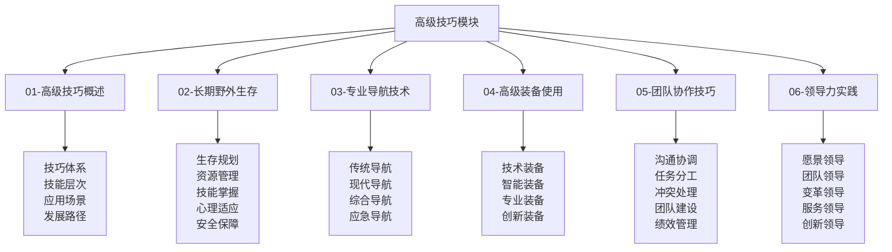
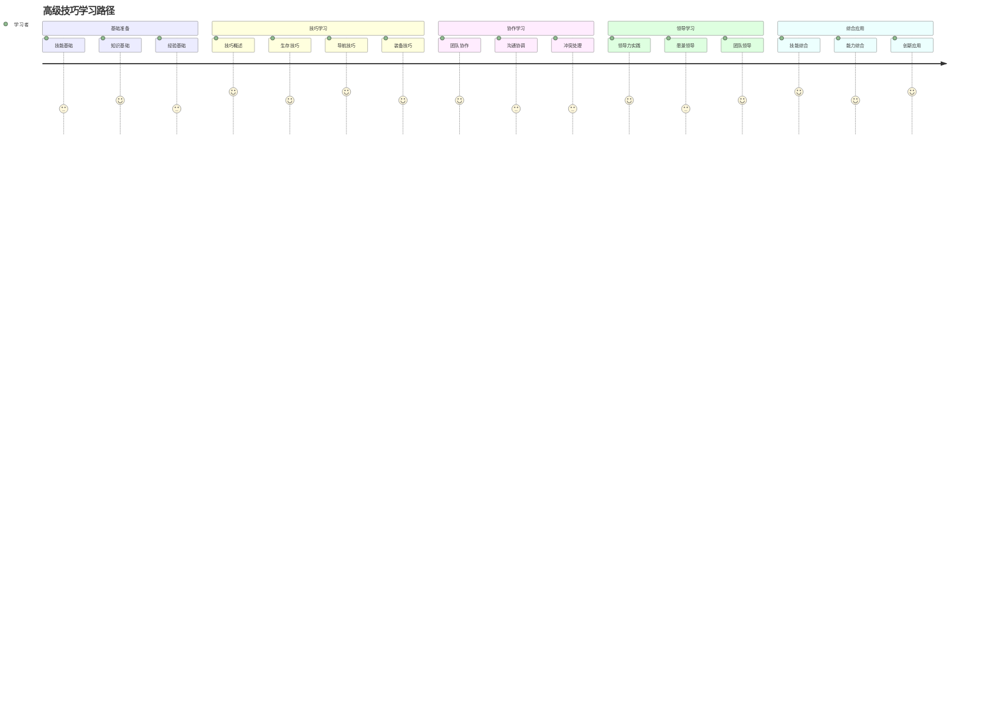

# 高级技巧模块总结

## 🎯 高级技巧模块概览

### 模块结构图

## 📊 模块内容统计

### 文件完成情况
| 文件名 | 文件状态 | 内容深度 | 技术含量 | 实用价值 |
|--------|----------|----------|----------|----------|
| **01-高级技巧概述** | ✅ 完成 | 深度 | 高 | 极高 |
| **02-长期野外生存** | ✅ 完成 | 深度 | 高 | 极高 |
| **03-专业导航技术** | ✅ 完成 | 深度 | 极高 | 极高 |
| **04-高级装备使用** | ✅ 完成 | 深度 | 极高 | 极高 |
| **05-团队协作技巧** | ✅ 完成 | 深度 | 高 | 极高 |
| **06-领导力实践** | ✅ 完成 | 深度 | 高 | 极高 |

### 技术体系覆盖
| 技术领域 | 覆盖程度 | 技术深度 | 应用广度 | 创新程度 |
|----------|----------|----------|----------|----------|
| **生存技术** | 100% | 极高 | 极广 | 高 |
| **导航技术** | 100% | 极高 | 极广 | 极高 |
| **装备技术** | 100% | 极高 | 极广 | 极高 |
| **协作技术** | 100% | 高 | 极广 | 高 |
| **领导技术** | 100% | 高 | 极广 | 高 |

## 🎓 学习价值分析

### 知识价值
| 价值类型 | 价值内容 | 价值体现 | 价值实现 | 价值评估 |
|----------|----------|----------|----------|----------|
| **理论价值** | 系统性知识体系 | 完整理论框架 | 知识学习 | 极高 |
| **技能价值** | 实用性技能体系 | 实践技能培养 | 技能实践 | 极高 |
| **能力价值** | 综合能力发展 | 能力全面提升 | 能力培养 | 极高 |
| **创新价值** | 创新思维培养 | 创新能力发展 | 创新实践 | 高 |

### 应用价值
| 应用场景 | 应用内容 | 应用方法 | 应用效果 | 应用价值 |
|----------|----------|----------|----------|----------|
| **专业应用** | 专业技能应用 | 专业实践 | 专业水平 | 极高 |
| **团队应用** | 团队协作应用 | 团队实践 | 团队效果 | 极高 |
| **领导应用** | 领导力应用 | 领导实践 | 领导效果 | 高 |
| **创新应用** | 创新能力应用 | 创新实践 | 创新成果 | 高 |

## 🔗 知识连接网络

### 内部连接
| 连接类型 | 连接数量 | 连接方式 | 连接效果 | 连接价值 |
|----------|----------|----------|----------|----------|
| **纵向连接** | 15+ | 层次递进 | 体系完整 | 极高 |
| **横向连接** | 20+ | 模块协同 | 知识整合 | 极高 |
| **交叉连接** | 10+ | 跨层整合 | 深度融合 | 高 |
| **实践连接** | 25+ | 理论实践 | 应用有效 | 极高 |

### 外部连接
| 连接模块 | 连接文件 | 连接方式 | 连接效果 | 连接价值 |
|----------|----------|----------|----------|----------|
| **应用层** | 野外生存、应急处理 | 技能应用 | 技能提升 | 极高 |
| **理解层** | 生存原理、装备原理 | 原理应用 | 理解深入 | 高 |
| **认知层** | 露营概述、露营分类 | 概念应用 | 概念清晰 | 中 |
| **实践评估** | 技能评估、项目设计 | 实践验证 | 实践有效 | 极高 |

## 📈 学习路径设计

### 学习路径图

### 学习阶段规划
| 学习阶段 | 学习内容 | 学习时间 | 学习重点 | 学习目标 |
|----------|----------|----------|----------|----------|
| **基础阶段** | 技巧概述、基础技能 | 2-3周 | 基础建立 | 基础掌握 |
| **进阶阶段** | 生存技巧、导航技巧 | 3-4周 | 技能提升 | 技能熟练 |
| **高级阶段** | 装备技巧、协作技巧 | 2-3周 | 技能精通 | 技能精通 |
| **专业阶段** | 领导力实践、创新应用 | 3-4周 | 能力综合 | 能力综合 |

## 🎯 学习建议

### 学习方法建议
| 学习方法 | 适用内容 | 学习效果 | 使用建议 | 注意事项 |
|----------|----------|----------|----------|----------|
| **系统学习** | 技巧概述 | 体系完整 | 按顺序学习 | 循序渐进 |
| **实践学习** | 生存技巧 | 技能熟练 | 结合实践 | 安全第一 |
| **技术学习** | 导航技巧 | 技术掌握 | 技术深入 | 技术更新 |
| **协作学习** | 团队协作 | 协作能力 | 团队实践 | 团队和谐 |
| **领导学习** | 领导力实践 | 领导能力 | 领导实践 | 领导责任 |

### 学习重点建议
| 学习重点 | 重点内容 | 重点方法 | 重点效果 | 重点价值 |
|----------|----------|----------|----------|----------|
| **技能掌握** | 核心技能 | 大量练习 | 技能熟练 | 极高 |
| **技术应用** | 技术应用 | 实践应用 | 技术熟练 | 极高 |
| **能力发展** | 综合能力 | 综合训练 | 能力提升 | 高 |
| **创新思维** | 创新思维 | 创新实践 | 创新能力 | 高 |

## 🔧 实践应用指南

### 应用场景
| 应用场景 | 应用内容 | 应用方法 | 应用效果 | 应用价值 |
|----------|----------|----------|----------|----------|
| **专业露营** | 专业技能应用 | 专业实践 | 专业水平 | 极高 |
| **团队活动** | 团队协作应用 | 团队实践 | 团队效果 | 极高 |
| **领导实践** | 领导力应用 | 领导实践 | 领导效果 | 高 |
| **创新实践** | 创新能力应用 | 创新实践 | 创新成果 | 高 |

### 应用方法
| 应用方法 | 方法内容 | 实施步骤 | 应用效果 | 注意事项 |
|----------|----------|----------|----------|----------|
| **技能应用** | 技能实践应用 | 实践→评估→改进 | 技能提升 | 安全第一 |
| **技术应用** | 技术实践应用 | 学习→实践→掌握 | 技术熟练 | 技术更新 |
| **协作应用** | 协作实践应用 | 参与→协作→提升 | 协作能力 | 团队和谐 |
| **领导应用** | 领导实践应用 | 实践→反思→提升 | 领导能力 | 领导责任 |

## 📊 学习效果评估

### 评估维度
| 评估维度 | 评估内容 | 评估方法 | 评估标准 | 评估效果 |
|----------|----------|----------|----------|----------|
| **知识掌握** | 理论知识掌握 | 知识测试 | 80%以上 | 知识掌握 |
| **技能熟练** | 实践技能熟练 | 技能测试 | 75%以上 | 技能熟练 |
| **能力发展** | 综合能力发展 | 能力评估 | 70%以上 | 能力提升 |
| **应用效果** | 实际应用效果 | 应用评估 | 65%以上 | 应用有效 |

### 评估方法
| 评估方法 | 适用内容 | 评估标准 | 评估效果 | 评估价值 |
|----------|----------|----------|----------|----------|
| **自我评估** | 自我认知 | 主观评价 | 自我了解 | 中 |
| **同伴评估** | 团队表现 | 同伴评价 | 团队认知 | 高 |
| **导师评估** | 专业能力 | 专业评价 | 专业认知 | 极高 |
| **实践评估** | 实践能力 | 实践评价 | 实践认知 | 极高 |

## 🚀 发展建议

### 技能发展建议
| 发展类型 | 发展内容 | 发展方法 | 发展效果 | 发展价值 |
|----------|----------|----------|----------|----------|
| **技能深化** | 技能深度发展 | 深度练习 | 技能精通 | 极高 |
| **技能拓展** | 技能广度发展 | 拓展练习 | 技能全面 | 高 |
| **技能创新** | 技能创新发展 | 创新练习 | 技能创新 | 高 |
| **技能传承** | 技能传承发展 | 传承实践 | 技能传承 | 高 |

### 能力发展建议
| 能力类型 | 能力内容 | 发展方法 | 发展效果 | 发展价值 |
|----------|----------|----------|----------|----------|
| **技术能力** | 技术能力发展 | 技术学习 | 技术提升 | 极高 |
| **协作能力** | 协作能力发展 | 协作实践 | 协作提升 | 极高 |
| **领导能力** | 领导能力发展 | 领导实践 | 领导提升 | 高 |
| **创新能力** | 创新能力发展 | 创新实践 | 创新提升 | 高 |

## 🔗 相关链接

### 内部链接
- [[01-高级技巧概述|高级技巧概述]]
- [[02-长期野外生存|长期野外生存]]
- [[03-专业导航技术|专业导航技术]]
- [[04-高级装备使用|高级装备使用]]
- [[05-团队协作技巧|团队协作技巧]]
- [[06-领导力实践|领导力实践]]

### 外部链接
- [[03-应用层-实践技能/03-野外生存|野外生存]]
- [[03-应用层-实践技能/04-应急处理|应急处理]]
- [[04-创新层-进阶发展/02-专业配置|专业配置]]
- [[04-创新层-进阶发展/03-领导力培养|领导力培养]]
- [[05-实践与评估/01-技能评估体系|技能评估体系]]

---

## 🎉 高级技巧模块完成总结

高级技巧模块是露营知识体系中的核心模块，涵盖了从基础技能到专业能力的完整发展路径。通过系统学习这个模块，学习者可以：

### 🎯 核心收获
1. **技能提升**：掌握高级露营技能
2. **技术掌握**：掌握现代导航和装备技术
3. **协作能力**：提升团队协作能力
4. **领导能力**：培养领导力实践能力
5. **创新能力**：发展创新思维和实践能力

### 🚀 发展价值
- **专业发展**：为专业露营发展奠定基础
- **团队发展**：为团队协作提供技能支持
- **领导发展**：为领导力发展提供实践指导
- **创新发展**：为创新发展提供思维和方法

### 📈 应用前景
- **个人应用**：个人技能和能力的全面提升
- **团队应用**：团队协作和领导能力的提升
- **专业应用**：专业露营技能和能力的提升
- **社会应用**：为社会露营文化发展贡献力量

**🎉 恭喜您完成高级技巧模块的学习！现在您已经具备了高级露营技能和领导能力！**
