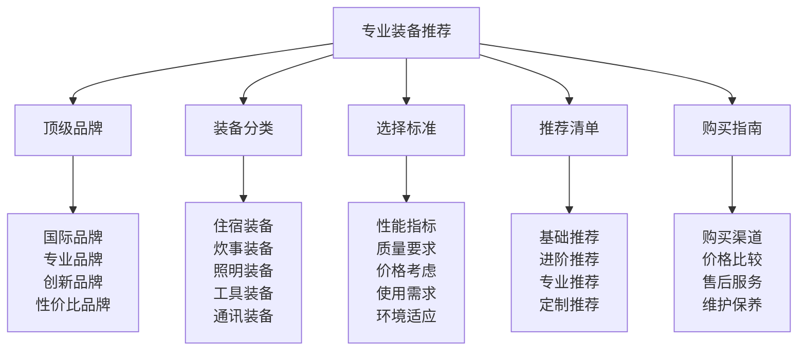

# 专业装备推荐

## 🏆 专业装备推荐核心框架

### 装备推荐金字塔

## 🌟 顶级品牌体系

### 国际顶级品牌
| 品牌名称 | 品牌特色 | 主要产品 | 价格区间 | 推荐指数 |
|----------|----------|----------|----------|----------|
| **MSR** | 轻量化、高性能 | 帐篷、炉具、净水器 | 高端 | ⭐⭐⭐⭐⭐ |
| **Patagonia** | 环保、耐用 | 服装、背包 | 高端 | ⭐⭐⭐⭐⭐ |
| **Arc'teryx** | 技术、创新 | 服装、背包 | 高端 | ⭐⭐⭐⭐⭐ |
| **Black Diamond** | 专业、可靠 | 照明、工具 | 高端 | ⭐⭐⭐⭐⭐ |
| **Therm-a-Rest** | 舒适、便携 | 睡垫、枕头 | 高端 | ⭐⭐⭐⭐⭐ |

### 专业品牌推荐
| 品牌名称 | 品牌特色 | 主要产品 | 价格区间 | 推荐指数 |
|----------|----------|----------|----------|----------|
| **Big Agnes** | 帐篷专家 | 帐篷、睡袋 | 中高端 | ⭐⭐⭐⭐ |
| **Jetboil** | 炉具专家 | 炉具、炊具 | 中高端 | ⭐⭐⭐⭐ |
| **Petzl** | 照明专家 | 头灯、安全带 | 中高端 | ⭐⭐⭐⭐ |
| **Leatherman** | 工具专家 | 多功能工具 | 中端 | ⭐⭐⭐⭐ |
| **Goal Zero** | 电源专家 | 太阳能充电器 | 中高端 | ⭐⭐⭐⭐ |

### 创新品牌推荐
| 品牌名称 | 品牌特色 | 主要产品 | 价格区间 | 推荐指数 |
|----------|----------|----------|----------|----------|
| **Nemo** | 创新设计 | 帐篷、睡袋 | 中高端 | ⭐⭐⭐⭐ |
| **Sea to Summit** | 轻量化 | 炊具、收纳 | 中高端 | ⭐⭐⭐⭐ |
| **Hyperlite Mountain Gear** | 超轻量化 | 背包、帐篷 | 高端 | ⭐⭐⭐⭐ |
| **Zpacks** | 定制化 | 背包、帐篷 | 高端 | ⭐⭐⭐⭐ |
| **Six Moon Designs** | 轻量化 | 帐篷、背包 | 中高端 | ⭐⭐⭐⭐ |

### 性价比品牌推荐
| 品牌名称 | 品牌特色 | 主要产品 | 价格区间 | 推荐指数 |
|----------|----------|----------|----------|----------|
| **Coleman** | 性价比高 | 帐篷、炉具 | 中低端 | ⭐⭐⭐ |
| **REI Co-op** | 性价比高 | 全系列装备 | 中端 | ⭐⭐⭐ |
| **Marmot** | 性价比高 | 服装、帐篷 | 中端 | ⭐⭐⭐ |
| **Kelty** | 性价比高 | 帐篷、背包 | 中端 | ⭐⭐⭐ |
| **ALPS Mountaineering** | 性价比高 | 帐篷、背包 | 中低端 | ⭐⭐⭐ |

## 🏕️ 装备分类推荐

### 住宿装备推荐
| 装备类型 | 推荐品牌 | 推荐型号 | 价格区间 | 推荐理由 |
|----------|----------|----------|----------|----------|
| **帐篷** | MSR | Hubba Hubba NX | 高端 | 轻量化、耐用 |
| **帐篷** | Big Agnes | Copper Spur HV UL | 高端 | 空间大、轻量化 |
| **帐篷** | Coleman | Sundome 4 | 中低端 | 性价比高、耐用 |
| **睡袋** | Western Mountaineering | SummerLite | 高端 | 轻量化、保暖 |
| **睡袋** | REI Co-op | Magma 15 | 中端 | 性价比高、保暖 |
| **睡垫** | Therm-a-Rest | NeoAir XTherm | 高端 | 轻量化、保暖 |
| **睡垫** | REI Co-op | Flash 3-Season | 中端 | 性价比高、舒适 |

### 炊事装备推荐
| 装备类型 | 推荐品牌 | 推荐型号 | 价格区间 | 推荐理由 |
|----------|----------|----------|----------|----------|
| **炉具** | MSR | PocketRocket 2 | 中高端 | 轻量化、高效 |
| **炉具** | Jetboil | Flash | 中高端 | 快速、高效 |
| **炉具** | Coleman | Classic Propane | 中低端 | 性价比高、稳定 |
| **炊具** | MSR | Quick 2 System | 高端 | 轻量化、多功能 |
| **炊具** | Sea to Summit | Alpha Light | 中高端 | 轻量化、耐用 |
| **炊具** | GSI | Outdoors Halulite | 中端 | 性价比高、实用 |
| **净水器** | MSR | Guardian | 高端 | 高效、可靠 |
| **净水器** | Sawyer | Squeeze | 中端 | 轻量化、经济 |

### 照明装备推荐
| 装备类型 | 推荐品牌 | 推荐型号 | 价格区间 | 推荐理由 |
|----------|----------|----------|----------|----------|
| **头灯** | Petzl | Actik Core | 中高端 | 亮度高、续航长 |
| **头灯** | Black Diamond | Spot 400 | 中端 | 性价比高、实用 |
| **头灯** | Coast | FL75R | 中低端 | 性价比高、耐用 |
| **手电** | Fenix | PD36R | 中高端 | 亮度高、续航长 |
| **手电** | Streamlight | ProTac 2L-X | 中端 | 耐用、可靠 |
| **营地灯** | Goal Zero | Lighthouse 400 | 中高端 | 多功能、环保 |
| **营地灯** | Black Diamond | Moji Lantern | 中端 | 轻量化、实用 |

### 工具装备推荐
| 装备类型 | 推荐品牌 | 推荐型号 | 价格区间 | 推荐理由 |
|----------|----------|----------|----------|----------|
| **多功能工具** | Leatherman | Wave+ | 中高端 | 功能全、耐用 |
| **多功能工具** | Gerber | Suspension | 中端 | 性价比高、实用 |
| **刀具** | Benchmade | Bugout | 高端 | 轻量化、锋利 |
| **刀具** | Kershaw | Leek | 中端 | 性价比高、锋利 |
| **斧头** | Fiskars | X7 | 中端 | 性价比高、耐用 |
| **锯子** | Silky | Gomboy 240 | 中高端 | 锋利、轻量化 |
| **绳索** | Sterling | Dynamic Rope | 高端 | 专业、可靠 |
| **绳索** | Mammut | Dynamic Rope | 中高端 | 性价比高、可靠 |

### 通讯装备推荐
| 装备类型 | 推荐品牌 | 推荐型号 | 价格区间 | 推荐理由 |
|----------|----------|----------|----------|----------|
| **GPS** | Garmin | GPSMAP 66i | 高端 | 功能全、可靠 |
| **GPS** | Garmin | eTrex 22x | 中端 | 性价比高、实用 |
| **卫星通讯** | Garmin | inReach Mini 2 | 高端 | 轻量化、可靠 |
| **卫星通讯** | SPOT | Gen4 | 中高端 | 简单、可靠 |
| **对讲机** | Motorola | T600 | 中端 | 性价比高、实用 |
| **对讲机** | Midland | GXT1000VP4 | 中低端 | 性价比高、耐用 |

## 📊 选择标准体系

### 性能指标评估
| 性能指标 | 评估内容 | 评估标准 | 权重 | 评估方法 |
|----------|----------|----------|------|----------|
| **重量** | 装备重量 | 轻量化优先 | 25% | 重量测量 |
| **耐用性** | 装备耐用程度 | 耐用性优先 | 20% | 耐久测试 |
| **功能性** | 装备功能完整性 | 功能完整优先 | 20% | 功能测试 |
| **便携性** | 装备便携程度 | 便携性优先 | 15% | 便携测试 |
| **可靠性** | 装备可靠性 | 可靠性优先 | 20% | 可靠性测试 |

### 质量要求标准
| 质量维度 | 质量要求 | 质量标准 | 检测方法 | 质量等级 |
|----------|----------|----------|----------|----------|
| **材料质量** | 材料选择、工艺 | 优质材料 | 材料检测 | A级 |
| **工艺质量** | 制造工艺、精度 | 精工制造 | 工艺检测 | A级 |
| **设计质量** | 设计合理性、创新性 | 优秀设计 | 设计评估 | A级 |
| **测试质量** | 测试标准、认证 | 严格测试 | 测试验证 | A级 |

### 价格考虑因素
| 价格因素 | 考虑内容 | 考虑标准 | 权重 | 决策方法 |
|----------|----------|----------|------|----------|
| **性价比** | 性能与价格比 | 性价比优先 | 40% | 性价比分析 |
| **预算限制** | 预算范围 | 预算内选择 | 30% | 预算分析 |
| **使用频率** | 使用频率 | 高频使用优先 | 20% | 使用分析 |
| **长期成本** | 维护、更换成本 | 长期成本优先 | 10% | 成本分析 |

### 使用需求分析
| 需求类型 | 需求内容 | 需求标准 | 匹配方法 | 需求满足度 |
|----------|----------|----------|----------|------------|
| **环境需求** | 环境适应性 | 环境匹配 | 环境分析 | 高 |
| **活动需求** | 活动类型匹配 | 活动匹配 | 活动分析 | 高 |
| **技能需求** | 技能水平匹配 | 技能匹配 | 技能分析 | 中 |
| **个人需求** | 个人偏好匹配 | 偏好匹配 | 偏好分析 | 中 |

## 📋 推荐清单体系

### 基础推荐清单
| 装备类别 | 推荐装备 | 品牌型号 | 价格区间 | 推荐理由 |
|----------|----------|----------|----------|----------|
| **帐篷** | 3-4人帐篷 | Coleman Sundome 4 | 中低端 | 性价比高 |
| **睡袋** | 三季睡袋 | REI Co-op Magma 15 | 中端 | 性价比高 |
| **睡垫** | 充气睡垫 | REI Co-op Flash 3-Season | 中端 | 性价比高 |
| **炉具** | 便携炉具 | Coleman Classic Propane | 中低端 | 性价比高 |
| **炊具** | 基础炊具 | GSI Outdoors Halulite | 中端 | 性价比高 |
| **头灯** | 基础头灯 | Black Diamond Spot 400 | 中端 | 性价比高 |
| **背包** | 50-60L背包 | REI Co-op Traverse 60 | 中端 | 性价比高 |

### 进阶推荐清单
| 装备类别 | 推荐装备 | 品牌型号 | 价格区间 | 推荐理由 |
|----------|----------|----------|----------|----------|
| **帐篷** | 轻量化帐篷 | MSR Hubba Hubba NX | 高端 | 轻量化 |
| **睡袋** | 轻量化睡袋 | Western Mountaineering SummerLite | 高端 | 轻量化 |
| **睡垫** | 轻量化睡垫 | Therm-a-Rest NeoAir XTherm | 高端 | 轻量化 |
| **炉具** | 轻量化炉具 | MSR PocketRocket 2 | 中高端 | 轻量化 |
| **炊具** | 轻量化炊具 | Sea to Summit Alpha Light | 中高端 | 轻量化 |
| **头灯** | 专业头灯 | Petzl Actik Core | 中高端 | 专业性能 |
| **背包** | 轻量化背包 | Osprey Exos 58 | 中高端 | 轻量化 |

### 专业推荐清单
| 装备类别 | 推荐装备 | 品牌型号 | 价格区间 | 推荐理由 |
|----------|----------|----------|----------|----------|
| **帐篷** | 超轻帐篷 | Hyperlite Mountain Gear Ultamid 2 | 高端 | 超轻量化 |
| **睡袋** | 超轻睡袋 | Western Mountaineering HighLite | 高端 | 超轻量化 |
| **睡垫** | 超轻睡垫 | Therm-a-Rest NeoAir UberLite | 高端 | 超轻量化 |
| **炉具** | 超轻炉具 | MSR PocketRocket Deluxe | 高端 | 超轻量化 |
| **炊具** | 超轻炊具 | MSR Quick 2 System | 高端 | 超轻量化 |
| **头灯** | 超轻头灯 | Petzl Bindi | 高端 | 超轻量化 |
| **背包** | 超轻背包 | Hyperlite Mountain Gear 2400 | 高端 | 超轻量化 |

### 定制推荐清单
| 定制类型 | 定制内容 | 定制方法 | 定制标准 | 定制效果 |
|----------|----------|----------|----------|----------|
| **个人定制** | 个人需求定制 | 需求分析 | 个人匹配 | 个性化 |
| **环境定制** | 环境需求定制 | 环境分析 | 环境匹配 | 环境适应 |
| **活动定制** | 活动需求定制 | 活动分析 | 活动匹配 | 活动优化 |
| **预算定制** | 预算需求定制 | 预算分析 | 预算匹配 | 预算优化 |

## 🛒 购买指南体系

### 购买渠道推荐
| 渠道类型 | 渠道特点 | 优势 | 劣势 | 推荐指数 |
|----------|----------|------|------|----------|
| **官方旗舰店** | 品牌官方 | 正品保证、售后好 | 价格较高 | ⭐⭐⭐⭐⭐ |
| **专业户外店** | 专业销售 | 专业建议、体验好 | 价格较高 | ⭐⭐⭐⭐ |
| **电商平台** | 在线购买 | 价格优惠、选择多 | 无法体验 | ⭐⭐⭐ |
| **二手市场** | 二手交易 | 价格便宜 | 质量不确定 | ⭐⭐ |

### 价格比较策略
| 比较要素 | 比较内容 | 比较方法 | 比较标准 | 比较效果 |
|----------|----------|----------|----------|----------|
| **品牌比较** | 同类型品牌比较 | 品牌对比 | 性价比优先 | 选择最优 |
| **型号比较** | 同品牌型号比较 | 型号对比 | 需求匹配 | 选择最适 |
| **渠道比较** | 不同渠道比较 | 渠道对比 | 价格优先 | 选择最便宜 |
| **时间比较** | 不同时间比较 | 时间对比 | 促销优先 | 选择最优惠 |

### 售后服务保障
| 服务类型 | 服务内容 | 服务标准 | 服务保障 | 服务效果 |
|----------|----------|----------|----------|----------|
| **保修服务** | 产品保修 | 保修期内免费 | 保修保障 | 服务可靠 |
| **维修服务** | 产品维修 | 专业维修 | 维修保障 | 服务可靠 |
| **更换服务** | 产品更换 | 质量问题更换 | 更换保障 | 服务可靠 |
| **咨询服务** | 使用咨询 | 专业咨询 | 咨询保障 | 服务可靠 |

### 维护保养指导
| 保养类型 | 保养内容 | 保养方法 | 保养频率 | 保养效果 |
|----------|----------|----------|----------|----------|
| **日常保养** | 日常清洁保养 | 清洁、干燥 | 每次使用后 | 延长寿命 |
| **定期保养** | 定期深度保养 | 深度清洁、检查 | 每月一次 | 保持性能 |
| **专业保养** | 专业维护保养 | 专业服务 | 每年一次 | 恢复性能 |
| **应急保养** | 应急维修保养 | 应急处理 | 需要时 | 恢复功能 |

## 🎓 费曼学习法应用

### 第一步：选择概念
选择"专业装备推荐"作为学习概念

### 第二步：教授他人
用简单语言解释：
> "专业装备推荐就是根据不同的需求和预算，推荐合适的露营装备。包括品牌推荐、装备分类、选择标准、推荐清单、购买指南。关键是找到性价比高、质量可靠、适合自己的装备。"

### 第三步：回顾简化
- **顶级品牌**：国际品牌、专业品牌、创新品牌、性价比品牌
- **装备分类**：住宿装备、炊事装备、照明装备、工具装备、通讯装备
- **选择标准**：性能指标、质量要求、价格考虑、使用需求、环境适应
- **推荐清单**：基础推荐、进阶推荐、专业推荐、定制推荐
- **购买指南**：购买渠道、价格比较、售后服务、维护保养

### 第四步：组织优化
建立装备推荐与技能的关系：
- 品牌推荐 → [[04-创新层-进阶发展/02-专业配置/01-专业配置概述|专业配置]]
- 装备分类 → [[03-应用层-实践技能/01-装备准备|装备准备]]
- 选择标准 → [[04-创新层-进阶发展/02-专业配置/02-定制化配置|定制化配置]]
- 推荐清单 → [[05-实践与评估/01-技能评估体系|技能评估]]
- 购买指南 → [[04-创新层-进阶发展/02-专业配置/04-维护保养体系|维护保养]]

## 🏃‍♂️ 刻意练习要点

### 装备推荐练习
1. **品牌练习**：练习品牌分析和推荐
2. **分类练习**：练习装备分类和选择
3. **标准练习**：练习选择标准应用
4. **推荐练习**：练习推荐清单制定

### 练习方法
- **理论学习**：学习装备推荐理论
- **案例分析**：分析装备推荐案例
- **实践推荐**：实际推荐装备
- **比较分析**：比较不同装备

### 实践验证
- **推荐测试**：测试装备推荐能力
- **效果验证**：验证推荐效果
- **满意度调查**：调查用户满意度
- **持续改进**：持续改进推荐方法

## 📋 装备推荐检查清单

### 品牌推荐检查
- [ ] 品牌分析是否全面
- [ ] 品牌特色是否明确
- [ ] 品牌推荐是否合理
- [ ] 品牌比较是否客观

### 装备分类检查
- [ ] 分类是否科学合理
- [ ] 推荐装备是否合适
- [ ] 价格区间是否合理
- [ ] 推荐理由是否充分

### 选择标准检查
- [ ] 标准是否科学合理
- [ ] 权重是否合理
- [ ] 评估方法是否有效
- [ ] 标准应用是否准确

### 推荐清单检查
- [ ] 清单是否完整
- [ ] 推荐是否合适
- [ ] 价格是否合理
- [ ] 理由是否充分

### 购买指南检查
- [ ] 渠道是否可靠
- [ ] 价格比较是否准确
- [ ] 服务保障是否完善
- [ ] 保养指导是否详细

## 🎯 装备推荐策略

### 推荐策略
1. **需求导向**：以需求为导向推荐
2. **性价比优先**：优先推荐性价比高的装备
3. **质量保证**：确保推荐装备质量
4. **个性化**：根据个人情况个性化推荐

### 发展策略
- **品牌发展**：持续关注品牌发展
- **产品更新**：及时更新产品信息
- **标准优化**：持续优化选择标准
- **服务提升**：持续提升推荐服务

## 🔗 相关链接
- [[01-专业配置概述|专业配置概述]]
- [[02-定制化配置|定制化配置]]
- [[03-技术装备集成|技术装备集成]]
- [[04-维护保养体系|维护保养体系]]
- [[03-应用层-实践技能/01-装备准备|装备准备]]
- [[05-实践与评估/01-技能评估体系|技能评估体系]]