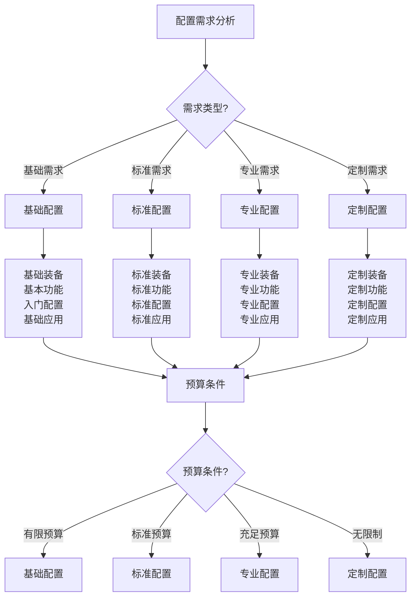

# 专业配置

## ⚙️ 专业配置概述

### 1. 配置层次
- **基础配置**：基础装备、基本功能、入门配置、基础应用
- **标准配置**：标准装备、标准功能、标准配置、标准应用
- **专业配置**：专业装备、专业功能、专业配置、专业应用
- **定制配置**：定制装备、定制功能、定制配置、定制应用
- **顶级配置**：顶级装备、顶级功能、顶级配置、顶级应用
- **创新配置**：创新装备、创新功能、创新配置、创新应用

### 2. 配置原则
- **功能优先**：功能优先、性能优先、效率优先、效果优先
- **质量保证**：质量保证、可靠性保证、安全性保证、耐用性保证
- **成本控制**：成本控制、预算控制、性价比优化、投资回报
- **个性化**：个性化需求、定制化配置、差异化配置、特色化配置
- **可持续性**：可持续发展、环保配置、资源节约、长期价值
- **创新性**：创新配置、技术前沿、功能创新、体验创新

### 3. 配置分类
- **装备配置**：装备选择、装备搭配、装备优化、装备升级
- **技术配置**：技术选择、技术集成、技术优化、技术升级
- **系统配置**：系统设计、系统集成、系统优化、系统升级
- **服务配置**：服务设计、服务集成、服务优化、服务升级
- **管理配置**：管理设计、管理集成、管理优化、管理升级
- **文化配置**：文化设计、文化集成、文化优化、文化传承

### 4. 配置管理
- **配置规划**：配置规划、需求分析、方案设计、资源配置
- **配置实施**：配置实施、采购管理、安装调试、测试验收
- **配置维护**：配置维护、保养维护、维修维护、升级维护
- **配置优化**：配置优化、性能优化、功能优化、成本优化
- **配置评估**：配置评估、效果评估、价值评估、投资评估
- **配置发展**：配置发展、技术发展、功能发展、创新发展

## 🎯 定制化配置

### 1. 需求分析
- **个人需求**：个人需求、使用需求、功能需求、体验需求
- **环境需求**：环境需求、气候需求、地形需求、生态需求
- **活动需求**：活动需求、项目需求、目标需求、效果需求
- **预算需求**：预算需求、成本需求、投资需求、回报需求
- **时间需求**：时间需求、周期需求、效率需求、进度需求
- **质量需求**：质量需求、标准需求、性能需求、可靠性需求

### 2. 方案设计
- **方案制定**：方案制定、方案设计、方案优化、方案选择
- **技术方案**：技术方案、技术选择、技术集成、技术优化
- **装备方案**：装备方案、装备选择、装备搭配、装备优化
- **服务方案**：服务方案、服务设计、服务集成、服务优化
- **管理方案**：管理方案、管理设计、管理集成、管理优化
- **文化方案**：文化方案、文化设计、文化集成、文化传承

### 3. 实施管理
- **实施计划**：实施计划、进度计划、资源计划、质量计划
- **采购管理**：采购管理、供应商管理、合同管理、质量管理
- **安装调试**：安装调试、系统调试、功能调试、性能调试
- **测试验收**：测试验收、功能测试、性能测试、安全测试
- **培训交付**：培训交付、使用培训、维护培训、管理培训
- **售后服务**：售后服务、技术支持、维护服务、升级服务

### 4. 效果评估
- **功能评估**：功能评估、性能评估、效果评估、满意度评估
- **成本评估**：成本评估、投资评估、回报评估、价值评估
- **质量评估**：质量评估、可靠性评估、安全性评估、耐用性评估
- **服务评估**：服务评估、支持评估、维护评估、升级评估
- **创新评估**：创新评估、技术评估、功能评估、体验评估
- **发展评估**：发展评估、潜力评估、前景评估、可持续性评估

## 🔧 技术装备集成

### 1. 装备集成
- **系统集成**：系统集成、功能集成、技术集成、服务集成
- **设备集成**：设备集成、硬件集成、软件集成、网络集成
- **功能集成**：功能集成、性能集成、体验集成、服务集成
- **技术集成**：技术集成、标准集成、协议集成、接口集成
- **服务集成**：服务集成、支持集成、维护集成、升级集成
- **管理集成**：管理集成、监控集成、控制集成、优化集成

### 2. 技术标准
- **技术标准**：技术标准、性能标准、质量标准、安全标准
- **接口标准**：接口标准、协议标准、通信标准、数据标准
- **测试标准**：测试标准、验收标准、质量标准、安全标准
- **维护标准**：维护标准、保养标准、维修标准、升级标准
- **服务标准**：服务标准、支持标准、培训标准、管理标准
- **创新标准**：创新标准、技术标准、功能标准、体验标准

### 3. 集成管理
- **集成规划**：集成规划、需求分析、方案设计、资源配置
- **集成实施**：集成实施、系统实施、功能实施、服务实施
- **集成测试**：集成测试、系统测试、功能测试、性能测试
- **集成验收**：集成验收、功能验收、性能验收、质量验收
- **集成维护**：集成维护、系统维护、功能维护、服务维护
- **集成优化**：集成优化、系统优化、功能优化、服务优化

### 4. 技术发展
- **技术跟踪**：技术跟踪、技术研究、技术分析、技术评估
- **技术升级**：技术升级、系统升级、功能升级、服务升级
- **技术创新**：技术创新、功能创新、应用创新、体验创新
- **技术应用**：技术应用、功能应用、服务应用、管理应用
- **技术推广**：技术推广、功能推广、服务推广、管理推广
- **技术发展**：技术发展、系统发展、功能发展、服务发展

## 🔧 维护保养体系

### 1. 维护体系
- **预防维护**：预防维护、定期维护、计划维护、预测维护
- **纠正维护**：纠正维护、故障维护、应急维护、紧急维护
- **改进维护**：改进维护、优化维护、升级维护、创新维护
- **全面维护**：全面维护、系统维护、功能维护、服务维护
- **智能维护**：智能维护、自动化维护、远程维护、数字化维护
- **绿色维护**：绿色维护、环保维护、可持续维护、生态维护

### 2. 保养管理
- **保养计划**：保养计划、保养周期、保养内容、保养标准
- **保养执行**：保养执行、保养操作、保养记录、保养验收
- **保养监控**：保养监控、保养跟踪、保养评估、保养改进
- **保养优化**：保养优化、保养效率、保养质量、保养成本
- **保养创新**：保养创新、保养方法、保养技术、保养工具
- **保养发展**：保养发展、保养体系、保养标准、保养文化

### 3. 维修体系
- **维修管理**：维修管理、维修计划、维修执行、维修验收
- **故障诊断**：故障诊断、故障分析、故障定位、故障处理
- **维修技术**：维修技术、维修方法、维修工具、维修标准
- **维修质量**：维修质量、维修标准、维修验收、维修保证
- **维修成本**：维修成本、成本控制、成本优化、成本管理
- **维修创新**：维修创新、维修技术、维修方法、维修工具

### 4. 升级体系
- **升级规划**：升级规划、升级需求、升级方案、升级实施
- **升级管理**：升级管理、升级计划、升级执行、升级验收
- **升级技术**：升级技术、升级方法、升级工具、升级标准
- **升级质量**：升级质量、升级标准、升级验收、升级保证
- **升级成本**：升级成本、成本控制、成本优化、成本管理
- **升级创新**：升级创新、升级技术、升级方法、升级工具

## 📊 专业配置对比

| 配置类型 | 复杂度 | 成本 | 性能 | 个性化 | 维护性 | 推荐指数 |
|----------|--------|------|------|--------|--------|----------|
| **基础配置** | 低 | 低 | 中 | 低 | 高 | ⭐⭐⭐ |
| **标准配置** | 中 | 中 | 中 | 中 | 高 | ⭐⭐⭐⭐ |
| **专业配置** | 高 | 高 | 高 | 高 | 中 | ⭐⭐⭐⭐⭐ |
| **定制配置** | 极高 | 极高 | 极高 | 极高 | 中 | ⭐⭐⭐⭐⭐ |
| **顶级配置** | 极高 | 极高 | 极高 | 极高 | 低 | ⭐⭐⭐⭐ |
| **创新配置** | 极高 | 极高 | 极高 | 极高 | 低 | ⭐⭐⭐⭐⭐ |

## 🎯 专业配置决策树

## 🎓 费曼学习法应用

### 第一步：选择概念
选择"专业配置"作为学习概念

### 第二步：教授他人
用简单语言解释：
> "专业配置是露营装备的高级配置：从基础配置到定制配置，需要根据需求、预算、环境选择合适配置。关键是功能优先、质量保证、成本控制，还要考虑维护和升级。"

### 第三步：回顾简化
- **配置层次**：基础配置、标准配置、专业配置、定制配置
- **定制化配置**：需求分析、方案设计、实施管理、效果评估
- **技术集成**：装备集成、技术标准、集成管理、技术发展
- **维护体系**：维护体系、保养管理、维修体系、升级体系

### 第四步：组织优化
建立专业配置与技能的关系：
- 配置层次 → [[01-装备准备/01-基础装备清单|基础装备]]
- 定制化配置 → [[03-应用层-实践技能|应用技能]]
- 技术集成 → [[01-高级技巧/07-跨学科知识整合|跨学科知识]]
- 维护体系 → [[03-应用层-实践技能|应用技能]]

## 🏃‍♂️ 刻意练习要点

### 专业配置练习
1. **需求分析**：练习需求分析技能
2. **方案设计**：练习方案设计技能
3. **实施管理**：练习实施管理技能
4. **效果评估**：练习效果评估技能

### 实践验证
- **配置测试**：测试配置效果
- **性能测试**：测试配置性能
- **成本测试**：测试配置成本
- **持续改进**：持续改进配置

## 🔗 专业配置与技能的关系

### 配置层次技能
- **选择技能**：[[01-装备准备/01-基础装备清单|基础装备]]
- **分析技能**：[[04-创新层-进阶发展/01-高级技巧/07-跨学科知识整合|跨学科知识]]
- **设计技能**：[[04-创新层-进阶发展/01-高级技巧|高级技巧]]
- **管理技能**：[[04-创新层-进阶发展/03-领导力培养/01-团队管理技能|团队管理]]

### 定制化配置技能
- **分析技能**：[[04-创新层-进阶发展/01-高级技巧/07-跨学科知识整合|跨学科知识]]
- **设计技能**：[[04-创新层-进阶发展/01-高级技巧|高级技巧]]
- **管理技能**：[[04-创新层-进阶发展/03-领导力培养/01-团队管理技能|团队管理]]
- **评估技能**：[[04-创新层-进阶发展/02-专业配置/05-升级优化策略|升级优化]]

### 技术集成技能
- **技术技能**：[[04-创新层-进阶发展/01-高级技巧/07-跨学科知识整合|跨学科知识]]
- **集成技能**：[[04-创新层-进阶发展/01-高级技巧|高级技巧]]
- **管理技能**：[[04-创新层-进阶发展/03-领导力培养/01-团队管理技能|团队管理]]
- **创新技能**：[[04-创新层-进阶发展/04-文化传承/03-创新文化发展|创新文化]]

### 维护体系技能
- **维护技能**：[[03-应用层-实践技能|应用技能]]
- **管理技能**：[[04-创新层-进阶发展/03-领导力培养/01-团队管理技能|团队管理]]
- **优化技能**：[[04-创新层-进阶发展/02-专业配置/05-升级优化策略|升级优化]]
- **创新技能**：[[04-创新层-进阶发展/04-文化传承/03-创新文化发展|创新文化]]

## 📋 专业配置检查清单

### 配置层次
- [ ] 了解配置层次
- [ ] 掌握配置原则
- [ ] 学会配置分类
- [ ] 掌握配置管理

### 定制化配置
- [ ] 掌握需求分析
- [ ] 学会方案设计
- [ ] 掌握实施管理
- [ ] 学会效果评估

### 技术集成
- [ ] 掌握装备集成
- [ ] 了解技术标准
- [ ] 掌握集成管理
- [ ] 了解技术发展

### 维护体系
- [ ] 掌握维护体系
- [ ] 学会保养管理
- [ ] 掌握维修体系
- [ ] 学会升级体系

## 🎯 专业配置策略

### 系统性策略
1. **需求导向**：以需求为导向
2. **质量优先**：质量优先、性能优先
3. **成本控制**：成本控制、性价比优化
4. **持续改进**：持续改进、不断优化

### 创新性策略
- **技术创新**：技术创新、功能创新
- **配置创新**：配置创新、体验创新
- **管理创新**：管理创新、服务创新
- **持续发展**：持续发展、创新发展

## 🔗 相关链接
- [[01-高级技巧|高级技巧]]
- [[03-领导力培养|领导力培养]]
- [[04-文化传承|文化传承]]
- [[03-应用层-实践技能|应用层实践技能]]
