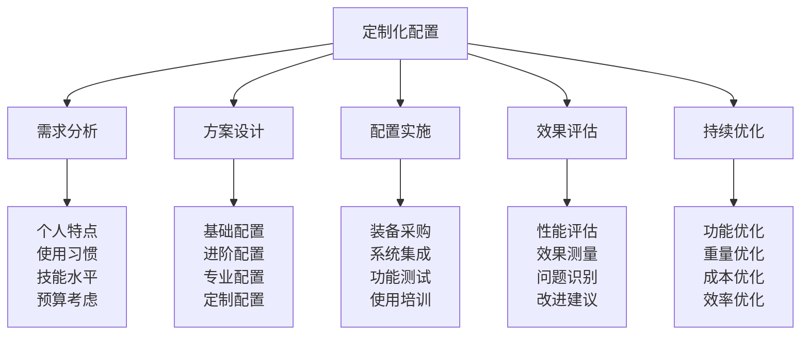
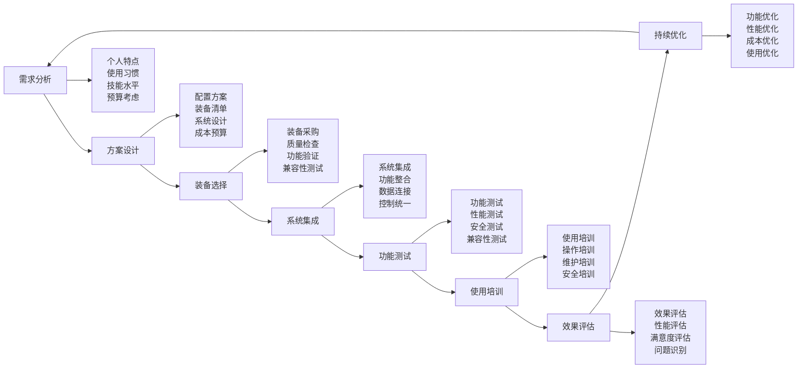

# 定制化配置

## 🎯 定制化配置核心框架

### 配置设计金字塔

## 📊 个性化需求分析

### 个人特点分析
| 分析维度 | 分析内容 | 分析方法 | 分析标准 | 配置影响 |
|----------|----------|----------|----------|----------|
| **身体特征** | 身高、体重、力量 | 身体测量 | 客观数据 | 装备选择 |
| **技能水平** | 技能等级、经验 | 技能评估 | 技能标准 | 装备复杂度 |
| **使用习惯** | 使用偏好、习惯 | 习惯调查 | 主观偏好 | 装备配置 |
| **学习能力** | 学习速度、适应 | 能力测试 | 能力标准 | 装备学习 |

### 使用习惯分析
| 习惯类型 | 习惯内容 | 分析方法 | 习惯特点 | 配置要求 |
|----------|----------|----------|----------|----------|
| **活动习惯** | 活动类型、频率 | 活动记录 | 活动规律 | 装备适配 |
| **环境习惯** | 环境偏好、适应 | 环境分析 | 环境特点 | 环境装备 |
| **时间习惯** | 时间安排、节奏 | 时间分析 | 时间规律 | 时间装备 |
| **社交习惯** | 社交方式、偏好 | 社交分析 | 社交特点 | 社交装备 |

### 技能水平评估
| 技能层次 | 技能内容 | 评估方法 | 评估标准 | 配置要求 |
|----------|----------|----------|----------|----------|
| **初级技能** | 基础操作技能 | 技能测试 | 80%熟练度 | 基础装备 |
| **中级技能** | 进阶应用技能 | 技能测试 | 75%熟练度 | 进阶装备 |
| **高级技能** | 高级操作技能 | 技能测试 | 70%熟练度 | 高级装备 |
| **专业技能** | 专业应用技能 | 技能测试 | 65%熟练度 | 专业装备 |

### 预算考虑分析
| 预算类型 | 预算内容 | 预算方法 | 预算标准 | 配置策略 |
|----------|----------|----------|----------|----------|
| **总预算** | 总体预算限制 | 预算规划 | 预算合理 | 预算控制 |
| **装备预算** | 装备采购预算 | 装备规划 | 装备价值 | 装备优化 |
| **维护预算** | 维护保养预算 | 维护规划 | 维护成本 | 维护优化 |
| **升级预算** | 升级更新预算 | 升级规划 | 升级价值 | 升级策略 |

## 🛠️ 配置方案设计

### 基础配置方案
| 配置要素 | 配置内容 | 配置标准 | 配置成本 | 配置效果 |
|----------|----------|----------|----------|----------|
| **核心装备** | 帐篷、睡袋、背包 | 基础标准 | 低 | 基本满足 |
| **安全装备** | 急救包、照明、通讯 | 安全标准 | 中 | 安全保障 |
| **生活装备** | 炊具、餐具、清洁 | 生活标准 | 低 | 生活便利 |
| **工具装备** | 基础工具、维修 | 工具标准 | 低 | 基本维护 |

### 进阶配置方案
| 配置要素 | 配置内容 | 配置标准 | 配置成本 | 配置效果 |
|----------|----------|----------|----------|----------|
| **专业装备** | 专业帐篷、睡袋 | 专业标准 | 中 | 专业性能 |
| **技术装备** | GPS、通讯设备 | 技术标准 | 高 | 技术先进 |
| **舒适装备** | 舒适垫、椅子 | 舒适标准 | 中 | 舒适提升 |
| **多功能装备** | 多功能工具、设备 | 多功能标准 | 中 | 功能多样 |

### 专业配置方案
| 配置要素 | 配置内容 | 配置标准 | 配置成本 | 配置效果 |
|----------|----------|----------|----------|----------|
| **高端装备** | 高端帐篷、睡袋 | 高端标准 | 高 | 性能卓越 |
| **智能装备** | 智能设备、传感器 | 智能标准 | 极高 | 智能化 |
| **定制装备** | 定制装备、配件 | 定制标准 | 极高 | 个性化 |
| **系统装备** | 系统集成、控制 | 系统标准 | 极高 | 系统化 |

### 定制配置方案

## 🔧 配置实施流程

### 装备采购流程
| 采购阶段 | 采购内容 | 采购方法 | 采购标准 | 采购效果 |
|----------|----------|----------|----------|----------|
| **需求确认** | 需求分析、确认 | 需求调研 | 需求明确 | 需求准确 |
| **供应商选择** | 供应商评估、选择 | 供应商评估 | 供应商可靠 | 供应商优质 |
| **价格谈判** | 价格谈判、合同 | 价格谈判 | 价格合理 | 价格优惠 |
| **质量验收** | 质量检查、验收 | 质量验收 | 质量合格 | 质量保证 |

### 系统集成流程
| 集成阶段 | 集成内容 | 集成方法 | 集成标准 | 集成效果 |
|----------|----------|----------|----------|----------|
| **系统设计** | 系统架构、设计 | 系统设计 | 系统合理 | 系统优化 |
| **设备安装** | 设备安装、调试 | 设备安装 | 安装正确 | 安装可靠 |
| **功能测试** | 功能测试、验证 | 功能测试 | 功能正常 | 功能可靠 |
| **系统优化** | 系统优化、调优 | 系统优化 | 系统最优 | 系统高效 |

### 功能测试流程
| 测试类型 | 测试内容 | 测试方法 | 测试标准 | 测试效果 |
|----------|----------|----------|----------|----------|
| **功能测试** | 功能验证、测试 | 功能测试 | 功能正常 | 功能可靠 |
| **性能测试** | 性能测试、评估 | 性能测试 | 性能达标 | 性能优秀 |
| **安全测试** | 安全测试、验证 | 安全测试 | 安全可靠 | 安全保障 |
| **兼容性测试** | 兼容性测试、验证 | 兼容性测试 | 兼容性好 | 兼容性佳 |

### 使用培训流程
| 培训类型 | 培训内容 | 培训方法 | 培训标准 | 培训效果 |
|----------|----------|----------|----------|----------|
| **操作培训** | 操作技能、方法 | 操作培训 | 操作熟练 | 操作准确 |
| **维护培训** | 维护技能、方法 | 维护培训 | 维护熟练 | 维护有效 |
| **安全培训** | 安全知识、技能 | 安全培训 | 安全意识 | 安全保障 |
| **高级培训** | 高级技能、方法 | 高级培训 | 高级技能 | 高级应用 |

## 📈 效果评估体系

### 性能评估指标
| 评估指标 | 评估内容 | 评估方法 | 评估标准 | 评估效果 |
|----------|----------|----------|----------|----------|
| **功能性能** | 功能完整性、可靠性 | 功能测试 | 功能正常 | 功能可靠 |
| **性能表现** | 性能指标、表现 | 性能测试 | 性能达标 | 性能优秀 |
| **使用便利** | 使用便利性、友好性 | 使用测试 | 使用便利 | 使用友好 |
| **成本效益** | 成本效益、性价比 | 成本分析 | 成本合理 | 效益良好 |

### 满意度评估
| 满意度维度 | 评估内容 | 评估方法 | 评估标准 | 评估效果 |
|------------|----------|----------|----------|----------|
| **功能满意度** | 功能满足程度 | 满意度调查 | 满意度高 | 功能满足 |
| **性能满意度** | 性能满足程度 | 满意度调查 | 满意度高 | 性能满足 |
| **使用满意度** | 使用便利程度 | 满意度调查 | 满意度高 | 使用便利 |
| **服务满意度** | 服务质量程度 | 满意度调查 | 满意度高 | 服务优质 |

### 问题识别分析
| 问题类型 | 问题内容 | 识别方法 | 问题标准 | 解决效果 |
|----------|----------|----------|----------|----------|
| **功能问题** | 功能缺陷、故障 | 问题识别 | 问题明确 | 问题解决 |
| **性能问题** | 性能不足、问题 | 问题识别 | 问题明确 | 问题解决 |
| **使用问题** | 使用困难、不便 | 问题识别 | 问题明确 | 问题解决 |
| **服务问题** | 服务质量、问题 | 问题识别 | 问题明确 | 问题解决 |

## 🔄 持续优化机制

### 功能优化策略
| 优化类型 | 优化内容 | 优化方法 | 优化标准 | 优化效果 |
|----------|----------|----------|----------|----------|
| **功能增强** | 功能增加、改进 | 功能开发 | 功能先进 | 功能提升 |
| **功能优化** | 功能优化、改进 | 功能优化 | 功能优化 | 功能改善 |
| **功能创新** | 功能创新、突破 | 功能创新 | 功能创新 | 功能突破 |
| **功能集成** | 功能集成、整合 | 功能集成 | 功能集成 | 功能整合 |

### 重量优化策略
| 优化要素 | 优化内容 | 优化方法 | 优化标准 | 优化效果 |
|----------|----------|----------|----------|----------|
| **材料优化** | 轻量化材料 | 材料选择 | 材料轻量 | 重量减轻 |
| **结构优化** | 结构轻量化 | 结构设计 | 结构优化 | 重量减轻 |
| **功能优化** | 功能轻量化 | 功能设计 | 功能优化 | 重量减轻 |
| **系统优化** | 系统轻量化 | 系统设计 | 系统优化 | 重量减轻 |

### 成本优化策略
| 优化要素 | 优化内容 | 优化方法 | 优化标准 | 优化效果 |
|----------|----------|----------|----------|----------|
| **采购优化** | 采购成本优化 | 采购策略 | 采购优化 | 成本降低 |
| **维护优化** | 维护成本优化 | 维护策略 | 维护优化 | 成本降低 |
| **使用优化** | 使用成本优化 | 使用策略 | 使用优化 | 成本降低 |
| **升级优化** | 升级成本优化 | 升级策略 | 升级优化 | 成本降低 |

### 效率优化策略
| 优化要素 | 优化内容 | 优化方法 | 优化标准 | 优化效果 |
|----------|----------|----------|----------|----------|
| **操作优化** | 操作效率优化 | 操作优化 | 操作高效 | 效率提升 |
| **维护优化** | 维护效率优化 | 维护优化 | 维护高效 | 效率提升 |
| **使用优化** | 使用效率优化 | 使用优化 | 使用高效 | 效率提升 |
| **管理优化** | 管理效率优化 | 管理优化 | 管理高效 | 效率提升 |

## 🎓 费曼学习法应用

### 第一步：选择概念
选择"定制化配置"作为学习概念

### 第二步：教授他人
用简单语言解释：
> "定制化配置就是根据个人特点、使用习惯、技能水平和预算考虑，设计个性化的装备配置方案。包括需求分析、方案设计、配置实施、效果评估和持续优化。"

### 第三步：回顾简化
- **需求分析**：个人特点、使用习惯、技能水平、预算考虑
- **方案设计**：基础配置、进阶配置、专业配置、定制配置
- **配置实施**：装备采购、系统集成、功能测试、使用培训
- **效果评估**：性能评估、满意度评估、问题识别
- **持续优化**：功能优化、重量优化、成本优化、效率优化

### 第四步：组织优化
建立定制化配置与技能的关系：
- 需求分析 → [[05-实践与评估/01-技能评估体系/01-自我评估清单|自我评估]]
- 方案设计 → [[04-创新层-进阶发展/02-专业配置/01-专业配置概述|专业配置]]
- 配置实施 → [[04-创新层-进阶发展/02-专业配置/03-技术装备集成|技术集成]]
- 效果评估 → [[05-实践与评估/01-技能评估体系|技能评估]]
- 持续优化 → [[05-实践与评估/03-持续改进|持续改进]]

## 🏃‍♂️ 刻意练习要点

### 配置设计练习
1. **需求分析练习**：练习分析个人需求
2. **方案设计练习**：练习设计配置方案
3. **实施管理练习**：练习管理配置实施
4. **效果评估练习**：练习评估配置效果

### 练习方法
- **案例分析**：分析配置案例
- **方案设计**：设计配置方案
- **实施管理**：管理配置实施
- **效果评估**：评估配置效果

### 实践验证
- **需求验证**：验证需求分析准确性
- **方案验证**：验证方案设计合理性
- **实施验证**：验证实施过程有效性
- **效果验证**：验证配置效果满意度

## 📋 定制化配置检查清单

### 需求分析检查
- [ ] 个人特点是否分析清楚
- [ ] 使用习惯是否了解
- [ ] 技能水平是否评估
- [ ] 预算考虑是否合理

### 方案设计检查
- [ ] 配置方案是否合理
- [ ] 装备选择是否合适
- [ ] 系统设计是否优化
- [ ] 成本预算是否合理

### 配置实施检查
- [ ] 装备采购是否顺利
- [ ] 系统集成是否成功
- [ ] 功能测试是否通过
- [ ] 使用培训是否有效

### 效果评估检查
- [ ] 性能评估是否客观
- [ ] 满意度评估是否真实
- [ ] 问题识别是否准确
- [ ] 改进建议是否有效

### 持续优化检查
- [ ] 功能优化是否有效
- [ ] 重量优化是否成功
- [ ] 成本优化是否合理
- [ ] 效率优化是否提升

## 🎯 定制化配置策略

### 配置策略
1. **需求导向**：以需求为导向设计配置
2. **个性化**：注重个性化定制
3. **系统性**：注重系统化配置
4. **可持续**：注重可持续发展

### 优化策略
- **持续优化**：持续优化配置方案
- **技术创新**：采用技术创新优化
- **成本控制**：控制配置成本
- **效果提升**：提升配置效果

## 🔗 相关链接
- [[01-专业配置概述|专业配置概述]]
- [[03-技术装备集成|技术装备集成]]
- [[04-维护保养体系|维护保养体系]]
- [[05-升级优化策略|升级优化策略]]
- [[05-实践与评估/01-技能评估体系/01-自我评估清单|自我评估清单]]
- [[05-实践与评估/03-持续改进/01-学习反思模板|学习反思模板]]