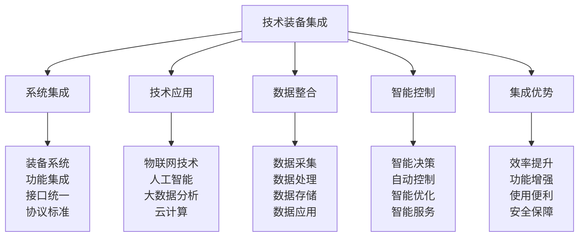

# 技术装备集成

## 🔗 技术装备集成核心框架

### 集成技术金字塔

## 🔧 系统集成技术

### 装备系统集成
| 集成层次 | 集成内容 | 集成方法 | 集成标准 | 集成效果 |
|----------|----------|----------|----------|----------|
| **硬件集成** | 硬件设备集成 | 硬件连接 | 硬件兼容 | 硬件统一 |
| **软件集成** | 软件系统集成 | 软件接口 | 软件兼容 | 软件统一 |
| **网络集成** | 网络通信集成 | 网络协议 | 网络兼容 | 网络统一 |
| **数据集成** | 数据系统集成 | 数据接口 | 数据兼容 | 数据统一 |

### 功能集成技术
| 功能类型 | 集成内容 | 集成方法 | 集成标准 | 集成效果 |
|----------|----------|----------|----------|----------|
| **基础功能** | 基础功能集成 | 功能整合 | 功能完整 | 功能统一 |
| **高级功能** | 高级功能集成 | 功能融合 | 功能先进 | 功能增强 |
| **智能功能** | 智能功能集成 | 智能融合 | 智能先进 | 智能提升 |
| **创新功能** | 创新功能集成 | 创新融合 | 创新先进 | 创新突破 |

### 接口统一技术
| 接口类型 | 接口内容 | 统一方法 | 统一标准 | 统一效果 |
|----------|----------|----------|----------|----------|
| **物理接口** | 物理连接接口 | 接口标准化 | 接口标准 | 连接统一 |
| **逻辑接口** | 逻辑通信接口 | 协议标准化 | 协议标准 | 通信统一 |
| **数据接口** | 数据交换接口 | 数据标准化 | 数据标准 | 数据统一 |
| **服务接口** | 服务调用接口 | 服务标准化 | 服务标准 | 服务统一 |

### 协议标准技术
| 协议类型 | 协议内容 | 标准方法 | 标准要求 | 标准效果 |
|----------|----------|----------|----------|----------|
| **通信协议** | 设备通信协议 | 协议标准化 | 协议兼容 | 通信统一 |
| **数据协议** | 数据传输协议 | 协议标准化 | 协议兼容 | 数据统一 |
| **控制协议** | 设备控制协议 | 协议标准化 | 协议兼容 | 控制统一 |
| **安全协议** | 安全通信协议 | 协议标准化 | 协议安全 | 安全统一 |

## 🤖 技术应用体系

### 物联网技术应用
| 应用领域 | 应用内容 | 应用技术 | 应用效果 | 应用价值 |
|----------|----------|----------|----------|----------|
| **设备连接** | 设备互联互通 | IoT技术 | 设备连接 | 连接价值 |
| **数据采集** | 实时数据采集 | 传感器技术 | 数据实时 | 数据价值 |
| **远程监控** | 远程设备监控 | 远程技术 | 监控远程 | 监控价值 |
| **智能控制** | 智能设备控制 | 智能控制 | 控制智能 | 控制价值 |

### 人工智能技术应用
| 应用类型 | 应用内容 | 应用技术 | 应用效果 | 应用价值 |
|----------|----------|----------|----------|----------|
| **智能分析** | 数据智能分析 | AI分析 | 分析智能 | 分析价值 |
| **智能决策** | 智能决策支持 | AI决策 | 决策智能 | 决策价值 |
| **智能优化** | 系统智能优化 | AI优化 | 优化智能 | 优化价值 |
| **智能服务** | 智能服务提供 | AI服务 | 服务智能 | 服务价值 |

### 大数据分析技术
| 分析类型 | 分析内容 | 分析技术 | 分析效果 | 分析价值 |
|----------|----------|----------|----------|----------|
| **数据挖掘** | 数据模式挖掘 | 数据挖掘 | 模式发现 | 发现价值 |
| **预测分析** | 趋势预测分析 | 预测分析 | 预测准确 | 预测价值 |
| **关联分析** | 数据关联分析 | 关联分析 | 关联发现 | 关联价值 |
| **异常检测** | 异常数据检测 | 异常检测 | 异常识别 | 检测价值 |

### 云计算技术应用
| 应用类型 | 应用内容 | 应用技术 | 应用效果 | 应用价值 |
|----------|----------|----------|----------|----------|
| **计算服务** | 云计算服务 | 云计算 | 计算弹性 | 计算价值 |
| **存储服务** | 云存储服务 | 云存储 | 存储弹性 | 存储价值 |
| **网络服务** | 云网络服务 | 云网络 | 网络弹性 | 网络价值 |
| **平台服务** | 云平台服务 | 云平台 | 平台弹性 | 平台价值 |

## 📊 数据整合技术

### 数据采集技术
| 采集类型 | 采集内容 | 采集技术 | 采集标准 | 采集效果 |
|----------|----------|----------|----------|----------|
| **实时采集** | 实时数据采集 | 实时技术 | 实时标准 | 数据实时 |
| **批量采集** | 批量数据采集 | 批量技术 | 批量标准 | 数据批量 |
| **增量采集** | 增量数据采集 | 增量技术 | 增量标准 | 数据增量 |
| **全量采集** | 全量数据采集 | 全量技术 | 全量标准 | 数据全量 |

### 数据处理技术
| 处理类型 | 处理内容 | 处理技术 | 处理标准 | 处理效果 |
|----------|----------|----------|----------|----------|
| **数据清洗** | 数据清洗处理 | 清洗技术 | 清洗标准 | 数据清洁 |
| **数据转换** | 数据格式转换 | 转换技术 | 转换标准 | 数据统一 |
| **数据聚合** | 数据聚合处理 | 聚合技术 | 聚合标准 | 数据聚合 |
| **数据计算** | 数据计算处理 | 计算技术 | 计算标准 | 数据计算 |

### 数据存储技术
| 存储类型 | 存储内容 | 存储技术 | 存储标准 | 存储效果 |
|----------|----------|----------|----------|----------|
| **关系存储** | 关系数据存储 | 关系数据库 | 关系标准 | 存储关系 |
| **非关系存储** | 非关系数据存储 | NoSQL数据库 | 非关系标准 | 存储非关系 |
| **分布式存储** | 分布式数据存储 | 分布式技术 | 分布式标准 | 存储分布式 |
| **云存储** | 云端数据存储 | 云存储技术 | 云存储标准 | 存储云端 |

### 数据应用技术
| 应用类型 | 应用内容 | 应用技术 | 应用标准 | 应用效果 |
|----------|----------|----------|----------|----------|
| **数据可视化** | 数据可视化展示 | 可视化技术 | 可视化标准 | 展示直观 |
| **数据报表** | 数据报表生成 | 报表技术 | 报表标准 | 报表完整 |
| **数据API** | 数据API服务 | API技术 | API标准 | 服务API |
| **数据服务** | 数据服务提供 | 服务技术 | 服务标准 | 服务数据 |

## 🧠 智能控制技术

### 智能决策技术
| 决策类型 | 决策内容 | 决策技术 | 决策标准 | 决策效果 |
|----------|----------|----------|----------|----------|
| **规则决策** | 基于规则的决策 | 规则引擎 | 规则标准 | 决策规则 |
| **机器学习** | 基于学习的决策 | 机器学习 | 学习标准 | 决策学习 |
| **深度学习** | 基于深度学习的决策 | 深度学习 | 深度标准 | 决策深度 |
| **强化学习** | 基于强化学习的决策 | 强化学习 | 强化标准 | 决策强化 |

### 自动控制技术
| 控制类型 | 控制内容 | 控制技术 | 控制标准 | 控制效果 |
|----------|----------|----------|----------|----------|
| **反馈控制** | 反馈控制系统 | 反馈技术 | 反馈标准 | 控制反馈 |
| **前馈控制** | 前馈控制系统 | 前馈技术 | 前馈标准 | 控制前馈 |
| **自适应控制** | 自适应控制系统 | 自适应技术 | 自适应标准 | 控制自适应 |
| **智能控制** | 智能控制系统 | 智能技术 | 智能标准 | 控制智能 |

### 智能优化技术
| 优化类型 | 优化内容 | 优化技术 | 优化标准 | 优化效果 |
|----------|----------|----------|----------|----------|
| **参数优化** | 系统参数优化 | 参数优化 | 优化标准 | 参数优化 |
| **结构优化** | 系统结构优化 | 结构优化 | 优化标准 | 结构优化 |
| **性能优化** | 系统性能优化 | 性能优化 | 优化标准 | 性能优化 |
| **能耗优化** | 系统能耗优化 | 能耗优化 | 优化标准 | 能耗优化 |

### 智能服务技术
| 服务类型 | 服务内容 | 服务技术 | 服务标准 | 服务效果 |
|----------|----------|----------|----------|----------|
| **智能推荐** | 智能推荐服务 | 推荐技术 | 推荐标准 | 推荐智能 |
| **智能诊断** | 智能诊断服务 | 诊断技术 | 诊断标准 | 诊断智能 |
| **智能维护** | 智能维护服务 | 维护技术 | 维护标准 | 维护智能 |
| **智能预测** | 智能预测服务 | 预测技术 | 预测标准 | 预测智能 |

## 🚀 集成优势分析

### 效率提升优势
| 效率类型 | 提升内容 | 提升方法 | 提升标准 | 提升效果 |
|----------|----------|----------|----------|----------|
| **操作效率** | 操作效率提升 | 操作优化 | 效率标准 | 操作高效 |
| **维护效率** | 维护效率提升 | 维护优化 | 效率标准 | 维护高效 |
| **管理效率** | 管理效率提升 | 管理优化 | 效率标准 | 管理高效 |
| **服务效率** | 服务效率提升 | 服务优化 | 效率标准 | 服务高效 |

### 功能增强优势
| 功能类型 | 增强内容 | 增强方法 | 增强标准 | 增强效果 |
|----------|----------|----------|----------|----------|
| **基础功能** | 基础功能增强 | 功能扩展 | 功能标准 | 功能增强 |
| **高级功能** | 高级功能增强 | 功能升级 | 功能标准 | 功能增强 |
| **智能功能** | 智能功能增强 | 智能升级 | 功能标准 | 功能增强 |
| **创新功能** | 创新功能增强 | 功能创新 | 功能标准 | 功能增强 |

### 使用便利优势
| 便利类型 | 便利内容 | 便利方法 | 便利标准 | 便利效果 |
|----------|----------|----------|----------|----------|
| **操作便利** | 操作便利性 | 操作简化 | 便利标准 | 操作便利 |
| **维护便利** | 维护便利性 | 维护简化 | 便利标准 | 维护便利 |
| **管理便利** | 管理便利性 | 管理简化 | 便利标准 | 管理便利 |
| **服务便利** | 服务便利性 | 服务简化 | 便利标准 | 服务便利 |

### 安全保障优势
| 安全类型 | 保障内容 | 保障方法 | 保障标准 | 保障效果 |
|----------|----------|----------|----------|----------|
| **数据安全** | 数据安全保障 | 数据保护 | 安全标准 | 数据安全 |
| **系统安全** | 系统安全保障 | 系统保护 | 安全标准 | 系统安全 |
| **网络安全** | 网络安全保障 | 网络保护 | 安全标准 | 网络安全 |
| **服务安全** | 服务安全保障 | 服务保护 | 安全标准 | 服务安全 |

## 🎓 费曼学习法应用

### 第一步：选择概念
选择"技术装备集成"作为学习概念

### 第二步：教授他人
用简单语言解释：
> "技术装备集成就是把各种技术装备连接起来，形成一个统一的系统。包括系统集成、技术应用、数据整合、智能控制。关键是让所有装备能够互相通信，数据共享，智能控制。"

### 第三步：回顾简化
- **系统集成**：装备系统、功能集成、接口统一、协议标准
- **技术应用**：物联网、人工智能、大数据、云计算
- **数据整合**：数据采集、数据处理、数据存储、数据应用
- **智能控制**：智能决策、自动控制、智能优化、智能服务
- **集成优势**：效率提升、功能增强、使用便利、安全保障

### 第四步：组织优化
建立技术集成与技能的关系：
- 系统集成 → [[04-创新层-进阶发展/02-专业配置/01-专业配置概述|专业配置]]
- 技术应用 → [[04-创新层-进阶发展/01-高级技巧/04-高级装备使用|高级装备]]
- 数据整合 → [[04-创新层-进阶发展/01-高级技巧/03-专业导航技术|专业导航]]
- 智能控制 → [[04-创新层-进阶发展/01-高级技巧/01-高级技巧概述|高级技巧]]
- 集成优势 → [[05-实践与评估/01-技能评估体系|技能评估]]

## 🏃‍♂️ 刻意练习要点

### 技术集成练习
1. **系统设计练习**：练习设计集成系统
2. **技术应用练习**：练习应用各种技术
3. **数据整合练习**：练习整合各种数据
4. **智能控制练习**：练习智能控制系统

### 练习方法
- **理论学习**：学习技术集成理论
- **实践操作**：实际操作集成系统
- **案例分析**：分析集成案例
- **项目实践**：参与集成项目

### 实践验证
- **功能测试**：测试集成系统功能
- **性能测试**：测试集成系统性能
- **安全测试**：测试集成系统安全
- **效果评估**：评估集成系统效果

## 📋 技术装备集成检查清单

### 系统集成检查
- [ ] 装备系统是否集成
- [ ] 功能集成是否完整
- [ ] 接口是否统一
- [ ] 协议是否标准

### 技术应用检查
- [ ] 物联网技术是否应用
- [ ] 人工智能是否应用
- [ ] 大数据分析是否应用
- [ ] 云计算是否应用

### 数据整合检查
- [ ] 数据采集是否有效
- [ ] 数据处理是否准确
- [ ] 数据存储是否安全
- [ ] 数据应用是否有效

### 智能控制检查
- [ ] 智能决策是否有效
- [ ] 自动控制是否可靠
- [ ] 智能优化是否有效
- [ ] 智能服务是否优质

### 集成优势检查
- [ ] 效率是否提升
- [ ] 功能是否增强
- [ ] 使用是否便利
- [ ] 安全是否保障

## 🎯 技术集成策略

### 集成策略
1. **系统化集成**：系统化设计集成方案
2. **标准化集成**：标准化实施集成过程
3. **智能化集成**：智能化提升集成效果
4. **安全化集成**：安全化保障集成安全

### 发展策略
- **技术发展**：持续发展集成技术
- **应用发展**：持续发展集成应用
- **服务发展**：持续发展集成服务
- **创新发展**：持续发展集成创新

## 🔗 相关链接
- [[01-专业配置概述|专业配置概述]]
- [[02-定制化配置|定制化配置]]
- [[04-维护保养体系|维护保养体系]]
- [[05-升级优化策略|升级优化策略]]
- [[04-创新层-进阶发展/01-高级技巧/04-高级装备使用|高级装备使用]]
- [[04-创新层-进阶发展/01-高级技巧/03-专业导航技术|专业导航技术]]