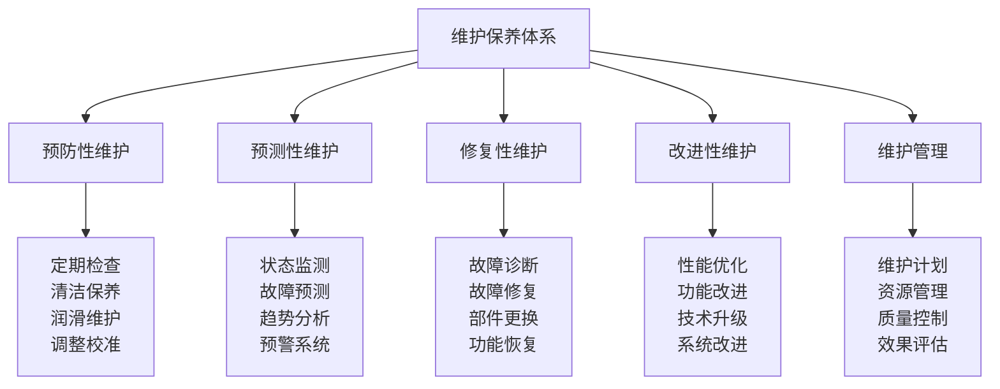

# 维护保养体系

## 🔧 维护保养核心框架

### 维护体系金字塔

## 📊 预防性维护体系

### 定期检查制度
| 检查类型 | 检查内容 | 检查频率 | 检查标准 | 检查效果 |
|----------|----------|----------|----------|----------|
| **日常检查** | 基础功能检查 | 每日 | 功能正常 | 问题及时发现 |
| **周检查** | 详细功能检查 | 每周 | 功能完整 | 问题预防 |
| **月检查** | 全面系统检查 | 每月 | 系统正常 | 系统稳定 |
| **季检查** | 深度专业检查 | 每季度 | 专业标准 | 专业维护 |

### 清洁保养技术
| 保养类型 | 保养内容 | 保养方法 | 保养标准 | 保养效果 |
|----------|----------|----------|----------|----------|
| **表面清洁** | 设备表面清洁 | 清洁剂清洁 | 表面干净 | 外观良好 |
| **内部清洁** | 设备内部清洁 | 专业清洁 | 内部干净 | 功能正常 |
| **深度清洁** | 深度清洁保养 | 深度清洁 | 深度干净 | 性能恢复 |
| **专业清洁** | 专业清洁保养 | 专业方法 | 专业标准 | 专业效果 |

### 润滑维护技术
| 润滑类型 | 润滑内容 | 润滑方法 | 润滑标准 | 润滑效果 |
|----------|----------|----------|----------|----------|
| **基础润滑** | 基础润滑维护 | 润滑剂润滑 | 润滑充分 | 摩擦减少 |
| **专业润滑** | 专业润滑维护 | 专业润滑 | 润滑专业 | 润滑专业 |
| **智能润滑** | 智能润滑维护 | 智能润滑 | 润滑智能 | 润滑智能 |
| **环保润滑** | 环保润滑维护 | 环保润滑 | 润滑环保 | 润滑环保 |

### 调整校准技术
| 校准类型 | 校准内容 | 校准方法 | 校准标准 | 校准效果 |
|----------|----------|----------|----------|----------|
| **功能校准** | 功能参数校准 | 参数调整 | 参数准确 | 功能准确 |
| **精度校准** | 精度参数校准 | 精度调整 | 精度准确 | 精度准确 |
| **系统校准** | 系统参数校准 | 系统调整 | 系统准确 | 系统准确 |
| **专业校准** | 专业参数校准 | 专业调整 | 专业准确 | 专业准确 |

## 🔍 预测性维护体系

### 状态监测技术
| 监测类型 | 监测内容 | 监测技术 | 监测标准 | 监测效果 |
|----------|----------|----------|----------|----------|
| **振动监测** | 设备振动监测 | 振动传感器 | 振动标准 | 振动异常 |
| **温度监测** | 设备温度监测 | 温度传感器 | 温度标准 | 温度异常 |
| **压力监测** | 设备压力监测 | 压力传感器 | 压力标准 | 压力异常 |
| **电流监测** | 设备电流监测 | 电流传感器 | 电流标准 | 电流异常 |

### 故障预测技术
| 预测类型 | 预测内容 | 预测技术 | 预测标准 | 预测效果 |
|----------|----------|----------|----------|----------|
| **趋势预测** | 故障趋势预测 | 趋势分析 | 趋势准确 | 趋势预测 |
| **模式预测** | 故障模式预测 | 模式识别 | 模式准确 | 模式预测 |
| **时间预测** | 故障时间预测 | 时间分析 | 时间准确 | 时间预测 |
| **影响预测** | 故障影响预测 | 影响分析 | 影响准确 | 影响预测 |

### 趋势分析技术
| 分析类型 | 分析内容 | 分析技术 | 分析标准 | 分析效果 |
|----------|----------|----------|----------|----------|
| **数据趋势** | 数据趋势分析 | 数据分析 | 趋势准确 | 趋势分析 |
| **性能趋势** | 性能趋势分析 | 性能分析 | 趋势准确 | 趋势分析 |
| **故障趋势** | 故障趋势分析 | 故障分析 | 趋势准确 | 趋势分析 |
| **维护趋势** | 维护趋势分析 | 维护分析 | 趋势准确 | 趋势分析 |

### 预警系统技术
| 预警类型 | 预警内容 | 预警技术 | 预警标准 | 预警效果 |
|----------|----------|----------|----------|----------|
| **实时预警** | 实时故障预警 | 实时监测 | 预警及时 | 预警实时 |
| **提前预警** | 提前故障预警 | 预测分析 | 预警提前 | 预警提前 |
| **分级预警** | 分级故障预警 | 分级管理 | 预警分级 | 预警分级 |
| **智能预警** | 智能故障预警 | 智能分析 | 预警智能 | 预警智能 |

## 🔨 修复性维护体系

### 故障诊断技术
| 诊断类型 | 诊断内容 | 诊断技术 | 诊断标准 | 诊断效果 |
|----------|----------|----------|----------|----------|
| **症状诊断** | 故障症状诊断 | 症状分析 | 症状准确 | 诊断准确 |
| **原因诊断** | 故障原因诊断 | 原因分析 | 原因准确 | 诊断准确 |
| **影响诊断** | 故障影响诊断 | 影响分析 | 影响准确 | 诊断准确 |
| **解决方案** | 故障解决方案 | 方案分析 | 方案有效 | 诊断有效 |

### 故障修复技术
| 修复类型 | 修复内容 | 修复技术 | 修复标准 | 修复效果 |
|----------|----------|----------|----------|----------|
| **快速修复** | 快速故障修复 | 快速方法 | 修复快速 | 修复快速 |
| **专业修复** | 专业故障修复 | 专业方法 | 修复专业 | 修复专业 |
| **深度修复** | 深度故障修复 | 深度方法 | 修复深度 | 修复深度 |
| **系统修复** | 系统故障修复 | 系统方法 | 修复系统 | 修复系统 |

### 部件更换技术
| 更换类型 | 更换内容 | 更换技术 | 更换标准 | 更换效果 |
|----------|----------|----------|----------|----------|
| **标准更换** | 标准部件更换 | 标准方法 | 更换标准 | 更换标准 |
| **专业更换** | 专业部件更换 | 专业方法 | 更换专业 | 更换专业 |
| **智能更换** | 智能部件更换 | 智能方法 | 更换智能 | 更换智能 |
| **环保更换** | 环保部件更换 | 环保方法 | 更换环保 | 更换环保 |

### 功能恢复技术
| 恢复类型 | 恢复内容 | 恢复技术 | 恢复标准 | 恢复效果 |
|----------|----------|----------|----------|----------|
| **功能恢复** | 设备功能恢复 | 功能恢复 | 功能正常 | 功能恢复 |
| **性能恢复** | 设备性能恢复 | 性能恢复 | 性能正常 | 性能恢复 |
| **系统恢复** | 系统功能恢复 | 系统恢复 | 系统正常 | 系统恢复 |
| **完全恢复** | 完全功能恢复 | 完全恢复 | 完全正常 | 完全恢复 |

## 🚀 改进性维护体系

### 性能优化技术
| 优化类型 | 优化内容 | 优化技术 | 优化标准 | 优化效果 |
|----------|----------|----------|----------|----------|
| **参数优化** | 设备参数优化 | 参数调整 | 参数最优 | 性能优化 |
| **结构优化** | 设备结构优化 | 结构改进 | 结构最优 | 性能优化 |
| **材料优化** | 设备材料优化 | 材料改进 | 材料最优 | 性能优化 |
| **工艺优化** | 设备工艺优化 | 工艺改进 | 工艺最优 | 性能优化 |

### 功能改进技术
| 改进类型 | 改进内容 | 改进技术 | 改进标准 | 改进效果 |
|----------|----------|----------|----------|----------|
| **功能扩展** | 设备功能扩展 | 功能增加 | 功能扩展 | 功能增强 |
| **功能升级** | 设备功能升级 | 功能提升 | 功能升级 | 功能增强 |
| **功能创新** | 设备功能创新 | 功能创新 | 功能创新 | 功能增强 |
| **功能集成** | 设备功能集成 | 功能整合 | 功能集成 | 功能增强 |

### 技术升级技术
| 升级类型 | 升级内容 | 升级技术 | 升级标准 | 升级效果 |
|----------|----------|----------|----------|----------|
| **硬件升级** | 设备硬件升级 | 硬件更换 | 硬件先进 | 技术升级 |
| **软件升级** | 设备软件升级 | 软件更新 | 软件先进 | 技术升级 |
| **系统升级** | 设备系统升级 | 系统更新 | 系统先进 | 技术升级 |
| **技术升级** | 设备技术升级 | 技术更新 | 技术先进 | 技术升级 |

### 系统改进技术
| 改进类型 | 改进内容 | 改进技术 | 改进标准 | 改进效果 |
|----------|----------|----------|----------|----------|
| **系统优化** | 系统性能优化 | 系统优化 | 系统最优 | 系统改进 |
| **系统升级** | 系统功能升级 | 系统升级 | 系统先进 | 系统改进 |
| **系统创新** | 系统功能创新 | 系统创新 | 系统创新 | 系统改进 |
| **系统集成** | 系统功能集成 | 系统集成 | 系统集成 | 系统改进 |

## 📈 维护管理体系

### 维护计划管理
| 计划类型 | 计划内容 | 计划方法 | 计划标准 | 计划效果 |
|----------|----------|----------|----------|----------|
| **年度计划** | 年度维护计划 | 年度规划 | 计划完整 | 计划完整 |
| **月度计划** | 月度维护计划 | 月度规划 | 计划详细 | 计划详细 |
| **周计划** | 周维护计划 | 周规划 | 计划具体 | 计划具体 |
| **日计划** | 日维护计划 | 日规划 | 计划精确 | 计划精确 |

### 资源管理技术
| 资源类型 | 管理内容 | 管理方法 | 管理标准 | 管理效果 |
|----------|----------|----------|----------|----------|
| **人力资源** | 维护人员管理 | 人员管理 | 人员充足 | 人员充足 |
| **物资资源** | 维护物资管理 | 物资管理 | 物资充足 | 物资充足 |
| **技术资源** | 维护技术管理 | 技术管理 | 技术先进 | 技术先进 |
| **时间资源** | 维护时间管理 | 时间管理 | 时间合理 | 时间合理 |

### 质量控制技术
| 控制类型 | 控制内容 | 控制方法 | 控制标准 | 控制效果 |
|----------|----------|----------|----------|----------|
| **过程控制** | 维护过程控制 | 过程管理 | 过程标准 | 过程标准 |
| **结果控制** | 维护结果控制 | 结果管理 | 结果标准 | 结果标准 |
| **质量检查** | 维护质量检查 | 质量检查 | 质量标准 | 质量标准 |
| **质量改进** | 维护质量改进 | 质量改进 | 质量提升 | 质量提升 |

### 效果评估技术
| 评估类型 | 评估内容 | 评估方法 | 评估标准 | 评估效果 |
|----------|----------|----------|----------|----------|
| **效果测量** | 维护效果测量 | 效果测量 | 效果明显 | 效果明显 |
| **效果分析** | 维护效果分析 | 效果分析 | 分析准确 | 分析准确 |
| **效果评估** | 维护效果评估 | 效果评估 | 评估客观 | 评估客观 |
| **效果改进** | 维护效果改进 | 效果改进 | 改进有效 | 改进有效 |

## 🎓 费曼学习法应用

### 第一步：选择概念
选择"维护保养体系"作为学习概念

### 第二步：教授他人
用简单语言解释：
> "维护保养体系就是让装备保持良好状态的系统，包括预防性维护、预测性维护、修复性维护、改进性维护。关键是预防问题，预测故障，快速修复，持续改进。"

### 第三步：回顾简化
- **预防性维护**：定期检查、清洁保养、润滑维护、调整校准
- **预测性维护**：状态监测、故障预测、趋势分析、预警系统
- **修复性维护**：故障诊断、故障修复、部件更换、功能恢复
- **改进性维护**：性能优化、功能改进、技术升级、系统改进
- **维护管理**：维护计划、资源管理、质量控制、效果评估

### 第四步：组织优化
建立维护保养与技能的关系：
- 预防性维护 → [[03-应用层-实践技能/01-装备准备|装备准备]]
- 预测性维护 → [[04-创新层-进阶发展/02-专业配置/03-技术装备集成|技术集成]]
- 修复性维护 → [[03-应用层-实践技能/04-应急处理|应急处理]]
- 改进性维护 → [[04-创新层-进阶发展/02-专业配置/05-升级优化策略|升级优化]]
- 维护管理 → [[05-实践与评估/03-持续改进|持续改进]]

## 🏃‍♂️ 刻意练习要点

### 维护保养练习
1. **预防练习**：练习预防性维护技能
2. **预测练习**：练习预测性维护技能
3. **修复练习**：练习修复性维护技能
4. **改进练习**：练习改进性维护技能

### 练习方法
- **理论学习**：学习维护保养理论
- **实践操作**：实际操作维护保养
- **案例分析**：分析维护保养案例
- **技能训练**：训练维护保养技能

### 实践验证
- **技能测试**：测试维护保养技能
- **效果验证**：验证维护保养效果
- **质量检查**：检查维护保养质量
- **持续改进**：持续改进维护保养

## 📋 维护保养检查清单

### 预防性维护检查
- [ ] 定期检查是否执行
- [ ] 清洁保养是否到位
- [ ] 润滑维护是否充分
- [ ] 调整校准是否准确

### 预测性维护检查
- [ ] 状态监测是否有效
- [ ] 故障预测是否准确
- [ ] 趋势分析是否深入
- [ ] 预警系统是否及时

### 修复性维护检查
- [ ] 故障诊断是否准确
- [ ] 故障修复是否有效
- [ ] 部件更换是否合适
- [ ] 功能恢复是否完全

### 改进性维护检查
- [ ] 性能优化是否有效
- [ ] 功能改进是否成功
- [ ] 技术升级是否先进
- [ ] 系统改进是否有效

### 维护管理检查
- [ ] 维护计划是否合理
- [ ] 资源管理是否有效
- [ ] 质量控制是否到位
- [ ] 效果评估是否客观

## 🎯 维护保养策略

### 维护策略
1. **预防为主**：以预防性维护为主
2. **预测为辅**：以预测性维护为辅
3. **修复及时**：及时进行修复性维护
4. **改进持续**：持续进行改进性维护

### 管理策略
- **计划管理**：科学制定维护计划
- **资源管理**：合理配置维护资源
- **质量管理**：严格控制维护质量
- **效果管理**：客观评估维护效果

## 🔗 相关链接
- [[01-专业配置概述|专业配置概述]]
- [[02-定制化配置|定制化配置]]
- [[03-技术装备集成|技术装备集成]]
- [[05-升级优化策略|升级优化策略]]
- [[03-应用层-实践技能/01-装备准备|装备准备]]
- [[05-实践与评估/03-持续改进|持续改进]]