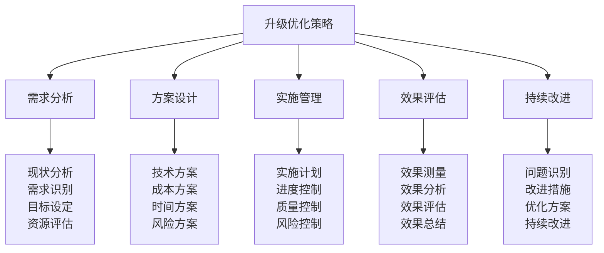
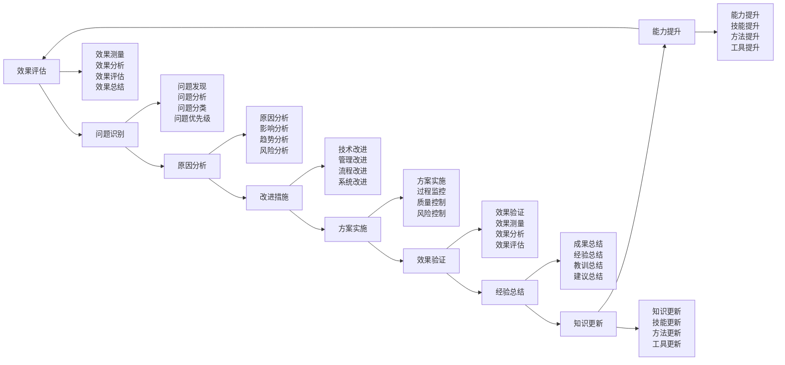

# 升级优化策略

## 🚀 升级优化核心框架

### 优化策略金字塔

## 📊 需求分析体系

### 现状分析技术
| 分析维度 | 分析内容 | 分析方法 | 分析标准 | 分析效果 |
|----------|----------|----------|----------|----------|
| **技术现状** | 技术水平、能力 | 技术评估 | 技术标准 | 技术清晰 |
| **性能现状** | 性能水平、表现 | 性能测试 | 性能标准 | 性能清晰 |
| **功能现状** | 功能完整性、可用性 | 功能测试 | 功能标准 | 功能清晰 |
| **成本现状** | 成本结构、效率 | 成本分析 | 成本标准 | 成本清晰 |

### 需求识别技术
| 需求类型 | 需求内容 | 识别方法 | 识别标准 | 识别效果 |
|----------|----------|----------|----------|----------|
| **功能需求** | 功能需求、要求 | 需求调研 | 需求明确 | 需求清晰 |
| **性能需求** | 性能需求、要求 | 需求分析 | 需求明确 | 需求清晰 |
| **技术需求** | 技术需求、要求 | 技术分析 | 需求明确 | 需求清晰 |
| **成本需求** | 成本需求、要求 | 成本分析 | 需求明确 | 需求清晰 |

### 目标设定技术
| 目标类型 | 目标内容 | 设定方法 | 设定标准 | 设定效果 |
|----------|----------|----------|----------|----------|
| **技术目标** | 技术提升目标 | SMART原则 | 目标明确 | 目标清晰 |
| **性能目标** | 性能提升目标 | SMART原则 | 目标明确 | 目标清晰 |
| **功能目标** | 功能增强目标 | SMART原则 | 目标明确 | 目标清晰 |
| **成本目标** | 成本控制目标 | SMART原则 | 目标明确 | 目标清晰 |

### 资源评估技术
| 资源类型 | 评估内容 | 评估方法 | 评估标准 | 评估效果 |
|----------|----------|----------|----------|----------|
| **人力资源** | 人员能力、数量 | 人员评估 | 资源充足 | 资源清晰 |
| **技术资源** | 技术能力、水平 | 技术评估 | 资源充足 | 资源清晰 |
| **资金资源** | 资金预算、来源 | 资金评估 | 资源充足 | 资源清晰 |
| **时间资源** | 时间安排、周期 | 时间评估 | 资源充足 | 资源清晰 |

## 🛠️ 方案设计体系

### 技术方案设计
| 方案类型 | 方案内容 | 设计方法 | 设计标准 | 设计效果 |
|----------|----------|----------|----------|----------|
| **硬件方案** | 硬件升级方案 | 硬件设计 | 技术先进 | 方案可行 |
| **软件方案** | 软件升级方案 | 软件设计 | 技术先进 | 方案可行 |
| **系统方案** | 系统升级方案 | 系统设计 | 技术先进 | 方案可行 |
| **集成方案** | 集成升级方案 | 集成设计 | 技术先进 | 方案可行 |

### 成本方案设计
| 成本类型 | 成本内容 | 设计方法 | 设计标准 | 设计效果 |
|----------|----------|----------|----------|----------|
| **投资成本** | 初始投资成本 | 成本预算 | 成本合理 | 成本可控 |
| **运营成本** | 运营维护成本 | 成本分析 | 成本合理 | 成本可控 |
| **维护成本** | 维护保养成本 | 成本分析 | 成本合理 | 成本可控 |
| **升级成本** | 后续升级成本 | 成本分析 | 成本合理 | 成本可控 |

### 时间方案设计
| 时间类型 | 时间内容 | 设计方法 | 设计标准 | 设计效果 |
|----------|----------|----------|----------|----------|
| **项目周期** | 项目总体周期 | 时间规划 | 时间合理 | 时间可控 |
| **阶段时间** | 各阶段时间 | 时间分解 | 时间合理 | 时间可控 |
| **关键路径** | 关键路径时间 | 路径分析 | 时间合理 | 时间可控 |
| **缓冲时间** | 缓冲时间安排 | 缓冲设计 | 时间合理 | 时间可控 |

### 风险方案设计
| 风险类型 | 风险内容 | 设计方法 | 设计标准 | 设计效果 |
|----------|----------|----------|----------|----------|
| **技术风险** | 技术实现风险 | 风险分析 | 风险可控 | 风险可控 |
| **成本风险** | 成本超支风险 | 风险分析 | 风险可控 | 风险可控 |
| **时间风险** | 时间延误风险 | 风险分析 | 风险可控 | 风险可控 |
| **质量风险** | 质量不达标风险 | 风险分析 | 风险可控 | 风险可控 |

## 📈 实施管理体系

### 实施计划管理
| 计划类型 | 计划内容 | 管理方法 | 管理标准 | 管理效果 |
|----------|----------|----------|----------|----------|
| **总体计划** | 项目总体计划 | 计划管理 | 计划完整 | 计划完整 |
| **阶段计划** | 各阶段计划 | 计划分解 | 计划详细 | 计划详细 |
| **任务计划** | 具体任务计划 | 任务分解 | 计划具体 | 计划具体 |
| **资源计划** | 资源配置计划 | 资源规划 | 计划合理 | 计划合理 |

### 进度控制技术
| 控制类型 | 控制内容 | 控制方法 | 控制标准 | 控制效果 |
|----------|----------|----------|----------|----------|
| **进度监控** | 进度实时监控 | 进度跟踪 | 进度正常 | 进度可控 |
| **进度调整** | 进度计划调整 | 进度调整 | 进度合理 | 进度可控 |
| **进度预警** | 进度风险预警 | 预警系统 | 预警及时 | 进度可控 |
| **进度优化** | 进度计划优化 | 进度优化 | 进度最优 | 进度可控 |

### 质量控制技术
| 控制类型 | 控制内容 | 控制方法 | 控制标准 | 控制效果 |
|----------|----------|----------|----------|----------|
| **质量监控** | 质量实时监控 | 质量检查 | 质量达标 | 质量可控 |
| **质量改进** | 质量持续改进 | 质量改进 | 质量提升 | 质量可控 |
| **质量验收** | 质量验收标准 | 质量验收 | 质量合格 | 质量可控 |
| **质量保证** | 质量保证体系 | 质量保证 | 质量可靠 | 质量可控 |

### 风险控制技术
| 控制类型 | 控制内容 | 控制方法 | 控制标准 | 控制效果 |
|----------|----------|----------|----------|----------|
| **风险识别** | 风险识别分析 | 风险分析 | 风险明确 | 风险可控 |
| **风险评估** | 风险评估等级 | 风险评估 | 风险等级 | 风险可控 |
| **风险应对** | 风险应对措施 | 风险应对 | 风险控制 | 风险可控 |
| **风险监控** | 风险实时监控 | 风险监控 | 风险可控 | 风险可控 |

## 📊 效果评估体系

### 效果测量技术
| 测量类型 | 测量内容 | 测量方法 | 测量标准 | 测量效果 |
|----------|----------|----------|----------|----------|
| **技术效果** | 技术提升效果 | 技术测试 | 效果明显 | 效果测量 |
| **性能效果** | 性能提升效果 | 性能测试 | 效果明显 | 效果测量 |
| **功能效果** | 功能增强效果 | 功能测试 | 效果明显 | 效果测量 |
| **成本效果** | 成本控制效果 | 成本分析 | 效果明显 | 效果测量 |

### 效果分析技术
| 分析类型 | 分析内容 | 分析方法 | 分析标准 | 分析效果 |
|----------|----------|----------|----------|----------|
| **对比分析** | 升级前后对比 | 对比分析 | 分析准确 | 分析准确 |
| **趋势分析** | 效果趋势分析 | 趋势分析 | 分析准确 | 分析准确 |
| **原因分析** | 效果原因分析 | 原因分析 | 分析准确 | 分析准确 |
| **影响分析** | 效果影响分析 | 影响分析 | 分析准确 | 分析准确 |

### 效果评估技术
| 评估类型 | 评估内容 | 评估方法 | 评估标准 | 评估效果 |
|----------|----------|----------|----------|----------|
| **定量评估** | 效果定量评估 | 定量分析 | 评估客观 | 评估客观 |
| **定性评估** | 效果定性评估 | 定性分析 | 评估客观 | 评估客观 |
| **综合评估** | 效果综合评估 | 综合分析 | 评估全面 | 评估全面 |
| **专业评估** | 效果专业评估 | 专业分析 | 评估专业 | 评估专业 |

### 效果总结技术
| 总结类型 | 总结内容 | 总结方法 | 总结标准 | 总结效果 |
|----------|----------|----------|----------|----------|
| **成果总结** | 升级成果总结 | 成果总结 | 总结完整 | 总结完整 |
| **经验总结** | 升级经验总结 | 经验总结 | 总结深入 | 总结深入 |
| **教训总结** | 升级教训总结 | 教训总结 | 总结深刻 | 总结深刻 |
| **建议总结** | 升级建议总结 | 建议总结 | 总结实用 | 总结实用 |

## 🔄 持续改进体系

### 问题识别技术
| 识别类型 | 识别内容 | 识别方法 | 识别标准 | 识别效果 |
|----------|----------|----------|----------|----------|
| **问题发现** | 问题及时发现 | 问题监测 | 问题明确 | 问题明确 |
| **问题分析** | 问题深入分析 | 问题分析 | 问题清晰 | 问题清晰 |
| **问题分类** | 问题分类整理 | 问题分类 | 分类合理 | 分类合理 |
| **问题优先级** | 问题优先级排序 | 优先级分析 | 优先级合理 | 优先级合理 |

### 改进措施技术
| 措施类型 | 措施内容 | 措施方法 | 措施标准 | 措施效果 |
|----------|----------|----------|----------|----------|
| **技术改进** | 技术改进措施 | 技术改进 | 措施有效 | 措施有效 |
| **管理改进** | 管理改进措施 | 管理改进 | 措施有效 | 措施有效 |
| **流程改进** | 流程改进措施 | 流程改进 | 措施有效 | 措施有效 |
| **系统改进** | 系统改进措施 | 系统改进 | 措施有效 | 措施有效 |

### 优化方案技术
| 方案类型 | 方案内容 | 方案方法 | 方案标准 | 方案效果 |
|----------|----------|----------|----------|----------|
| **技术优化** | 技术优化方案 | 技术优化 | 方案先进 | 方案先进 |
| **性能优化** | 性能优化方案 | 性能优化 | 方案先进 | 方案先进 |
| **成本优化** | 成本优化方案 | 成本优化 | 方案先进 | 方案先进 |
| **效率优化** | 效率优化方案 | 效率优化 | 方案先进 | 方案先进 |

### 持续改进机制

## 🎓 费曼学习法应用

### 第一步：选择概念
选择"升级优化策略"作为学习概念

### 第二步：教授他人
用简单语言解释：
> "升级优化策略就是让装备变得更好的方法，包括需求分析、方案设计、实施管理、效果评估、持续改进。关键是分析现状，设计方案，实施管理，评估效果，持续改进。"

### 第三步：回顾简化
- **需求分析**：现状分析、需求识别、目标设定、资源评估
- **方案设计**：技术方案、成本方案、时间方案、风险方案
- **实施管理**：实施计划、进度控制、质量控制、风险控制
- **效果评估**：效果测量、效果分析、效果评估、效果总结
- **持续改进**：问题识别、改进措施、优化方案、持续改进

### 第四步：组织优化
建立升级优化与技能的关系：
- 需求分析 → [[05-实践与评估/01-技能评估体系/01-自我评估清单|自我评估]]
- 方案设计 → [[04-创新层-进阶发展/02-专业配置/02-定制化配置|定制化配置]]
- 实施管理 → [[04-创新层-进阶发展/02-专业配置/03-技术装备集成|技术集成]]
- 效果评估 → [[05-实践与评估/01-技能评估体系|技能评估]]
- 持续改进 → [[05-实践与评估/03-持续改进|持续改进]]

## 🏃‍♂️ 刻意练习要点

### 升级优化练习
1. **分析练习**：练习需求分析技能
2. **设计练习**：练习方案设计技能
3. **管理练习**：练习实施管理技能
4. **评估练习**：练习效果评估技能

### 练习方法
- **理论学习**：学习升级优化理论
- **案例分析**：分析升级优化案例
- **方案设计**：设计升级优化方案
- **实践管理**：管理升级优化实施

### 实践验证
- **方案验证**：验证方案设计合理性
- **实施验证**：验证实施管理有效性
- **效果验证**：验证效果评估准确性
- **改进验证**：验证持续改进有效性

## 📋 升级优化检查清单

### 需求分析检查
- [ ] 现状分析是否准确
- [ ] 需求识别是否明确
- [ ] 目标设定是否合理
- [ ] 资源评估是否充分

### 方案设计检查
- [ ] 技术方案是否先进
- [ ] 成本方案是否合理
- [ ] 时间方案是否可行
- [ ] 风险方案是否可控

### 实施管理检查
- [ ] 实施计划是否完整
- [ ] 进度控制是否有效
- [ ] 质量控制是否到位
- [ ] 风险控制是否充分

### 效果评估检查
- [ ] 效果测量是否准确
- [ ] 效果分析是否深入
- [ ] 效果评估是否客观
- [ ] 效果总结是否完整

### 持续改进检查
- [ ] 问题识别是否及时
- [ ] 改进措施是否有效
- [ ] 优化方案是否先进
- [ ] 持续改进是否有效

## 🎯 升级优化策略

### 优化策略
1. **需求导向**：以需求为导向进行优化
2. **技术先进**：采用先进技术进行优化
3. **成本控制**：控制成本进行优化
4. **持续改进**：持续改进进行优化

### 管理策略
- **计划管理**：科学制定升级计划
- **过程管理**：严格控制升级过程
- **质量管理**：严格控制升级质量
- **效果管理**：客观评估升级效果

## 🔗 相关链接
- [[01-专业配置概述|专业配置概述]]
- [[02-定制化配置|定制化配置]]
- [[03-技术装备集成|技术装备集成]]
- [[04-维护保养体系|维护保养体系]]
- [[05-实践与评估/01-技能评估体系/01-自我评估清单|自我评估清单]]
- [[05-实践与评估/03-持续改进/01-学习反思模板|学习反思模板]]