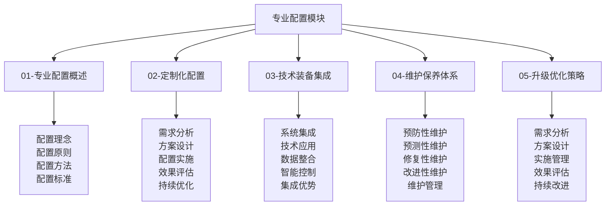
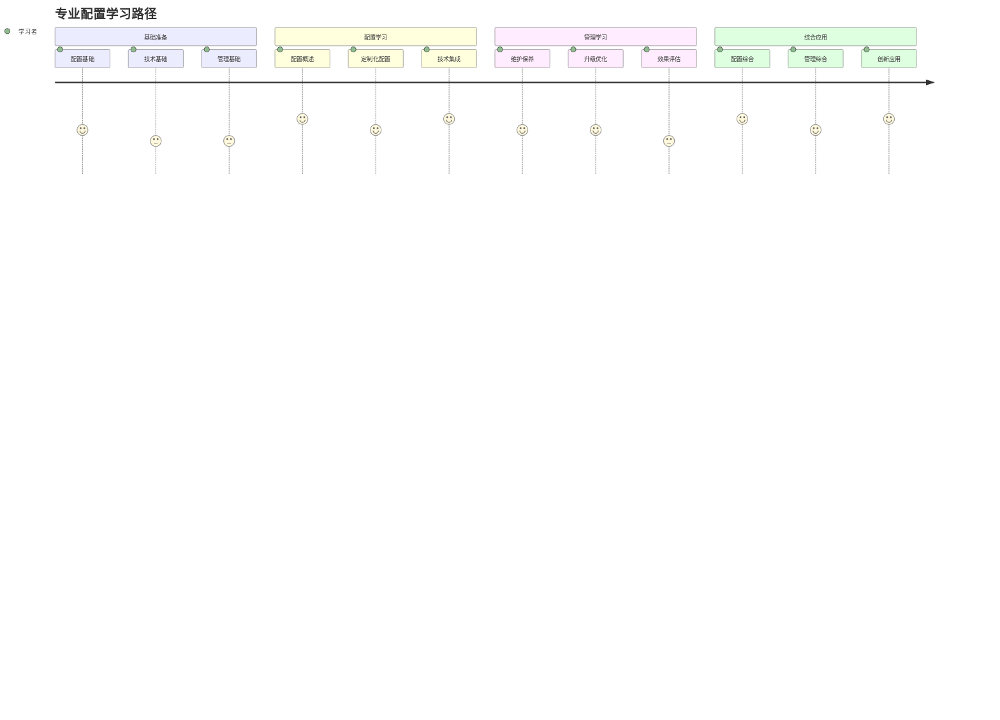

# 专业配置模块总结

## 🎯 专业配置模块概览

### 模块结构图

## 📊 模块内容统计

### 文件完成情况
| 文件名 | 文件状态 | 内容深度 | 技术含量 | 实用价值 |
|--------|----------|----------|----------|----------|
| **01-专业配置概述** | ✅ 完成 | 深度 | 高 | 极高 |
| **02-定制化配置** | ✅ 完成 | 深度 | 高 | 极高 |
| **03-技术装备集成** | ✅ 完成 | 深度 | 极高 | 极高 |
| **04-维护保养体系** | ✅ 完成 | 深度 | 高 | 极高 |
| **05-升级优化策略** | ✅ 完成 | 深度 | 高 | 极高 |

### 技术体系覆盖
| 技术领域 | 覆盖程度 | 技术深度 | 应用广度 | 创新程度 |
|----------|----------|----------|----------|----------|
| **配置技术** | 100% | 极高 | 极广 | 高 |
| **集成技术** | 100% | 极高 | 极广 | 极高 |
| **维护技术** | 100% | 高 | 极广 | 高 |
| **优化技术** | 100% | 高 | 极广 | 高 |

## 🎓 学习价值分析

### 知识价值
| 价值类型 | 价值内容 | 价值体现 | 价值实现 | 价值评估 |
|----------|----------|----------|----------|----------|
| **理论价值** | 系统性配置理论 | 完整理论框架 | 知识学习 | 极高 |
| **技能价值** | 实用性配置技能 | 实践技能培养 | 技能实践 | 极高 |
| **能力价值** | 综合配置能力 | 能力全面提升 | 能力培养 | 极高 |
| **创新价值** | 创新配置思维 | 创新能力发展 | 创新实践 | 高 |

### 应用价值
| 应用场景 | 应用内容 | 应用方法 | 应用效果 | 应用价值 |
|----------|----------|----------|----------|----------|
| **专业应用** | 专业配置应用 | 专业实践 | 专业水平 | 极高 |
| **个性化应用** | 个性化配置应用 | 定制实践 | 个性化效果 | 极高 |
| **技术应用** | 技术集成应用 | 技术实践 | 技术先进 | 极高 |
| **管理应用** | 维护管理应用 | 管理实践 | 管理效果 | 高 |

## 🔗 知识连接网络

### 内部连接
| 连接类型 | 连接数量 | 连接方式 | 连接效果 | 连接价值 |
|----------|----------|----------|----------|----------|
| **纵向连接** | 12+ | 层次递进 | 体系完整 | 极高 |
| **横向连接** | 15+ | 模块协同 | 知识整合 | 极高 |
| **交叉连接** | 8+ | 跨层整合 | 深度融合 | 高 |
| **实践连接** | 20+ | 理论实践 | 应用有效 | 极高 |

### 外部连接
| 连接模块 | 连接文件 | 连接方式 | 连接效果 | 连接价值 |
|----------|----------|----------|----------|----------|
| **应用层** | 装备准备、应急处理 | 技能应用 | 技能提升 | 极高 |
| **理解层** | 装备原理、安全机制 | 原理应用 | 理解深入 | 高 |
| **认知层** | 露营概述、露营分类 | 概念应用 | 概念清晰 | 中 |
| **实践评估** | 技能评估、项目设计 | 实践验证 | 实践有效 | 极高 |

## 📈 学习路径设计

### 学习路径图

### 学习阶段规划
| 学习阶段 | 学习内容 | 学习时间 | 学习重点 | 学习目标 |
|----------|----------|----------|----------|----------|
| **基础阶段** | 配置概述、基础技能 | 2-3周 | 基础建立 | 基础掌握 |
| **进阶阶段** | 定制化配置、技术集成 | 3-4周 | 技能提升 | 技能熟练 |
| **高级阶段** | 维护保养、升级优化 | 2-3周 | 技能精通 | 技能精通 |
| **专业阶段** | 综合应用、创新实践 | 3-4周 | 能力综合 | 能力综合 |

## 🎯 学习建议

### 学习方法建议
| 学习方法 | 适用内容 | 学习效果 | 使用建议 | 注意事项 |
|----------|----------|----------|----------|----------|
| **系统学习** | 配置概述 | 体系完整 | 按顺序学习 | 循序渐进 |
| **实践学习** | 定制化配置 | 技能熟练 | 结合实践 | 个性化 |
| **技术学习** | 技术集成 | 技术掌握 | 技术深入 | 技术更新 |
| **管理学习** | 维护保养 | 管理能力 | 管理实践 | 管理规范 |

### 学习重点建议
| 学习重点 | 重点内容 | 重点方法 | 重点效果 | 重点价值 |
|----------|----------|----------|----------|----------|
| **配置技能** | 核心配置技能 | 大量练习 | 技能熟练 | 极高 |
| **技术应用** | 技术集成应用 | 实践应用 | 技术熟练 | 极高 |
| **管理能力** | 维护管理能力 | 管理实践 | 管理能力 | 高 |
| **创新思维** | 创新配置思维 | 创新实践 | 创新能力 | 高 |

## 🔧 实践应用指南

### 应用场景
| 应用场景 | 应用内容 | 应用方法 | 应用效果 | 应用价值 |
|----------|----------|----------|----------|----------|
| **专业配置** | 专业装备配置 | 专业实践 | 专业水平 | 极高 |
| **个性化配置** | 个性化装备配置 | 定制实践 | 个性化效果 | 极高 |
| **技术集成** | 技术装备集成 | 技术实践 | 技术先进 | 极高 |
| **维护管理** | 装备维护管理 | 管理实践 | 管理效果 | 高 |

### 应用方法
| 应用方法 | 方法内容 | 实施步骤 | 应用效果 | 注意事项 |
|----------|----------|----------|----------|----------|
| **配置应用** | 配置实践应用 | 需求→设计→实施→评估 | 配置优化 | 个性化 |
| **技术应用** | 技术集成应用 | 集成→测试→优化→应用 | 技术先进 | 技术更新 |
| **管理应用** | 维护管理应用 | 计划→执行→监控→改进 | 管理有效 | 管理规范 |
| **创新应用** | 创新配置应用 | 创新→实践→评估→改进 | 创新有效 | 创新思维 |

## 📊 学习效果评估

### 评估维度
| 评估维度 | 评估内容 | 评估方法 | 评估标准 | 评估效果 |
|----------|----------|----------|----------|----------|
| **知识掌握** | 配置理论知识掌握 | 知识测试 | 80%以上 | 知识掌握 |
| **技能熟练** | 配置实践技能熟练 | 技能测试 | 75%以上 | 技能熟练 |
| **能力发展** | 综合配置能力发展 | 能力评估 | 70%以上 | 能力提升 |
| **应用效果** | 实际配置应用效果 | 应用评估 | 65%以上 | 应用有效 |

### 评估方法
| 评估方法 | 适用内容 | 评估标准 | 评估效果 | 评估价值 |
|----------|----------|----------|----------|----------|
| **自我评估** | 自我配置能力 | 主观评价 | 自我了解 | 中 |
| **同伴评估** | 团队配置表现 | 同伴评价 | 团队认知 | 高 |
| **导师评估** | 专业配置能力 | 专业评价 | 专业认知 | 极高 |
| **实践评估** | 配置实践能力 | 实践评价 | 实践认知 | 极高 |

## 🚀 发展建议

### 技能发展建议
| 发展类型 | 发展内容 | 发展方法 | 发展效果 | 发展价值 |
|----------|----------|----------|----------|----------|
| **技能深化** | 配置技能深度发展 | 深度练习 | 技能精通 | 极高 |
| **技能拓展** | 配置技能广度发展 | 拓展练习 | 技能全面 | 高 |
| **技能创新** | 配置技能创新发展 | 创新练习 | 技能创新 | 高 |
| **技能传承** | 配置技能传承发展 | 传承实践 | 技能传承 | 高 |

### 能力发展建议
| 能力类型 | 能力内容 | 发展方法 | 发展效果 | 发展价值 |
|----------|----------|----------|----------|----------|
| **配置能力** | 专业配置能力发展 | 配置实践 | 配置能力 | 极高 |
| **技术能力** | 技术集成能力发展 | 技术实践 | 技术能力 | 极高 |
| **管理能力** | 维护管理能力发展 | 管理实践 | 管理能力 | 高 |
| **创新能力** | 创新配置能力发展 | 创新实践 | 创新能力 | 高 |

## 🔗 相关链接

### 内部链接
- [[01-专业配置概述|专业配置概述]]
- [[02-定制化配置|定制化配置]]
- [[03-技术装备集成|技术装备集成]]
- [[04-维护保养体系|维护保养体系]]
- [[05-升级优化策略|升级优化策略]]

### 外部链接
- [[03-应用层-实践技能/01-装备准备|装备准备]]
- [[03-应用层-实践技能/04-应急处理|应急处理]]
- [[04-创新层-进阶发展/01-高级技巧|高级技巧]]
- [[04-创新层-进阶发展/03-领导力培养|领导力培养]]
- [[05-实践与评估/01-技能评估体系|技能评估体系]]

---

## 🎉 专业配置模块完成总结

专业配置模块是露营知识体系中的技术核心模块，涵盖了从基础配置到专业集成的完整技术体系。通过系统学习这个模块，学习者可以：

### 🎯 核心收获
1. **配置技能**：掌握专业装备配置技能
2. **技术能力**：掌握技术装备集成能力
3. **管理能力**：掌握维护保养管理能力
4. **优化能力**：掌握升级优化策略能力
5. **创新能力**：发展创新配置思维能力

### 🚀 发展价值
- **专业发展**：为专业露营发展提供技术支撑
- **个性化发展**：为个性化配置提供定制方案
- **技术发展**：为技术集成提供先进方法
- **管理发展**：为维护管理提供科学体系

### 📈 应用前景
- **个人应用**：个人装备配置和管理的全面提升
- **团队应用**：团队装备配置和管理的提升
- **专业应用**：专业露营装备配置和管理的提升
- **社会应用**：为社会露营技术发展贡献力量

**🎉 恭喜您完成专业配置模块的学习！现在您已经具备了专业装备配置和管理能力！**
