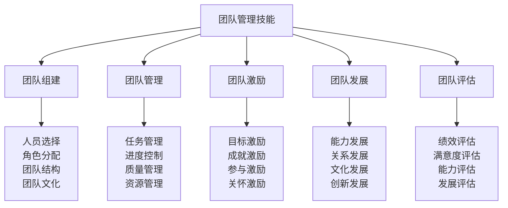

# 团队管理技能

## 👥 团队管理核心框架

### 团队管理金字塔

## 🏗️ 团队组建体系

### 人员选择技术
| 选择维度 | 选择内容 | 选择方法 | 选择标准 | 选择效果 |
|----------|----------|----------|----------|----------|
| **技能匹配** | 技能水平、专业能力 | 技能测试 | 技能达标 | 技能匹配 |
| **性格匹配** | 性格特点、团队适配 | 性格测试 | 性格合适 | 性格匹配 |
| **经验匹配** | 工作经验、项目经验 | 经验评估 | 经验丰富 | 经验匹配 |
| **价值观匹配** | 价值观念、团队文化 | 价值观评估 | 价值观一致 | 价值观匹配 |

### 角色分配技术
| 角色类型 | 角色内容 | 分配方法 | 分配标准 | 分配效果 |
|----------|----------|----------|----------|----------|
| **领导角色** | 团队领导、决策者 | 能力评估 | 领导能力强 | 领导有效 |
| **执行角色** | 任务执行、操作者 | 技能评估 | 执行能力强 | 执行有效 |
| **协调角色** | 团队协调、沟通者 | 沟通评估 | 协调能力强 | 协调有效 |
| **支持角色** | 团队支持、辅助者 | 支持评估 | 支持能力强 | 支持有效 |

### 团队结构设计
| 结构类型 | 结构内容 | 设计方法 | 设计标准 | 设计效果 |
|----------|----------|----------|----------|----------|
| **层级结构** | 管理层级、指挥链 | 层级设计 | 层级清晰 | 管理有效 |
| **功能结构** | 功能分工、专业化 | 功能设计 | 功能明确 | 功能有效 |
| **矩阵结构** | 项目矩阵、交叉管理 | 矩阵设计 | 矩阵合理 | 矩阵有效 |
| **网络结构** | 网络协作、扁平化 | 网络设计 | 网络高效 | 网络有效 |

### 团队文化建设
| 文化要素 | 文化内容 | 建设方法 | 建设标准 | 建设效果 |
|----------|----------|----------|----------|----------|
| **价值观** | 共同价值观 | 价值观讨论 | 价值观一致 | 价值观认同 |
| **行为规范** | 行为准则 | 规范制定 | 规范明确 | 行为统一 |
| **团队精神** | 团队意识 | 精神培养 | 精神凝聚 | 精神统一 |
| **团队传统** | 团队习惯 | 传统建立 | 传统传承 | 传统延续 |

## 📊 团队管理体系

### 任务管理技术
| 管理要素 | 管理内容 | 管理方法 | 管理标准 | 管理效果 |
|----------|----------|----------|----------|----------|
| **任务分解** | 任务结构、层次 | WBS方法 | 任务清晰 | 任务明确 |
| **任务分配** | 任务分配、责任 | 分配原则 | 分配合理 | 分配有效 |
| **任务协调** | 任务协调、同步 | 协调机制 | 协调有效 | 协调成功 |
| **任务监控** | 任务监控、跟踪 | 监控系统 | 监控及时 | 监控有效 |

### 进度控制技术
| 控制要素 | 控制内容 | 控制方法 | 控制标准 | 控制效果 |
|----------|----------|----------|----------|----------|
| **进度计划** | 进度安排、时间 | 计划制定 | 计划合理 | 计划可行 |
| **进度监控** | 进度跟踪、监控 | 监控系统 | 监控及时 | 监控有效 |
| **进度调整** | 进度调整、优化 | 调整机制 | 调整及时 | 调整有效 |
| **进度预警** | 进度预警、风险 | 预警系统 | 预警及时 | 预警有效 |

### 质量管理技术
| 质量要素 | 质量内容 | 管理方法 | 管理标准 | 管理效果 |
|----------|----------|----------|----------|----------|
| **质量标准** | 质量标准、要求 | 标准制定 | 标准明确 | 标准统一 |
| **质量控制** | 质量控制、检查 | 控制机制 | 控制有效 | 质量保证 |
| **质量改进** | 质量改进、提升 | 改进机制 | 改进持续 | 质量提升 |
| **质量评估** | 质量评估、评价 | 评估体系 | 评估客观 | 评估准确 |

### 资源管理技术
| 资源类型 | 管理内容 | 管理方法 | 管理标准 | 管理效果 |
|----------|----------|----------|----------|----------|
| **人力资源** | 人员配置、调度 | 人员管理 | 配置合理 | 人员有效 |
| **物质资源** | 物资配置、使用 | 物资管理 | 配置合理 | 物资有效 |
| **信息资源** | 信息共享、传递 | 信息管理 | 信息及时 | 信息有效 |
| **时间资源** | 时间安排、利用 | 时间管理 | 安排合理 | 时间有效 |

## 🎯 团队激励体系

### 目标激励技术
| 激励要素 | 激励内容 | 激励方法 | 激励标准 | 激励效果 |
|----------|----------|----------|----------|----------|
| **目标设定** | 目标设定、挑战 | SMART原则 | 目标明确 | 目标激励 |
| **目标分解** | 目标分解、细化 | 分解方法 | 分解合理 | 目标清晰 |
| **目标跟踪** | 目标跟踪、监控 | 跟踪系统 | 跟踪及时 | 目标可控 |
| **目标达成** | 目标达成、奖励 | 奖励机制 | 奖励公平 | 目标激励 |

### 成就激励技术
| 激励要素 | 激励内容 | 激励方法 | 激励标准 | 激励效果 |
|----------|----------|----------|----------|----------|
| **成就认可** | 成就认可、表扬 | 认可机制 | 认可及时 | 成就激励 |
| **成就分享** | 成就分享、庆祝 | 分享机制 | 分享及时 | 成就激励 |
| **成就记录** | 成就记录、档案 | 记录系统 | 记录完整 | 成就激励 |
| **成就传承** | 成就传承、学习 | 传承机制 | 传承有效 | 成就激励 |

### 参与激励技术
| 激励要素 | 激励内容 | 激励方法 | 激励标准 | 激励效果 |
|----------|----------|----------|----------|----------|
| **决策参与** | 决策参与、意见 | 参与机制 | 参与充分 | 参与激励 |
| **管理参与** | 管理参与、责任 | 参与机制 | 参与有效 | 参与激励 |
| **创新参与** | 创新参与、建议 | 参与机制 | 参与鼓励 | 参与激励 |
| **学习参与** | 学习参与、培训 | 参与机制 | 参与积极 | 参与激励 |

### 关怀激励技术
| 激励要素 | 激励内容 | 激励方法 | 激励标准 | 激励效果 |
|----------|----------|----------|----------|----------|
| **工作关怀** | 工作环境、条件 | 关怀机制 | 关怀到位 | 关怀激励 |
| **生活关怀** | 生活帮助、支持 | 关怀机制 | 关怀及时 | 关怀激励 |
| **成长关怀** | 成长机会、发展 | 关怀机制 | 关怀持续 | 关怀激励 |
| **情感关怀** | 情感支持、理解 | 关怀机制 | 关怀真诚 | 关怀激励 |

## 🚀 团队发展体系

### 能力发展技术
| 发展要素 | 发展内容 | 发展方法 | 发展标准 | 发展效果 |
|----------|----------|----------|----------|----------|
| **技能发展** | 技能提升、学习 | 培训学习 | 技能提升 | 能力增强 |
| **知识发展** | 知识更新、学习 | 知识学习 | 知识更新 | 知识丰富 |
| **经验发展** | 经验积累、总结 | 经验总结 | 经验丰富 | 经验提升 |
| **创新发展** | 创新能力、思维 | 创新训练 | 创新活跃 | 创新能力 |

### 关系发展技术
| 发展要素 | 发展内容 | 发展方法 | 发展标准 | 发展效果 |
|----------|----------|----------|----------|----------|
| **沟通关系** | 沟通改善、加强 | 沟通训练 | 沟通有效 | 关系改善 |
| **协作关系** | 协作加强、配合 | 协作训练 | 协作有效 | 关系融洽 |
| **信任关系** | 信任建立、加强 | 信任建设 | 信任深厚 | 关系稳定 |
| **支持关系** | 支持加强、互助 | 支持机制 | 支持有效 | 关系和谐 |

### 文化发展技术
| 发展要素 | 发展内容 | 发展方法 | 发展标准 | 发展效果 |
|----------|----------|----------|----------|----------|
| **文化深化** | 文化深化、内化 | 文化建设 | 文化深入 | 文化认同 |
| **文化创新** | 文化创新、发展 | 文化创新 | 文化先进 | 文化引领 |
| **文化传承** | 文化传承、延续 | 文化传承 | 文化传承 | 文化延续 |
| **文化影响** | 文化影响、传播 | 文化传播 | 文化影响 | 文化影响 |

### 创新发展技术
| 发展要素 | 发展内容 | 发展方法 | 发展标准 | 发展效果 |
|----------|----------|----------|----------|----------|
| **思维创新** | 创新思维、突破 | 思维训练 | 思维活跃 | 创新思维 |
| **方法创新** | 创新方法、技术 | 方法创新 | 方法先进 | 创新方法 |
| **管理创新** | 管理创新、模式 | 管理创新 | 管理先进 | 创新管理 |
| **文化创新** | 文化创新、理念 | 文化创新 | 文化先进 | 创新文化 |

## 📈 团队评估体系

### 绩效评估技术
| 评估要素 | 评估内容 | 评估方法 | 评估标准 | 评估效果 |
|----------|----------|----------|----------|----------|
| **目标达成** | 目标完成情况 | 目标对比 | 目标达成 | 绩效评估 |
| **质量评估** | 工作质量评估 | 质量检查 | 质量达标 | 质量评估 |
| **效率评估** | 工作效率评估 | 效率测量 | 效率提升 | 效率评估 |
| **创新评估** | 创新能力评估 | 创新评价 | 创新活跃 | 创新评估 |

### 满意度评估技术
| 评估要素 | 评估内容 | 评估方法 | 评估标准 | 评估效果 |
|----------|----------|----------|----------|----------|
| **工作满意度** | 工作满意度评估 | 满意度调查 | 满意度高 | 满意度评估 |
| **团队满意度** | 团队满意度评估 | 满意度调查 | 满意度高 | 满意度评估 |
| **领导满意度** | 领导满意度评估 | 满意度调查 | 满意度高 | 满意度评估 |
| **发展满意度** | 发展满意度评估 | 满意度调查 | 满意度高 | 满意度评估 |

### 能力评估技术
| 评估要素 | 评估内容 | 评估方法 | 评估标准 | 评估效果 |
|----------|----------|----------|----------|----------|
| **技能评估** | 技能水平评估 | 技能测试 | 技能提升 | 能力评估 |
| **知识评估** | 知识水平评估 | 知识测试 | 知识丰富 | 能力评估 |
| **经验评估** | 经验水平评估 | 经验评价 | 经验丰富 | 能力评估 |
| **创新评估** | 创新能力评估 | 创新评价 | 创新活跃 | 能力评估 |

### 发展评估技术
| 评估要素 | 评估内容 | 评估方法 | 评估标准 | 评估效果 |
|----------|----------|----------|----------|----------|
| **成长评估** | 个人成长评估 | 成长分析 | 成长明显 | 发展评估 |
| **进步评估** | 团队进步评估 | 进步分析 | 进步明显 | 发展评估 |
| **发展评估** | 团队发展评估 | 发展分析 | 发展持续 | 发展评估 |
| **未来评估** | 未来发展评估 | 未来分析 | 未来可期 | 发展评估 |

## 🎓 费曼学习法应用

### 第一步：选择概念
选择"团队管理技能"作为学习概念

### 第二步：教授他人
用简单语言解释：
> "团队管理技能就是管理团队的能力，包括团队组建、团队管理、团队激励、团队发展、团队评估。关键是选择合适的成员，合理分配任务，有效激励团队，持续发展团队。"

### 第三步：回顾简化
- **团队组建**：人员选择、角色分配、团队结构、团队文化
- **团队管理**：任务管理、进度控制、质量管理、资源管理
- **团队激励**：目标激励、成就激励、参与激励、关怀激励
- **团队发展**：能力发展、关系发展、文化发展、创新发展
- **团队评估**：绩效评估、满意度评估、能力评估、发展评估

### 第四步：组织优化
建立团队管理与技能的关系：
- 团队组建 → [[04-创新层-进阶发展/03-领导力培养/01-领导力概述|领导力概述]]
- 团队管理 → [[04-创新层-进阶发展/01-高级技巧/05-团队协作技巧|团队协作]]
- 团队激励 → [[04-创新层-进阶发展/03-领导力培养/02-决策制定能力|决策制定]]
- 团队发展 → [[04-创新层-进阶发展/03-领导力培养/06-责任与担当|责任担当]]
- 团队评估 → [[05-实践与评估/01-技能评估体系|技能评估]]

## 🏃‍♂️ 刻意练习要点

### 团队管理练习
1. **组建练习**：练习团队组建技能
2. **管理练习**：练习团队管理技能
3. **激励练习**：练习团队激励技能
4. **发展练习**：练习团队发展技能

### 练习方法
- **理论学习**：学习团队管理理论
- **案例分析**：分析团队管理案例
- **实践管理**：实际管理团队
- **反思总结**：反思团队管理经验

### 实践验证
- **管理测试**：测试团队管理能力
- **效果验证**：验证团队管理效果
- **满意度调查**：调查团队满意度
- **持续改进**：持续改进团队管理

## 📋 团队管理检查清单

### 团队组建检查
- [ ] 人员选择是否合适
- [ ] 角色分配是否合理
- [ ] 团队结构是否优化
- [ ] 团队文化是否建立

### 团队管理检查
- [ ] 任务管理是否有效
- [ ] 进度控制是否到位
- [ ] 质量管理是否严格
- [ ] 资源管理是否合理

### 团队激励检查
- [ ] 目标激励是否有效
- [ ] 成就激励是否及时
- [ ] 参与激励是否充分
- [ ] 关怀激励是否到位

### 团队发展检查
- [ ] 能力发展是否持续
- [ ] 关系发展是否和谐
- [ ] 文化发展是否深入
- [ ] 创新发展是否活跃

### 团队评估检查
- [ ] 绩效评估是否客观
- [ ] 满意度评估是否真实
- [ ] 能力评估是否准确
- [ ] 发展评估是否全面

## 🎯 团队管理策略

### 管理策略
1. **以人为本**：以人为中心进行管理
2. **目标导向**：以目标为导向进行管理
3. **过程控制**：严格控制管理过程
4. **持续改进**：持续改进管理方法

### 发展策略
- **能力发展**：持续发展团队能力
- **关系发展**：持续发展团队关系
- **文化发展**：持续发展团队文化
- **创新发展**：持续发展团队创新

## 🔗 相关链接
- [[01-领导力概述|领导力概述]]
- [[02-决策制定能力|决策制定能力]]
- [[03-危机处理领导|危机处理领导]]
- [[04-沟通协调技巧|沟通协调技巧]]
- [[04-创新层-进阶发展/01-高级技巧/05-团队协作技巧|团队协作技巧]]
- [[05-实践与评估/01-技能评估体系|技能评估体系]]