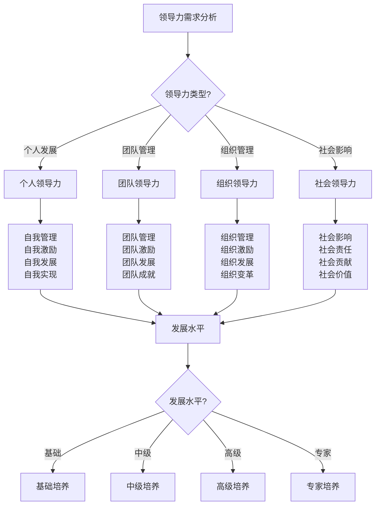

# 领导力培养

## 👑 领导力概述

### 1. 领导力层次
- **个人领导力**：自我管理、自我激励、自我发展、自我实现
- **团队领导力**：团队管理、团队激励、团队发展、团队成就
- **组织领导力**：组织管理、组织激励、组织发展、组织变革
- **社会领导力**：社会影响、社会责任、社会贡献、社会价值
- **文化领导力**：文化传承、文化创新、文化影响、文化价值
- **创新领导力**：创新思维、创新实践、创新影响、创新发展

### 2. 领导力要素
- **愿景能力**：愿景制定、愿景传达、愿景实现、愿景发展
- **决策能力**：决策制定、决策执行、决策评估、决策改进
- **沟通能力**：沟通技巧、沟通效果、沟通影响、沟通创新
- **激励能力**：激励方法、激励效果、激励创新、激励发展
- **协调能力**：协调技巧、协调效果、协调创新、协调发展
- **创新能力**：创新思维、创新实践、创新影响、创新发展

### 3. 领导力类型
- **变革型领导**：变革思维、变革实践、变革影响、变革发展
- **服务型领导**：服务理念、服务实践、服务影响、服务发展
- **魅力型领导**：魅力特质、魅力影响、魅力发展、魅力传承
- **交易型领导**：交易思维、交易实践、交易影响、交易发展
- **情境型领导**：情境适应、情境应对、情境创新、情境发展
- **分布式领导**：分布思维、分布实践、分布影响、分布发展

### 4. 领导力发展
- **学习发展**：学习能力、学习方法、学习效果、学习创新
- **实践发展**：实践能力、实践方法、实践效果、实践创新
- **反思发展**：反思能力、反思方法、反思效果、反思创新
- **创新发展**：创新能力、创新方法、创新效果、创新发展
- **传承发展**：传承能力、传承方法、传承效果、传承创新
- **持续发展**：持续能力、持续方法、持续效果、持续创新

## 👥 团队管理技能

### 1. 团队建设
- **团队组建**：团队组建、人员选择、角色分配、目标设定
- **团队文化**：团队文化、价值观念、行为规范、团队精神
- **团队发展**：团队发展、能力提升、技能发展、成长进步
- **团队激励**：团队激励、动机激发、目标激励、成就激励
- **团队协调**：团队协调、沟通协调、工作协调、关系协调
- **团队创新**：团队创新、创新氛围、创新实践、创新发展

### 2. 团队管理
- **目标管理**：目标设定、目标分解、目标执行、目标评估
- **任务管理**：任务分配、任务执行、任务监控、任务评估
- **资源管理**：资源分配、资源使用、资源优化、资源管理
- **时间管理**：时间规划、时间控制、时间优化、时间管理
- **质量管理**：质量标准、质量控制、质量改进、质量管理
- **风险管理**：风险识别、风险评估、风险控制、风险管理

### 3. 团队沟通
- **沟通技巧**：沟通技巧、沟通方法、沟通效果、沟通创新
- **信息传递**：信息传递、信息共享、信息确认、信息反馈
- **冲突处理**：冲突识别、冲突分析、冲突解决、冲突预防
- **反馈机制**：反馈收集、反馈分析、反馈处理、反馈改进
- **团队会议**：会议组织、会议管理、会议效果、会议创新
- **团队协作**：协作机制、协作方法、协作效果、协作创新

### 4. 团队发展
- **能力发展**：能力评估、能力提升、能力发展、能力创新
- **技能发展**：技能评估、技能提升、技能发展、技能创新
- **知识发展**：知识更新、知识分享、知识创新、知识管理
- **经验发展**：经验积累、经验分享、经验创新、经验传承
- **创新发展**：创新思维、创新实践、创新文化、创新发展
- **持续发展**：持续学习、持续改进、持续创新、持续发展

## ⏰ 时间管理技能

### 1. 时间规划
- **目标设定**：目标设定、目标分解、目标优先级、目标时间
- **计划制定**：计划制定、计划分解、计划执行、计划调整
- **时间分配**：时间分配、时间优先级、时间平衡、时间优化
- **任务安排**：任务安排、任务优先级、任务时间、任务协调
- **资源规划**：资源规划、资源分配、资源使用、资源优化
- **风险管理**：风险识别、风险预防、风险应对、风险控制

### 2. 时间控制
- **时间监控**：时间监控、进度监控、效率监控、质量监控
- **时间调整**：时间调整、计划调整、优先级调整、资源调整
- **时间优化**：时间优化、效率优化、流程优化、方法优化
- **时间平衡**：时间平衡、工作平衡、生活平衡、发展平衡
- **时间保护**：时间保护、专注保护、效率保护、质量保护
- **时间创新**：时间创新、方法创新、工具创新、管理创新

### 3. 效率提升
- **效率分析**：效率分析、效率评估、效率改进、效率创新
- **方法优化**：方法优化、流程优化、工具优化、技术优化
- **技能提升**：技能提升、能力提升、知识提升、经验提升
- **工具使用**：工具使用、技术使用、系统使用、平台使用
- **习惯培养**：习惯培养、行为培养、思维培养、文化培养
- **持续改进**：持续改进、持续优化、持续创新、持续发展

### 4. 时间文化
- **时间观念**：时间观念、时间价值、时间意识、时间文化
- **时间管理**：时间管理、时间规划、时间控制、时间优化
- **时间教育**：时间教育、时间培训、时间学习、时间发展
- **时间创新**：时间创新、管理创新、方法创新、文化创新
- **时间传承**：时间传承、经验传承、文化传承、价值传承
- **时间发展**：时间发展、管理发展、文化发展、创新发展

## 💬 沟通协调技巧

### 1. 沟通基础
- **沟通原理**：沟通原理、沟通要素、沟通过程、沟通效果
- **沟通技巧**：沟通技巧、沟通方法、沟通策略、沟通创新
- **沟通障碍**：沟通障碍、障碍识别、障碍分析、障碍解决
- **沟通改善**：沟通改善、沟通优化、沟通创新、沟通发展
- **沟通评估**：沟通评估、效果评估、质量评估、满意度评估
- **沟通发展**：沟通发展、技能发展、方法发展、文化发展

### 2. 协调技巧
- **协调原理**：协调原理、协调要素、协调过程、协调效果
- **协调方法**：协调方法、协调技巧、协调策略、协调创新
- **协调障碍**：协调障碍、障碍识别、障碍分析、障碍解决
- **协调改善**：协调改善、协调优化、协调创新、协调发展
- **协调评估**：协调评估、效果评估、质量评估、满意度评估
- **协调发展**：协调发展、技能发展、方法发展、文化发展

### 3. 冲突处理
- **冲突识别**：冲突识别、冲突类型、冲突原因、冲突影响
- **冲突分析**：冲突分析、原因分析、影响分析、解决分析
- **冲突解决**：冲突解决、解决方法、解决策略、解决创新
- **冲突预防**：冲突预防、预防措施、预防策略、预防创新
- **冲突管理**：冲突管理、管理方法、管理策略、管理创新
- **冲突发展**：冲突发展、处理发展、管理发展、文化发展

### 4. 团队协作
- **协作机制**：协作机制、协作模式、协作流程、协作创新
- **协作技巧**：协作技巧、协作方法、协作策略、协作创新
- **协作障碍**：协作障碍、障碍识别、障碍分析、障碍解决
- **协作改善**：协作改善、协作优化、协作创新、协作发展
- **协作评估**：协作评估、效果评估、质量评估、满意度评估
- **协作发展**：协作发展、技能发展、方法发展、文化发展

## 🎯 决策制定技能

### 1. 决策基础
- **决策原理**：决策原理、决策要素、决策过程、决策效果
- **决策类型**：决策类型、决策分类、决策特点、决策应用
- **决策环境**：决策环境、环境分析、环境影响、环境适应
- **决策信息**：决策信息、信息收集、信息分析、信息使用
- **决策风险**：决策风险、风险识别、风险评估、风险控制
- **决策质量**：决策质量、质量评估、质量改进、质量保证

### 2. 决策方法
- **决策方法**：决策方法、决策工具、决策技术、决策创新
- **决策分析**：决策分析、分析方法、分析工具、分析创新
- **决策评估**：决策评估、评估方法、评估标准、评估创新
- **决策优化**：决策优化、优化方法、优化工具、优化创新
- **决策创新**：决策创新、创新方法、创新工具、创新实践
- **决策发展**：决策发展、方法发展、工具发展、技术发展

### 3. 决策执行
- **执行计划**：执行计划、计划制定、计划执行、计划监控
- **执行管理**：执行管理、管理方法、管理工具、管理创新
- **执行监控**：执行监控、监控方法、监控工具、监控创新
- **执行调整**：执行调整、调整方法、调整策略、调整创新
- **执行评估**：执行评估、评估方法、评估标准、评估创新
- **执行改进**：执行改进、改进方法、改进策略、改进创新

### 4. 决策文化
- **决策文化**：决策文化、文化理念、文化价值、文化实践
- **决策教育**：决策教育、教育培训、教育方法、教育创新
- **决策创新**：决策创新、创新思维、创新方法、创新实践
- **决策传承**：决策传承、经验传承、文化传承、价值传承
- **决策发展**：决策发展、文化发展、方法发展、创新发展
- **决策影响**：决策影响、社会影响、文化影响、价值影响

## 🏆 责任与担当

### 1. 责任意识
- **责任认知**：责任认知、责任理解、责任认同、责任承担
- **责任范围**：责任范围、责任边界、责任分工、责任协调
- **责任标准**：责任标准、责任要求、责任评估、责任改进
- **责任文化**：责任文化、责任理念、责任价值、责任实践
- **责任教育**：责任教育、教育培训、教育方法、教育创新
- **责任发展**：责任发展、意识发展、能力发展、文化发展

### 2. 担当精神
- **担当精神**：担当精神、精神内涵、精神价值、精神实践
- **担当行为**：担当行为、行为表现、行为标准、行为改进
- **担当能力**：担当能力、能力培养、能力提升、能力发展
- **担当文化**：担当文化、文化理念、文化价值、文化实践
- **担当教育**：担当教育、教育培训、教育方法、教育创新
- **担当发展**：担当发展、精神发展、能力发展、文化发展

### 3. 领导责任
- **领导责任**：领导责任、责任内容、责任范围、责任标准
- **团队责任**：团队责任、责任分工、责任协调、责任管理
- **组织责任**：组织责任、责任体系、责任管理、责任发展
- **社会责任**：社会责任、社会影响、社会贡献、社会价值
- **文化责任**：文化责任、文化传承、文化发展、文化创新
- **发展责任**：发展责任、发展目标、发展策略、发展实践

### 4. 责任管理
- **责任管理**：责任管理、管理体系、管理方法、管理创新
- **责任评估**：责任评估、评估方法、评估标准、评估改进
- **责任改进**：责任改进、改进方法、改进策略、改进创新
- **责任发展**：责任发展、发展策略、发展实践、发展创新
- **责任传承**：责任传承、经验传承、文化传承、价值传承
- **责任影响**：责任影响、社会影响、文化影响、价值影响

## 📊 领导力培养对比

| 领导力类型 | 复杂度 | 影响力 | 培养难度 | 实用性 | 发展潜力 | 推荐指数 |
|------------|--------|--------|----------|--------|----------|----------|
| **个人领导力** | 中 | 中 | 中 | 高 | 高 | ⭐⭐⭐⭐ |
| **团队领导力** | 高 | 高 | 高 | 极高 | 高 | ⭐⭐⭐⭐⭐ |
| **组织领导力** | 极高 | 极高 | 极高 | 高 | 极高 | ⭐⭐⭐⭐⭐ |
| **社会领导力** | 极高 | 极高 | 极高 | 中 | 极高 | ⭐⭐⭐⭐ |
| **文化领导力** | 极高 | 极高 | 极高 | 中 | 极高 | ⭐⭐⭐⭐⭐ |
| **创新领导力** | 极高 | 极高 | 极高 | 高 | 极高 | ⭐⭐⭐⭐⭐ |

## 🎯 领导力培养决策树

## 🎓 费曼学习法应用

### 第一步：选择概念
选择"领导力培养"作为学习概念

### 第二步：教授他人
用简单语言解释：
> "领导力培养是露营活动的高级技能：从个人领导力到社会领导力，需要培养愿景、决策、沟通、激励、协调、创新能力。关键是承担责任，勇于担当，持续学习发展。"

### 第三步：回顾简化
- **领导力层次**：个人领导力、团队领导力、组织领导力、社会领导力
- **团队管理**：团队建设、团队管理、团队沟通、团队发展
- **时间管理**：时间规划、时间控制、效率提升、时间文化
- **沟通协调**：沟通基础、协调技巧、冲突处理、团队协作

### 第四步：组织优化
建立领导力培养与技能的关系：
- 个人领导力 → [[01-认知层-基础概念/04-价值与意义/01-身心健康益处|身心健康]]
- 团队领导力 → [[03-应用层-实践技能|应用技能]]
- 组织领导力 → [[04-文化传承|文化传承]]
- 社会领导力 → [[04-文化传承|文化传承]]

## 🏃‍♂️ 刻意练习要点

### 领导力培养练习
1. **理论学习**：学习领导力理论知识
2. **技能练习**：练习领导力技能
3. **实践应用**：实践领导力应用
4. **持续发展**：持续发展领导力

### 实践验证
- **领导力测试**：测试领导力水平
- **技能测试**：测试领导力技能
- **应用测试**：测试领导力应用
- **持续改进**：持续改进领导力

## 🔗 领导力培养与技能的关系

### 个人领导力技能
- **自我管理**：[[01-认知层-基础概念/04-价值与意义/01-身心健康益处|身心健康]]
- **自我激励**：[[02-理解层-原理机制/01-户外生存原理/04-心理适应机制|心理适应]]
- **自我发展**：[[04-文化传承/04-终身学习体系|终身学习]]
- **自我实现**：[[01-认知层-基础概念/04-价值与意义/02-个人成长价值|个人成长]]

### 团队领导力技能
- **团队管理**：[[03-应用层-实践技能|应用技能]]
- **团队激励**：[[04-创新层-进阶发展/03-领导力培养/04-沟通协调技巧|沟通协调]]
- **团队发展**：[[04-创新层-进阶发展/03-领导力培养/01-团队管理技能|团队管理]]
- **团队成就**：[[04-创新层-进阶发展/03-领导力培养/06-责任与担当|责任担当]]

### 组织领导力技能
- **组织管理**：[[04-创新层-进阶发展/03-领导力培养/01-团队管理技能|团队管理]]
- **组织激励**：[[04-创新层-进阶发展/03-领导力培养/04-沟通协调技巧|沟通协调]]
- **组织发展**：[[04-创新层-进阶发展/04-文化传承|文化传承]]
- **组织变革**：[[04-创新层-进阶发展/04-文化传承/03-创新文化发展|创新文化]]

### 社会领导力技能
- **社会影响**：[[04-创新层-进阶发展/04-文化传承|文化传承]]
- **社会责任**：[[02-理解层-原理机制/04-环境保护理念/02-可持续发展理念|可持续发展]]
- **社会贡献**：[[04-创新层-进阶发展/04-文化传承/02-美学教育实践|美学教育]]
- **社会价值**：[[01-认知层-基础概念/04-价值与意义/03-社会价值意义|社会价值]]

## 📋 领导力培养检查清单

### 领导力基础
- [ ] 了解领导力层次
- [ ] 掌握领导力要素
- [ ] 了解领导力类型
- [ ] 掌握领导力发展

### 团队管理
- [ ] 掌握团队建设
- [ ] 学会团队管理
- [ ] 掌握团队沟通
- [ ] 学会团队发展

### 时间管理
- [ ] 掌握时间规划
- [ ] 学会时间控制
- [ ] 掌握效率提升
- [ ] 学会时间文化

### 沟通协调
- [ ] 掌握沟通基础
- [ ] 学会协调技巧
- [ ] 掌握冲突处理
- [ ] 学会团队协作

## 🎯 领导力培养策略

### 系统性策略
1. **分层培养**：分层培养、循序渐进
2. **全面发展**：全面发展、综合提升
3. **实践导向**：实践导向、学以致用
4. **持续发展**：持续发展、终身学习

### 创新性策略
- **创新思维**：培养创新思维
- **创新实践**：进行创新实践
- **创新文化**：建设创新文化
- **创新发展**：持续创新发展

## 🔗 相关链接
- [[01-高级技巧|高级技巧]]
- [[02-专业配置|专业配置]]
- [[04-文化传承|文化传承]]
- [[03-应用层-实践技能|应用层实践技能]]
