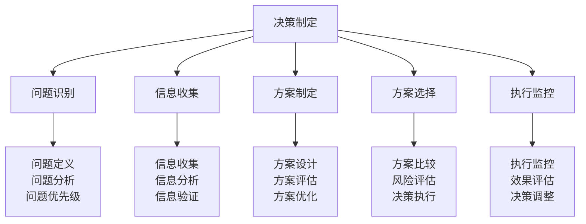
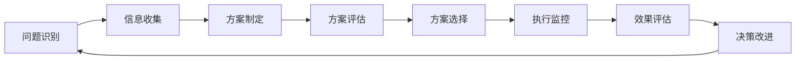
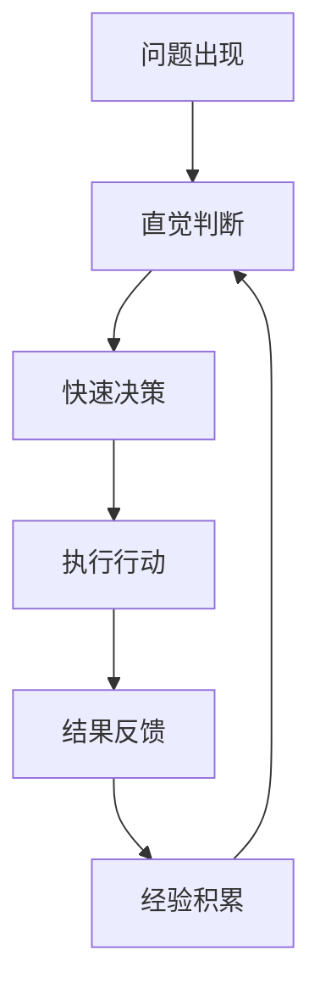
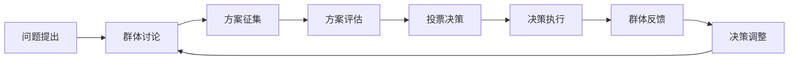
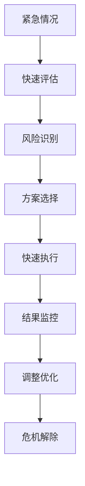
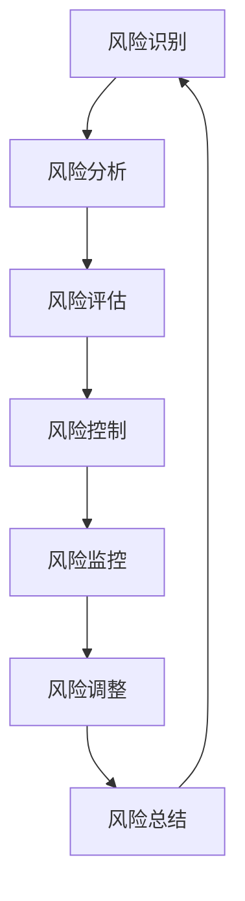

# 决策制定能力

## 🧠 决策制定核心框架

### 决策制定金字塔

## 📊 决策制定过程

### 1. 问题识别阶段
| 步骤 | 核心内容 | 关键技能 | 时间分配 | 成功标准 |
|------|----------|----------|----------|----------|
| **问题定义** | 明确问题本质和范围 | 分析思维、逻辑思维 | 20% | 问题清晰明确 |
| **问题分析** | 分析问题原因和影响 | 系统思维、批判思维 | 30% | 原因分析准确 |
| **问题优先级** | 确定问题解决优先级 | 价值判断、时间管理 | 10% | 优先级合理 |
| **问题确认** | 确认问题理解正确 | 沟通确认、反馈收集 | 10% | 理解一致 |

### 2. 信息收集阶段
| 步骤 | 核心内容 | 关键技能 | 时间分配 | 成功标准 |
|------|----------|----------|----------|----------|
| **信息收集** | 收集相关信息 | 信息搜索、数据收集 | 25% | 信息全面准确 |
| **信息分析** | 分析信息价值 | 数据分析、逻辑分析 | 30% | 分析深入透彻 |
| **信息验证** | 验证信息真实性 | 事实核查、交叉验证 | 20% | 信息真实可靠 |
| **信息整合** | 整合相关信息 | 信息整合、知识管理 | 25% | 整合系统完整 |

### 3. 方案制定阶段
| 步骤 | 核心内容 | 关键技能 | 时间分配 | 成功标准 |
|------|----------|----------|----------|----------|
| **方案设计** | 设计解决方案 | 创新思维、设计思维 | 40% | 方案创新可行 |
| **方案评估** | 评估方案效果 | 评估技能、预测能力 | 30% | 评估客观准确 |
| **方案优化** | 优化方案设计 | 优化思维、改进能力 | 20% | 优化效果明显 |
| **方案确认** | 确认方案可行性 | 可行性分析、风险评估 | 10% | 方案可行可靠 |

### 4. 方案选择阶段
| 步骤 | 核心内容 | 关键技能 | 时间分配 | 成功标准 |
|------|----------|----------|----------|----------|
| **方案比较** | 比较不同方案 | 比较分析、权衡能力 | 30% | 比较全面客观 |
| **风险评估** | 评估方案风险 | 风险识别、风险评估 | 25% | 风险识别准确 |
| **决策执行** | 执行选定方案 | 执行能力、项目管理 | 35% | 执行高效有序 |
| **决策记录** | 记录决策过程 | 记录技能、知识管理 | 10% | 记录完整清晰 |

## 🎯 决策制定方法

### 理性决策方法

#### 理性决策步骤
1. **问题识别**：明确问题本质和范围
2. **信息收集**：收集全面准确的信息
3. **方案制定**：制定多个可行方案
4. **方案评估**：评估各方案的优劣
5. **方案选择**：选择最优方案
6. **执行监控**：监控执行过程
7. **效果评估**：评估决策效果
8. **决策改进**：改进决策质量

### 直觉决策方法

#### 直觉决策特点
- **快速响应**：在时间紧迫时快速决策
- **经验驱动**：基于丰富经验进行判断
- **模式识别**：识别问题模式和解决方案
- **风险承担**：承担决策风险和责任

### 群体决策方法

#### 群体决策优势
- **集思广益**：汇集群体智慧和经验
- **风险分散**：分散决策风险和责任
- **执行支持**：获得群体支持和配合
- **质量提升**：提高决策质量和效果

### 应急决策方法

#### 应急决策原则
- **安全第一**：安全始终是第一优先级
- **快速响应**：快速响应紧急情况
- **风险控制**：控制风险在可接受范围
- **灵活调整**：根据情况灵活调整策略

## 📈 决策质量评估

### 决策质量标准
| 评估维度 | 评估指标 | 权重 | 评分标准 | 改进建议 |
|----------|----------|------|----------|----------|
| **准确性** | 决策结果准确性 | 30% | 1-10分 | 提高信息质量 |
| **及时性** | 决策时机把握 | 20% | 1-10分 | 提高响应速度 |
| **可行性** | 方案可执行性 | 25% | 1-10分 | 提高方案质量 |
| **效果性** | 决策效果达成 | 25% | 1-10分 | 提高执行效果 |

### 决策风险评估

#### 风险评估要素
- **风险概率**：风险发生的可能性
- **风险影响**：风险对目标的影响程度
- **风险等级**：综合评估风险等级
- **控制措施**：风险控制和缓解措施

### 决策效果评估
| 评估阶段 | 评估内容 | 评估方法 | 评估频率 | 改进措施 |
|----------|----------|----------|----------|----------|
| **短期评估** | 决策执行效果 | 执行监控 | 每周 | 执行调整 |
| **中期评估** | 决策目标达成 | 目标对比 | 每月 | 策略调整 |
| **长期评估** | 决策长期影响 | 影响分析 | 每季度 | 战略调整 |
| **综合评估** | 决策整体质量 | 综合评估 | 每年 | 系统改进 |

## 🎓 费曼学习法应用

### 第一步：选择概念
选择"决策制定能力"作为学习概念

### 第二步：教授他人
用简单语言解释：
> "决策制定就是遇到问题时，先搞清楚问题是什么，然后收集信息，想出几个解决方案，比较哪个最好，选一个执行，最后看看效果怎么样，下次遇到类似问题就知道怎么做了。"

### 第三步：回顾简化
- **问题识别**：搞清楚问题本质
- **信息收集**：收集相关信息
- **方案制定**：想出解决方案
- **方案选择**：选择最优方案
- **执行监控**：监控执行效果

### 第四步：组织优化
建立决策与技能的关系：
- 问题识别 → [[01-团队管理技能|团队管理]]
- 信息收集 → [[04-沟通协调技巧|沟通协调]]
- 方案制定 → [[03-危机处理领导|危机处理]]
- 方案选择 → [[06-责任与担当|责任担当]]

## 🏃‍♂️ 刻意练习要点

### 决策能力练习
1. **问题识别练习**：练习快速识别问题本质
2. **信息收集练习**：练习高效收集相关信息
3. **方案制定练习**：练习创新制定解决方案
4. **方案选择练习**：练习科学选择最优方案

### 实践验证
- **模拟决策**：模拟各种决策场景
- **案例分析**：分析成功和失败案例
- **决策记录**：记录决策过程和结果
- **持续改进**：持续改进决策质量

## 🔗 决策与技能的关系

### 问题识别技能
- **分析技能**：[[01-团队管理技能|团队管理]]
- **沟通技能**：[[04-沟通协调技巧|沟通协调]]
- **观察技能**：[[02-理解层-原理机制/01-户外生存原理/02-环境因素影响|环境因素]]
- **判断技能**：[[03-危机处理领导|危机处理]]

### 信息收集技能
- **搜索技能**：[[03-资源索引|资源索引]]
- **分析技能**：[[02-理解层-原理机制/01-户外生存原理|生存原理]]
- **验证技能**：[[03-应用层-实践技能/04-应急处理|应急处理]]
- **整合技能**：[[04-创新层-进阶发展/01-高级技巧/07-跨学科知识整合|跨学科知识]]

### 方案制定技能
- **创新技能**：[[04-创新层-进阶发展/01-高级技巧|高级技巧]]
- **设计技能**：[[04-创新层-进阶发展/02-专业配置|专业配置]]
- **评估技能**：[[05-实践与评估/01-技能评估体系|评估体系]]
- **优化技能**：[[05-实践与评估/03-持续改进|持续改进]]

### 方案选择技能
- **比较技能**：[[01-认知层-基础概念/02-露营分类|露营分类]]
- **评估技能**：[[02-理解层-原理机制/03-安全防护机制/01-风险评估体系|风险评估]]
- **执行技能**：[[03-应用层-实践技能|实践技能]]
- **监控技能**：[[04-创新层-进阶发展/03-领导力培养/02-时间管理技能|时间管理]]

## 📋 决策能力检查清单

### 问题识别能力
- [ ] 能够快速识别问题本质
- [ ] 能够分析问题原因和影响
- [ ] 能够确定问题解决优先级
- [ ] 能够确认问题理解正确

### 信息收集能力
- [ ] 能够收集全面准确的信息
- [ ] 能够分析信息价值
- [ ] 能够验证信息真实性
- [ ] 能够整合相关信息

### 方案制定能力
- [ ] 能够设计创新可行的方案
- [ ] 能够评估方案效果
- [ ] 能够优化方案设计
- [ ] 能够确认方案可行性

### 方案选择能力
- [ ] 能够比较不同方案
- [ ] 能够评估方案风险
- [ ] 能够执行选定方案
- [ ] 能够记录决策过程

## 🎯 决策能力提升策略

### 系统性提升
1. **理论学习**：学习决策理论和方法
2. **实践练习**：大量实践决策技能
3. **案例分析**：分析成功和失败案例
4. **持续改进**：持续改进决策质量

### 个性化发展
- **优势发挥**：发挥个人决策优势
- **短板补强**：补强决策能力短板
- **风格培养**：培养个人决策风格
- **经验积累**：积累决策经验

## 🔗 相关链接
- [[01-团队管理技能|团队管理技能]]
- [[03-危机处理领导|危机处理领导]]
- [[04-沟通协调技巧|沟通协调技巧]]
- [[06-责任与担当|责任与担当]]