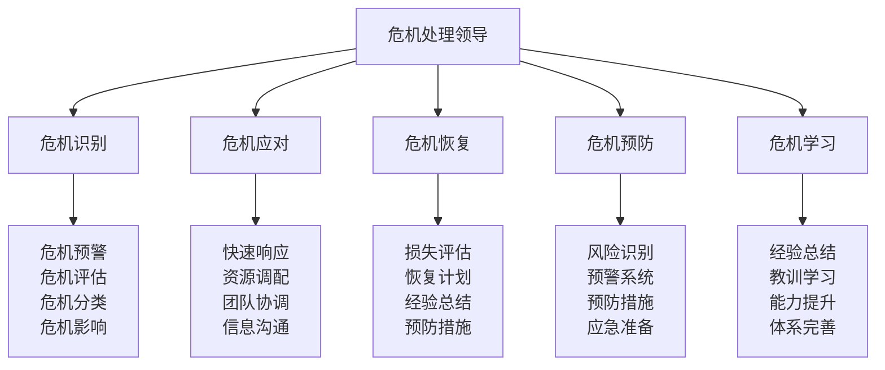

# 危机处理领导

## 🚨 危机处理领导核心框架

### 危机处理金字塔

## 🔍 危机识别体系

### 危机预警技术
| 预警类型 | 预警内容 | 预警方法 | 预警标准 | 预警效果 |
|----------|----------|----------|----------|----------|
| **环境预警** | 环境变化预警 | 环境监测 | 环境异常 | 预警及时 |
| **技术预警** | 技术故障预警 | 技术监测 | 技术异常 | 预警及时 |
| **人员预警** | 人员状态预警 | 人员监测 | 人员异常 | 预警及时 |
| **系统预警** | 系统故障预警 | 系统监测 | 系统异常 | 预警及时 |

### 危机评估技术
| 评估维度 | 评估内容 | 评估方法 | 评估标准 | 评估效果 |
|----------|----------|----------|----------|----------|
| **严重程度** | 危机严重程度 | 严重性分析 | 严重程度 | 评估准确 |
| **影响范围** | 危机影响范围 | 影响分析 | 影响范围 | 评估准确 |
| **紧急程度** | 危机紧急程度 | 紧急性分析 | 紧急程度 | 评估准确 |
| **可控程度** | 危机可控程度 | 可控性分析 | 可控程度 | 评估准确 |

### 危机分类技术
| 分类维度 | 分类内容 | 分类方法 | 分类标准 | 分类效果 |
|----------|----------|----------|----------|----------|
| **按性质分类** | 自然、人为、技术 | 性质分析 | 性质明确 | 分类清晰 |
| **按影响分类** | 人员、财产、环境 | 影响分析 | 影响明确 | 分类清晰 |
| **按时间分类** | 突发、渐进、持续 | 时间分析 | 时间明确 | 分类清晰 |
| **按可控性分类** | 可控、部分可控、不可控 | 可控性分析 | 可控性明确 | 分类清晰 |

### 危机影响分析
| 影响类型 | 影响内容 | 分析方法 | 分析标准 | 分析效果 |
|----------|----------|----------|----------|----------|
| **直接影响** | 直接损失、伤害 | 直接分析 | 影响明确 | 分析准确 |
| **间接影响** | 间接损失、影响 | 间接分析 | 影响明确 | 分析准确 |
| **短期影响** | 短期影响、后果 | 短期分析 | 影响明确 | 分析准确 |
| **长期影响** | 长期影响、后果 | 长期分析 | 影响明确 | 分析准确 |

## ⚡ 危机应对体系

### 快速响应技术
| 响应要素 | 响应内容 | 响应方法 | 响应标准 | 响应效果 |
|----------|----------|----------|----------|----------|
| **响应时间** | 响应速度、时效 | 时间控制 | 响应快速 | 响应及时 |
| **响应团队** | 响应团队、人员 | 团队组建 | 团队专业 | 响应专业 |
| **响应资源** | 响应资源、物资 | 资源调配 | 资源充足 | 响应充分 |
| **响应决策** | 响应决策、方案 | 决策制定 | 决策正确 | 响应有效 |

### 资源调配技术
| 调配类型 | 调配内容 | 调配方法 | 调配标准 | 调配效果 |
|----------|----------|----------|----------|----------|
| **人力资源** | 人员调配、分工 | 人员管理 | 人员充足 | 调配有效 |
| **物质资源** | 物资调配、使用 | 物资管理 | 物资充足 | 调配有效 |
| **信息资源** | 信息调配、共享 | 信息管理 | 信息及时 | 调配有效 |
| **技术资源** | 技术调配、支持 | 技术管理 | 技术先进 | 调配有效 |

### 团队协调技术
| 协调要素 | 协调内容 | 协调方法 | 协调标准 | 协调效果 |
|----------|----------|----------|----------|----------|
| **内部协调** | 内部团队协调 | 内部管理 | 协调有效 | 协调成功 |
| **外部协调** | 外部资源协调 | 外部管理 | 协调有效 | 协调成功 |
| **跨部门协调** | 跨部门协调 | 跨部门管理 | 协调有效 | 协调成功 |
| **跨组织协调** | 跨组织协调 | 跨组织管理 | 协调有效 | 协调成功 |

### 信息沟通技术
| 沟通要素 | 沟通内容 | 沟通方法 | 沟通标准 | 沟通效果 |
|----------|----------|----------|----------|----------|
| **内部沟通** | 内部信息沟通 | 内部沟通 | 沟通及时 | 沟通有效 |
| **外部沟通** | 外部信息沟通 | 外部沟通 | 沟通及时 | 沟通有效 |
| **媒体沟通** | 媒体信息沟通 | 媒体沟通 | 沟通及时 | 沟通有效 |
| **公众沟通** | 公众信息沟通 | 公众沟通 | 沟通及时 | 沟通有效 |

## 🔄 危机恢复体系

### 损失评估技术
| 评估类型 | 评估内容 | 评估方法 | 评估标准 | 评估效果 |
|----------|----------|----------|----------|----------|
| **人员损失** | 人员伤亡、影响 | 人员评估 | 评估准确 | 评估准确 |
| **财产损失** | 财产损失、损坏 | 财产评估 | 评估准确 | 评估准确 |
| **环境损失** | 环境破坏、影响 | 环境评估 | 评估准确 | 评估准确 |
| **声誉损失** | 声誉影响、损害 | 声誉评估 | 评估准确 | 评估准确 |

### 恢复计划技术
| 计划要素 | 计划内容 | 计划方法 | 计划标准 | 计划效果 |
|----------|----------|----------|----------|----------|
| **短期恢复** | 短期恢复计划 | 计划制定 | 计划可行 | 计划有效 |
| **中期恢复** | 中期恢复计划 | 计划制定 | 计划可行 | 计划有效 |
| **长期恢复** | 长期恢复计划 | 计划制定 | 计划可行 | 计划有效 |
| **全面恢复** | 全面恢复计划 | 计划制定 | 计划可行 | 计划有效 |

### 经验总结技术
| 总结要素 | 总结内容 | 总结方法 | 总结标准 | 总结效果 |
|----------|----------|----------|----------|----------|
| **成功经验** | 成功经验总结 | 经验总结 | 总结深入 | 总结有效 |
| **失败教训** | 失败教训总结 | 教训总结 | 总结深刻 | 总结有效 |
| **改进建议** | 改进建议总结 | 建议总结 | 建议实用 | 总结有效 |
| **预防措施** | 预防措施总结 | 措施总结 | 措施有效 | 总结有效 |

### 预防措施技术
| 措施类型 | 措施内容 | 措施方法 | 措施标准 | 措施效果 |
|----------|----------|----------|----------|----------|
| **技术预防** | 技术预防措施 | 技术改进 | 措施有效 | 预防有效 |
| **管理预防** | 管理预防措施 | 管理改进 | 措施有效 | 预防有效 |
| **制度预防** | 制度预防措施 | 制度完善 | 措施有效 | 预防有效 |
| **文化预防** | 文化预防措施 | 文化建设 | 措施有效 | 预防有效 |

## 🛡️ 危机预防体系

### 风险识别技术
| 识别类型 | 识别内容 | 识别方法 | 识别标准 | 识别效果 |
|----------|----------|----------|----------|----------|
| **环境风险** | 环境风险识别 | 环境分析 | 风险明确 | 识别准确 |
| **技术风险** | 技术风险识别 | 技术分析 | 风险明确 | 识别准确 |
| **人员风险** | 人员风险识别 | 人员分析 | 风险明确 | 识别准确 |
| **管理风险** | 管理风险识别 | 管理分析 | 风险明确 | 识别准确 |

### 预警系统技术
| 系统要素 | 系统内容 | 系统方法 | 系统标准 | 系统效果 |
|----------|----------|----------|----------|----------|
| **监测系统** | 风险监测系统 | 系统建设 | 系统完善 | 系统有效 |
| **预警系统** | 风险预警系统 | 系统建设 | 系统完善 | 系统有效 |
| **响应系统** | 应急响应系统 | 系统建设 | 系统完善 | 系统有效 |
| **管理系统** | 危机管理系统 | 系统建设 | 系统完善 | 系统有效 |

### 预防措施技术
| 措施类型 | 措施内容 | 措施方法 | 措施标准 | 措施效果 |
|----------|----------|----------|----------|----------|
| **技术预防** | 技术预防措施 | 技术改进 | 措施有效 | 预防有效 |
| **管理预防** | 管理预防措施 | 管理改进 | 措施有效 | 预防有效 |
| **制度预防** | 制度预防措施 | 制度完善 | 措施有效 | 预防有效 |
| **培训预防** | 培训预防措施 | 培训教育 | 措施有效 | 预防有效 |

### 应急准备技术
| 准备要素 | 准备内容 | 准备方法 | 准备标准 | 准备效果 |
|----------|----------|----------|----------|----------|
| **人员准备** | 应急人员准备 | 人员培训 | 准备充分 | 准备有效 |
| **物资准备** | 应急物资准备 | 物资储备 | 准备充分 | 准备有效 |
| **技术准备** | 应急技术准备 | 技术准备 | 准备充分 | 准备有效 |
| **预案准备** | 应急预案准备 | 预案制定 | 准备充分 | 准备有效 |

## 📚 危机学习体系

### 经验总结技术
| 总结类型 | 总结内容 | 总结方法 | 总结标准 | 总结效果 |
|----------|----------|----------|----------|----------|
| **成功经验** | 成功经验总结 | 经验分析 | 总结深入 | 总结有效 |
| **失败教训** | 失败教训总结 | 教训分析 | 总结深刻 | 总结有效 |
| **最佳实践** | 最佳实践总结 | 实践分析 | 总结实用 | 总结有效 |
| **改进建议** | 改进建议总结 | 建议分析 | 建议实用 | 总结有效 |

### 教训学习技术
| 学习要素 | 学习内容 | 学习方法 | 学习标准 | 学习效果 |
|----------|----------|----------|----------|----------|
| **案例分析** | 危机案例分析 | 案例学习 | 分析深入 | 学习有效 |
| **经验分享** | 经验分享学习 | 分享学习 | 分享充分 | 学习有效 |
| **培训学习** | 危机培训学习 | 培训学习 | 培训专业 | 学习有效 |
| **实践学习** | 危机实践学习 | 实践学习 | 实践充分 | 学习有效 |

### 能力提升技术
| 提升要素 | 提升内容 | 提升方法 | 提升标准 | 提升效果 |
|----------|----------|----------|----------|----------|
| **识别能力** | 危机识别能力 | 能力训练 | 能力提升 | 能力增强 |
| **应对能力** | 危机应对能力 | 能力训练 | 能力提升 | 能力增强 |
| **恢复能力** | 危机恢复能力 | 能力训练 | 能力提升 | 能力增强 |
| **预防能力** | 危机预防能力 | 能力训练 | 能力提升 | 能力增强 |

### 体系完善技术
| 完善要素 | 完善内容 | 完善方法 | 完善标准 | 完善效果 |
|----------|----------|----------|----------|----------|
| **制度完善** | 危机管理制度 | 制度完善 | 制度完善 | 体系完善 |
| **流程完善** | 危机处理流程 | 流程完善 | 流程完善 | 体系完善 |
| **工具完善** | 危机处理工具 | 工具完善 | 工具完善 | 体系完善 |
| **文化完善** | 危机处理文化 | 文化完善 | 文化完善 | 体系完善 |

## 🎓 费曼学习法应用

### 第一步：选择概念
选择"危机处理领导"作为学习概念

### 第二步：教授他人
用简单语言解释：
> "危机处理领导就是在危机发生时能够有效领导团队应对危机的能力，包括危机识别、危机应对、危机恢复、危机预防、危机学习。关键是快速识别、有效应对、及时恢复、持续预防。"

### 第三步：回顾简化
- **危机识别**：危机预警、危机评估、危机分类、危机影响
- **危机应对**：快速响应、资源调配、团队协调、信息沟通
- **危机恢复**：损失评估、恢复计划、经验总结、预防措施
- **危机预防**：风险识别、预警系统、预防措施、应急准备
- **危机学习**：经验总结、教训学习、能力提升、体系完善

### 第四步：组织优化
建立危机处理与技能的关系：
- 危机识别 → [[03-应用层-实践技能/04-应急处理/01-常见伤病处理|应急处理]]
- 危机应对 → [[04-创新层-进阶发展/03-领导力培养/01-团队管理技能|团队管理]]
- 危机恢复 → [[05-实践与评估/03-持续改进|持续改进]]
- 危机预防 → [[02-理解层-原理机制/03-安全防护机制|安全防护]]
- 危机学习 → [[05-实践与评估/03-持续改进/01-学习反思模板|学习反思]]

## 🏃‍♂️ 刻意练习要点

### 危机处理练习
1. **识别练习**：练习危机识别技能
2. **应对练习**：练习危机应对技能
3. **恢复练习**：练习危机恢复技能
4. **预防练习**：练习危机预防技能

### 练习方法
- **理论学习**：学习危机处理理论
- **案例分析**：分析危机处理案例
- **模拟演练**：进行危机模拟演练
- **实践应用**：实际应用危机处理技能

### 实践验证
- **演练测试**：测试危机处理能力
- **效果验证**：验证危机处理效果
- **能力评估**：评估危机处理能力
- **持续改进**：持续改进危机处理能力

## 📋 危机处理检查清单

### 危机识别检查
- [ ] 危机预警是否及时
- [ ] 危机评估是否准确
- [ ] 危机分类是否清晰
- [ ] 危机影响是否明确

### 危机应对检查
- [ ] 快速响应是否及时
- [ ] 资源调配是否有效
- [ ] 团队协调是否成功
- [ ] 信息沟通是否及时

### 危机恢复检查
- [ ] 损失评估是否准确
- [ ] 恢复计划是否可行
- [ ] 经验总结是否深入
- [ ] 预防措施是否有效

### 危机预防检查
- [ ] 风险识别是否全面
- [ ] 预警系统是否完善
- [ ] 预防措施是否有效
- [ ] 应急准备是否充分

### 危机学习检查
- [ ] 经验总结是否深入
- [ ] 教训学习是否充分
- [ ] 能力提升是否明显
- [ ] 体系完善是否有效

## 🎯 危机处理策略

### 处理策略
1. **预防为主**：以预防为主进行处理
2. **快速响应**：快速响应危机情况
3. **有效应对**：有效应对危机挑战
4. **持续改进**：持续改进处理能力

### 领导策略
- **决策领导**：快速决策领导团队
- **协调领导**：协调各方资源应对
- **沟通领导**：有效沟通信息
- **学习领导**：持续学习改进能力

## 🔗 相关链接
- [[01-领导力概述|领导力概述]]
- [[01-团队管理技能|团队管理技能]]
- [[02-决策制定能力|决策制定能力]]
- [[04-沟通协调技巧|沟通协调技巧]]
- [[03-应用层-实践技能/04-应急处理|应急处理]]
- [[05-实践与评估/03-持续改进|持续改进]]