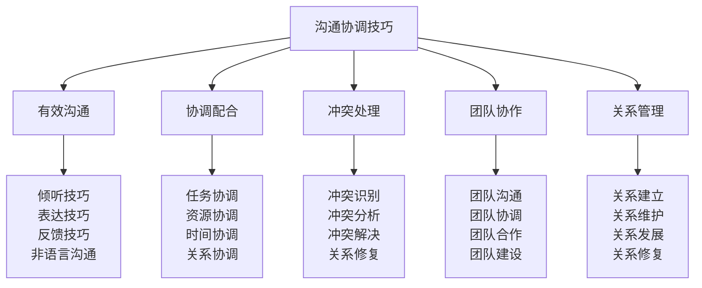

# 沟通协调技巧

## 💬 沟通协调核心框架

### 沟通协调金字塔

## 👂 有效沟通技巧

### 倾听技巧技术
| 技巧类型 | 技巧内容 | 实施方法 | 实施标准 | 实施效果 |
|----------|----------|----------|----------|----------|
| **主动倾听** | 主动专注倾听 | 专注训练 | 专注度高 | 理解准确 |
| **理解倾听** | 理解内容倾听 | 理解训练 | 理解深入 | 理解准确 |
| **回应倾听** | 回应式倾听 | 回应训练 | 回应及时 | 沟通有效 |
| **同理倾听** | 同理心倾听 | 同理训练 | 同理心强 | 关系融洽 |

### 表达技巧技术
| 技巧类型 | 技巧内容 | 实施方法 | 实施标准 | 实施效果 |
|----------|----------|----------|----------|----------|
| **清晰表达** | 清晰明确表达 | 表达训练 | 表达清晰 | 信息传达 |
| **简洁表达** | 简洁有力表达 | 简洁训练 | 表达简洁 | 信息高效 |
| **逻辑表达** | 逻辑清晰表达 | 逻辑训练 | 逻辑清晰 | 信息准确 |
| **情感表达** | 情感丰富表达 | 情感训练 | 情感真实 | 情感传达 |

### 反馈技巧技术
| 技巧类型 | 技巧内容 | 实施方法 | 实施标准 | 实施效果 |
|----------|----------|----------|----------|----------|
| **及时反馈** | 及时有效反馈 | 及时训练 | 反馈及时 | 反馈有效 |
| **具体反馈** | 具体明确反馈 | 具体训练 | 反馈具体 | 反馈有效 |
| **建设性反馈** | 建设性反馈 | 建设训练 | 反馈建设 | 反馈有效 |
| **平衡反馈** | 平衡客观反馈 | 平衡训练 | 反馈平衡 | 反馈有效 |

### 非语言沟通技术
| 沟通类型 | 沟通内容 | 沟通方法 | 沟通标准 | 沟通效果 |
|----------|----------|----------|----------|----------|
| **肢体语言** | 肢体动作沟通 | 肢体训练 | 肢体自然 | 沟通有效 |
| **面部表情** | 面部表情沟通 | 表情训练 | 表情自然 | 沟通有效 |
| **眼神交流** | 眼神交流沟通 | 眼神训练 | 眼神自然 | 沟通有效 |
| **声音语调** | 声音语调沟通 | 声音训练 | 声音自然 | 沟通有效 |

## 🤝 协调配合技巧

### 任务协调技术
| 协调要素 | 协调内容 | 协调方法 | 协调标准 | 协调效果 |
|----------|----------|----------|----------|----------|
| **任务分配** | 任务合理分配 | 分配原则 | 分配合理 | 协调有效 |
| **任务同步** | 任务同步协调 | 同步机制 | 同步及时 | 协调有效 |
| **任务整合** | 任务整合协调 | 整合方法 | 整合有效 | 协调有效 |
| **任务优化** | 任务优化协调 | 优化方法 | 优化有效 | 协调有效 |

### 资源协调技术
| 协调要素 | 协调内容 | 协调方法 | 协调标准 | 协调效果 |
|----------|----------|----------|----------|----------|
| **人力资源** | 人力资源协调 | 人员管理 | 人员合理 | 协调有效 |
| **物质资源** | 物质资源协调 | 物资管理 | 物资合理 | 协调有效 |
| **信息资源** | 信息资源协调 | 信息管理 | 信息及时 | 协调有效 |
| **技术资源** | 技术资源协调 | 技术管理 | 技术先进 | 协调有效 |

### 时间协调技术
| 协调要素 | 协调内容 | 协调方法 | 协调标准 | 协调效果 |
|----------|----------|----------|----------|----------|
| **时间安排** | 时间合理安排 | 时间规划 | 安排合理 | 协调有效 |
| **时间同步** | 时间同步协调 | 同步机制 | 同步及时 | 协调有效 |
| **时间优化** | 时间优化协调 | 优化方法 | 优化有效 | 协调有效 |
| **时间控制** | 时间控制协调 | 控制机制 | 控制有效 | 协调有效 |

### 关系协调技术
| 协调要素 | 协调内容 | 协调方法 | 协调标准 | 协调效果 |
|----------|----------|----------|----------|----------|
| **内部关系** | 内部关系协调 | 关系管理 | 关系和谐 | 协调有效 |
| **外部关系** | 外部关系协调 | 关系管理 | 关系和谐 | 协调有效 |
| **跨部门关系** | 跨部门关系协调 | 关系管理 | 关系和谐 | 协调有效 |
| **跨组织关系** | 跨组织关系协调 | 关系管理 | 关系和谐 | 协调有效 |

## ⚔️ 冲突处理技巧

### 冲突识别技术
| 识别要素 | 识别内容 | 识别方法 | 识别标准 | 识别效果 |
|----------|----------|----------|----------|----------|
| **冲突信号** | 冲突早期信号 | 信号监测 | 信号明确 | 识别及时 |
| **冲突类型** | 冲突类型识别 | 类型分析 | 类型明确 | 识别准确 |
| **冲突程度** | 冲突程度识别 | 程度分析 | 程度明确 | 识别准确 |
| **冲突影响** | 冲突影响识别 | 影响分析 | 影响明确 | 识别准确 |

### 冲突分析技术
| 分析要素 | 分析内容 | 分析方法 | 分析标准 | 分析效果 |
|----------|----------|----------|----------|----------|
| **原因分析** | 冲突原因分析 | 原因分析 | 原因明确 | 分析准确 |
| **利益分析** | 利益冲突分析 | 利益分析 | 利益明确 | 分析准确 |
| **影响分析** | 冲突影响分析 | 影响分析 | 影响明确 | 分析准确 |
| **趋势分析** | 冲突趋势分析 | 趋势分析 | 趋势明确 | 分析准确 |

### 冲突解决技术
| 解决策略 | 解决内容 | 解决方法 | 解决标准 | 解决效果 |
|----------|----------|----------|----------|----------|
| **协商解决** | 协商谈判解决 | 协商方法 | 双方满意 | 解决有效 |
| **调解解决** | 第三方调解解决 | 调解方法 | 调解成功 | 解决有效 |
| **仲裁解决** | 权威仲裁解决 | 仲裁方法 | 仲裁公正 | 解决有效 |
| **强制解决** | 强制措施解决 | 强制方法 | 强制合理 | 解决有效 |

### 关系修复技术
| 修复要素 | 修复内容 | 修复方法 | 修复标准 | 修复效果 |
|----------|----------|----------|----------|----------|
| **关系重建** | 关系重新建立 | 重建方法 | 关系和谐 | 修复有效 |
| **信任重建** | 信任重新建立 | 信任建设 | 信任深厚 | 修复有效 |
| **沟通改善** | 沟通关系改善 | 沟通训练 | 沟通有效 | 修复有效 |
| **合作加强** | 合作关系加强 | 合作训练 | 合作有效 | 修复有效 |

## 👥 团队协作技巧

### 团队沟通技术
| 沟通要素 | 沟通内容 | 沟通方法 | 沟通标准 | 沟通效果 |
|----------|----------|----------|----------|----------|
| **团队会议** | 团队会议沟通 | 会议管理 | 会议有效 | 沟通有效 |
| **团队讨论** | 团队讨论沟通 | 讨论管理 | 讨论充分 | 沟通有效 |
| **团队分享** | 团队分享沟通 | 分享机制 | 分享充分 | 沟通有效 |
| **团队反馈** | 团队反馈沟通 | 反馈机制 | 反馈及时 | 沟通有效 |

### 团队协调技术
| 协调要素 | 协调内容 | 协调方法 | 协调标准 | 协调效果 |
|----------|----------|----------|----------|----------|
| **任务协调** | 团队任务协调 | 任务管理 | 协调有效 | 协调成功 |
| **资源协调** | 团队资源协调 | 资源管理 | 协调有效 | 协调成功 |
| **时间协调** | 团队时间协调 | 时间管理 | 协调有效 | 协调成功 |
| **关系协调** | 团队关系协调 | 关系管理 | 协调有效 | 协调成功 |

### 团队合作技术
| 合作要素 | 合作内容 | 合作方法 | 合作标准 | 合作效果 |
|----------|----------|----------|----------|----------|
| **目标合作** | 共同目标合作 | 目标统一 | 目标一致 | 合作有效 |
| **任务合作** | 任务分工合作 | 分工协作 | 分工合理 | 合作有效 |
| **资源合作** | 资源共享合作 | 资源共享 | 资源优化 | 合作有效 |
| **知识合作** | 知识共享合作 | 知识共享 | 知识丰富 | 合作有效 |

### 团队建设技术
| 建设要素 | 建设内容 | 建设方法 | 建设标准 | 建设效果 |
|----------|----------|----------|----------|----------|
| **团队文化** | 团队文化建设 | 文化建设 | 文化认同 | 建设有效 |
| **团队精神** | 团队精神建设 | 精神培养 | 精神凝聚 | 建设有效 |
| **团队能力** | 团队能力建设 | 能力培养 | 能力提升 | 建设有效 |
| **团队关系** | 团队关系建设 | 关系建设 | 关系和谐 | 建设有效 |

## 💕 关系管理技巧

### 关系建立技术
| 建立要素 | 建立内容 | 建立方法 | 建立标准 | 建立效果 |
|----------|----------|----------|----------|----------|
| **初次接触** | 初次接触建立 | 接触技巧 | 接触自然 | 建立成功 |
| **信任建立** | 信任关系建立 | 信任建设 | 信任深厚 | 建立成功 |
| **共同兴趣** | 共同兴趣建立 | 兴趣培养 | 兴趣一致 | 建立成功 |
| **价值认同** | 价值认同建立 | 价值讨论 | 价值一致 | 建立成功 |

### 关系维护技术
| 维护要素 | 维护内容 | 维护方法 | 维护标准 | 维护效果 |
|----------|----------|----------|----------|----------|
| **定期联系** | 定期联系维护 | 联系机制 | 联系及时 | 维护有效 |
| **关心支持** | 关心支持维护 | 关心机制 | 关心真诚 | 维护有效 |
| **共同活动** | 共同活动维护 | 活动组织 | 活动丰富 | 维护有效 |
| **相互帮助** | 相互帮助维护 | 帮助机制 | 帮助及时 | 维护有效 |

### 关系发展技术
| 发展要素 | 发展内容 | 发展方法 | 发展标准 | 发展效果 |
|----------|----------|----------|----------|----------|
| **深度发展** | 关系深度发展 | 深度交流 | 关系深入 | 发展有效 |
| **广度发展** | 关系广度发展 | 广度拓展 | 关系广泛 | 发展有效 |
| **质量发展** | 关系质量发展 | 质量提升 | 关系优质 | 发展有效 |
| **持续发展** | 关系持续发展 | 持续维护 | 关系持续 | 发展有效 |

### 关系修复技术
| 修复要素 | 修复内容 | 修复方法 | 修复标准 | 修复效果 |
|----------|----------|----------|----------|----------|
| **问题识别** | 关系问题识别 | 问题分析 | 问题明确 | 修复有效 |
| **道歉沟通** | 道歉沟通修复 | 道歉技巧 | 道歉真诚 | 修复有效 |
| **理解包容** | 理解包容修复 | 包容训练 | 包容充分 | 修复有效 |
| **重新开始** | 重新开始修复 | 重新建立 | 重新开始 | 修复有效 |

## 🎓 费曼学习法应用

### 第一步：选择概念
选择"沟通协调技巧"作为学习概念

### 第二步：教授他人
用简单语言解释：
> "沟通协调技巧就是与人有效沟通和协调配合的能力，包括有效沟通、协调配合、冲突处理、团队协作、关系管理。关键是学会倾听、清晰表达、有效协调、处理冲突、管理关系。"

### 第三步：回顾简化
- **有效沟通**：倾听技巧、表达技巧、反馈技巧、非语言沟通
- **协调配合**：任务协调、资源协调、时间协调、关系协调
- **冲突处理**：冲突识别、冲突分析、冲突解决、关系修复
- **团队协作**：团队沟通、团队协调、团队合作、团队建设
- **关系管理**：关系建立、关系维护、关系发展、关系修复

### 第四步：组织优化
建立沟通协调与技能的关系：
- 有效沟通 → [[04-创新层-进阶发展/03-领导力培养/01-团队管理技能|团队管理]]
- 协调配合 → [[04-创新层-进阶发展/01-高级技巧/05-团队协作技巧|团队协作]]
- 冲突处理 → [[04-创新层-进阶发展/03-领导力培养/03-危机处理领导|危机处理]]
- 团队协作 → [[04-创新层-进阶发展/03-领导力培养/01-领导力概述|领导力]]
- 关系管理 → [[04-创新层-进阶发展/04-文化传承|文化传承]]

## 🏃‍♂️ 刻意练习要点

### 沟通协调练习
1. **沟通练习**：练习有效沟通技能
2. **协调练习**：练习协调配合技能
3. **冲突练习**：练习冲突处理技能
4. **协作练习**：练习团队协作技能

### 练习方法
- **理论学习**：学习沟通协调理论
- **实践练习**：实际练习沟通协调
- **案例分析**：分析沟通协调案例
- **角色扮演**：扮演不同角色练习

### 实践验证
- **沟通测试**：测试沟通协调能力
- **效果验证**：验证沟通协调效果
- **关系评估**：评估人际关系质量
- **持续改进**：持续改进沟通协调

## 📋 沟通协调检查清单

### 有效沟通检查
- [ ] 倾听技巧是否熟练
- [ ] 表达技巧是否清晰
- [ ] 反馈技巧是否及时
- [ ] 非语言沟通是否自然

### 协调配合检查
- [ ] 任务协调是否有效
- [ ] 资源协调是否合理
- [ ] 时间协调是否及时
- [ ] 关系协调是否和谐

### 冲突处理检查
- [ ] 冲突识别是否及时
- [ ] 冲突分析是否准确
- [ ] 冲突解决是否有效
- [ ] 关系修复是否成功

### 团队协作检查
- [ ] 团队沟通是否有效
- [ ] 团队协调是否成功
- [ ] 团队合作是否充分
- [ ] 团队建设是否有效

### 关系管理检查
- [ ] 关系建立是否成功
- [ ] 关系维护是否有效
- [ ] 关系发展是否持续
- [ ] 关系修复是否成功

## 🎯 沟通协调策略

### 沟通策略
1. **倾听优先**：优先倾听他人意见
2. **表达清晰**：清晰表达自己的想法
3. **反馈及时**：及时给予有效反馈
4. **非语言自然**：自然使用非语言沟通

### 协调策略
- **目标统一**：统一团队目标
- **资源优化**：优化资源配置
- **时间合理**：合理安排时间
- **关系和谐**：维护和谐关系

## 🔗 相关链接
- [[01-领导力概述|领导力概述]]
- [[01-团队管理技能|团队管理技能]]
- [[02-决策制定能力|决策制定能力]]
- [[03-危机处理领导|危机处理领导]]
- [[04-创新层-进阶发展/01-高级技巧/05-团队协作技巧|团队协作技巧]]
- [[04-创新层-进阶发展/04-文化传承|文化传承]]