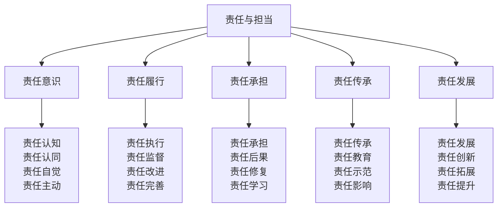

# 责任与担当

## 🎯 责任与担当核心框架

### 责任担当金字塔

## 🧠 责任意识体系

### 责任认知技术
| 认知要素 | 认知内容 | 认知方法 | 认知标准 | 认知效果 |
|----------|----------|----------|----------|----------|
| **责任定义** | 责任概念、内涵 | 概念学习 | 概念清晰 | 认知准确 |
| **责任范围** | 责任边界、范围 | 范围分析 | 范围明确 | 认知准确 |
| **责任标准** | 责任标准、要求 | 标准学习 | 标准明确 | 认知准确 |
| **责任价值** | 责任价值、意义 | 价值分析 | 价值明确 | 认知准确 |

### 责任认同技术
| 认同要素 | 认同内容 | 认同方法 | 认同标准 | 认同效果 |
|----------|----------|----------|----------|----------|
| **价值认同** | 责任价值认同 | 价值讨论 | 价值一致 | 认同深入 |
| **标准认同** | 责任标准认同 | 标准讨论 | 标准一致 | 认同深入 |
| **行为认同** | 责任行为认同 | 行为讨论 | 行为一致 | 认同深入 |
| **文化认同** | 责任文化认同 | 文化讨论 | 文化一致 | 认同深入 |

### 责任自觉技术
| 自觉要素 | 自觉内容 | 自觉方法 | 自觉标准 | 自觉效果 |
|----------|----------|----------|----------|----------|
| **主动意识** | 主动承担责任 | 意识培养 | 意识主动 | 自觉深入 |
| **自觉行为** | 自觉履行责任 | 行为培养 | 行为自觉 | 自觉深入 |
| **自觉监督** | 自觉监督责任 | 监督培养 | 监督自觉 | 自觉深入 |
| **自觉改进** | 自觉改进责任 | 改进培养 | 改进自觉 | 自觉深入 |

### 责任主动技术
| 主动要素 | 主动内容 | 主动方法 | 主动标准 | 主动效果 |
|----------|----------|----------|----------|----------|
| **主动承担** | 主动承担责任 | 承担训练 | 承担主动 | 主动有效 |
| **主动执行** | 主动执行责任 | 执行训练 | 执行主动 | 主动有效 |
| **主动改进** | 主动改进责任 | 改进训练 | 改进主动 | 主动有效 |
| **主动创新** | 主动创新责任 | 创新训练 | 创新主动 | 主动有效 |

## ⚡ 责任履行体系

### 责任执行技术
| 执行要素 | 执行内容 | 执行方法 | 执行标准 | 执行效果 |
|----------|----------|----------|----------|----------|
| **计划执行** | 责任计划执行 | 计划管理 | 执行到位 | 执行有效 |
| **过程执行** | 责任过程执行 | 过程管理 | 执行到位 | 执行有效 |
| **结果执行** | 责任结果执行 | 结果管理 | 执行到位 | 执行有效 |
| **持续执行** | 责任持续执行 | 持续管理 | 执行到位 | 执行有效 |

### 责任监督技术
| 监督要素 | 监督内容 | 监督方法 | 监督标准 | 监督效果 |
|----------|----------|----------|----------|----------|
| **自我监督** | 自我责任监督 | 自我管理 | 监督严格 | 监督有效 |
| **相互监督** | 相互责任监督 | 相互管理 | 监督严格 | 监督有效 |
| **上级监督** | 上级责任监督 | 上级管理 | 监督严格 | 监督有效 |
| **社会监督** | 社会责任监督 | 社会管理 | 监督严格 | 监督有效 |

### 责任改进技术
| 改进要素 | 改进内容 | 改进方法 | 改进标准 | 改进效果 |
|----------|----------|----------|----------|----------|
| **问题改进** | 责任问题改进 | 问题解决 | 改进有效 | 改进成功 |
| **方法改进** | 责任方法改进 | 方法优化 | 改进有效 | 改进成功 |
| **流程改进** | 责任流程改进 | 流程优化 | 改进有效 | 改进成功 |
| **系统改进** | 责任系统改进 | 系统优化 | 改进有效 | 改进成功 |

### 责任完善技术
| 完善要素 | 完善内容 | 完善方法 | 完善标准 | 完善效果 |
|----------|----------|----------|----------|----------|
| **制度完善** | 责任制度完善 | 制度优化 | 完善有效 | 完善成功 |
| **机制完善** | 责任机制完善 | 机制优化 | 完善有效 | 完善成功 |
| **体系完善** | 责任体系完善 | 体系优化 | 完善有效 | 完善成功 |
| **文化完善** | 责任文化完善 | 文化优化 | 完善有效 | 完善成功 |

## 🛡️ 责任承担体系

### 责任承担技术
| 承担要素 | 承担内容 | 承担方法 | 承担标准 | 承担效果 |
|----------|----------|----------|----------|----------|
| **主动承担** | 主动承担责任 | 承担训练 | 承担主动 | 承担有效 |
| **全面承担** | 全面承担责任 | 承担训练 | 承担全面 | 承担有效 |
| **及时承担** | 及时承担责任 | 承担训练 | 承担及时 | 承担有效 |
| **持续承担** | 持续承担责任 | 承担训练 | 承担持续 | 承担有效 |

### 责任后果技术
| 后果要素 | 后果内容 | 后果方法 | 后果标准 | 后果效果 |
|----------|----------|----------|----------|----------|
| **后果认知** | 责任后果认知 | 后果分析 | 后果明确 | 认知准确 |
| **后果承担** | 责任后果承担 | 后果承担 | 后果承担 | 承担有效 |
| **后果处理** | 责任后果处理 | 后果处理 | 后果处理 | 处理有效 |
| **后果学习** | 责任后果学习 | 后果学习 | 后果学习 | 学习有效 |

### 责任修复技术
| 修复要素 | 修复内容 | 修复方法 | 修复标准 | 修复效果 |
|----------|----------|----------|----------|----------|
| **损失修复** | 责任损失修复 | 损失修复 | 修复有效 | 修复成功 |
| **关系修复** | 责任关系修复 | 关系修复 | 修复有效 | 修复成功 |
| **信任修复** | 责任信任修复 | 信任修复 | 修复有效 | 修复成功 |
| **声誉修复** | 责任声誉修复 | 声誉修复 | 修复有效 | 修复成功 |

### 责任学习技术
| 学习要素 | 学习内容 | 学习方法 | 学习标准 | 学习效果 |
|----------|----------|----------|----------|----------|
| **经验学习** | 责任经验学习 | 经验总结 | 学习深入 | 学习有效 |
| **教训学习** | 责任教训学习 | 教训总结 | 学习深入 | 学习有效 |
| **改进学习** | 责任改进学习 | 改进总结 | 学习深入 | 学习有效 |
| **创新学习** | 责任创新学习 | 创新总结 | 学习深入 | 学习有效 |

## 📚 责任传承体系

### 责任传承技术
| 传承要素 | 传承内容 | 传承方法 | 传承标准 | 传承效果 |
|----------|----------|----------|----------|----------|
| **知识传承** | 责任知识传承 | 知识传授 | 传承完整 | 传承有效 |
| **经验传承** | 责任经验传承 | 经验传授 | 传承完整 | 传承有效 |
| **技能传承** | 责任技能传承 | 技能传授 | 传承完整 | 传承有效 |
| **文化传承** | 责任文化传承 | 文化传授 | 传承完整 | 传承有效 |

### 责任教育技术
| 教育要素 | 教育内容 | 教育方法 | 教育标准 | 教育效果 |
|----------|----------|----------|----------|----------|
| **理念教育** | 责任理念教育 | 理念传授 | 教育深入 | 教育有效 |
| **行为教育** | 责任行为教育 | 行为训练 | 教育深入 | 教育有效 |
| **实践教育** | 责任实践教育 | 实践训练 | 教育深入 | 教育有效 |
| **文化教育** | 责任文化教育 | 文化熏陶 | 教育深入 | 教育有效 |

### 责任示范技术
| 示范要素 | 示范内容 | 示范方法 | 示范标准 | 示范效果 |
|----------|----------|----------|----------|----------|
| **行为示范** | 责任行为示范 | 行为展示 | 示范标准 | 示范有效 |
| **态度示范** | 责任态度示范 | 态度展示 | 示范标准 | 示范有效 |
| **精神示范** | 责任精神示范 | 精神展示 | 示范标准 | 示范有效 |
| **文化示范** | 责任文化示范 | 文化展示 | 示范标准 | 示范有效 |

### 责任影响技术
| 影响要素 | 影响内容 | 影响方法 | 影响标准 | 影响效果 |
|----------|----------|----------|----------|----------|
| **个人影响** | 个人责任影响 | 个人影响 | 影响积极 | 影响有效 |
| **团队影响** | 团队责任影响 | 团队影响 | 影响积极 | 影响有效 |
| **组织影响** | 组织责任影响 | 组织影响 | 影响积极 | 影响有效 |
| **社会影响** | 社会责任影响 | 社会影响 | 影响积极 | 影响有效 |

## 🚀 责任发展体系

### 责任发展技术
| 发展要素 | 发展内容 | 发展方法 | 发展标准 | 发展效果 |
|----------|----------|----------|----------|----------|
| **个人发展** | 个人责任发展 | 个人发展 | 发展持续 | 发展有效 |
| **团队发展** | 团队责任发展 | 团队发展 | 发展持续 | 发展有效 |
| **组织发展** | 组织责任发展 | 组织发展 | 发展持续 | 发展有效 |
| **社会发展** | 社会责任发展 | 社会发展 | 发展持续 | 发展有效 |

### 责任创新技术
| 创新要素 | 创新内容 | 创新方法 | 创新标准 | 创新效果 |
|----------|----------|----------|----------|----------|
| **理念创新** | 责任理念创新 | 理念创新 | 创新先进 | 创新有效 |
| **方法创新** | 责任方法创新 | 方法创新 | 创新先进 | 创新有效 |
| **机制创新** | 责任机制创新 | 机制创新 | 创新先进 | 创新有效 |
| **文化创新** | 责任文化创新 | 文化创新 | 创新先进 | 创新有效 |

### 责任拓展技术
| 拓展要素 | 拓展内容 | 拓展方法 | 拓展标准 | 拓展效果 |
|----------|----------|----------|----------|----------|
| **范围拓展** | 责任范围拓展 | 范围拓展 | 拓展合理 | 拓展有效 |
| **深度拓展** | 责任深度拓展 | 深度拓展 | 拓展合理 | 拓展有效 |
| **广度拓展** | 责任广度拓展 | 广度拓展 | 拓展合理 | 拓展有效 |
| **高度拓展** | 责任高度拓展 | 高度拓展 | 拓展合理 | 拓展有效 |

### 责任提升技术
| 提升要素 | 提升内容 | 提升方法 | 提升标准 | 提升效果 |
|----------|----------|----------|----------|----------|
| **能力提升** | 责任能力提升 | 能力培养 | 提升明显 | 提升有效 |
| **水平提升** | 责任水平提升 | 水平培养 | 提升明显 | 提升有效 |
| **质量提升** | 责任质量提升 | 质量培养 | 提升明显 | 提升有效 |
| **效果提升** | 责任效果提升 | 效果培养 | 提升明显 | 提升有效 |

## 🎓 费曼学习法应用

### 第一步：选择概念
选择"责任与担当"作为学习概念

### 第二步：教授他人
用简单语言解释：
> "责任与担当就是对自己、对团队、对社会承担责任的意识和能力，包括责任意识、责任履行、责任承担、责任传承、责任发展。关键是认识责任、履行责任、承担责任、传承责任、发展责任。"

### 第三步：回顾简化
- **责任意识**：责任认知、责任认同、责任自觉、责任主动
- **责任履行**：责任执行、责任监督、责任改进、责任完善
- **责任承担**：责任承担、责任后果、责任修复、责任学习
- **责任传承**：责任传承、责任教育、责任示范、责任影响
- **责任发展**：责任发展、责任创新、责任拓展、责任提升

### 第四步：组织优化
建立责任担当与技能的关系：
- 责任意识 → [[04-创新层-进阶发展/03-领导力培养/01-领导力概述|领导力概述]]
- 责任履行 → [[04-创新层-进阶发展/03-领导力培养/01-团队管理技能|团队管理]]
- 责任承担 → [[04-创新层-进阶发展/03-领导力培养/03-危机处理领导|危机处理]]
- 责任传承 → [[04-创新层-进阶发展/04-文化传承|文化传承]]
- 责任发展 → [[05-实践与评估/03-持续改进|持续改进]]

## 🏃‍♂️ 刻意练习要点

### 责任担当练习
1. **意识练习**：练习责任意识培养
2. **履行练习**：练习责任履行技能
3. **承担练习**：练习责任承担技能
4. **传承练习**：练习责任传承技能

### 练习方法
- **理论学习**：学习责任担当理论
- **实践练习**：实际练习责任担当
- **案例分析**：分析责任担当案例
- **反思总结**：反思责任担当经验

### 实践验证
- **意识测试**：测试责任意识水平
- **行为验证**：验证责任行为表现
- **效果评估**：评估责任担当效果
- **持续改进**：持续改进责任担当

## 📋 责任担当检查清单

### 责任意识检查
- [ ] 责任认知是否清晰
- [ ] 责任认同是否深入
- [ ] 责任自觉是否主动
- [ ] 责任主动是否积极

### 责任履行检查
- [ ] 责任执行是否到位
- [ ] 责任监督是否严格
- [ ] 责任改进是否有效
- [ ] 责任完善是否持续

### 责任承担检查
- [ ] 责任承担是否主动
- [ ] 责任后果是否承担
- [ ] 责任修复是否有效
- [ ] 责任学习是否深入

### 责任传承检查
- [ ] 责任传承是否完整
- [ ] 责任教育是否深入
- [ ] 责任示范是否标准
- [ ] 责任影响是否积极

### 责任发展检查
- [ ] 责任发展是否持续
- [ ] 责任创新是否活跃
- [ ] 责任拓展是否合理
- [ ] 责任提升是否明显

## 🎯 责任担当策略

### 担当策略
1. **意识先行**：先培养责任意识
2. **行动跟进**：及时履行责任行动
3. **承担到底**：勇于承担责任后果
4. **传承发展**：持续传承发展责任

### 发展策略
- **个人发展**：发展个人责任能力
- **团队发展**：发展团队责任文化
- **组织发展**：发展组织责任体系
- **社会发展**：发展社会责任价值

## 🔗 相关链接
- [[01-领导力概述|领导力概述]]
- [[01-团队管理技能|团队管理技能]]
- [[02-决策制定能力|决策制定能力]]
- [[03-危机处理领导|危机处理领导]]
- [[04-沟通协调技巧|沟通协调技巧]]
- [[04-创新层-进阶发展/04-文化传承|文化传承]]