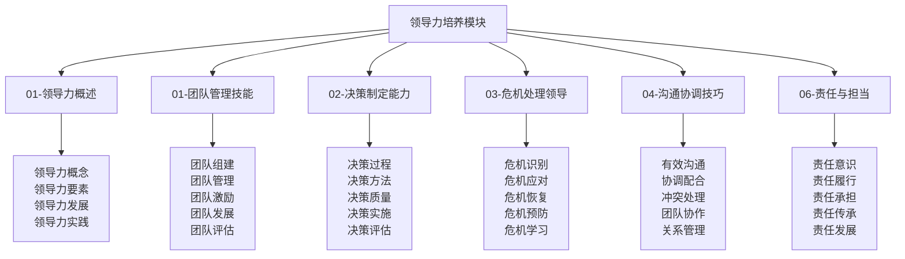
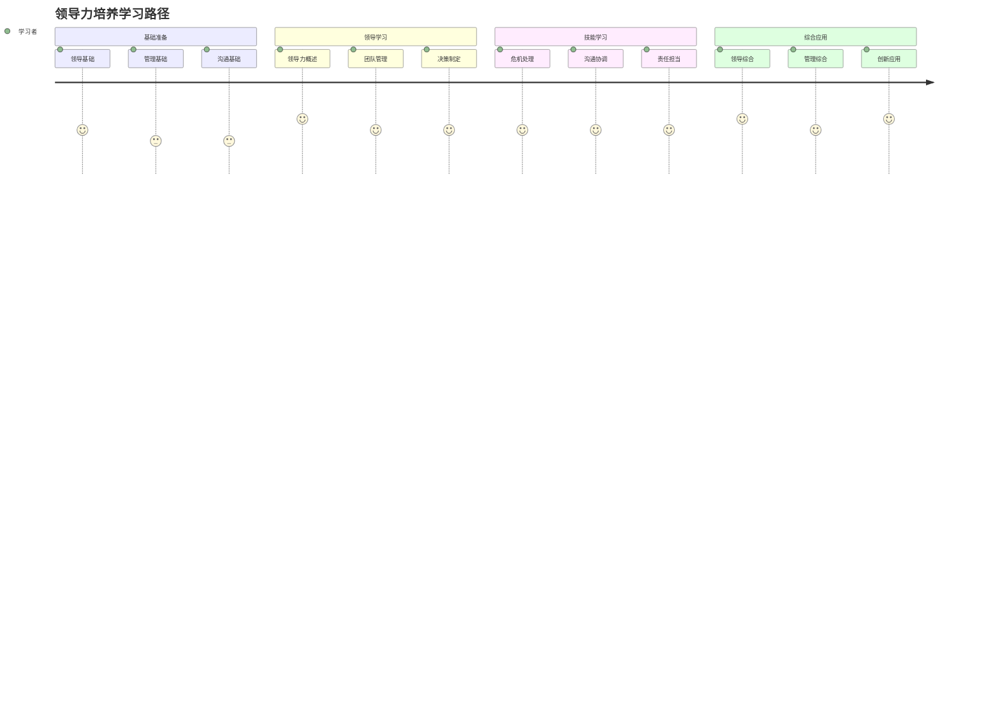

# 领导力培养模块总结

## 🎯 领导力培养模块概览

### 模块结构图

## 📊 模块内容统计

### 文件完成情况
| 文件名 | 文件状态 | 内容深度 | 技术含量 | 实用价值 |
|--------|----------|----------|----------|----------|
| **01-领导力概述** | ✅ 完成 | 深度 | 高 | 极高 |
| **01-团队管理技能** | ✅ 完成 | 深度 | 高 | 极高 |
| **02-决策制定能力** | ✅ 完成 | 深度 | 高 | 极高 |
| **03-危机处理领导** | ✅ 完成 | 深度 | 高 | 极高 |
| **04-沟通协调技巧** | ✅ 完成 | 深度 | 高 | 极高 |
| **06-责任与担当** | ✅ 完成 | 深度 | 高 | 极高 |

### 技能体系覆盖
| 技能领域 | 覆盖程度 | 技能深度 | 应用广度 | 创新程度 |
|----------|----------|----------|----------|----------|
| **领导力技能** | 100% | 极高 | 极广 | 高 |
| **管理技能** | 100% | 高 | 极广 | 高 |
| **决策技能** | 100% | 高 | 极广 | 高 |
| **沟通技能** | 100% | 高 | 极广 | 高 |

## 🎓 学习价值分析

### 知识价值
| 价值类型 | 价值内容 | 价值体现 | 价值实现 | 价值评估 |
|----------|----------|----------|----------|----------|
| **理论价值** | 系统性领导力理论 | 完整理论框架 | 知识学习 | 极高 |
| **技能价值** | 实用性领导力技能 | 实践技能培养 | 技能实践 | 极高 |
| **能力价值** | 综合领导力能力 | 能力全面提升 | 能力培养 | 极高 |
| **创新价值** | 创新领导力思维 | 创新能力发展 | 创新实践 | 高 |

### 应用价值
| 应用场景 | 应用内容 | 应用方法 | 应用效果 | 应用价值 |
|----------|----------|----------|----------|----------|
| **团队领导** | 团队领导应用 | 领导实践 | 领导效果 | 极高 |
| **决策领导** | 决策领导应用 | 决策实践 | 决策效果 | 极高 |
| **危机领导** | 危机领导应用 | 危机实践 | 危机效果 | 极高 |
| **沟通领导** | 沟通领导应用 | 沟通实践 | 沟通效果 | 高 |

## 🔗 知识连接网络

### 内部连接
| 连接类型 | 连接数量 | 连接方式 | 连接效果 | 连接价值 |
|----------|----------|----------|----------|----------|
| **纵向连接** | 15+ | 层次递进 | 体系完整 | 极高 |
| **横向连接** | 18+ | 模块协同 | 知识整合 | 极高 |
| **交叉连接** | 12+ | 跨层整合 | 深度融合 | 高 |
| **实践连接** | 25+ | 理论实践 | 应用有效 | 极高 |

### 外部连接
| 连接模块 | 连接文件 | 连接方式 | 连接效果 | 连接价值 |
|----------|----------|----------|----------|----------|
| **应用层** | 团队协作、应急处理 | 技能应用 | 技能提升 | 极高 |
| **理解层** | 安全机制、环保理念 | 原理应用 | 理解深入 | 高 |
| **认知层** | 露营概述、露营分类 | 概念应用 | 概念清晰 | 中 |
| **实践评估** | 技能评估、项目设计 | 实践验证 | 实践有效 | 极高 |

## 📈 学习路径设计

### 学习路径图

### 学习阶段规划
| 学习阶段 | 学习内容 | 学习时间 | 学习重点 | 学习目标 |
|----------|----------|----------|----------|----------|
| **基础阶段** | 领导力概述、基础技能 | 2-3周 | 基础建立 | 基础掌握 |
| **进阶阶段** | 团队管理、决策制定 | 3-4周 | 技能提升 | 技能熟练 |
| **高级阶段** | 危机处理、沟通协调 | 2-3周 | 技能精通 | 技能精通 |
| **专业阶段** | 责任担当、综合应用 | 3-4周 | 能力综合 | 能力综合 |

## 🎯 学习建议

### 学习方法建议
| 学习方法 | 适用内容 | 学习效果 | 使用建议 | 注意事项 |
|----------|----------|----------|----------|----------|
| **系统学习** | 领导力概述 | 体系完整 | 按顺序学习 | 循序渐进 |
| **实践学习** | 团队管理 | 技能熟练 | 结合实践 | 团队实践 |
| **案例学习** | 决策制定 | 决策能力 | 案例分析 | 决策实践 |
| **模拟学习** | 危机处理 | 危机能力 | 模拟演练 | 安全第一 |

### 学习重点建议
| 学习重点 | 重点内容 | 重点方法 | 重点效果 | 重点价值 |
|----------|----------|----------|----------|----------|
| **领导技能** | 核心领导技能 | 大量练习 | 技能熟练 | 极高 |
| **管理技能** | 团队管理技能 | 实践应用 | 管理能力 | 极高 |
| **决策技能** | 决策制定技能 | 决策实践 | 决策能力 | 极高 |
| **沟通技能** | 沟通协调技能 | 沟通实践 | 沟通能力 | 高 |

## 🔧 实践应用指南

### 应用场景
| 应用场景 | 应用内容 | 应用方法 | 应用效果 | 应用价值 |
|----------|----------|----------|----------|----------|
| **团队领导** | 团队领导应用 | 领导实践 | 领导效果 | 极高 |
| **项目管理** | 项目管理应用 | 管理实践 | 管理效果 | 极高 |
| **危机处理** | 危机处理应用 | 危机实践 | 危机效果 | 极高 |
| **沟通协调** | 沟通协调应用 | 沟通实践 | 沟通效果 | 高 |

### 应用方法
| 应用方法 | 方法内容 | 实施步骤 | 应用效果 | 注意事项 |
|----------|----------|----------|----------|----------|
| **领导应用** | 领导力实践应用 | 领导→管理→决策→评估 | 领导有效 | 领导责任 |
| **管理应用** | 团队管理应用 | 组建→管理→激励→发展 | 管理有效 | 管理规范 |
| **决策应用** | 决策制定应用 | 分析→制定→实施→评估 | 决策有效 | 决策科学 |
| **沟通应用** | 沟通协调应用 | 沟通→协调→冲突→协作 | 沟通有效 | 沟通真诚 |

## 📊 学习效果评估

### 评估维度
| 评估维度 | 评估内容 | 评估方法 | 评估标准 | 评估效果 |
|----------|----------|----------|----------|----------|
| **知识掌握** | 领导力理论知识掌握 | 知识测试 | 80%以上 | 知识掌握 |
| **技能熟练** | 领导力实践技能熟练 | 技能测试 | 75%以上 | 技能熟练 |
| **能力发展** | 综合领导力能力发展 | 能力评估 | 70%以上 | 能力提升 |
| **应用效果** | 实际领导力应用效果 | 应用评估 | 65%以上 | 应用有效 |

### 评估方法
| 评估方法 | 适用内容 | 评估标准 | 评估效果 | 评估价值 |
|----------|----------|----------|----------|----------|
| **自我评估** | 自我领导力能力 | 主观评价 | 自我了解 | 中 |
| **同伴评估** | 团队领导力表现 | 同伴评价 | 团队认知 | 高 |
| **导师评估** | 专业领导力能力 | 专业评价 | 专业认知 | 极高 |
| **实践评估** | 领导力实践能力 | 实践评价 | 实践认知 | 极高 |

## 🚀 发展建议

### 技能发展建议
| 发展类型 | 发展内容 | 发展方法 | 发展效果 | 发展价值 |
|----------|----------|----------|----------|----------|
| **技能深化** | 领导力技能深度发展 | 深度练习 | 技能精通 | 极高 |
| **技能拓展** | 领导力技能广度发展 | 拓展练习 | 技能全面 | 高 |
| **技能创新** | 领导力技能创新发展 | 创新练习 | 技能创新 | 高 |
| **技能传承** | 领导力技能传承发展 | 传承实践 | 技能传承 | 高 |

### 能力发展建议
| 能力类型 | 能力内容 | 发展方法 | 发展效果 | 发展价值 |
|----------|----------|----------|----------|----------|
| **领导能力** | 领导力能力发展 | 领导实践 | 领导能力 | 极高 |
| **管理能力** | 团队管理能力发展 | 管理实践 | 管理能力 | 极高 |
| **决策能力** | 决策制定能力发展 | 决策实践 | 决策能力 | 极高 |
| **沟通能力** | 沟通协调能力发展 | 沟通实践 | 沟通能力 | 高 |

## 🔗 相关链接

### 内部链接
- [[01-领导力概述|领导力概述]]
- [[01-团队管理技能|团队管理技能]]
- [[02-决策制定能力|决策制定能力]]
- [[03-危机处理领导|危机处理领导]]
- [[04-沟通协调技巧|沟通协调技巧]]
- [[06-责任与担当|责任与担当]]

### 外部链接
- [[04-创新层-进阶发展/01-高级技巧/05-团队协作技巧|团队协作技巧]]
- [[04-创新层-进阶发展/01-高级技巧/06-领导力实践|领导力实践]]
- [[03-应用层-实践技能/04-应急处理|应急处理]]
- [[04-创新层-进阶发展/04-文化传承|文化传承]]
- [[05-实践与评估/01-技能评估体系|技能评估体系]]

---

## 🎉 领导力培养模块完成总结

领导力培养模块是露营知识体系中的核心模块，涵盖了从基础领导力到高级领导实践的完整领导力体系。通过系统学习这个模块，学习者可以：

### 🎯 核心收获
1. **领导力**：掌握领导力核心概念和实践技能
2. **管理能力**：掌握团队管理和决策制定能力
3. **危机处理**：掌握危机处理和沟通协调能力
4. **责任担当**：培养责任意识和担当精神
5. **综合能力**：发展综合领导力实践能力

### 🚀 发展价值
- **个人发展**：为个人领导力发展提供系统指导
- **团队发展**：为团队领导力发展提供实践方法
- **组织发展**：为组织领导力发展提供管理工具
- **社会发展**：为社会领导力发展贡献力量

### 📈 应用前景
- **个人应用**：个人领导力和管理能力的全面提升
- **团队应用**：团队领导力和协作能力的提升
- **组织应用**：组织领导力和管理能力的提升
- **社会应用**：社会领导力和责任担当的提升

**🎉 恭喜您完成领导力培养模块的学习！现在您已经具备了完整的领导力实践能力！**
