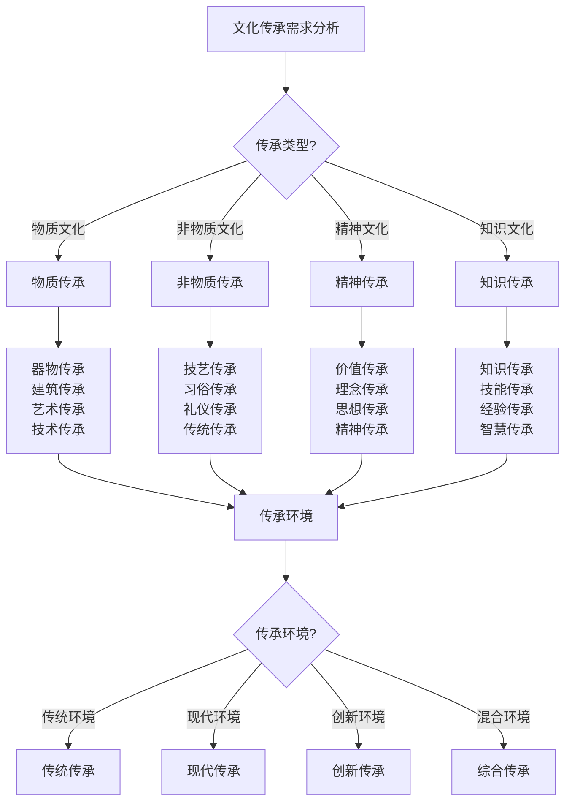

# 文化传承

## 🏛️ 文化传承概述

### 1. 文化内涵
- **文化定义**：文化概念、文化内涵、文化特征、文化价值
- **文化层次**：物质文化、制度文化、精神文化、行为文化
- **文化功能**：文化功能、社会功能、教育功能、发展功能
- **文化价值**：文化价值、历史价值、现实价值、未来价值
- **文化意义**：文化意义、个人意义、社会意义、人类意义
- **文化影响**：文化影响、社会影响、历史影响、发展影响

### 2. 传承机制
- **传承方式**：传承方式、传承方法、传承途径、传承手段
- **传承主体**：传承主体、传承者、传承对象、传承环境
- **传承内容**：传承内容、文化内容、知识内容、技能内容
- **传承过程**：传承过程、传承阶段、传承环节、传承机制
- **传承效果**：传承效果、传承质量、传承影响、传承价值
- **传承发展**：传承发展、传承创新、传承改进、传承优化

### 3. 传承类型
- **物质传承**：物质传承、器物传承、建筑传承、艺术传承
- **非物质传承**：非物质传承、技艺传承、知识传承、文化传承
- **精神传承**：精神传承、价值传承、理念传承、思想传承
- **行为传承**：行为传承、习俗传承、礼仪传承、传统传承
- **知识传承**：知识传承、技能传承、经验传承、智慧传承
- **创新传承**：创新传承、发展传承、现代传承、未来传承

### 4. 传承发展
- **传承保护**：传承保护、文化保护、遗产保护、传统保护
- **传承发展**：传承发展、文化发展、创新发展、现代发展
- **传承创新**：传承创新、文化创新、方法创新、内容创新
- **传承教育**：传承教育、文化教育、传统教育、现代教育
- **传承研究**：传承研究、文化研究、传统研究、现代研究
- **传承实践**：传承实践、文化实践、传统实践、现代实践

## 🎨 美学教育实践

### 1. 美学基础
- **美学理论**：美学理论、美学原理、美学方法、美学应用
- **审美教育**：审美教育、审美培养、审美能力、审美品味
- **美学实践**：美学实践、审美实践、艺术实践、文化实践
- **美学创新**：美学创新、审美创新、艺术创新、文化创新
- **美学发展**：美学发展、审美发展、艺术发展、文化发展
- **美学传承**：美学传承、审美传承、艺术传承、文化传承

### 2. 艺术教育
- **艺术理论**：艺术理论、艺术原理、艺术方法、艺术应用
- **艺术技能**：艺术技能、艺术技巧、艺术方法、艺术实践
- **艺术创作**：艺术创作、创作方法、创作技巧、创作实践
- **艺术欣赏**：艺术欣赏、欣赏方法、欣赏技巧、欣赏实践
- **艺术评价**：艺术评价、评价标准、评价方法、评价实践
- **艺术发展**：艺术发展、创作发展、欣赏发展、评价发展

### 3. 文化教育
- **文化理论**：文化理论、文化原理、文化方法、文化应用
- **文化知识**：文化知识、文化内容、文化内涵、文化价值
- **文化技能**：文化技能、文化技巧、文化方法、文化实践
- **文化实践**：文化实践、文化应用、文化体验、文化参与
- **文化创新**：文化创新、创新方法、创新实践、创新发展
- **文化传承**：文化传承、传承方法、传承实践、传承发展

### 4. 教育实践
- **教育理论**：教育理论、教育原理、教育方法、教育应用
- **教育实践**：教育实践、教学方法、学习方法、评价方法
- **教育创新**：教育创新、教学创新、学习创新、评价创新
- **教育发展**：教育发展、教学发展、学习发展、评价发展
- **教育传承**：教育传承、教学传承、学习传承、文化传承
- **教育影响**：教育影响、教学影响、学习影响、社会影响

## 🚀 创新文化发展

### 1. 创新理念
- **创新思维**：创新思维、思维方法、思维技巧、思维实践
- **创新理念**：创新理念、理念内涵、理念价值、理念实践
- **创新精神**：创新精神、精神内涵、精神价值、精神实践
- **创新文化**：创新文化、文化内涵、文化价值、文化实践
- **创新价值**：创新价值、价值内涵、价值意义、价值实现
- **创新影响**：创新影响、社会影响、文化影响、发展影响

### 2. 创新实践
- **创新方法**：创新方法、方法创新、技术创新、管理创新
- **创新实践**：创新实践、实践创新、应用创新、体验创新
- **创新应用**：创新应用、应用创新、技术应用、管理应用
- **创新效果**：创新效果、效果评估、效果改进、效果发展
- **创新影响**：创新影响、社会影响、文化影响、发展影响
- **创新发展**：创新发展、发展创新、持续创新、全面创新

### 3. 创新管理
- **创新管理**：创新管理、管理创新、组织创新、制度创新
- **创新组织**：创新组织、组织创新、团队创新、文化创新
- **创新制度**：创新制度、制度创新、机制创新、体系创新
- **创新环境**：创新环境、环境创新、氛围创新、文化创新
- **创新激励**：创新激励、激励创新、动力创新、机制创新
- **创新发展**：创新发展、发展创新、持续创新、全面创新

### 4. 创新传承
- **创新传承**：创新传承、传承创新、文化传承、价值传承
- **创新教育**：创新教育、教育创新、培训创新、学习创新
- **创新研究**：创新研究、研究创新、理论创新、方法创新
- **创新实践**：创新实践、实践创新、应用创新、体验创新
- **创新发展**：创新发展、发展创新、持续创新、全面创新
- **创新影响**：创新影响、社会影响、文化影响、发展影响

## 📚 终身学习体系

### 1. 学习理念
- **学习理念**：学习理念、理念内涵、理念价值、理念实践
- **学习态度**：学习态度、态度培养、态度发展、态度实践
- **学习动机**：学习动机、动机激发、动机维持、动机发展
- **学习目标**：学习目标、目标设定、目标实现、目标发展
- **学习价值**：学习价值、价值认知、价值实现、价值发展
- **学习影响**：学习影响、个人影响、社会影响、发展影响

### 2. 学习方法
- **学习方法**：学习方法、方法创新、技巧创新、工具创新
- **学习策略**：学习策略、策略制定、策略实施、策略优化
- **学习技巧**：学习技巧、技巧掌握、技巧应用、技巧创新
- **学习工具**：学习工具、工具使用、工具创新、工具发展
- **学习环境**：学习环境、环境营造、环境优化、环境创新
- **学习资源**：学习资源、资源利用、资源开发、资源创新

### 3. 学习实践
- **学习实践**：学习实践、实践学习、应用学习、体验学习
- **学习应用**：学习应用、应用学习、实践应用、创新应用
- **学习创新**：学习创新、创新学习、方法创新、内容创新
- **学习发展**：学习发展、发展学习、持续学习、全面学习
- **学习评估**：学习评估、评估学习、效果评估、质量评估
- **学习改进**：学习改进、改进学习、持续改进、全面改进

### 4. 学习文化
- **学习文化**：学习文化、文化学习、氛围学习、环境学习
- **学习组织**：学习组织、组织学习、团队学习、集体学习
- **学习制度**：学习制度、制度学习、机制学习、体系学习
- **学习激励**：学习激励、激励学习、动力学习、机制学习
- **学习传承**：学习传承、传承学习、文化传承、价值传承
- **学习影响**：学习影响、社会影响、文化影响、发展影响

## 📊 文化传承对比

| 传承类型 | 传承难度 | 文化价值 | 社会影响 | 发展潜力 | 创新空间 | 推荐指数 |
|----------|----------|----------|----------|----------|----------|----------|
| **物质传承** | 中 | 高 | 中 | 中 | 中 | ⭐⭐⭐⭐ |
| **非物质传承** | 高 | 极高 | 高 | 高 | 高 | ⭐⭐⭐⭐⭐ |
| **精神传承** | 极高 | 极高 | 极高 | 极高 | 极高 | ⭐⭐⭐⭐⭐ |
| **知识传承** | 中 | 高 | 高 | 高 | 高 | ⭐⭐⭐⭐⭐ |
| **创新传承** | 极高 | 极高 | 极高 | 极高 | 极高 | ⭐⭐⭐⭐⭐ |

## 🎯 文化传承决策树

## 🎓 费曼学习法应用

### 第一步：选择概念
选择"文化传承"作为学习概念

### 第二步：教授他人
用简单语言解释：
> "文化传承是露营活动的高级价值：包括物质传承、非物质传承、精神传承、知识传承。通过美学教育、创新文化、终身学习，实现文化的保护、发展、创新和传承。"

### 第三步：回顾简化
- **文化内涵**：文化定义、文化层次、文化功能、文化价值
- **美学教育**：美学基础、艺术教育、文化教育、教育实践
- **创新文化**：创新理念、创新实践、创新管理、创新传承
- **终身学习**：学习理念、学习方法、学习实践、学习文化

### 第四步：组织优化
建立文化传承与技能的关系：
- 文化内涵 → [[01-认知层-基础概念/03-历史与文化|历史文化]]
- 美学教育 → [[01-认知层-基础概念/04-价值与意义|价值意义]]
- 创新文化 → [[04-创新层-进阶发展/01-高级技巧|高级技巧]]
- 终身学习 → [[04-创新层-进阶发展/03-领导力培养|领导力培养]]

## 🏃‍♂️ 刻意练习要点

### 文化传承练习
1. **理论学习**：学习文化传承理论
2. **实践练习**：练习文化传承实践
3. **创新应用**：进行文化创新应用
4. **持续发展**：持续发展文化传承

### 实践验证
- **传承测试**：测试文化传承效果
- **创新测试**：测试文化创新能力
- **教育测试**：测试美学教育效果
- **持续改进**：持续改进文化传承

## 🔗 文化传承与技能的关系

### 文化内涵技能
- **文化技能**：[[01-认知层-基础概念/03-历史与文化|历史文化]]
- **价值技能**：[[01-认知层-基础概念/04-价值与意义|价值意义]]
- **传承技能**：[[04-创新层-进阶发展/04-文化传承|文化传承]]
- **发展技能**：[[04-创新层-进阶发展/04-文化传承/03-创新文化发展|创新文化]]

### 美学教育技能
- **美学技能**：[[04-创新层-进阶发展/01-高级技巧|高级技巧]]
- **教育技能**：[[04-创新层-进阶发展/03-领导力培养|领导力培养]]
- **艺术技能**：[[04-创新层-进阶发展/01-高级技巧|高级技巧]]
- **文化技能**：[[04-创新层-进阶发展/04-文化传承|文化传承]]

### 创新文化技能
- **创新技能**：[[04-创新层-进阶发展/01-高级技巧|高级技巧]]
- **文化技能**：[[04-创新层-进阶发展/04-文化传承|文化传承]]
- **管理技能**：[[04-创新层-进阶发展/03-领导力培养/01-团队管理技能|团队管理]]
- **发展技能**：[[04-创新层-进阶发展/04-文化传承/03-创新文化发展|创新文化]]

### 终身学习技能
- **学习技能**：[[04-创新层-进阶发展/04-文化传承/04-终身学习体系|终身学习]]
- **管理技能**：[[04-创新层-进阶发展/03-领导力培养/02-时间管理技能|时间管理]]
- **创新技能**：[[04-创新层-进阶发展/04-文化传承/03-创新文化发展|创新文化]]
- **传承技能**：[[04-创新层-进阶发展/04-文化传承|文化传承]]

## 📋 文化传承检查清单

### 文化内涵
- [ ] 了解文化定义
- [ ] 掌握文化层次
- [ ] 了解文化功能
- [ ] 掌握文化价值

### 美学教育
- [ ] 掌握美学基础
- [ ] 学会艺术教育
- [ ] 掌握文化教育
- [ ] 学会教育实践

### 创新文化
- [ ] 掌握创新理念
- [ ] 学会创新实践
- [ ] 掌握创新管理
- [ ] 学会创新传承

### 终身学习
- [ ] 掌握学习理念
- [ ] 学会学习方法
- [ ] 掌握学习实践
- [ ] 学会学习文化

## 🎯 文化传承策略

### 系统性策略
1. **保护传承**：保护文化、传承文化
2. **创新发展**：创新发展、文化发展
3. **教育实践**：教育实践、文化教育
4. **持续发展**：持续发展、文化发展

### 创新性策略
- **文化创新**：文化创新、传承创新
- **教育创新**：教育创新、方法创新
- **实践创新**：实践创新、应用创新
- **发展创新**：发展创新、持续创新

## 🔗 相关链接
- [[01-高级技巧|高级技巧]]
- [[02-专业配置|专业配置]]
- [[03-领导力培养|领导力培养]]
- [[01-认知层-基础概念/03-历史与文化|历史与文化]]
