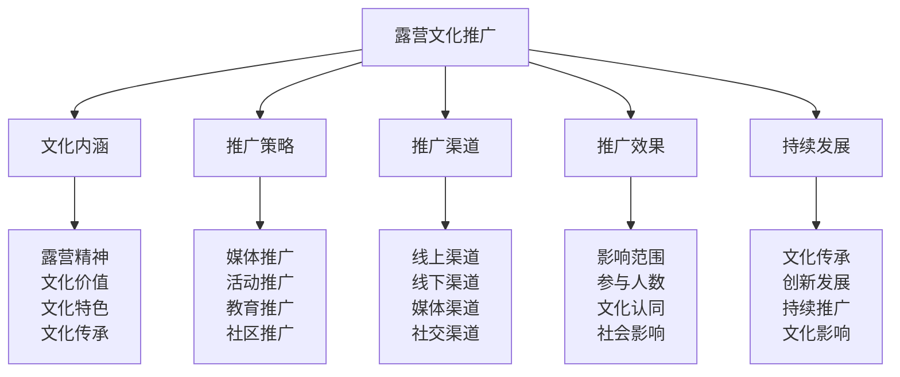

# 露营文化推广

## 🌟 露营文化推广核心框架

### 文化推广金字塔

## 🎯 文化内涵体系

### 露营精神内涵
| 精神要素 | 精神内容 | 精神体现 | 精神价值 | 精神传承 |
|----------|----------|----------|----------|----------|
| **探索精神** | 探索未知、挑战自我 | 勇于探索 | 个人成长 | 代代相传 |
| **团队精神** | 团队协作、互助友爱 | 团队合作 | 社会和谐 | 团队传承 |
| **环保精神** | 保护环境、可持续发展 | 环保行动 | 生态保护 | 环保传承 |
| **坚韧精神** | 坚韧不拔、永不放弃 | 坚持到底 | 意志品质 | 精神传承 |

### 文化价值体系
| 价值类型 | 价值内容 | 价值体现 | 价值意义 | 价值影响 |
|----------|----------|----------|----------|----------|
| **教育价值** | 技能教育、品格教育 | 教育功能 | 人才培养 | 教育影响 |
| **健康价值** | 身心健康、生活方式 | 健康促进 | 健康生活 | 健康影响 |
| **社会价值** | 社会和谐、文化交流 | 社会功能 | 社会进步 | 社会影响 |
| **经济价值** | 产业发展、就业创造 | 经济功能 | 经济发展 | 经济影响 |

### 文化特色体系
| 特色类型 | 特色内容 | 特色体现 | 特色优势 | 特色传承 |
|----------|----------|----------|----------|----------|
| **自然特色** | 亲近自然、回归自然 | 自然环境 | 自然优势 | 自然传承 |
| **技能特色** | 实用技能、生存技能 | 技能培养 | 技能优势 | 技能传承 |
| **体验特色** | 独特体验、深度体验 | 体验感受 | 体验优势 | 体验传承 |
| **文化特色** | 文化内涵、精神内涵 | 文化深度 | 文化优势 | 文化传承 |

### 文化传承体系
| 传承要素 | 传承内容 | 传承方法 | 传承标准 | 传承效果 |
|----------|----------|----------|----------|----------|
| **知识传承** | 露营知识、技能知识 | 知识传授 | 传承完整 | 知识传承 |
| **技能传承** | 露营技能、生存技能 | 技能传授 | 传承完整 | 技能传承 |
| **精神传承** | 露营精神、文化精神 | 精神熏陶 | 传承深入 | 精神传承 |
| **文化传承** | 露营文化、传统文化 | 文化传播 | 传承广泛 | 文化传承 |

## 📢 推广策略体系

### 媒体推广策略
| 媒体类型 | 推广内容 | 推广方法 | 推广标准 | 推广效果 |
|----------|----------|----------|----------|----------|
| **传统媒体** | 电视、广播、报纸 | 媒体报道 | 传播广泛 | 影响广泛 |
| **网络媒体** | 网站、博客、论坛 | 网络传播 | 传播快速 | 影响快速 |
| **社交媒体** | 微博、微信、抖音 | 社交传播 | 传播互动 | 影响互动 |
| **专业媒体** | 户外杂志、专业网站 | 专业传播 | 传播专业 | 影响专业 |

### 活动推广策略
| 活动类型 | 活动内容 | 活动方法 | 活动标准 | 活动效果 |
|----------|----------|----------|----------|----------|
| **体验活动** | 露营体验、技能体验 | 体验参与 | 体验丰富 | 参与积极 |
| **比赛活动** | 技能比赛、知识竞赛 | 比赛竞争 | 比赛激烈 | 竞争激烈 |
| **培训活动** | 技能培训、知识培训 | 培训学习 | 培训专业 | 学习有效 |
| **交流活动** | 经验交流、文化交流 | 交流分享 | 交流深入 | 分享充分 |

### 教育推广策略
| 教育类型 | 教育内容 | 教育方法 | 教育标准 | 教育效果 |
|----------|----------|----------|----------|----------|
| **学校教育** | 户外教育、生存教育 | 课程教育 | 教育系统 | 教育系统 |
| **社会教育** | 公众教育、社区教育 | 社会教育 | 教育广泛 | 教育广泛 |
| **家庭教育** | 亲子教育、家庭活动 | 家庭教育 | 教育温馨 | 教育温馨 |
| **自我教育** | 自主学习、自我提升 | 自我教育 | 教育主动 | 教育主动 |

### 社区推广策略
| 社区类型 | 推广内容 | 推广方法 | 推广标准 | 推广效果 |
|----------|----------|----------|----------|----------|
| **线上社区** | 网络社区、社交群组 | 社区互动 | 互动活跃 | 社区活跃 |
| **线下社区** | 实体社区、邻里社区 | 社区活动 | 活动丰富 | 社区丰富 |
| **专业社区** | 户外社区、专业组织 | 专业交流 | 交流专业 | 社区专业 |
| **兴趣社区** | 兴趣小组、爱好群体 | 兴趣分享 | 分享充分 | 社区充分 |

## 🌐 推广渠道体系

### 线上推广渠道
| 渠道类型 | 渠道特点 | 推广方法 | 推广优势 | 推广效果 |
|----------|----------|----------|----------|----------|
| **官方网站** | 权威性、专业性 | 内容发布 | 权威专业 | 影响权威 |
| **社交媒体** | 互动性、传播性 | 内容分享 | 传播快速 | 影响快速 |
| **视频平台** | 直观性、生动性 | 视频制作 | 内容生动 | 影响生动 |
| **知识平台** | 知识性、学习性 | 知识分享 | 知识丰富 | 影响知识 |

### 线下推广渠道
| 渠道类型 | 渠道特点 | 推广方法 | 推广优势 | 推广效果 |
|----------|----------|----------|----------|----------|
| **户外店** | 专业性、体验性 | 产品展示 | 专业体验 | 影响专业 |
| **学校机构** | 教育性、系统性 | 课程合作 | 教育系统 | 影响教育 |
| **社区中心** | 社区性、便民性 | 社区活动 | 社区便民 | 影响社区 |
| **公园景区** | 自然性、体验性 | 活动组织 | 自然体验 | 影响自然 |

### 媒体推广渠道
| 渠道类型 | 渠道特点 | 推广方法 | 推广优势 | 推广效果 |
|----------|----------|----------|----------|----------|
| **电视媒体** | 权威性、广泛性 | 节目制作 | 传播广泛 | 影响广泛 |
| **广播媒体** | 即时性、互动性 | 节目参与 | 互动即时 | 影响即时 |
| **报纸杂志** | 深度性、专业性 | 文章发表 | 内容深度 | 影响深度 |
| **网络媒体** | 快速性、互动性 | 内容发布 | 传播快速 | 影响快速 |

### 社交推广渠道
| 渠道类型 | 渠道特点 | 推广方法 | 推广优势 | 推广效果 |
|----------|----------|----------|----------|----------|
| **朋友圈** | 私密性、信任性 | 内容分享 | 信任度高 | 影响信任 |
| **微信群** | 群体性、互动性 | 群组交流 | 互动活跃 | 影响活跃 |
| **QQ群** | 组织性、专业性 | 群组管理 | 组织有序 | 影响有序 |
| **论坛社区** | 讨论性、专业性 | 话题讨论 | 讨论深入 | 影响深入 |

## 📊 推广效果评估

### 影响范围评估
| 评估维度 | 评估内容 | 评估方法 | 评估标准 | 评估效果 |
|----------|----------|----------|----------|----------|
| **地理范围** | 推广地理覆盖 | 地理分析 | 覆盖广泛 | 影响广泛 |
| **人群范围** | 推广人群覆盖 | 人群分析 | 覆盖全面 | 影响全面 |
| **年龄范围** | 推广年龄覆盖 | 年龄分析 | 覆盖全龄 | 影响全龄 |
| **职业范围** | 推广职业覆盖 | 职业分析 | 覆盖全职业 | 影响全职业 |

### 参与人数评估
| 评估类型 | 评估内容 | 评估方法 | 评估标准 | 评估效果 |
|----------|----------|----------|----------|----------|
| **线上参与** | 线上活动参与 | 数据统计 | 参与活跃 | 参与活跃 |
| **线下参与** | 线下活动参与 | 数据统计 | 参与积极 | 参与积极 |
| **持续参与** | 持续参与情况 | 跟踪统计 | 参与持续 | 参与持续 |
| **深度参与** | 深度参与情况 | 深度分析 | 参与深入 | 参与深入 |

### 文化认同评估
| 评估要素 | 评估内容 | 评估方法 | 评估标准 | 评估效果 |
|----------|----------|----------|----------|----------|
| **理念认同** | 文化理念认同 | 认同调查 | 认同度高 | 认同度高 |
| **行为认同** | 文化行为认同 | 行为观察 | 认同深入 | 认同深入 |
| **价值认同** | 文化价值认同 | 价值调查 | 认同一致 | 认同一致 |
| **传承认同** | 文化传承认同 | 传承调查 | 认同持续 | 认同持续 |

### 社会影响评估
| 影响类型 | 影响内容 | 影响方法 | 影响标准 | 影响效果 |
|----------|----------|----------|----------|----------|
| **教育影响** | 教育领域影响 | 教育分析 | 影响积极 | 影响积极 |
| **健康影响** | 健康领域影响 | 健康分析 | 影响积极 | 影响积极 |
| **环保影响** | 环保领域影响 | 环保分析 | 影响积极 | 影响积极 |
| **经济影响** | 经济领域影响 | 经济分析 | 影响积极 | 影响积极 |

## 🔄 持续发展体系

### 文化传承发展
| 发展要素 | 发展内容 | 发展方法 | 发展标准 | 发展效果 |
|----------|----------|----------|----------|----------|
| **传承机制** | 文化传承机制 | 机制建设 | 机制完善 | 传承持续 |
| **传承人才** | 文化传承人才 | 人才培养 | 人才充足 | 传承有力 |
| **传承内容** | 文化传承内容 | 内容更新 | 内容丰富 | 传承丰富 |
| **传承方式** | 文化传承方式 | 方式创新 | 方式多样 | 传承多样 |

### 创新发展体系
| 创新要素 | 创新内容 | 创新方法 | 创新标准 | 创新效果 |
|----------|----------|----------|----------|----------|
| **理念创新** | 文化理念创新 | 理念更新 | 理念先进 | 创新先进 |
| **方法创新** | 推广方法创新 | 方法更新 | 方法先进 | 创新先进 |
| **内容创新** | 推广内容创新 | 内容更新 | 内容先进 | 创新先进 |
| **渠道创新** | 推广渠道创新 | 渠道更新 | 渠道先进 | 创新先进 |

### 持续推广体系
| 推广要素 | 推广内容 | 推广方法 | 推广标准 | 推广效果 |
|----------|----------|----------|----------|----------|
| **推广计划** | 持续推广计划 | 计划制定 | 计划完整 | 推广持续 |
| **推广资源** | 推广资源配置 | 资源配置 | 资源充足 | 推广有力 |
| **推广团队** | 推广团队建设 | 团队建设 | 团队专业 | 推广专业 |
| **推广评估** | 推广效果评估 | 效果评估 | 评估客观 | 推广有效 |

### 文化影响体系
| 影响要素 | 影响内容 | 影响方法 | 影响标准 | 影响效果 |
|----------|----------|----------|----------|----------|
| **个人影响** | 个人文化影响 | 个人影响 | 影响积极 | 影响积极 |
| **家庭影响** | 家庭文化影响 | 家庭影响 | 影响积极 | 影响积极 |
| **社会影响** | 社会文化影响 | 社会影响 | 影响积极 | 影响积极 |
| **时代影响** | 时代文化影响 | 时代影响 | 影响深远 | 影响深远 |

## 🎓 费曼学习法应用

### 第一步：选择概念
选择"露营文化推广"作为学习概念

### 第二步：教授他人
用简单语言解释：
> "露营文化推广就是让更多人了解和参与露营文化的过程，包括文化内涵、推广策略、推广渠道、推广效果、持续发展。关键是传播露营精神，推广文化价值，扩大社会影响。"

### 第三步：回顾简化
- **文化内涵**：露营精神、文化价值、文化特色、文化传承
- **推广策略**：媒体推广、活动推广、教育推广、社区推广
- **推广渠道**：线上渠道、线下渠道、媒体渠道、社交渠道
- **推广效果**：影响范围、参与人数、文化认同、社会影响
- **持续发展**：文化传承、创新发展、持续推广、文化影响

### 第四步：组织优化
建立文化推广与技能的关系：
- 文化内涵 → [[01-认知层-基础概念/04-价值与意义|价值意义]]
- 推广策略 → [[04-创新层-进阶发展/03-领导力培养/04-沟通协调技巧|沟通协调]]
- 推广渠道 → [[04-创新层-进阶发展/04-文化传承/04-知识分享平台|知识分享]]
- 推广效果 → [[05-实践与评估/01-技能评估体系|技能评估]]
- 持续发展 → [[05-实践与评估/03-持续改进|持续改进]]

## 🏃‍♂️ 刻意练习要点

### 文化推广练习
1. **内涵练习**：练习文化内涵理解
2. **策略练习**：练习推广策略制定
3. **渠道练习**：练习推广渠道运用
4. **效果练习**：练习推广效果评估

### 练习方法
- **理论学习**：学习文化推广理论
- **案例分析**：分析文化推广案例
- **实践推广**：实际进行文化推广
- **效果评估**：评估推广效果

### 实践验证
- **推广测试**：测试文化推广能力
- **效果验证**：验证推广效果
- **影响评估**：评估文化影响
- **持续改进**：持续改进推广方法

## 📋 文化推广检查清单

### 文化内涵检查
- [ ] 露营精神是否明确
- [ ] 文化价值是否清晰
- [ ] 文化特色是否突出
- [ ] 文化传承是否有效

### 推广策略检查
- [ ] 媒体推广是否有效
- [ ] 活动推广是否丰富
- [ ] 教育推广是否系统
- [ ] 社区推广是否活跃

### 推广渠道检查
- [ ] 线上渠道是否完善
- [ ] 线下渠道是否丰富
- [ ] 媒体渠道是否权威
- [ ] 社交渠道是否活跃

### 推广效果检查
- [ ] 影响范围是否广泛
- [ ] 参与人数是否众多
- [ ] 文化认同是否深入
- [ ] 社会影响是否积极

### 持续发展检查
- [ ] 文化传承是否持续
- [ ] 创新发展是否活跃
- [ ] 持续推广是否有效
- [ ] 文化影响是否深远

## 🎯 文化推广策略

### 推广策略
1. **内涵先行**：先明确文化内涵
2. **策略系统**：制定系统推广策略
3. **渠道多元**：运用多元推广渠道
4. **效果导向**：以效果为导向推广

### 发展策略
- **文化发展**：持续发展文化内涵
- **策略发展**：持续发展推广策略
- **渠道发展**：持续发展推广渠道
- **影响发展**：持续发展文化影响

## 🔗 相关链接
- [[01-文化传承概述|文化传承概述]]
- [[02-新手指导方法|新手指导方法]]
- [[03-社区建设参与|社区建设参与]]
- [[04-知识分享平台|知识分享平台]]
- [[01-认知层-基础概念/04-价值与意义|价值意义]]
- [[04-创新层-进阶发展/03-领导力培养/04-沟通协调技巧|沟通协调技巧]]