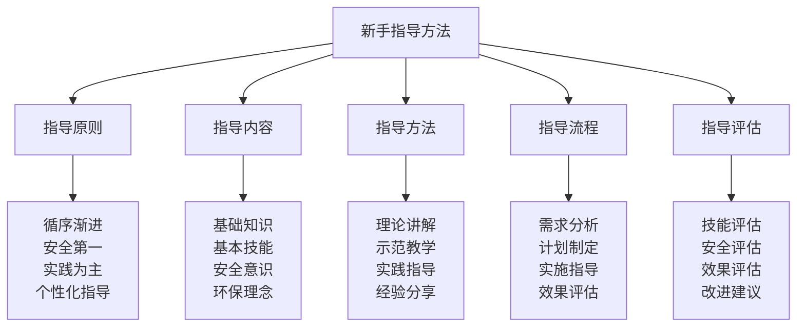

# 新手指导方法

## 👨‍🏫 新手指导核心框架

### 指导方法金字塔

## 🎯 指导原则体系

### 循序渐进原则
| 原则要素 | 原则内容 | 实施方法 | 实施标准 | 实施效果 |
|----------|----------|----------|----------|----------|
| **难度递进** | 从简单到复杂 | 难度分级 | 难度适中 | 学习有效 |
| **技能递进** | 从基础到高级 | 技能分级 | 技能匹配 | 技能提升 |
| **环境递进** | 从安全到挑战 | 环境分级 | 环境安全 | 环境适应 |
| **时间递进** | 从短期到长期 | 时间规划 | 时间合理 | 时间有效 |

### 安全第一原则
| 安全要素 | 安全内容 | 安全方法 | 安全标准 | 安全效果 |
|----------|----------|----------|----------|----------|
| **环境安全** | 环境风险评估 | 风险评估 | 风险可控 | 安全保障 |
| **装备安全** | 装备安全检查 | 安全检查 | 装备可靠 | 安全保障 |
| **行为安全** | 行为安全规范 | 安全规范 | 行为安全 | 安全保障 |
| **应急安全** | 应急安全准备 | 应急准备 | 应急充分 | 安全保障 |

### 实践为主原则
| 实践要素 | 实践内容 | 实践方法 | 实践标准 | 实践效果 |
|----------|----------|----------|----------|----------|
| **理论实践** | 理论与实践结合 | 实践教学 | 实践充分 | 学习有效 |
| **技能实践** | 技能实践训练 | 技能训练 | 训练充分 | 技能提升 |
| **环境实践** | 环境实践适应 | 环境适应 | 适应充分 | 环境适应 |
| **综合实践** | 综合实践应用 | 综合应用 | 应用充分 | 能力提升 |

### 个性化指导原则
| 个性要素 | 个性内容 | 个性方法 | 个性标准 | 个性效果 |
|----------|----------|----------|----------|----------|
| **能力个性** | 能力水平个性化 | 能力评估 | 能力匹配 | 指导有效 |
| **兴趣个性** | 兴趣爱好个性化 | 兴趣了解 | 兴趣匹配 | 指导有效 |
| **学习个性** | 学习方式个性化 | 学习分析 | 方式匹配 | 指导有效 |
| **目标个性** | 学习目标个性化 | 目标设定 | 目标匹配 | 指导有效 |

## 📚 指导内容体系

### 基础知识指导
| 知识类型 | 知识内容 | 指导方法 | 指导标准 | 指导效果 |
|----------|----------|----------|----------|----------|
| **露营概念** | 露营定义、内涵 | 概念讲解 | 概念清晰 | 理解准确 |
| **露营分类** | 露营类型、特点 | 分类讲解 | 分类清晰 | 理解准确 |
| **露营历史** | 露营发展、文化 | 历史讲解 | 历史完整 | 理解深入 |
| **露营价值** | 露营意义、价值 | 价值讲解 | 价值明确 | 理解深入 |

### 基本技能指导
| 技能类型 | 技能内容 | 指导方法 | 指导标准 | 指导效果 |
|----------|----------|----------|----------|----------|
| **装备技能** | 装备选择、使用 | 技能训练 | 技能熟练 | 技能掌握 |
| **搭建技能** | 帐篷搭建、营地建设 | 技能训练 | 技能熟练 | 技能掌握 |
| **生存技能** | 基本生存技能 | 技能训练 | 技能熟练 | 技能掌握 |
| **安全技能** | 安全防护技能 | 技能训练 | 技能熟练 | 技能掌握 |

### 安全意识指导
| 安全意识 | 意识内容 | 指导方法 | 指导标准 | 指导效果 |
|----------|----------|----------|----------|----------|
| **环境意识** | 环境安全意识 | 意识培养 | 意识强烈 | 安全意识 |
| **装备意识** | 装备安全意识 | 意识培养 | 意识强烈 | 安全意识 |
| **行为意识** | 行为安全意识 | 意识培养 | 意识强烈 | 安全意识 |
| **应急意识** | 应急安全意识 | 意识培养 | 意识强烈 | 安全意识 |

### 环保理念指导
| 环保理念 | 理念内容 | 指导方法 | 指导标准 | 指导效果 |
|----------|----------|----------|----------|----------|
| **环保意识** | 环境保护意识 | 理念培养 | 理念深入 | 环保意识 |
| **可持续理念** | 可持续发展理念 | 理念培养 | 理念深入 | 环保理念 |
| **生态理念** | 生态保护理念 | 理念培养 | 理念深入 | 环保理念 |
| **责任理念** | 环保责任理念 | 理念培养 | 理念深入 | 环保理念 |

## 🎓 指导方法体系

### 理论讲解方法
| 讲解要素 | 讲解内容 | 讲解方法 | 讲解标准 | 讲解效果 |
|----------|----------|----------|----------|----------|
| **概念讲解** | 基本概念讲解 | 概念教学 | 概念清晰 | 理解准确 |
| **原理讲解** | 基本原理讲解 | 原理教学 | 原理清晰 | 理解深入 |
| **方法讲解** | 基本方法讲解 | 方法教学 | 方法清晰 | 理解实用 |
| **技巧讲解** | 基本技巧讲解 | 技巧教学 | 技巧清晰 | 理解实用 |

### 示范教学方法
| 示范要素 | 示范内容 | 示范方法 | 示范标准 | 示范效果 |
|----------|----------|----------|----------|----------|
| **技能示范** | 基本技能示范 | 技能演示 | 示范标准 | 技能掌握 |
| **操作示范** | 基本操作示范 | 操作演示 | 示范标准 | 操作掌握 |
| **流程示范** | 基本流程示范 | 流程演示 | 示范标准 | 流程掌握 |
| **标准示范** | 基本标准示范 | 标准演示 | 示范标准 | 标准掌握 |

### 实践指导方法
| 实践要素 | 实践内容 | 实践方法 | 实践标准 | 实践效果 |
|----------|----------|----------|----------|----------|
| **技能实践** | 基本技能实践 | 实践训练 | 实践充分 | 技能提升 |
| **操作实践** | 基本操作实践 | 实践训练 | 实践充分 | 操作提升 |
| **环境实践** | 环境适应实践 | 实践训练 | 实践充分 | 环境适应 |
| **综合实践** | 综合能力实践 | 实践训练 | 实践充分 | 能力提升 |

### 经验分享方法
| 分享要素 | 分享内容 | 分享方法 | 分享标准 | 分享效果 |
|----------|----------|----------|----------|----------|
| **成功经验** | 成功经验分享 | 经验分享 | 分享充分 | 经验学习 |
| **失败教训** | 失败教训分享 | 教训分享 | 分享充分 | 教训学习 |
| **技巧经验** | 技巧经验分享 | 经验分享 | 分享充分 | 技巧学习 |
| **心得经验** | 心得体会分享 | 心得分享 | 分享充分 | 心得学习 |

## 🔄 指导流程体系

### 需求分析流程
| 分析要素 | 分析内容 | 分析方法 | 分析标准 | 分析效果 |
|----------|----------|----------|----------|----------|
| **能力分析** | 新手能力水平分析 | 能力评估 | 分析准确 | 能力了解 |
| **需求分析** | 新手需求分析 | 需求调研 | 分析准确 | 需求了解 |
| **目标分析** | 新手目标分析 | 目标设定 | 分析准确 | 目标明确 |
| **环境分析** | 新手环境分析 | 环境评估 | 分析准确 | 环境了解 |

### 计划制定流程
| 计划要素 | 计划内容 | 计划方法 | 计划标准 | 计划效果 |
|----------|----------|----------|----------|----------|
| **学习计划** | 学习计划制定 | 计划制定 | 计划合理 | 计划可行 |
| **技能计划** | 技能计划制定 | 计划制定 | 计划合理 | 计划可行 |
| **实践计划** | 实践计划制定 | 计划制定 | 计划合理 | 计划可行 |
| **评估计划** | 评估计划制定 | 计划制定 | 计划合理 | 计划可行 |

### 实施指导流程
| 实施要素 | 实施内容 | 实施方法 | 实施标准 | 实施效果 |
|----------|----------|----------|----------|----------|
| **理论实施** | 理论指导实施 | 理论教学 | 实施到位 | 理论掌握 |
| **技能实施** | 技能指导实施 | 技能训练 | 实施到位 | 技能掌握 |
| **实践实施** | 实践指导实施 | 实践训练 | 实施到位 | 实践掌握 |
| **评估实施** | 评估指导实施 | 评估测试 | 实施到位 | 评估准确 |

### 效果评估流程
| 评估要素 | 评估内容 | 评估方法 | 评估标准 | 评估效果 |
|----------|----------|----------|----------|----------|
| **技能评估** | 技能掌握评估 | 技能测试 | 评估客观 | 评估准确 |
| **知识评估** | 知识掌握评估 | 知识测试 | 评估客观 | 评估准确 |
| **能力评估** | 能力发展评估 | 能力测试 | 评估客观 | 评估准确 |
| **效果评估** | 指导效果评估 | 效果分析 | 评估客观 | 评估准确 |

## 📊 指导评估体系

### 技能评估方法
| 评估类型 | 评估内容 | 评估方法 | 评估标准 | 评估效果 |
|----------|----------|----------|----------|----------|
| **基础技能** | 基础技能掌握 | 技能测试 | 技能达标 | 评估准确 |
| **安全技能** | 安全技能掌握 | 技能测试 | 技能达标 | 评估准确 |
| **环保技能** | 环保技能掌握 | 技能测试 | 技能达标 | 评估准确 |
| **综合技能** | 综合技能掌握 | 技能测试 | 技能达标 | 评估准确 |

### 安全评估方法
| 评估要素 | 评估内容 | 评估方法 | 评估标准 | 评估效果 |
|----------|----------|----------|----------|----------|
| **安全意识** | 安全意识水平 | 意识测试 | 意识达标 | 评估准确 |
| **安全知识** | 安全知识掌握 | 知识测试 | 知识达标 | 评估准确 |
| **安全技能** | 安全技能掌握 | 技能测试 | 技能达标 | 评估准确 |
| **安全行为** | 安全行为表现 | 行为观察 | 行为安全 | 评估准确 |

### 效果评估方法
| 评估维度 | 评估内容 | 评估方法 | 评估标准 | 评估效果 |
|----------|----------|----------|----------|----------|
| **学习效果** | 学习效果评估 | 效果分析 | 效果良好 | 评估准确 |
| **技能效果** | 技能效果评估 | 效果分析 | 效果良好 | 评估准确 |
| **安全效果** | 安全效果评估 | 效果分析 | 效果良好 | 评估准确 |
| **综合效果** | 综合效果评估 | 效果分析 | 效果良好 | 评估准确 |

### 改进建议方法
| 改进要素 | 改进内容 | 改进方法 | 改进标准 | 改进效果 |
|----------|----------|----------|----------|----------|
| **方法改进** | 指导方法改进 | 方法优化 | 改进有效 | 改进成功 |
| **内容改进** | 指导内容改进 | 内容优化 | 改进有效 | 改进成功 |
| **流程改进** | 指导流程改进 | 流程优化 | 改进有效 | 改进成功 |
| **评估改进** | 评估方法改进 | 评估优化 | 改进有效 | 改进成功 |

## 🎓 费曼学习法应用

### 第一步：选择概念
选择"新手指导方法"作为学习概念

### 第二步：教授他人
用简单语言解释：
> "新手指导方法就是帮助露营新手快速掌握露营技能的方法，包括指导原则、指导内容、指导方法、指导流程、指导评估。关键是循序渐进、安全第一、实践为主、个性化指导。"

### 第三步：回顾简化
- **指导原则**：循序渐进、安全第一、实践为主、个性化指导
- **指导内容**：基础知识、基本技能、安全意识、环保理念
- **指导方法**：理论讲解、示范教学、实践指导、经验分享
- **指导流程**：需求分析、计划制定、实施指导、效果评估
- **指导评估**：技能评估、安全评估、效果评估、改进建议

### 第四步：组织优化
建立新手指导与技能的关系：
- 指导原则 → [[04-创新层-进阶发展/03-领导力培养/01-领导力概述|领导力]]
- 指导内容 → [[01-认知层-基础概念/01-露营概述|露营概述]]
- 指导方法 → [[04-创新层-进阶发展/03-领导力培养/04-沟通协调技巧|沟通协调]]
- 指导流程 → [[05-实践与评估/01-技能评估体系|技能评估]]
- 指导评估 → [[05-实践与评估/03-持续改进|持续改进]]

## 🏃‍♂️ 刻意练习要点

### 新手指导练习
1. **原则练习**：练习指导原则应用
2. **内容练习**：练习指导内容设计
3. **方法练习**：练习指导方法运用
4. **流程练习**：练习指导流程执行

### 练习方法
- **理论学习**：学习新手指导理论
- **案例分析**：分析新手指导案例
- **实践指导**：实际指导新手
- **效果评估**：评估指导效果

### 实践验证
- **指导测试**：测试新手指导能力
- **效果验证**：验证指导效果
- **新手反馈**：收集新手反馈
- **持续改进**：持续改进指导方法

## 📋 新手指导检查清单

### 指导原则检查
- [ ] 循序渐进是否到位
- [ ] 安全第一是否落实
- [ ] 实践为主是否充分
- [ ] 个性化指导是否有效

### 指导内容检查
- [ ] 基础知识是否完整
- [ ] 基本技能是否全面
- [ ] 安全意识是否强化
- [ ] 环保理念是否深入

### 指导方法检查
- [ ] 理论讲解是否清晰
- [ ] 示范教学是否标准
- [ ] 实践指导是否充分
- [ ] 经验分享是否有效

### 指导流程检查
- [ ] 需求分析是否准确
- [ ] 计划制定是否合理
- [ ] 实施指导是否到位
- [ ] 效果评估是否客观

### 指导评估检查
- [ ] 技能评估是否准确
- [ ] 安全评估是否全面
- [ ] 效果评估是否客观
- [ ] 改进建议是否实用

## 🎯 新手指导策略

### 指导策略
1. **原则导向**：以指导原则为导向
2. **内容系统**：系统设计指导内容
3. **方法多样**：运用多样指导方法
4. **流程规范**：规范执行指导流程

### 发展策略
- **方法发展**：持续发展指导方法
- **内容发展**：持续发展指导内容
- **流程发展**：持续发展指导流程
- **效果发展**：持续发展指导效果

## 🔗 相关链接
- [[01-文化传承概述|文化传承概述]]
- [[01-露营文化推广|露营文化推广]]
- [[03-社区建设参与|社区建设参与]]
- [[04-知识分享平台|知识分享平台]]
- [[01-认知层-基础概念/01-露营概述|露营概述]]
- [[04-创新层-进阶发展/03-领导力培养/04-沟通协调技巧|沟通协调技巧]]