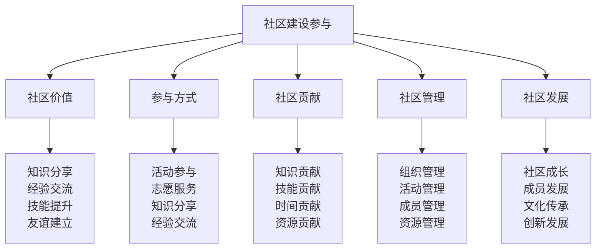

# 社区建设参与

## 🤝 社区建设参与核心框架

### 社区参与金字塔

## 💎 社区价值体系

### 知识分享价值
| 价值要素 | 价值内容 | 价值体现 | 价值意义 | 价值影响 |
|----------|----------|----------|----------|----------|
| **知识传播** | 知识传播分享 | 知识扩散 | 知识普及 | 知识影响 |
| **技能传承** | 技能传承分享 | 技能传承 | 技能延续 | 技能影响 |
| **经验交流** | 经验交流分享 | 经验传播 | 经验积累 | 经验影响 |
| **创新分享** | 创新成果分享 | 创新传播 | 创新发展 | 创新影响 |

### 经验交流价值
| 交流要素 | 交流内容 | 交流方式 | 交流效果 | 交流价值 |
|----------|----------|----------|----------|----------|
| **成功经验** | 成功经验交流 | 经验分享 | 经验学习 | 经验价值 |
| **失败教训** | 失败教训交流 | 教训分享 | 教训学习 | 教训价值 |
| **技巧经验** | 技巧经验交流 | 技巧分享 | 技巧学习 | 技巧价值 |
| **心得经验** | 心得体会交流 | 心得分享 | 心得学习 | 心得价值 |

### 技能提升价值
| 提升要素 | 提升内容 | 提升方式 | 提升效果 | 提升价值 |
|----------|----------|----------|----------|----------|
| **技能学习** | 技能学习提升 | 技能培训 | 技能提升 | 技能价值 |
| **技能实践** | 技能实践提升 | 技能实践 | 技能熟练 | 技能价值 |
| **技能创新** | 技能创新提升 | 技能创新 | 技能创新 | 技能价值 |
| **技能传承** | 技能传承提升 | 技能传承 | 技能传承 | 技能价值 |

### 友谊建立价值
| 友谊要素 | 友谊内容 | 友谊方式 | 友谊效果 | 友谊价值 |
|----------|----------|----------|----------|----------|
| **共同兴趣** | 共同兴趣友谊 | 兴趣交流 | 友谊建立 | 友谊价值 |
| **共同目标** | 共同目标友谊 | 目标合作 | 友谊深化 | 友谊价值 |
| **共同经历** | 共同经历友谊 | 经历分享 | 友谊巩固 | 友谊价值 |
| **共同成长** | 共同成长友谊 | 成长互助 | 友谊持久 | 友谊价值 |

## 🎯 参与方式体系

### 活动参与方式
| 参与类型 | 参与内容 | 参与方法 | 参与标准 | 参与效果 |
|----------|----------|----------|----------|----------|
| **线下活动** | 线下露营活动 | 活动参与 | 参与积极 | 参与有效 |
| **线上活动** | 线上交流活动 | 活动参与 | 参与积极 | 参与有效 |
| **培训活动** | 技能培训活动 | 培训参与 | 参与认真 | 参与有效 |
| **比赛活动** | 技能比赛活动 | 比赛参与 | 参与竞争 | 参与有效 |

### 志愿服务方式
| 服务类型 | 服务内容 | 服务方法 | 服务标准 | 服务效果 |
|----------|----------|----------|----------|----------|
| **活动服务** | 活动组织服务 | 志愿服务 | 服务专业 | 服务有效 |
| **教学服务** | 技能教学服务 | 志愿服务 | 服务专业 | 服务有效 |
| **管理服务** | 社区管理服务 | 志愿服务 | 服务专业 | 服务有效 |
| **支持服务** | 社区支持服务 | 志愿服务 | 服务专业 | 服务有效 |

### 知识分享方式
| 分享类型 | 分享内容 | 分享方法 | 分享标准 | 分享效果 |
|----------|----------|----------|----------|----------|
| **经验分享** | 个人经验分享 | 经验分享 | 分享充分 | 分享有效 |
| **技能分享** | 个人技能分享 | 技能分享 | 分享充分 | 分享有效 |
| **知识分享** | 专业知识分享 | 知识分享 | 分享充分 | 分享有效 |
| **资源分享** | 个人资源分享 | 资源分享 | 分享充分 | 分享有效 |

### 经验交流方式
| 交流类型 | 交流内容 | 交流方法 | 交流标准 | 交流效果 |
|----------|----------|----------|----------|----------|
| **面对面交流** | 面对面经验交流 | 直接交流 | 交流深入 | 交流有效 |
| **在线交流** | 在线经验交流 | 网络交流 | 交流便捷 | 交流有效 |
| **小组交流** | 小组经验交流 | 小组讨论 | 交流充分 | 交流有效 |
| **专题交流** | 专题经验交流 | 专题讨论 | 交流专业 | 交流有效 |

## 🎁 社区贡献体系

### 知识贡献方式
| 贡献类型 | 贡献内容 | 贡献方法 | 贡献标准 | 贡献效果 |
|----------|----------|----------|----------|----------|
| **专业知识** | 专业知识贡献 | 知识分享 | 知识准确 | 贡献有效 |
| **实践经验** | 实践经验贡献 | 经验分享 | 经验实用 | 贡献有效 |
| **技能知识** | 技能知识贡献 | 技能分享 | 技能实用 | 贡献有效 |
| **创新知识** | 创新知识贡献 | 创新分享 | 创新实用 | 贡献有效 |

### 技能贡献方式
| 贡献类型 | 贡献内容 | 贡献方法 | 贡献标准 | 贡献效果 |
|----------|----------|----------|----------|----------|
| **教学技能** | 教学技能贡献 | 技能教学 | 教学专业 | 贡献有效 |
| **指导技能** | 指导技能贡献 | 技能指导 | 指导专业 | 贡献有效 |
| **服务技能** | 服务技能贡献 | 技能服务 | 服务专业 | 贡献有效 |
| **管理技能** | 管理技能贡献 | 技能管理 | 管理专业 | 贡献有效 |

### 时间贡献方式
| 贡献类型 | 贡献内容 | 贡献方法 | 贡献标准 | 贡献效果 |
|----------|----------|----------|----------|----------|
| **活动时间** | 活动参与时间 | 时间投入 | 时间充分 | 贡献有效 |
| **服务时间** | 志愿服务时间 | 时间投入 | 时间充分 | 贡献有效 |
| **学习时间** | 学习交流时间 | 时间投入 | 时间充分 | 贡献有效 |
| **管理时间** | 社区管理时间 | 时间投入 | 时间充分 | 贡献有效 |

### 资源贡献方式
| 贡献类型 | 贡献内容 | 贡献方法 | 贡献标准 | 贡献效果 |
|----------|----------|----------|----------|----------|
| **物质资源** | 物质资源贡献 | 资源提供 | 资源充足 | 贡献有效 |
| **场地资源** | 场地资源贡献 | 资源提供 | 资源充足 | 贡献有效 |
| **设备资源** | 设备资源贡献 | 资源提供 | 资源充足 | 贡献有效 |
| **信息资源** | 信息资源贡献 | 资源提供 | 资源充足 | 贡献有效 |

## 🏗️ 社区管理体系

### 组织管理方式
| 管理要素 | 管理内容 | 管理方法 | 管理标准 | 管理效果 |
|----------|----------|----------|----------|----------|
| **组织结构** | 社区组织结构 | 组织建设 | 结构合理 | 管理有效 |
| **管理制度** | 社区管理制度 | 制度制定 | 制度完善 | 管理有效 |
| **管理流程** | 社区管理流程 | 流程设计 | 流程规范 | 管理有效 |
| **管理工具** | 社区管理工具 | 工具使用 | 工具有效 | 管理有效 |

### 活动管理方式
| 管理要素 | 管理内容 | 管理方法 | 管理标准 | 管理效果 |
|----------|----------|----------|----------|----------|
| **活动策划** | 活动策划管理 | 策划管理 | 策划完整 | 管理有效 |
| **活动组织** | 活动组织管理 | 组织管理 | 组织有序 | 管理有效 |
| **活动执行** | 活动执行管理 | 执行管理 | 执行到位 | 管理有效 |
| **活动评估** | 活动评估管理 | 评估管理 | 评估客观 | 管理有效 |

### 成员管理方式
| 管理要素 | 管理内容 | 管理方法 | 管理标准 | 管理效果 |
|----------|----------|----------|----------|----------|
| **成员招募** | 成员招募管理 | 招募管理 | 招募有效 | 管理有效 |
| **成员培训** | 成员培训管理 | 培训管理 | 培训有效 | 管理有效 |
| **成员激励** | 成员激励管理 | 激励管理 | 激励有效 | 管理有效 |
| **成员评估** | 成员评估管理 | 评估管理 | 评估客观 | 管理有效 |

### 资源管理方式
| 管理要素 | 管理内容 | 管理方法 | 管理标准 | 管理效果 |
|----------|----------|----------|----------|----------|
| **资源规划** | 资源规划管理 | 规划管理 | 规划合理 | 管理有效 |
| **资源配置** | 资源配置管理 | 配置管理 | 配置合理 | 管理有效 |
| **资源使用** | 资源使用管理 | 使用管理 | 使用有效 | 管理有效 |
| **资源维护** | 资源维护管理 | 维护管理 | 维护及时 | 管理有效 |

## 🚀 社区发展体系

### 社区成长发展
| 发展要素 | 发展内容 | 发展方法 | 发展标准 | 发展效果 |
|----------|----------|----------|----------|----------|
| **规模发展** | 社区规模发展 | 规模扩大 | 规模合理 | 发展有效 |
| **质量发展** | 社区质量发展 | 质量提升 | 质量提升 | 发展有效 |
| **影响力发展** | 社区影响力发展 | 影响扩大 | 影响扩大 | 发展有效 |
| **可持续发展** | 社区可持续发展 | 持续发展 | 持续发展 | 发展有效 |

### 成员发展体系
| 发展要素 | 发展内容 | 发展方法 | 发展标准 | 发展效果 |
|----------|----------|----------|----------|----------|
| **技能发展** | 成员技能发展 | 技能培养 | 技能提升 | 发展有效 |
| **知识发展** | 成员知识发展 | 知识培养 | 知识丰富 | 发展有效 |
| **能力发展** | 成员能力发展 | 能力培养 | 能力提升 | 发展有效 |
| **领导力发展** | 成员领导力发展 | 领导力培养 | 领导力提升 | 发展有效 |

### 文化传承发展
| 发展要素 | 发展内容 | 发展方法 | 发展标准 | 发展效果 |
|----------|----------|----------|----------|----------|
| **文化传承** | 社区文化传承 | 文化传承 | 传承有效 | 发展有效 |
| **文化创新** | 社区文化创新 | 文化创新 | 创新活跃 | 发展有效 |
| **文化影响** | 社区文化影响 | 文化影响 | 影响扩大 | 发展有效 |
| **文化发展** | 社区文化发展 | 文化发展 | 发展持续 | 发展有效 |

### 创新发展体系
| 发展要素 | 发展内容 | 发展方法 | 发展标准 | 发展效果 |
|----------|----------|----------|----------|----------|
| **理念创新** | 社区理念创新 | 理念创新 | 理念先进 | 发展有效 |
| **方法创新** | 社区方法创新 | 方法创新 | 方法先进 | 发展有效 |
| **技术创新** | 社区技术创新 | 技术创新 | 技术先进 | 发展有效 |
| **管理创新** | 社区管理创新 | 管理创新 | 管理先进 | 发展有效 |

## 🎓 费曼学习法应用

### 第一步：选择概念
选择"社区建设参与"作为学习概念

### 第二步：教授他人
用简单语言解释：
> "社区建设参与就是积极参与露营社区的建设和发展，包括知识分享、经验交流、技能提升、友谊建立。关键是积极参与、主动贡献、共同发展。"

### 第三步：回顾简化
- **社区价值**：知识分享、经验交流、技能提升、友谊建立
- **参与方式**：活动参与、志愿服务、知识分享、经验交流
- **社区贡献**：知识贡献、技能贡献、时间贡献、资源贡献
- **社区管理**：组织管理、活动管理、成员管理、资源管理
- **社区发展**：社区成长、成员发展、文化传承、创新发展

### 第四步：组织优化
建立社区参与与技能的关系：
- 社区价值 → [[04-创新层-进阶发展/04-文化传承/01-露营文化推广|文化推广]]
- 参与方式 → [[04-创新层-进阶发展/03-领导力培养/04-沟通协调技巧|沟通协调]]
- 社区贡献 → [[04-创新层-进阶发展/03-领导力培养/06-责任与担当|责任担当]]
- 社区管理 → [[04-创新层-进阶发展/03-领导力培养/01-团队管理技能|团队管理]]
- 社区发展 → [[05-实践与评估/03-持续改进|持续改进]]

## 🏃‍♂️ 刻意练习要点

### 社区参与练习
1. **价值练习**：练习社区价值理解
2. **参与练习**：练习社区参与方式
3. **贡献练习**：练习社区贡献方法
4. **管理练习**：练习社区管理技能

### 练习方法
- **理论学习**：学习社区建设理论
- **案例分析**：分析社区建设案例
- **实践参与**：实际参与社区建设
- **效果评估**：评估参与效果

### 实践验证
- **参与测试**：测试社区参与能力
- **贡献验证**：验证社区贡献效果
- **管理评估**：评估社区管理能力
- **发展评估**：评估社区发展效果

## 📋 社区参与检查清单

### 社区价值检查
- [ ] 知识分享是否充分
- [ ] 经验交流是否深入
- [ ] 技能提升是否有效
- [ ] 友谊建立是否成功

### 参与方式检查
- [ ] 活动参与是否积极
- [ ] 志愿服务是否专业
- [ ] 知识分享是否充分
- [ ] 经验交流是否深入

### 社区贡献检查
- [ ] 知识贡献是否准确
- [ ] 技能贡献是否专业
- [ ] 时间贡献是否充分
- [ ] 资源贡献是否充足

### 社区管理检查
- [ ] 组织管理是否有效
- [ ] 活动管理是否有序
- [ ] 成员管理是否专业
- [ ] 资源管理是否合理

### 社区发展检查
- [ ] 社区成长是否持续
- [ ] 成员发展是否有效
- [ ] 文化传承是否深入
- [ ] 创新发展是否活跃

## 🎯 社区参与策略

### 参与策略
1. **价值导向**：以社区价值为导向参与
2. **主动参与**：主动参与社区建设
3. **持续贡献**：持续贡献社区发展
4. **共同发展**：与社区共同发展

### 发展策略
- **个人发展**：在社区中发展个人能力
- **社区发展**：推动社区持续发展
- **文化发展**：促进文化传承发展
- **创新发展**：推动社区创新发展

## 🔗 相关链接
- [[01-文化传承概述|文化传承概述]]
- [[01-露营文化推广|露营文化推广]]
- [[02-新手指导方法|新手指导方法]]
- [[04-知识分享平台|知识分享平台]]
- [[04-创新层-进阶发展/03-领导力培养/04-沟通协调技巧|沟通协调技巧]]
- [[04-创新层-进阶发展/03-领导力培养/06-责任与担当|责任担当]]