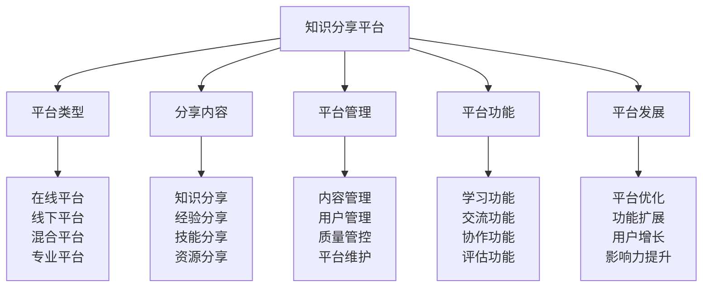

# 知识分享平台

## 🌐 知识分享平台核心框架

### 平台体系金字塔

## 🖥️ 平台类型体系

### 在线平台类型
| 平台类型 | 平台特点 | 平台优势 | 平台功能 | 平台价值 |
|----------|----------|----------|----------|----------|
| **官方网站** | 权威性、专业性 | 权威专业 | 信息发布、资源下载 | 权威价值 |
| **社交媒体** | 互动性、传播性 | 传播快速 | 内容分享、互动交流 | 传播价值 |
| **视频平台** | 直观性、生动性 | 内容生动 | 视频教学、经验分享 | 教学价值 |
| **知识平台** | 知识性、学习性 | 知识丰富 | 知识问答、学习资源 | 学习价值 |
| **论坛社区** | 讨论性、专业性 | 讨论深入 | 话题讨论、经验交流 | 交流价值 |

### 线下平台类型
| 平台类型 | 平台特点 | 平台优势 | 平台功能 | 平台价值 |
|----------|----------|----------|----------|----------|
| **户外店** | 专业性、体验性 | 专业体验 | 产品展示、技能培训 | 专业价值 |
| **学校机构** | 教育性、系统性 | 教育系统 | 课程教学、技能培训 | 教育价值 |
| **社区中心** | 社区性、便民性 | 社区便民 | 社区活动、技能分享 | 社区价值 |
| **公园景区** | 自然性、体验性 | 自然体验 | 户外活动、技能实践 | 体验价值 |
| **专业组织** | 专业性、权威性 | 专业权威 | 专业培训、认证考核 | 专业价值 |

### 混合平台类型
| 平台类型 | 平台特点 | 平台优势 | 平台功能 | 平台价值 |
|----------|----------|----------|----------|----------|
| **线上线下结合** | 综合性强 | 功能全面 | 在线学习+线下实践 | 综合价值 |
| **虚拟现实结合** | 技术先进 | 体验丰富 | VR教学+实际体验 | 体验价值 |
| **传统现代结合** | 传承创新 | 文化传承 | 传统技能+现代技术 | 传承价值 |
| **个人团体结合** | 灵活多样 | 适应性强 | 个人学习+团体活动 | 灵活价值 |

### 专业平台类型
| 平台类型 | 平台特点 | 平台优势 | 平台功能 | 平台价值 |
|----------|----------|----------|----------|----------|
| **技能认证平台** | 专业性、权威性 | 认证权威 | 技能认证、等级评定 | 认证价值 |
| **培训教育平台** | 教育性、系统性 | 教育系统 | 专业培训、系统教育 | 教育价值 |
| **研究交流平台** | 学术性、研究性 | 学术研究 | 学术交流、研究合作 | 研究价值 |
| **行业服务平台** | 服务性、专业性 | 服务专业 | 行业服务、专业支持 | 服务价值 |

## 📚 分享内容体系

### 知识分享内容
| 内容类型 | 内容特点 | 内容形式 | 内容标准 | 内容价值 |
|----------|----------|----------|----------|----------|
| **理论知识** | 系统性、理论性 | 文章、教程 | 内容准确 | 学习价值 |
| **实践知识** | 实用性、操作性 | 案例、经验 | 内容实用 | 实践价值 |
| **技能知识** | 技术性、专业性 | 技能教程 | 内容专业 | 技能价值 |
| **创新知识** | 创新性、前沿性 | 创新成果 | 内容创新 | 创新价值 |

### 经验分享内容
| 内容类型 | 内容特点 | 内容形式 | 内容标准 | 内容价值 |
|----------|----------|----------|----------|----------|
| **成功经验** | 成功性、可复制性 | 成功案例 | 经验真实 | 学习价值 |
| **失败教训** | 教训性、警示性 | 失败案例 | 教训深刻 | 警示价值 |
| **技巧经验** | 技巧性、实用性 | 技巧分享 | 技巧实用 | 技巧价值 |
| **心得经验** | 心得性、感悟性 | 心得体会 | 心得真实 | 感悟价值 |

### 技能分享内容
| 内容类型 | 内容特点 | 内容形式 | 内容标准 | 内容价值 |
|----------|----------|----------|----------|----------|
| **基础技能** | 基础性、普及性 | 基础教程 | 技能基础 | 基础价值 |
| **进阶技能** | 进阶性、专业性 | 进阶教程 | 技能进阶 | 进阶价值 |
| **高级技能** | 高级性、专业性 | 高级教程 | 技能高级 | 高级价值 |
| **创新技能** | 创新性、前沿性 | 创新技能 | 技能创新 | 创新价值 |

### 资源分享内容
| 内容类型 | 内容特点 | 内容形式 | 内容标准 | 内容价值 |
|----------|----------|----------|----------|----------|
| **学习资源** | 学习性、教育性 | 学习材料 | 资源优质 | 学习价值 |
| **工具资源** | 工具性、实用性 | 工具软件 | 资源实用 | 工具价值 |
| **数据资源** | 数据性、信息性 | 数据资料 | 资源准确 | 数据价值 |
| **人脉资源** | 人脉性、社交性 | 人脉网络 | 资源可靠 | 人脉价值 |

## 🛠️ 平台管理体系

### 内容管理方式
| 管理要素 | 管理内容 | 管理方法 | 管理标准 | 管理效果 |
|----------|----------|----------|----------|----------|
| **内容审核** | 内容质量审核 | 审核机制 | 审核严格 | 质量保证 |
| **内容分类** | 内容分类管理 | 分类体系 | 分类科学 | 管理有序 |
| **内容更新** | 内容更新管理 | 更新机制 | 更新及时 | 内容新鲜 |
| **内容推荐** | 内容推荐管理 | 推荐算法 | 推荐精准 | 推荐有效 |

### 用户管理方式
| 管理要素 | 管理内容 | 管理方法 | 管理标准 | 管理效果 |
|----------|----------|----------|----------|----------|
| **用户注册** | 用户注册管理 | 注册流程 | 流程简便 | 注册便捷 |
| **用户认证** | 用户身份认证 | 认证机制 | 认证可靠 | 身份可靠 |
| **用户权限** | 用户权限管理 | 权限控制 | 权限合理 | 权限有效 |
| **用户行为** | 用户行为管理 | 行为监控 | 行为规范 | 行为良好 |

### 质量管控方式
| 管控要素 | 管控内容 | 管控方法 | 管控标准 | 管控效果 |
|----------|----------|----------|----------|----------|
| **内容质量** | 内容质量管控 | 质量检查 | 质量达标 | 质量保证 |
| **服务质量** | 服务质量管控 | 服务监控 | 服务优质 | 服务保证 |
| **平台质量** | 平台质量管控 | 平台监控 | 平台稳定 | 平台保证 |
| **用户体验** | 用户体验管控 | 体验优化 | 体验良好 | 体验保证 |

### 平台维护方式
| 维护要素 | 维护内容 | 维护方法 | 维护标准 | 维护效果 |
|----------|----------|----------|----------|----------|
| **技术维护** | 技术系统维护 | 技术维护 | 维护及时 | 系统稳定 |
| **内容维护** | 内容更新维护 | 内容维护 | 维护及时 | 内容新鲜 |
| **用户维护** | 用户服务维护 | 用户维护 | 维护及时 | 用户满意 |
| **安全维护** | 平台安全维护 | 安全维护 | 维护及时 | 安全可靠 |

## ⚙️ 平台功能体系

### 学习功能设计
| 功能类型 | 功能内容 | 功能特点 | 功能标准 | 功能效果 |
|----------|----------|----------|----------|----------|
| **在线学习** | 在线课程学习 | 学习便捷 | 功能完善 | 学习有效 |
| **视频教学** | 视频教学内容 | 教学直观 | 功能完善 | 教学有效 |
| **互动学习** | 互动学习功能 | 互动性强 | 功能完善 | 学习有效 |
| **个性化学习** | 个性化学习路径 | 个性化强 | 功能完善 | 学习有效 |

### 交流功能设计
| 功能类型 | 功能内容 | 功能特点 | 功能标准 | 功能效果 |
|----------|----------|----------|----------|----------|
| **在线交流** | 在线交流功能 | 交流便捷 | 功能完善 | 交流有效 |
| **讨论功能** | 话题讨论功能 | 讨论深入 | 功能完善 | 讨论有效 |
| **问答功能** | 问答互动功能 | 问答及时 | 功能完善 | 问答有效 |
| **分享功能** | 内容分享功能 | 分享便捷 | 功能完善 | 分享有效 |

### 协作功能设计
| 功能类型 | 功能内容 | 功能特点 | 功能标准 | 功能效果 |
|----------|----------|----------|----------|----------|
| **团队协作** | 团队协作功能 | 协作高效 | 功能完善 | 协作有效 |
| **项目管理** | 项目管理功能 | 管理有序 | 功能完善 | 管理有效 |
| **资源共享** | 资源共享功能 | 共享便捷 | 功能完善 | 共享有效 |
| **协同编辑** | 协同编辑功能 | 编辑协同 | 功能完善 | 编辑有效 |

### 评估功能设计
| 功能类型 | 功能内容 | 功能特点 | 功能标准 | 功能效果 |
|----------|----------|----------|----------|----------|
| **学习评估** | 学习效果评估 | 评估客观 | 功能完善 | 评估有效 |
| **技能评估** | 技能水平评估 | 评估准确 | 功能完善 | 评估有效 |
| **能力评估** | 综合能力评估 | 评估全面 | 功能完善 | 评估有效 |
| **进步评估** | 学习进步评估 | 评估及时 | 功能完善 | 评估有效 |

## 🚀 平台发展体系

### 平台优化发展
| 发展要素 | 发展内容 | 发展方法 | 发展标准 | 发展效果 |
|----------|----------|----------|----------|----------|
| **功能优化** | 平台功能优化 | 功能改进 | 功能完善 | 发展有效 |
| **性能优化** | 平台性能优化 | 性能提升 | 性能提升 | 发展有效 |
| **界面优化** | 用户界面优化 | 界面改进 | 界面友好 | 发展有效 |
| **体验优化** | 用户体验优化 | 体验改进 | 体验良好 | 发展有效 |

### 功能扩展发展
| 发展要素 | 发展内容 | 发展方法 | 发展标准 | 发展效果 |
|----------|----------|----------|----------|----------|
| **新功能开发** | 新功能开发 | 功能创新 | 功能实用 | 发展有效 |
| **功能整合** | 功能整合优化 | 功能整合 | 整合有效 | 发展有效 |
| **功能升级** | 功能升级改进 | 功能升级 | 升级有效 | 发展有效 |
| **功能定制** | 功能定制服务 | 功能定制 | 定制有效 | 发展有效 |

### 用户增长发展
| 发展要素 | 发展内容 | 发展方法 | 发展标准 | 发展效果 |
|----------|----------|----------|----------|----------|
| **用户获取** | 新用户获取 | 用户推广 | 用户增长 | 发展有效 |
| **用户留存** | 用户留存提升 | 用户维护 | 留存提升 | 发展有效 |
| **用户活跃** | 用户活跃提升 | 用户激励 | 活跃提升 | 发展有效 |
| **用户转化** | 用户转化提升 | 用户引导 | 转化提升 | 发展有效 |

### 影响力提升发展
| 发展要素 | 发展内容 | 发展方法 | 发展标准 | 发展效果 |
|----------|----------|----------|----------|----------|
| **品牌影响力** | 品牌影响力提升 | 品牌建设 | 影响扩大 | 发展有效 |
| **行业影响力** | 行业影响力提升 | 行业参与 | 影响扩大 | 发展有效 |
| **社会影响力** | 社会影响力提升 | 社会贡献 | 影响扩大 | 发展有效 |
| **国际影响力** | 国际影响力提升 | 国际合作 | 影响扩大 | 发展有效 |

## 🎓 费曼学习法应用

### 第一步：选择概念
选择"知识分享平台"作为学习概念

### 第二步：教授他人
用简单语言解释：
> "知识分享平台就是用来分享露营知识和经验的平台，包括在线平台、线下平台、混合平台、专业平台。关键是提供优质内容，促进知识交流，提升学习效果。"

### 第三步：回顾简化
- **平台类型**：在线平台、线下平台、混合平台、专业平台
- **分享内容**：知识分享、经验分享、技能分享、资源分享
- **平台管理**：内容管理、用户管理、质量管控、平台维护
- **平台功能**：学习功能、交流功能、协作功能、评估功能
- **平台发展**：平台优化、功能扩展、用户增长、影响力提升

### 第四步：组织优化
建立知识分享与技能的关系：
- 平台类型 → [[04-创新层-进阶发展/04-文化传承/03-社区建设参与|社区建设]]
- 分享内容 → [[04-创新层-进阶发展/04-文化传承/01-露营文化推广|文化推广]]
- 平台管理 → [[04-创新层-进阶发展/03-领导力培养/01-团队管理技能|团队管理]]
- 平台功能 → [[05-实践与评估/01-技能评估体系|技能评估]]
- 平台发展 → [[05-实践与评估/03-持续改进|持续改进]]

## 🏃‍♂️ 刻意练习要点

### 平台建设练习
1. **类型练习**：练习平台类型选择
2. **内容练习**：练习内容质量提升
3. **管理练习**：练习平台管理技能
4. **功能练习**：练习平台功能设计

### 练习方法
- **理论学习**：学习平台建设理论
- **案例分析**：分析优秀平台案例
- **实践建设**：实际建设知识平台
- **效果评估**：评估平台建设效果

### 实践验证
- **平台测试**：测试平台功能效果
- **用户验证**：验证用户体验效果
- **内容评估**：评估内容质量效果
- **发展评估**：评估平台发展效果

## 📋 平台建设检查清单

### 平台类型检查
- [ ] 平台类型是否合适
- [ ] 平台特点是否突出
- [ ] 平台优势是否明显
- [ ] 平台功能是否完善

### 分享内容检查
- [ ] 内容质量是否优质
- [ ] 内容分类是否科学
- [ ] 内容更新是否及时
- [ ] 内容推荐是否精准

### 平台管理检查
- [ ] 内容管理是否有效
- [ ] 用户管理是否规范
- [ ] 质量管控是否严格
- [ ] 平台维护是否及时

### 平台功能检查
- [ ] 学习功能是否完善
- [ ] 交流功能是否便捷
- [ ] 协作功能是否高效
- [ ] 评估功能是否客观

### 平台发展检查
- [ ] 平台优化是否持续
- [ ] 功能扩展是否有效
- [ ] 用户增长是否稳定
- [ ] 影响力提升是否明显

## 🎯 平台建设策略

### 建设策略
1. **用户导向**：以用户需求为导向建设
2. **内容为王**：以优质内容为核心
3. **功能完善**：不断完善平台功能
4. **持续发展**：持续优化平台发展

### 发展策略
- **技术发展**：持续发展平台技术
- **内容发展**：持续发展平台内容
- **用户发展**：持续发展平台用户
- **影响发展**：持续发展平台影响

## 🔗 相关链接
- [[01-文化传承概述|文化传承概述]]
- [[01-露营文化推广|露营文化推广]]
- [[02-新手指导方法|新手指导方法]]
- [[03-社区建设参与|社区建设参与]]
- [[04-创新层-进阶发展/03-领导力培养/01-团队管理技能|团队管理技能]]
- [[05-实践与评估/01-技能评估体系|技能评估体系]]