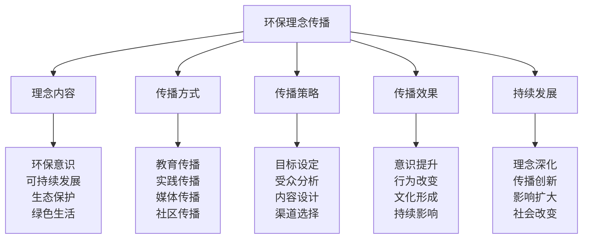

# 环保理念传播

## 🌱 环保理念传播核心框架

### 环保传播金字塔

## 🌍 理念内容体系

### 环保意识理念
| 意识要素 | 意识内容 | 意识体现 | 意识价值 | 意识传播 |
|----------|----------|----------|----------|----------|
| **环境认知** | 环境问题认知 | 问题意识 | 认知价值 | 认知传播 |
| **环保责任** | 环保责任意识 | 责任意识 | 责任价值 | 责任传播 |
| **生态意识** | 生态保护意识 | 保护意识 | 保护价值 | 保护传播 |
| **可持续意识** | 可持续发展意识 | 发展意识 | 发展价值 | 发展传播 |

### 可持续发展理念
| 发展要素 | 发展内容 | 发展体现 | 发展价值 | 发展传播 |
|----------|----------|----------|----------|----------|
| **经济可持续** | 经济可持续发展 | 经济发展 | 经济价值 | 经济传播 |
| **社会可持续** | 社会可持续发展 | 社会发展 | 社会价值 | 社会传播 |
| **环境可持续** | 环境可持续发展 | 环境发展 | 环境价值 | 环境传播 |
| **文化可持续** | 文化可持续发展 | 文化发展 | 文化价值 | 文化传播 |

### 生态保护理念
| 保护要素 | 保护内容 | 保护体现 | 保护价值 | 保护传播 |
|----------|----------|----------|----------|----------|
| **生物多样性** | 生物多样性保护 | 多样性保护 | 多样性价值 | 多样性传播 |
| **生态系统** | 生态系统保护 | 系统保护 | 系统价值 | 系统传播 |
| **自然资源** | 自然资源保护 | 资源保护 | 资源价值 | 资源传播 |
| **环境质量** | 环境质量保护 | 质量保护 | 质量价值 | 质量传播 |

### 绿色生活理念
| 生活要素 | 生活内容 | 生活体现 | 生活价值 | 生活传播 |
|----------|----------|----------|----------|----------|
| **绿色消费** | 绿色消费理念 | 消费绿色 | 消费价值 | 消费传播 |
| **绿色出行** | 绿色出行理念 | 出行绿色 | 出行价值 | 出行传播 |
| **绿色居住** | 绿色居住理念 | 居住绿色 | 居住价值 | 居住传播 |
| **绿色工作** | 绿色工作理念 | 工作绿色 | 工作价值 | 工作传播 |

## 📢 传播方式体系

### 教育传播方式
| 教育类型 | 教育内容 | 教育方法 | 教育标准 | 教育效果 |
|----------|----------|----------|----------|----------|
| **学校教育** | 环保教育课程 | 课程教育 | 教育系统 | 教育有效 |
| **社会教育** | 环保社会教育 | 社会教育 | 教育广泛 | 教育有效 |
| **家庭教育** | 环保家庭教育 | 家庭教育 | 教育温馨 | 教育有效 |
| **自我教育** | 环保自我教育 | 自我教育 | 教育主动 | 教育有效 |

### 实践传播方式
| 实践类型 | 实践内容 | 实践方法 | 实践标准 | 实践效果 |
|----------|----------|----------|----------|----------|
| **环保实践** | 环保实践活动 | 实践参与 | 实践充分 | 实践有效 |
| **绿色实践** | 绿色生活实践 | 实践参与 | 实践充分 | 实践有效 |
| **生态实践** | 生态保护实践 | 实践参与 | 实践充分 | 实践有效 |
| **可持续实践** | 可持续发展实践 | 实践参与 | 实践充分 | 实践有效 |

### 媒体传播方式
| 媒体类型 | 媒体内容 | 媒体方法 | 媒体标准 | 媒体效果 |
|----------|----------|----------|----------|----------|
| **传统媒体** | 环保传统媒体 | 媒体传播 | 传播广泛 | 传播有效 |
| **网络媒体** | 环保网络媒体 | 媒体传播 | 传播快速 | 传播有效 |
| **社交媒体** | 环保社交媒体 | 媒体传播 | 传播互动 | 传播有效 |
| **专业媒体** | 环保专业媒体 | 媒体传播 | 传播专业 | 传播有效 |

### 社区传播方式
| 社区类型 | 社区内容 | 社区方法 | 社区标准 | 社区效果 |
|----------|----------|----------|----------|----------|
| **线上社区** | 环保线上社区 | 社区交流 | 交流活跃 | 传播有效 |
| **线下社区** | 环保线下社区 | 社区活动 | 活动丰富 | 传播有效 |
| **专业社区** | 环保专业社区 | 社区交流 | 交流专业 | 传播有效 |
| **兴趣社区** | 环保兴趣社区 | 社区分享 | 分享充分 | 传播有效 |

## 🎯 传播策略体系

### 目标设定策略
| 目标要素 | 目标内容 | 目标方法 | 目标标准 | 目标效果 |
|----------|----------|----------|----------|----------|
| **意识目标** | 环保意识提升目标 | 目标设定 | 目标明确 | 目标达成 |
| **行为目标** | 环保行为改变目标 | 目标设定 | 目标明确 | 目标达成 |
| **文化目标** | 环保文化形成目标 | 目标设定 | 目标明确 | 目标达成 |
| **影响目标** | 环保影响扩大目标 | 目标设定 | 目标明确 | 目标达成 |

### 受众分析策略
| 分析要素 | 分析内容 | 分析方法 | 分析标准 | 分析效果 |
|----------|----------|----------|----------|----------|
| **年龄分析** | 不同年龄受众分析 | 年龄分析 | 分析准确 | 分析有效 |
| **职业分析** | 不同职业受众分析 | 职业分析 | 分析准确 | 分析有效 |
| **教育分析** | 不同教育受众分析 | 教育分析 | 分析准确 | 分析有效 |
| **兴趣分析** | 不同兴趣受众分析 | 兴趣分析 | 分析准确 | 分析有效 |

### 内容设计策略
| 设计要素 | 设计内容 | 设计方法 | 设计标准 | 设计效果 |
|----------|----------|----------|----------|----------|
| **内容定位** | 环保内容定位 | 内容设计 | 定位准确 | 设计有效 |
| **内容结构** | 环保内容结构 | 内容设计 | 结构合理 | 设计有效 |
| **内容形式** | 环保内容形式 | 内容设计 | 形式多样 | 设计有效 |
| **内容创新** | 环保内容创新 | 内容设计 | 创新有效 | 设计有效 |

### 渠道选择策略
| 选择要素 | 选择内容 | 选择方法 | 选择标准 | 选择效果 |
|----------|----------|----------|----------|----------|
| **渠道分析** | 传播渠道分析 | 渠道分析 | 分析准确 | 选择有效 |
| **渠道组合** | 传播渠道组合 | 渠道组合 | 组合合理 | 选择有效 |
| **渠道优化** | 传播渠道优化 | 渠道优化 | 优化有效 | 选择有效 |
| **渠道创新** | 传播渠道创新 | 渠道创新 | 创新有效 | 选择有效 |

## 📊 传播效果评估

### 意识提升评估
| 评估要素 | 评估内容 | 评估方法 | 评估标准 | 评估效果 |
|----------|----------|----------|----------|----------|
| **环保认知** | 环保认知水平 | 认知测试 | 认知提升 | 评估准确 |
| **环保态度** | 环保态度变化 | 态度调查 | 态度积极 | 评估准确 |
| **环保意识** | 环保意识强度 | 意识测试 | 意识强化 | 评估准确 |
| **环保价值观** | 环保价值观形成 | 价值观调查 | 价值观正确 | 评估准确 |

### 行为改变评估
| 评估要素 | 评估内容 | 评估方法 | 评估标准 | 评估效果 |
|----------|----------|----------|----------|----------|
| **环保行为** | 环保行为改变 | 行为观察 | 行为改善 | 评估准确 |
| **绿色消费** | 绿色消费行为 | 消费分析 | 消费绿色 | 评估准确 |
| **环保参与** | 环保参与行为 | 参与统计 | 参与积极 | 评估准确 |
| **环保传播** | 环保传播行为 | 传播统计 | 传播积极 | 评估准确 |

### 文化形成评估
| 评估要素 | 评估内容 | 评估方法 | 评估标准 | 评估效果 |
|----------|----------|----------|----------|----------|
| **环保文化** | 环保文化形成 | 文化分析 | 文化形成 | 评估准确 |
| **绿色文化** | 绿色文化形成 | 文化分析 | 文化形成 | 评估准确 |
| **生态文化** | 生态文化形成 | 文化分析 | 文化形成 | 评估准确 |
| **可持续文化** | 可持续文化形成 | 文化分析 | 文化形成 | 评估准确 |

### 持续影响评估
| 评估要素 | 评估内容 | 评估方法 | 评估标准 | 评估效果 |
|----------|----------|----------|----------|----------|
| **个人影响** | 个人持续影响 | 影响分析 | 影响持续 | 评估准确 |
| **家庭影响** | 家庭持续影响 | 影响分析 | 影响持续 | 评估准确 |
| **社会影响** | 社会持续影响 | 影响分析 | 影响持续 | 评估准确 |
| **代际影响** | 代际持续影响 | 影响分析 | 影响持续 | 评估准确 |

## 🔄 持续发展体系

### 理念深化发展
| 发展要素 | 发展内容 | 发展方法 | 发展标准 | 发展效果 |
|----------|----------|----------|----------|----------|
| **理念深度** | 环保理念深度发展 | 理念深化 | 理念深入 | 发展有效 |
| **理念广度** | 环保理念广度发展 | 理念拓展 | 理念广泛 | 发展有效 |
| **理念高度** | 环保理念高度发展 | 理念提升 | 理念提升 | 发展有效 |
| **理念创新** | 环保理念创新发展 | 理念创新 | 理念创新 | 发展有效 |

### 传播创新发展
| 发展要素 | 发展内容 | 发展方法 | 发展标准 | 发展效果 |
|----------|----------|----------|----------|----------|
| **传播方式创新** | 传播方式创新发展 | 方式创新 | 方式创新 | 发展有效 |
| **传播内容创新** | 传播内容创新发展 | 内容创新 | 内容创新 | 发展有效 |
| **传播技术创新** | 传播技术创新发展 | 技术创新 | 技术创新 | 发展有效 |
| **传播模式创新** | 传播模式创新发展 | 模式创新 | 模式创新 | 发展有效 |

### 影响扩大发展
| 发展要素 | 发展内容 | 发展方法 | 发展标准 | 发展效果 |
|----------|----------|----------|----------|----------|
| **影响范围扩大** | 影响范围扩大发展 | 范围扩大 | 范围扩大 | 发展有效 |
| **影响深度扩大** | 影响深度扩大发展 | 深度扩大 | 深度扩大 | 发展有效 |
| **影响时间扩大** | 影响时间扩大发展 | 时间扩大 | 时间扩大 | 发展有效 |
| **影响效果扩大** | 影响效果扩大发展 | 效果扩大 | 效果扩大 | 发展有效 |

### 社会改变发展
| 发展要素 | 发展内容 | 发展方法 | 发展标准 | 发展效果 |
|----------|----------|----------|----------|----------|
| **社会意识改变** | 社会意识改变发展 | 意识改变 | 意识改变 | 发展有效 |
| **社会行为改变** | 社会行为改变发展 | 行为改变 | 行为改变 | 发展有效 |
| **社会制度改变** | 社会制度改变发展 | 制度改变 | 制度改变 | 发展有效 |
| **社会文化改变** | 社会文化改变发展 | 文化改变 | 文化改变 | 发展有效 |

## 🎓 费曼学习法应用

### 第一步：选择概念
选择"环保理念传播"作为学习概念

### 第二步：教授他人
用简单语言解释：
> "环保理念传播就是让更多人了解和接受环保理念的过程，包括环保意识、可持续发展、生态保护、绿色生活。关键是传播环保理念，改变环保行为，形成环保文化。"

### 第三步：回顾简化
- **理念内容**：环保意识、可持续发展、生态保护、绿色生活
- **传播方式**：教育传播、实践传播、媒体传播、社区传播
- **传播策略**：目标设定、受众分析、内容设计、渠道选择
- **传播效果**：意识提升、行为改变、文化形成、持续影响
- **持续发展**：理念深化、传播创新、影响扩大、社会改变

### 第四步：组织优化
建立环保理念与技能的关系：
- 理念内容 → [[01-认知层-基础概念/04-价值与意义|价值意义]]
- 传播方式 → [[04-创新层-进阶发展/04-文化传承/01-露营文化推广|文化推广]]
- 传播策略 → [[04-创新层-进阶发展/03-领导力培养/04-沟通协调技巧|沟通协调]]
- 传播效果 → [[05-实践与评估/01-技能评估体系|技能评估]]
- 持续发展 → [[05-实践与评估/03-持续改进|持续改进]]

## 🏃‍♂️ 刻意练习要点

### 环保传播练习
1. **理念练习**：练习环保理念理解
2. **传播练习**：练习环保理念传播
3. **策略练习**：练习传播策略制定
4. **效果练习**：练习传播效果评估

### 练习方法
- **理论学习**：学习环保理念理论
- **案例分析**：分析环保传播案例
- **实践传播**：实际进行环保传播
- **效果评估**：评估传播效果

### 实践验证
- **传播测试**：测试环保传播能力
- **效果验证**：验证传播效果
- **影响评估**：评估环保影响
- **持续改进**：持续改进传播方法

## 📋 环保传播检查清单

### 理念内容检查
- [ ] 环保意识是否明确
- [ ] 可持续发展是否理解
- [ ] 生态保护是否重视
- [ ] 绿色生活是否实践

### 传播方式检查
- [ ] 教育传播是否有效
- [ ] 实践传播是否充分
- [ ] 媒体传播是否广泛
- [ ] 社区传播是否活跃

### 传播策略检查
- [ ] 目标设定是否明确
- [ ] 受众分析是否准确
- [ ] 内容设计是否合理
- [ ] 渠道选择是否有效

### 传播效果检查
- [ ] 意识提升是否明显
- [ ] 行为改变是否有效
- [ ] 文化形成是否深入
- [ ] 持续影响是否深远

### 持续发展检查
- [ ] 理念深化是否持续
- [ ] 传播创新是否活跃
- [ ] 影响扩大是否有效
- [ ] 社会改变是否明显

## 🎯 环保传播策略

### 传播策略
1. **理念先行**：先传播环保理念
2. **方式多样**：运用多样传播方式
3. **策略系统**：制定系统传播策略
4. **效果导向**：以效果为导向传播

### 发展策略
- **理念发展**：持续发展环保理念
- **方式发展**：持续发展传播方式
- **策略发展**：持续发展传播策略
- **影响发展**：持续发展环保影响

## 🔗 相关链接
- [[01-文化传承概述|文化传承概述]]
- [[01-露营文化推广|露营文化推广]]
- [[02-新手指导方法|新手指导方法]]
- [[03-社区建设参与|社区建设参与]]
- [[01-认知层-基础概念/04-价值与意义|价值意义]]
- [[04-创新层-进阶发展/03-领导力培养/04-沟通协调技巧|沟通协调技巧]]