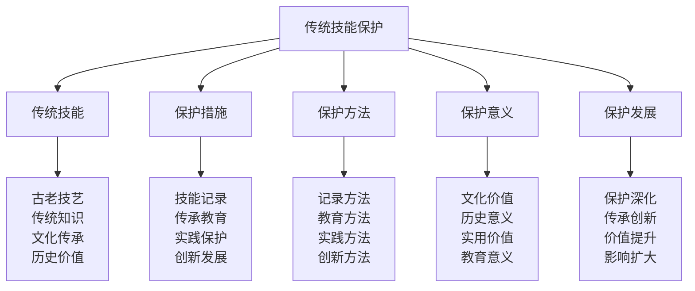

# 传统技能保护

## 🏛️ 传统技能保护核心框架

### 技能保护金字塔

## 🎨 传统技能体系

### 古老技艺技能
| 技能类型 | 技能内容 | 技能特点 | 技能价值 | 技能传承 |
|----------|----------|----------|----------|----------|
| **编织技艺** | 传统编织技能 | 手工精细 | 艺术价值 | 技艺传承 |
| **木工技艺** | 传统木工技能 | 工艺精湛 | 实用价值 | 技艺传承 |
| **铁艺技艺** | 传统铁艺技能 | 技术复杂 | 技术价值 | 技艺传承 |
| **陶艺技艺** | 传统陶艺技能 | 艺术性强 | 艺术价值 | 技艺传承 |
| **纺织技艺** | 传统纺织技能 | 工艺复杂 | 实用价值 | 技艺传承 |

### 传统知识技能
| 知识类型 | 知识内容 | 知识特点 | 知识价值 | 知识传承 |
|----------|----------|----------|----------|----------|
| **草药知识** | 传统草药知识 | 经验丰富 | 医疗价值 | 知识传承 |
| **天文知识** | 传统天文知识 | 观察细致 | 科学价值 | 知识传承 |
| **地理知识** | 传统地理知识 | 实用性强 | 实用价值 | 知识传承 |
| **气象知识** | 传统气象知识 | 预测准确 | 实用价值 | 知识传承 |
| **农业知识** | 传统农业知识 | 经验丰富 | 实用价值 | 知识传承 |

### 文化传承技能
| 传承类型 | 传承内容 | 传承特点 | 传承价值 | 传承方式 |
|----------|----------|----------|----------|----------|
| **口头传承** | 口头文化传承 | 口耳相传 | 文化价值 | 口头传承 |
| **文字传承** | 文字文化传承 | 记录详细 | 文化价值 | 文字传承 |
| **图像传承** | 图像文化传承 | 直观形象 | 文化价值 | 图像传承 |
| **实物传承** | 实物文化传承 | 实物保存 | 文化价值 | 实物传承 |
| **仪式传承** | 仪式文化传承 | 仪式隆重 | 文化价值 | 仪式传承 |

### 历史价值技能
| 价值类型 | 价值内容 | 价值特点 | 价值意义 | 价值保护 |
|----------|----------|----------|----------|----------|
| **历史记录** | 历史记录技能 | 记录详细 | 历史价值 | 价值保护 |
| **文化记忆** | 文化记忆技能 | 记忆深刻 | 文化价值 | 价值保护 |
| **社会见证** | 社会见证技能 | 见证真实 | 社会价值 | 价值保护 |
| **时代印记** | 时代印记技能 | 印记深刻 | 时代价值 | 价值保护 |

## 🛡️ 保护措施体系

### 技能记录措施
| 记录要素 | 记录内容 | 记录方法 | 记录标准 | 记录效果 |
|----------|----------|----------|----------|----------|
| **文字记录** | 技能文字记录 | 文字记录 | 记录详细 | 记录有效 |
| **图像记录** | 技能图像记录 | 图像记录 | 记录清晰 | 记录有效 |
| **视频记录** | 技能视频记录 | 视频记录 | 记录完整 | 记录有效 |
| **音频记录** | 技能音频记录 | 音频记录 | 记录清晰 | 记录有效 |
| **数字记录** | 技能数字记录 | 数字记录 | 记录准确 | 记录有效 |

### 传承教育措施
| 教育要素 | 教育内容 | 教育方法 | 教育标准 | 教育效果 |
|----------|----------|----------|----------|----------|
| **学校教育** | 传统技能学校教育 | 课程教育 | 教育系统 | 教育有效 |
| **社会教育** | 传统技能社会教育 | 社会教育 | 教育广泛 | 教育有效 |
| **家庭教育** | 传统技能家庭教育 | 家庭教育 | 教育温馨 | 教育有效 |
| **师徒教育** | 传统技能师徒教育 | 师徒传承 | 教育深入 | 教育有效 |
| **社区教育** | 传统技能社区教育 | 社区教育 | 教育社区 | 教育有效 |

### 实践保护措施
| 实践要素 | 实践内容 | 实践方法 | 实践标准 | 实践效果 |
|----------|----------|----------|----------|----------|
| **技能实践** | 传统技能实践 | 实践练习 | 实践充分 | 实践有效 |
| **工艺实践** | 传统工艺实践 | 实践练习 | 实践充分 | 实践有效 |
| **文化实践** | 传统文化实践 | 实践练习 | 实践充分 | 实践有效 |
| **创新实践** | 传统技能创新实践 | 实践创新 | 实践创新 | 实践有效 |

### 创新发展措施
| 创新要素 | 创新内容 | 创新方法 | 创新标准 | 创新效果 |
|----------|----------|----------|----------|----------|
| **技能创新** | 传统技能创新 | 技能创新 | 创新有效 | 创新有效 |
| **工艺创新** | 传统工艺创新 | 工艺创新 | 创新有效 | 创新有效 |
| **文化创新** | 传统文化创新 | 文化创新 | 创新有效 | 创新有效 |
| **应用创新** | 传统技能应用创新 | 应用创新 | 创新有效 | 创新有效 |

## 🔧 保护方法体系

### 记录方法技术
| 方法类型 | 方法内容 | 方法特点 | 方法标准 | 方法效果 |
|----------|----------|----------|----------|----------|
| **文献记录** | 文献记录方法 | 记录详细 | 记录准确 | 方法有效 |
| **田野调查** | 田野调查方法 | 调查深入 | 调查全面 | 方法有效 |
| **口述历史** | 口述历史方法 | 历史真实 | 历史完整 | 方法有效 |
| **影像记录** | 影像记录方法 | 记录直观 | 记录完整 | 方法有效 |
| **数字化记录** | 数字化记录方法 | 记录现代 | 记录便捷 | 方法有效 |

### 教育方法技术
| 方法类型 | 方法内容 | 方法特点 | 方法标准 | 方法效果 |
|----------|----------|----------|----------|----------|
| **传统教学** | 传统教学方法 | 教学传统 | 教学有效 | 方法有效 |
| **现代教学** | 现代教学方法 | 教学现代 | 教学有效 | 方法有效 |
| **实践教学** | 实践教学方法 | 教学实践 | 教学有效 | 方法有效 |
| **体验教学** | 体验教学方法 | 教学体验 | 教学有效 | 方法有效 |
| **互动教学** | 互动教学方法 | 教学互动 | 教学有效 | 方法有效 |

### 实践方法技术
| 方法类型 | 方法内容 | 方法特点 | 方法标准 | 方法效果 |
|----------|----------|----------|----------|----------|
| **技能实践** | 技能实践方法 | 实践技能 | 实践有效 | 方法有效 |
| **工艺实践** | 工艺实践方法 | 实践工艺 | 实践有效 | 方法有效 |
| **文化实践** | 文化实践方法 | 实践文化 | 实践有效 | 方法有效 |
| **创新实践** | 创新实践方法 | 实践创新 | 实践有效 | 方法有效 |

### 创新方法技术
| 方法类型 | 方法内容 | 方法特点 | 方法标准 | 方法效果 |
|----------|----------|----------|----------|----------|
| **技术创新** | 技术创新方法 | 创新技术 | 创新有效 | 方法有效 |
| **工艺创新** | 工艺创新方法 | 创新工艺 | 创新有效 | 方法有效 |
| **文化创新** | 文化创新方法 | 创新文化 | 创新有效 | 方法有效 |
| **应用创新** | 应用创新方法 | 创新应用 | 创新有效 | 方法有效 |

## 💎 保护意义体系

### 文化价值意义
| 价值要素 | 价值内容 | 价值体现 | 价值意义 | 价值保护 |
|----------|----------|----------|----------|----------|
| **文化传承** | 文化传承价值 | 传承文化 | 文化意义 | 价值保护 |
| **文化认同** | 文化认同价值 | 认同文化 | 文化意义 | 价值保护 |
| **文化多样性** | 文化多样性价值 | 多样性文化 | 文化意义 | 价值保护 |
| **文化创新** | 文化创新价值 | 创新文化 | 文化意义 | 价值保护 |

### 历史意义价值
| 价值要素 | 价值内容 | 价值体现 | 价值意义 | 价值保护 |
|----------|----------|----------|----------|----------|
| **历史记录** | 历史记录价值 | 记录历史 | 历史意义 | 价值保护 |
| **历史见证** | 历史见证价值 | 见证历史 | 历史意义 | 价值保护 |
| **历史传承** | 历史传承价值 | 传承历史 | 历史意义 | 价值保护 |
| **历史研究** | 历史研究价值 | 研究历史 | 历史意义 | 价值保护 |

### 实用价值意义
| 价值要素 | 价值内容 | 价值体现 | 价值意义 | 价值保护 |
|----------|----------|----------|----------|----------|
| **技能实用** | 技能实用价值 | 实用技能 | 实用意义 | 价值保护 |
| **工艺实用** | 工艺实用价值 | 实用工艺 | 实用意义 | 价值保护 |
| **知识实用** | 知识实用价值 | 实用知识 | 实用意义 | 价值保护 |
| **经验实用** | 经验实用价值 | 实用经验 | 实用意义 | 价值保护 |

### 教育意义价值
| 价值要素 | 价值内容 | 价值体现 | 价值意义 | 价值保护 |
|----------|----------|----------|----------|----------|
| **技能教育** | 技能教育价值 | 教育技能 | 教育意义 | 价值保护 |
| **文化教育** | 文化教育价值 | 教育文化 | 教育意义 | 价值保护 |
| **历史教育** | 历史教育价值 | 教育历史 | 教育意义 | 价值保护 |
| **价值观教育** | 价值观教育价值 | 教育价值观 | 教育意义 | 价值保护 |

## 🚀 保护发展体系

### 保护深化发展
| 发展要素 | 发展内容 | 发展方法 | 发展标准 | 发展效果 |
|----------|----------|----------|----------|----------|
| **保护深度** | 保护深度发展 | 深度保护 | 保护深入 | 发展有效 |
| **保护广度** | 保护广度发展 | 广度保护 | 保护广泛 | 发展有效 |
| **保护高度** | 保护高度发展 | 高度保护 | 保护提升 | 发展有效 |
| **保护创新** | 保护创新发展 | 创新保护 | 保护创新 | 发展有效 |

### 传承创新发展
| 发展要素 | 发展内容 | 发展方法 | 发展标准 | 发展效果 |
|----------|----------|----------|----------|----------|
| **传承方式创新** | 传承方式创新发展 | 方式创新 | 方式创新 | 发展有效 |
| **传承内容创新** | 传承内容创新发展 | 内容创新 | 内容创新 | 发展有效 |
| **传承技术创新** | 传承技术创新发展 | 技术创新 | 技术创新 | 发展有效 |
| **传承模式创新** | 传承模式创新发展 | 模式创新 | 模式创新 | 发展有效 |

### 价值提升发展
| 发展要素 | 发展内容 | 发展方法 | 发展标准 | 发展效果 |
|----------|----------|----------|----------|----------|
| **文化价值提升** | 文化价值提升发展 | 价值提升 | 价值提升 | 发展有效 |
| **历史价值提升** | 历史价值提升发展 | 价值提升 | 价值提升 | 发展有效 |
| **实用价值提升** | 实用价值提升发展 | 价值提升 | 价值提升 | 发展有效 |
| **教育价值提升** | 教育价值提升发展 | 价值提升 | 价值提升 | 发展有效 |

### 影响扩大发展
| 发展要素 | 发展内容 | 发展方法 | 发展标准 | 发展效果 |
|----------|----------|----------|----------|----------|
| **影响范围扩大** | 影响范围扩大发展 | 范围扩大 | 范围扩大 | 发展有效 |
| **影响深度扩大** | 影响深度扩大发展 | 深度扩大 | 深度扩大 | 发展有效 |
| **影响时间扩大** | 影响时间扩大发展 | 时间扩大 | 时间扩大 | 发展有效 |
| **影响效果扩大** | 影响效果扩大发展 | 效果扩大 | 效果扩大 | 发展有效 |

## 🎓 费曼学习法应用

### 第一步：选择概念
选择"传统技能保护"作为学习概念

### 第二步：教授他人
用简单语言解释：
> "传统技能保护就是保护和传承古老的技艺、传统知识、文化传承、历史价值的过程，包括技能记录、传承教育、实践保护、创新发展。关键是保护传统技能，传承文化价值，创新发展应用。"

### 第三步：回顾简化
- **传统技能**：古老技艺、传统知识、文化传承、历史价值
- **保护措施**：技能记录、传承教育、实践保护、创新发展
- **保护方法**：记录方法、教育方法、实践方法、创新方法
- **保护意义**：文化价值、历史意义、实用价值、教育意义
- **保护发展**：保护深化、传承创新、价值提升、影响扩大

### 第四步：组织优化
建立传统技能保护与技能的关系：
- 传统技能 → [[01-认知层-基础概念/01-露营概述|露营概述]]
- 保护措施 → [[04-创新层-进阶发展/04-文化传承/02-新手指导方法|新手指导]]
- 保护方法 → [[04-创新层-进阶发展/03-领导力培养/04-沟通协调技巧|沟通协调]]
- 保护意义 → [[01-认知层-基础概念/04-价值与意义|价值意义]]
- 保护发展 → [[05-实践与评估/03-持续改进|持续改进]]

## 🏃‍♂️ 刻意练习要点

### 技能保护练习
1. **技能练习**：练习传统技能学习
2. **保护练习**：练习技能保护方法
3. **传承练习**：练习技能传承方法
4. **创新练习**：练习技能创新方法

### 练习方法
- **理论学习**：学习传统技能理论
- **案例分析**：分析技能保护案例
- **实践保护**：实际保护传统技能
- **效果评估**：评估保护效果

### 实践验证
- **技能测试**：测试传统技能掌握
- **保护验证**：验证保护方法效果
- **传承评估**：评估传承效果
- **创新评估**：评估创新效果

## 📋 技能保护检查清单

### 传统技能检查
- [ ] 古老技艺是否掌握
- [ ] 传统知识是否了解
- [ ] 文化传承是否理解
- [ ] 历史价值是否认识

### 保护措施检查
- [ ] 技能记录是否完整
- [ ] 传承教育是否有效
- [ ] 实践保护是否充分
- [ ] 创新发展是否活跃

### 保护方法检查
- [ ] 记录方法是否科学
- [ ] 教育方法是否有效
- [ ] 实践方法是否充分
- [ ] 创新方法是否有效

### 保护意义检查
- [ ] 文化价值是否认识
- [ ] 历史意义是否理解
- [ ] 实用价值是否体现
- [ ] 教育意义是否发挥

### 保护发展检查
- [ ] 保护深化是否持续
- [ ] 传承创新是否活跃
- [ ] 价值提升是否明显
- [ ] 影响扩大是否有效

## 🎯 技能保护策略

### 保护策略
1. **记录优先**：优先记录传统技能
2. **教育传承**：通过教育传承技能
3. **实践保护**：通过实践保护技能
4. **创新发展**：通过创新发展技能

### 发展策略
- **技能发展**：持续发展传统技能
- **保护发展**：持续发展保护方法
- **传承发展**：持续发展传承方式
- **价值发展**：持续发展技能价值

## 🔗 相关链接
- [[01-文化传承概述|文化传承概述]]
- [[01-露营文化推广|露营文化推广]]
- [[02-新手指导方法|新手指导方法]]
- [[03-社区建设参与|社区建设参与]]
- [[01-认知层-基础概念/01-露营概述|露营概述]]
- [[01-认知层-基础概念/04-价值与意义|价值意义]]