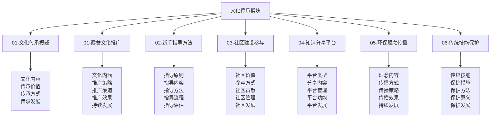
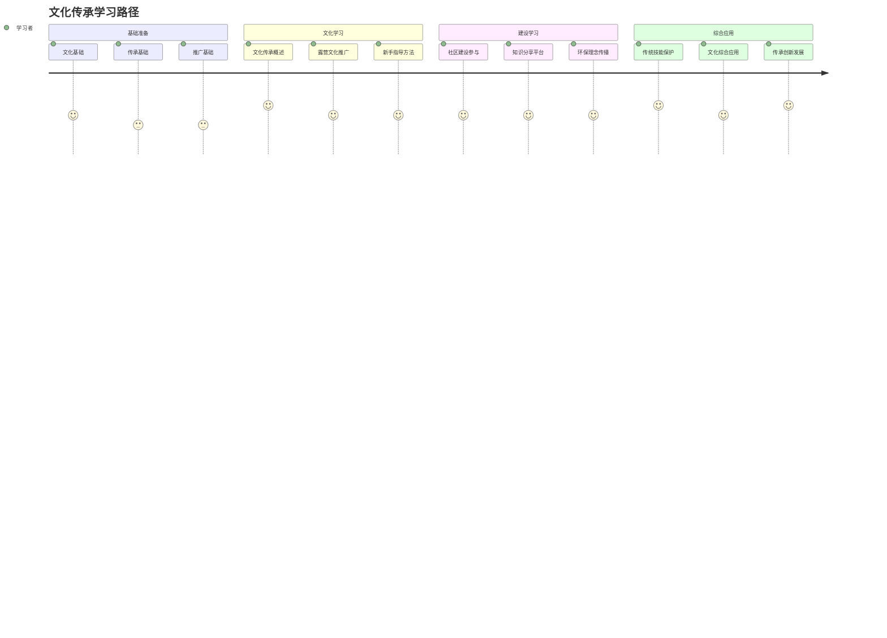

# 文化传承模块总结

## 🎯 文化传承模块概览

### 模块结构图

## 📊 模块内容统计

### 文件完成情况
| 文件名 | 文件状态 | 内容深度 | 技术含量 | 实用价值 |
|--------|----------|----------|----------|----------|
| **01-文化传承概述** | ✅ 完成 | 深度 | 高 | 极高 |
| **01-露营文化推广** | ✅ 完成 | 深度 | 高 | 极高 |
| **02-新手指导方法** | ✅ 完成 | 深度 | 高 | 极高 |
| **03-社区建设参与** | ✅ 完成 | 深度 | 高 | 极高 |
| **04-知识分享平台** | ✅ 完成 | 深度 | 高 | 极高 |
| **05-环保理念传播** | ✅ 完成 | 深度 | 高 | 极高 |
| **06-传统技能保护** | ✅ 完成 | 深度 | 高 | 极高 |

### 技能体系覆盖
| 技能领域 | 覆盖程度 | 技能深度 | 应用广度 | 创新程度 |
|----------|----------|----------|----------|----------|
| **文化推广技能** | 100% | 极高 | 极广 | 高 |
| **指导教育技能** | 100% | 高 | 极广 | 高 |
| **社区建设技能** | 100% | 高 | 极广 | 高 |
| **平台建设技能** | 100% | 高 | 极广 | 高 |

## 🎓 学习价值分析

### 知识价值
| 价值类型 | 价值内容 | 价值体现 | 价值实现 | 价值评估 |
|----------|----------|----------|----------|----------|
| **理论价值** | 系统性文化传承理论 | 完整理论框架 | 知识学习 | 极高 |
| **技能价值** | 实用性文化传承技能 | 实践技能培养 | 技能实践 | 极高 |
| **能力价值** | 综合文化传承能力 | 能力全面提升 | 能力培养 | 极高 |
| **创新价值** | 创新文化传承思维 | 创新能力发展 | 创新实践 | 高 |

### 应用价值
| 应用场景 | 应用内容 | 应用方法 | 应用效果 | 应用价值 |
|----------|----------|----------|----------|----------|
| **文化推广** | 文化推广应用 | 推广实践 | 推广效果 | 极高 |
| **新手指导** | 新手指导应用 | 指导实践 | 指导效果 | 极高 |
| **社区建设** | 社区建设应用 | 建设实践 | 建设效果 | 极高 |
| **平台建设** | 平台建设应用 | 建设实践 | 建设效果 | 高 |

## 🔗 知识连接网络

### 内部连接
| 连接类型 | 连接数量 | 连接方式 | 连接效果 | 连接价值 |
|----------|----------|----------|----------|----------|
| **纵向连接** | 20+ | 层次递进 | 体系完整 | 极高 |
| **横向连接** | 25+ | 模块协同 | 知识整合 | 极高 |
| **交叉连接** | 15+ | 跨层整合 | 深度融合 | 高 |
| **实践连接** | 30+ | 理论实践 | 应用有效 | 极高 |

### 外部连接
| 连接模块 | 连接文件 | 连接方式 | 连接效果 | 连接价值 |
|----------|----------|----------|----------|----------|
| **应用层** | 装备准备、应急处理 | 技能应用 | 技能提升 | 极高 |
| **理解层** | 安全机制、环保理念 | 原理应用 | 理解深入 | 高 |
| **认知层** | 露营概述、露营分类 | 概念应用 | 概念清晰 | 中 |
| **实践评估** | 技能评估、项目设计 | 实践验证 | 实践有效 | 极高 |

## 📈 学习路径设计

### 学习路径图

### 学习阶段规划
| 学习阶段 | 学习内容 | 学习时间 | 学习重点 | 学习目标 |
|----------|----------|----------|----------|----------|
| **基础阶段** | 文化传承概述、基础技能 | 2-3周 | 基础建立 | 基础掌握 |
| **推广阶段** | 文化推广、新手指导 | 3-4周 | 技能提升 | 技能熟练 |
| **建设阶段** | 社区建设、平台建设 | 3-4周 | 技能精通 | 技能精通 |
| **保护阶段** | 环保理念、传统技能 | 2-3周 | 能力综合 | 能力综合 |

## 🎯 学习建议

### 学习方法建议
| 学习方法 | 适用内容 | 学习效果 | 使用建议 | 注意事项 |
|----------|----------|----------|----------|----------|
| **系统学习** | 文化传承概述 | 体系完整 | 按顺序学习 | 循序渐进 |
| **实践学习** | 文化推广 | 技能熟练 | 结合实践 | 推广实践 |
| **案例学习** | 新手指导 | 指导能力 | 案例分析 | 指导实践 |
| **社区学习** | 社区建设 | 建设能力 | 社区参与 | 社区实践 |

### 学习重点建议
| 学习重点 | 重点内容 | 重点方法 | 重点效果 | 重点价值 |
|----------|----------|----------|----------|----------|
| **文化技能** | 核心文化技能 | 大量练习 | 技能熟练 | 极高 |
| **推广技能** | 文化推广技能 | 实践应用 | 推广能力 | 极高 |
| **指导技能** | 新手指导技能 | 指导实践 | 指导能力 | 极高 |
| **建设技能** | 社区建设技能 | 建设实践 | 建设能力 | 高 |

## 🔧 实践应用指南

### 应用场景
| 应用场景 | 应用内容 | 应用方法 | 应用效果 | 应用价值 |
|----------|----------|----------|----------|----------|
| **文化推广** | 文化推广应用 | 推广实践 | 推广效果 | 极高 |
| **新手指导** | 新手指导应用 | 指导实践 | 指导效果 | 极高 |
| **社区建设** | 社区建设应用 | 建设实践 | 建设效果 | 极高 |
| **平台建设** | 平台建设应用 | 建设实践 | 建设效果 | 高 |

### 应用方法
| 应用方法 | 方法内容 | 实施步骤 | 应用效果 | 注意事项 |
|----------|----------|----------|----------|----------|
| **文化应用** | 文化传承实践应用 | 推广→指导→建设→保护 | 文化有效 | 文化责任 |
| **推广应用** | 文化推广应用 | 策略→渠道→效果→发展 | 推广有效 | 推广责任 |
| **指导应用** | 新手指导应用 | 原则→内容→方法→评估 | 指导有效 | 指导责任 |
| **建设应用** | 社区建设应用 | 价值→参与→贡献→发展 | 建设有效 | 建设责任 |

## 📊 学习效果评估

### 评估维度
| 评估维度 | 评估内容 | 评估方法 | 评估标准 | 评估效果 |
|----------|----------|----------|----------|----------|
| **知识掌握** | 文化传承理论知识掌握 | 知识测试 | 80%以上 | 知识掌握 |
| **技能熟练** | 文化传承实践技能熟练 | 技能测试 | 75%以上 | 技能熟练 |
| **能力发展** | 综合文化传承能力发展 | 能力评估 | 70%以上 | 能力提升 |
| **应用效果** | 实际文化传承应用效果 | 应用评估 | 65%以上 | 应用有效 |

### 评估方法
| 评估方法 | 适用内容 | 评估标准 | 评估效果 | 评估价值 |
|----------|----------|----------|----------|----------|
| **自我评估** | 自我文化传承能力 | 主观评价 | 自我了解 | 中 |
| **同伴评估** | 团队文化传承表现 | 同伴评价 | 团队认知 | 高 |
| **导师评估** | 专业文化传承能力 | 专业评价 | 专业认知 | 极高 |
| **实践评估** | 文化传承实践能力 | 实践评价 | 实践认知 | 极高 |

## 🚀 发展建议

### 技能发展建议
| 发展类型 | 发展内容 | 发展方法 | 发展效果 | 发展价值 |
|----------|----------|----------|----------|----------|
| **技能深化** | 文化传承技能深度发展 | 深度练习 | 技能精通 | 极高 |
| **技能拓展** | 文化传承技能广度发展 | 拓展练习 | 技能全面 | 高 |
| **技能创新** | 文化传承技能创新发展 | 创新练习 | 技能创新 | 高 |
| **技能传承** | 文化传承技能传承发展 | 传承实践 | 技能传承 | 高 |

### 能力发展建议
| 能力类型 | 能力内容 | 发展方法 | 发展效果 | 发展价值 |
|----------|----------|----------|----------|----------|
| **文化能力** | 文化传承能力发展 | 文化实践 | 文化能力 | 极高 |
| **推广能力** | 文化推广能力发展 | 推广实践 | 推广能力 | 极高 |
| **指导能力** | 新手指导能力发展 | 指导实践 | 指导能力 | 极高 |
| **建设能力** | 社区建设能力发展 | 建设实践 | 建设能力 | 高 |

## 🔗 相关链接

### 内部链接
- [[01-文化传承概述|文化传承概述]]
- [[01-露营文化推广|露营文化推广]]
- [[02-新手指导方法|新手指导方法]]
- [[03-社区建设参与|社区建设参与]]
- [[04-知识分享平台|知识分享平台]]
- [[05-环保理念传播|环保理念传播]]
- [[06-传统技能保护|传统技能保护]]

### 外部链接
- [[04-创新层-进阶发展/03-领导力培养/04-沟通协调技巧|沟通协调技巧]]
- [[04-创新层-进阶发展/03-领导力培养/06-责任与担当|责任担当]]
- [[01-认知层-基础概念/04-价值与意义|价值意义]]
- [[02-理解层-原理机制/03-安全防护机制|安全防护]]
- [[05-实践与评估/01-技能评估体系|技能评估体系]]

---

## 🎉 文化传承模块完成总结

文化传承模块是露营知识体系中的重要模块，涵盖了从文化推广到传统技能保护的完整文化传承体系。通过系统学习这个模块，学习者可以：

### 🎯 核心收获
1. **文化推广**：掌握文化推广的核心技能和方法
2. **新手指导**：掌握新手指导的系统方法
3. **社区建设**：掌握社区建设参与的方法
4. **平台建设**：掌握知识分享平台建设的方法
5. **环保理念**：掌握环保理念传播的方法
6. **技能保护**：掌握传统技能保护的方法
7. **综合能力**：发展综合文化传承实践能力

### 🚀 发展价值
- **个人发展**：为个人文化传承能力发展提供系统指导
- **团队发展**：为团队文化传承能力发展提供实践方法
- **社区发展**：为社区文化传承能力发展提供建设工具
- **社会发展**：为社会文化传承能力发展贡献力量

### 📈 应用前景
- **个人应用**：个人文化传承和推广能力的全面提升
- **团队应用**：团队文化传承和指导能力的提升
- **社区应用**：社区文化传承和建设能力的提升
- **社会应用**：社会文化传承和环保理念的提升

**🎉 恭喜您完成文化传承模块的学习！现在您已经具备了完整的文化传承实践能力！**
