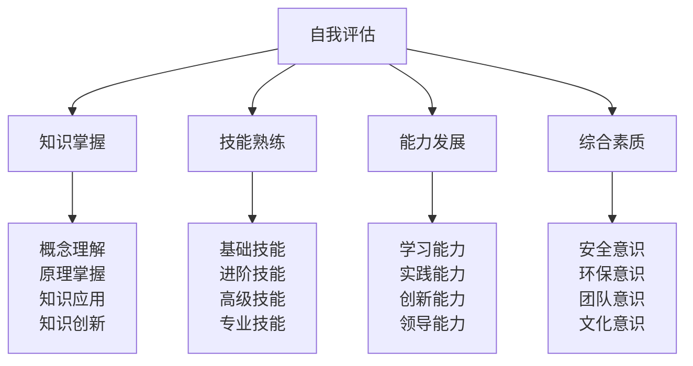
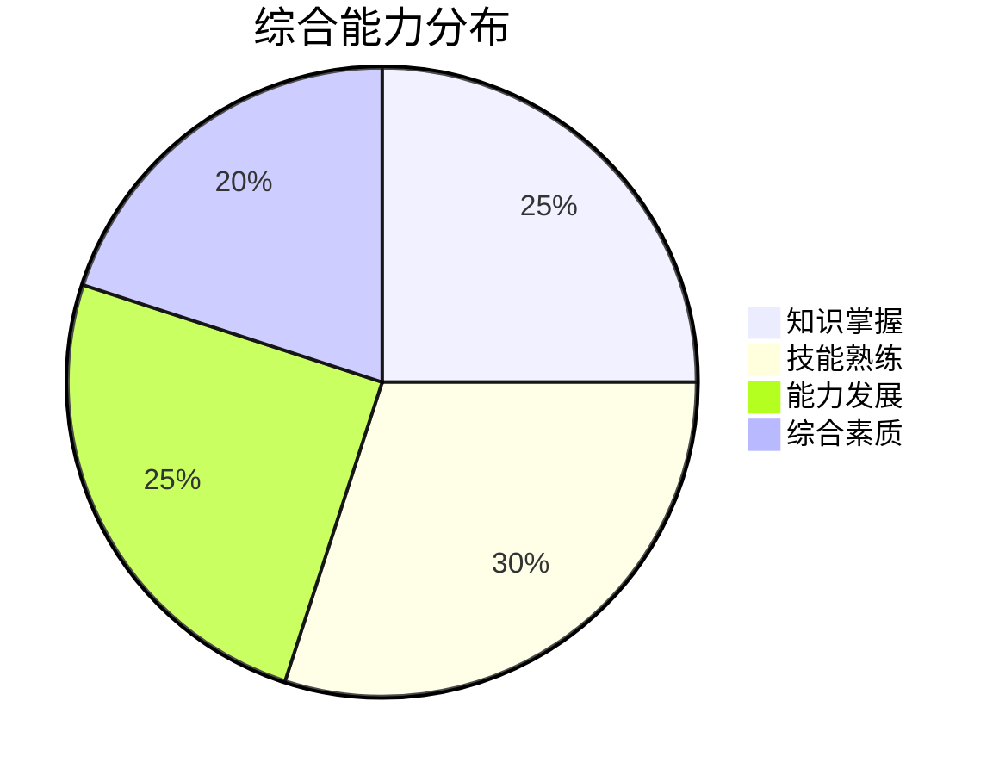
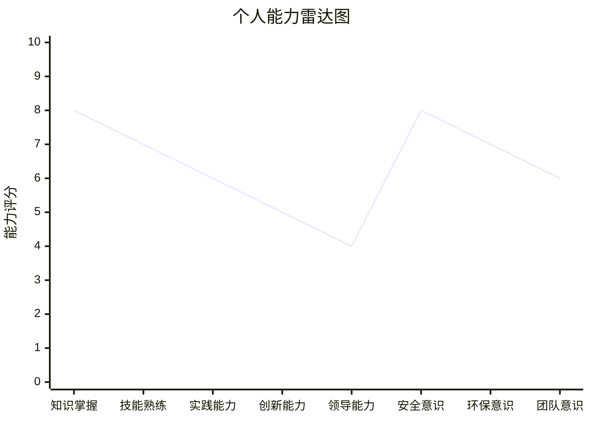

# 自我评估清单

## 📊 评估体系概览

### 评估维度框架

## 🎯 知识掌握评估

### 认知层知识评估
| 评估项目 | 评估标准 | 自评分数 | 改进方向 | 学习计划 |
|----------|----------|----------|----------|----------|
| **露营定义理解** | 能准确说出定义和内涵 | ___/10 | | |
| **露营分类掌握** | 能区分不同类型和特点 | ___/10 | | |
| **历史文化了解** | 了解发展历程和文化内涵 | ___/10 | | |
| **价值意义认识** | 认识多重价值和意义 | ___/10 | | |

### 理解层知识评估
| 评估项目 | 评估标准 | 自评分数 | 改进方向 | 学习计划 |
|----------|----------|----------|----------|----------|
| **生存原理掌握** | 理解人体适应机制 | ___/10 | | |
| **装备原理理解** | 理解装备选择逻辑 | ___/10 | | |
| **安全机制建立** | 建立安全防护意识 | ___/10 | | |
| **环保理念培养** | 培养环境保护理念 | ___/10 | | |

### 应用层知识评估
| 评估项目 | 评估标准 | 自评分数 | 改进方向 | 学习计划 |
|----------|----------|----------|----------|----------|
| **装备准备知识** | 掌握装备选择和使用 | ___/10 | | |
| **营地建设知识** | 掌握营地建设方法 | ___/10 | | |
| **野外生存知识** | 掌握野外生存技能 | ___/10 | | |
| **应急处理知识** | 掌握应急处理方法 | ___/10 | | |

### 创新层知识评估
| 评估项目 | 评估标准 | 自评分数 | 改进方向 | 学习计划 |
|----------|----------|----------|----------|----------|
| **高级技巧掌握** | 掌握高级技能技巧 | ___/10 | | |
| **专业配置能力** | 具备专业配置能力 | ___/10 | | |
| **领导力培养** | 培养团队领导力 | ___/10 | | |
| **文化传承责任** | 承担文化传承责任 | ___/10 | | |

## 🛠️ 技能熟练评估

### 基础技能评估
| 技能项目 | 熟练程度 | 实践次数 | 成功率 | 改进计划 |
|----------|----------|----------|--------|----------|
| **帐篷搭建** | ___/10 | ___次 | ___% | |
| **装备选择** | ___/10 | ___次 | ___% | |
| **营地选址** | ___/10 | ___次 | ___% | |
| **篝火建设** | ___/10 | ___次 | ___% | |
| **基础烹饪** | ___/10 | ___次 | ___% | |

### 进阶技能评估
| 技能项目 | 熟练程度 | 实践次数 | 成功率 | 改进计划 |
|----------|----------|----------|--------|----------|
| **方向识别** | ___/10 | ___次 | ___% | |
| **水源净化** | ___/10 | ___次 | ___% | |
| **食物获取** | ___/10 | ___次 | ___% | |
| **生火技术** | ___/10 | ___次 | ___% | |
| **应急处理** | ___/10 | ___次 | ___% | |

### 高级技能评估
| 技能项目 | 熟练程度 | 实践次数 | 成功率 | 改进计划 |
|----------|----------|----------|--------|----------|
| **极端环境应对** | ___/10 | ___次 | ___% | |
| **长期野外生存** | ___/10 | ___次 | ___% | |
| **专业导航技术** | ___/10 | ___次 | ___% | |
| **高级装备使用** | ___/10 | ___次 | ___% | |
| **团队协作技巧** | ___/10 | ___次 | ___% | |

### 专业技能评估
| 技能项目 | 熟练程度 | 实践次数 | 成功率 | 改进计划 |
|----------|----------|----------|--------|----------|
| **专业配置** | ___/10 | ___次 | ___% | |
| **技术集成** | ___/10 | ___次 | ___% | |
| **维护保养** | ___/10 | ___次 | ___% | |
| **升级优化** | ___/10 | ___次 | ___% | |
| **成本效益分析** | ___/10 | ___次 | ___% | |

## 🚀 能力发展评估

### 学习能力评估
| 能力项目 | 评估标准 | 自评分数 | 改进方向 | 发展计划 |
|----------|----------|----------|----------|----------|
| **知识吸收** | 快速理解新知识 | ___/10 | | |
| **知识整合** | 整合不同知识 | ___/10 | | |
| **知识应用** | 将知识应用到实践 | ___/10 | | |
| **知识创新** | 创新应用知识 | ___/10 | | |

### 实践能力评估
| 能力项目 | 评估标准 | 自评分数 | 改进方向 | 发展计划 |
|----------|----------|----------|----------|----------|
| **技能掌握** | 快速掌握新技能 | ___/10 | | |
| **技能应用** | 灵活应用技能 | ___/10 | | |
| **问题解决** | 独立解决问题 | ___/10 | | |
| **技能创新** | 创新技能应用 | ___/10 | | |

### 创新能力评估
| 能力项目 | 评估标准 | 自评分数 | 改进方向 | 发展计划 |
|----------|----------|----------|----------|----------|
| **创新思维** | 具备创新思维 | ___/10 | | |
| **创新实践** | 实践创新想法 | ___/10 | | |
| **创新应用** | 创新应用知识技能 | ___/10 | | |
| **创新引领** | 引领创新发展 | ___/10 | | |

### 领导能力评估
| 能力项目 | 评估标准 | 自评分数 | 改进方向 | 发展计划 |
|----------|----------|----------|----------|----------|
| **团队管理** | 有效管理团队 | ___/10 | | |
| **决策制定** | 科学制定决策 | ___/10 | | |
| **沟通协调** | 有效沟通协调 | ___/10 | | |
| **责任担当** | 承担领导责任 | ___/10 | | |

## 🌟 综合素质评估

### 安全意识评估
| 评估项目 | 评估标准 | 自评分数 | 改进方向 | 提升计划 |
|----------|----------|----------|----------|----------|
| **风险识别** | 识别潜在风险 | ___/10 | | |
| **风险评估** | 评估风险等级 | ___/10 | | |
| **风险控制** | 控制风险发生 | ___/10 | | |
| **应急处理** | 处理紧急情况 | ___/10 | | |

### 环保意识评估
| 评估项目 | 评估标准 | 自评分数 | 改进方向 | 提升计划 |
|----------|----------|----------|----------|----------|
| **环保理念** | 理解环保理念 | ___/10 | | |
| **环保实践** | 践行环保行为 | ___/10 | | |
| **环保教育** | 传播环保理念 | ___/10 | | |
| **环保创新** | 创新环保方法 | ___/10 | | |

### 团队意识评估
| 评估项目 | 评估标准 | 自评分数 | 改进方向 | 提升计划 |
|----------|----------|----------|----------|----------|
| **团队合作** | 积极参与团队合作 | ___/10 | | |
| **团队贡献** | 为团队做出贡献 | ___/10 | | |
| **团队支持** | 支持团队成员 | ___/10 | | |
| **团队发展** | 促进团队发展 | ___/10 | | |

### 文化意识评估
| 评估项目 | 评估标准 | 自评分数 | 改进方向 | 提升计划 |
|----------|----------|----------|----------|----------|
| **文化理解** | 理解露营文化 | ___/10 | | |
| **文化传承** | 传承露营文化 | ___/10 | | |
| **文化创新** | 创新露营文化 | ___/10 | | |
| **文化传播** | 传播露营文化 | ___/10 | | |

## 📈 综合评估分析

### 评估结果汇总

### 能力雷达图

### 优势分析
| 优势领域 | 优势程度 | 具体表现 | 发展建议 |
|----------|----------|----------|----------|
| **知识掌握** | 强 | 理论知识扎实 | 加强实践应用 |
| **安全意识** | 强 | 安全意识强 | 提升应急处理 |
| **环保意识** | 中 | 环保理念清晰 | 加强环保实践 |
| **团队意识** | 中 | 团队合作良好 | 提升领导能力 |

### 短板分析
| 短板领域 | 短板程度 | 具体表现 | 改进建议 |
|----------|----------|----------|----------|
| **技能熟练** | 弱 | 实践技能不足 | 增加实践练习 |
| **创新能力** | 弱 | 创新思维不足 | 培养创新思维 |
| **领导能力** | 弱 | 领导经验不足 | 参与领导实践 |
| **文化意识** | 中 | 文化理解不深 | 深入学习文化 |

## 🎯 改进计划制定

### 短期改进计划（1-3个月）
| 改进领域 | 改进目标 | 具体措施 | 时间安排 | 评估方式 |
|----------|----------|----------|----------|----------|
| **技能熟练** | 提升基础技能 | 每日练习30分钟 | 3个月 | 技能测试 |
| **实践能力** | 增加实践经验 | 每月实践1次 | 3个月 | 实践评估 |
| **安全意识** | 提升应急处理 | 参加安全培训 | 1个月 | 培训考核 |
| **环保意识** | 加强环保实践 | 践行环保行为 | 3个月 | 行为观察 |

### 中期改进计划（3-6个月）
| 改进领域 | 改进目标 | 具体措施 | 时间安排 | 评估方式 |
|----------|----------|----------|----------|----------|
| **创新能力** | 培养创新思维 | 学习创新方法 | 6个月 | 创新项目 |
| **领导能力** | 提升领导技能 | 参与领导实践 | 6个月 | 领导评估 |
| **文化意识** | 深化文化理解 | 深入学习文化 | 6个月 | 文化测试 |
| **综合素质** | 全面提升素质 | 系统化训练 | 6个月 | 综合评估 |

### 长期改进计划（6-12个月）
| 改进领域 | 改进目标 | 具体措施 | 时间安排 | 评估方式 |
|----------|----------|----------|----------|----------|
| **专业能力** | 达到专业水平 | 专业认证培训 | 12个月 | 专业认证 |
| **创新能力** | 具备创新能力 | 创新项目实践 | 12个月 | 创新成果 |
| **领导能力** | 具备领导能力 | 领导力培养 | 12个月 | 领导力评估 |
| **文化传承** | 承担传承责任 | 文化传承实践 | 12个月 | 传承效果 |

## 🎓 费曼学习法应用

### 第一步：选择概念
选择"自我评估"作为学习概念

### 第二步：教授他人
用简单语言解释：
> "自我评估就是定期检查自己的学习情况，看看知识掌握得怎么样，技能练得怎么样，能力发展得怎么样，然后找出不足，制定改进计划，持续提升自己。"

### 第三步：回顾简化
- **知识掌握**：概念理解、原理掌握、知识应用、知识创新
- **技能熟练**：基础技能、进阶技能、高级技能、专业技能
- **能力发展**：学习能力、实践能力、创新能力、领导能力
- **综合素质**：安全意识、环保意识、团队意识、文化意识

### 第四步：组织优化
建立评估与改进的关系：
- 知识掌握 → [[02-技能等级标准|技能等级]]
- 技能熟练 → [[03-实践项目设计|实践项目]]
- 能力发展 → [[04-认证与考核|认证考核]]
- 综合素质 → [[03-持续改进/01-学习反思模板|学习反思]]

## 🏃‍♂️ 刻意练习要点

### 评估技能练习
1. **自我观察**：练习客观观察自己
2. **自我分析**：练习深入分析自己
3. **自我改进**：练习制定改进计划
4. **自我监控**：练习监控改进效果

### 实践验证
- **定期评估**：定期进行自我评估
- **记录分析**：记录评估结果和分析
- **计划执行**：执行改进计划
- **效果验证**：验证改进效果

## 📋 评估检查清单

### 知识掌握检查
- [ ] 能准确说出核心概念
- [ ] 能理解基本原理
- [ ] 能应用知识解决问题
- [ ] 能创新应用知识

### 技能熟练检查
- [ ] 能熟练操作基础技能
- [ ] 能灵活应用进阶技能
- [ ] 能掌握高级技能
- [ ] 能具备专业技能

### 能力发展检查
- [ ] 具备学习能力
- [ ] 具备实践能力
- [ ] 具备创新能力
- [ ] 具备领导能力

### 综合素质检查
- [ ] 具备安全意识
- [ ] 具备环保意识
- [ ] 具备团队意识
- [ ] 具备文化意识

## 🔗 相关链接
- [[02-技能等级标准|技能等级标准]]
- [[03-实践项目设计|实践项目设计]]
- [[04-认证与考核|认证与考核]]
- [[03-持续改进/01-学习反思模板|学习反思模板]]