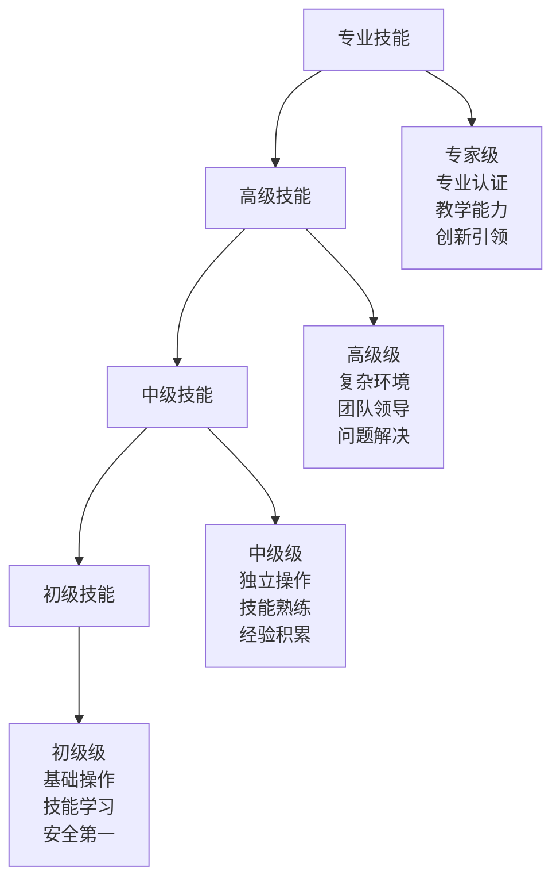
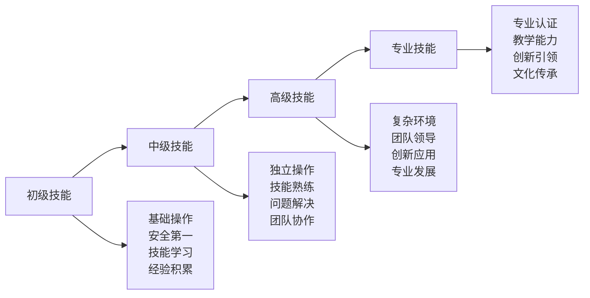
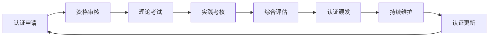

# 技能等级标准

## 🎯 技能等级体系概览

### 技能等级金字塔

## 📊 技能等级标准

### 初级技能标准（Level 1）
| 技能领域 | 技能要求 | 评估标准 | 通过条件 | 学习时间 |
|----------|----------|----------|----------|----------|
| **装备准备** | 基础装备选择和使用 | 能正确选择基础装备 | 80%正确率 | 2-4周 |
| **帐篷搭建** | 基础帐篷搭建 | 能独立搭建简单帐篷 | 90%成功率 | 1-2周 |
| **营地建设** | 基础营地建设 | 能建设安全营地 | 85%成功率 | 2-3周 |
| **基础烹饪** | 简单户外烹饪 | 能制作简单食物 | 80%成功率 | 1-2周 |
| **安全防护** | 基础安全知识 | 掌握安全原则 | 90%正确率 | 1-2周 |

### 中级技能标准（Level 2）
| 技能领域 | 技能要求 | 评估标准 | 通过条件 | 学习时间 |
|----------|----------|----------|----------|----------|
| **野外生存** | 基础生存技能 | 能应对基本生存挑战 | 75%成功率 | 4-6周 |
| **方向识别** | 多种导航方法 | 能使用多种导航工具 | 80%准确率 | 2-3周 |
| **水源管理** | 水源寻找和净化 | 能找到并净化水源 | 85%成功率 | 2-3周 |
| **应急处理** | 基础应急处理 | 能处理常见紧急情况 | 80%成功率 | 3-4周 |
| **团队协作** | 团队合作技能 | 能有效参与团队活动 | 75%表现 | 2-3周 |

### 高级技能标准（Level 3）
| 技能领域 | 技能要求 | 评估标准 | 通过条件 | 学习时间 |
|----------|----------|----------|----------|----------|
| **极端环境** | 极端环境应对 | 能应对极端环境挑战 | 70%成功率 | 6-8周 |
| **长期生存** | 长期野外生存 | 能进行长期野外生存 | 65%成功率 | 8-12周 |
| **专业导航** | 专业导航技术 | 掌握专业导航技能 | 75%准确率 | 4-6周 |
| **高级装备** | 高级装备使用 | 熟练使用高级装备 | 80%熟练度 | 3-4周 |
| **领导力** | 团队领导能力 | 能领导团队活动 | 70%表现 | 6-8周 |

### 专业技能标准（Level 4）
| 技能领域 | 技能要求 | 评估标准 | 通过条件 | 学习时间 |
|----------|----------|----------|----------|----------|
| **专业配置** | 专业装备配置 | 能进行专业装备配置 | 85%专业度 | 8-12周 |
| **技术集成** | 技术装备集成 | 能集成多种技术装备 | 80%集成度 | 6-8周 |
| **维护保养** | 专业维护保养 | 能进行专业维护保养 | 85%专业度 | 4-6周 |
| **教学指导** | 教学指导能力 | 能指导他人学习 | 80%教学效果 | 6-8周 |
| **文化传承** | 文化传承责任 | 能承担文化传承责任 | 75%传承效果 | 持续学习 |

## 🎯 技能评估方法

### 理论评估
| 评估类型 | 评估内容 | 评估方法 | 评估标准 | 通过条件 |
|----------|----------|----------|----------|----------|
| **概念测试** | 核心概念理解 | 选择题、简答题 | 80%正确率 | 概念清晰 |
| **原理分析** | 原理机制掌握 | 分析题、论述题 | 75%正确率 | 原理深入 |
| **案例分析** | 案例分析能力 | 案例题、应用题 | 70%正确率 | 分析准确 |
| **综合评估** | 综合知识应用 | 综合题、实践题 | 65%正确率 | 应用灵活 |

### 实践评估
| 评估类型 | 评估内容 | 评估方法 | 评估标准 | 通过条件 |
|----------|----------|----------|----------|----------|
| **技能操作** | 技能操作熟练度 | 实际操作测试 | 80%熟练度 | 操作熟练 |
| **问题解决** | 问题解决能力 | 问题解决测试 | 75%解决率 | 解决有效 |
| **应急处理** | 应急处理能力 | 应急演练测试 | 70%处理率 | 处理及时 |
| **团队协作** | 团队协作能力 | 团队活动测试 | 75%协作度 | 协作有效 |

### 综合评估
| 评估类型 | 评估内容 | 评估方法 | 评估标准 | 通过条件 |
|----------|----------|----------|----------|----------|
| **项目评估** | 项目完成能力 | 项目完成测试 | 70%完成度 | 项目成功 |
| **创新评估** | 创新能力评估 | 创新项目测试 | 65%创新度 | 创新有效 |
| **领导评估** | 领导能力评估 | 领导实践测试 | 70%领导力 | 领导有效 |
| **传承评估** | 文化传承能力 | 传承实践测试 | 65%传承度 | 传承有效 |

## 📈 技能等级进阶

### 进阶路径图

### 进阶要求
| 等级 | 进阶要求 | 时间要求 | 实践要求 | 认证要求 |
|------|----------|----------|----------|----------|
| **初级→中级** | 掌握基础技能 | 3-6个月 | 10次实践 | 基础认证 |
| **中级→高级** | 掌握进阶技能 | 6-12个月 | 20次实践 | 进阶认证 |
| **高级→专业** | 掌握高级技能 | 12-24个月 | 50次实践 | 专业认证 |
| **专业→专家** | 掌握专业技能 | 24个月以上 | 100次实践 | 专家认证 |

## 🏆 认证体系

### 认证等级
| 认证等级 | 认证标准 | 认证内容 | 认证方式 | 有效期 |
|----------|----------|----------|----------|--------|
| **基础认证** | 初级技能掌握 | 基础技能测试 | 理论+实践 | 2年 |
| **进阶认证** | 中级技能掌握 | 进阶技能测试 | 理论+实践 | 3年 |
| **高级认证** | 高级技能掌握 | 高级技能测试 | 理论+实践 | 4年 |
| **专业认证** | 专业技能掌握 | 专业技能测试 | 理论+实践 | 5年 |
| **专家认证** | 专家技能掌握 | 专家技能测试 | 理论+实践 | 终身 |

### 认证流程

### 认证标准
| 认证项目 | 认证内容 | 认证标准 | 认证方法 | 认证结果 |
|----------|----------|----------|----------|----------|
| **理论知识** | 概念、原理、方法 | 80%正确率 | 笔试测试 | 通过/不通过 |
| **实践技能** | 操作、应用、创新 | 75%熟练度 | 实操测试 | 通过/不通过 |
| **问题解决** | 分析、解决、创新 | 70%解决率 | 案例测试 | 通过/不通过 |
| **团队协作** | 沟通、协调、领导 | 75%协作度 | 团队测试 | 通过/不通过 |

## 📊 技能评估工具

### 评估量表
| 技能维度 | 评估项目 | 评分标准 | 权重 | 总分 |
|----------|----------|----------|------|------|
| **理论知识** | 概念理解、原理掌握 | 1-10分 | 25% | 100分 |
| **实践技能** | 操作熟练、应用灵活 | 1-10分 | 30% | 100分 |
| **问题解决** | 分析能力、解决能力 | 1-10分 | 25% | 100分 |
| **团队协作** | 沟通能力、协作能力 | 1-10分 | 20% | 100分 |

### 评估方法
| 评估方法 | 适用场景 | 评估内容 | 评估标准 | 评估效果 |
|----------|----------|----------|----------|----------|
| **自我评估** | 日常学习 | 自我认知 | 主观评价 | 自我了解 |
| **同伴评估** | 团队活动 | 团队表现 | 同伴评价 | 团队认知 |
| **导师评估** | 专业指导 | 专业能力 | 专业评价 | 专业认知 |
| **认证评估** | 正式认证 | 综合能力 | 标准评价 | 权威认证 |

## 🎓 费曼学习法应用

### 第一步：选择概念
选择"技能等级标准"作为学习概念

### 第二步：教授他人
用简单语言解释：
> "技能等级标准就是把露营技能分成四个等级：初级是基础操作，中级是独立操作，高级是复杂环境，专业是教学指导。每个等级都有明确的要求和评估标准。"

### 第三步：回顾简化
- **初级技能**：基础操作、安全第一、技能学习
- **中级技能**：独立操作、技能熟练、问题解决
- **高级技能**：复杂环境、团队领导、创新应用
- **专业技能**：专业认证、教学能力、创新引领

### 第四步：组织优化
建立技能等级与学习的关系：
- 初级技能 → [[01-认知层-基础概念|认知层]]
- 中级技能 → [[02-理解层-原理机制|理解层]]
- 高级技能 → [[03-应用层-实践技能|应用层]]
- 专业技能 → [[04-创新层-进阶发展|创新层]]

## 🏃‍♂️ 刻意练习要点

### 技能练习策略
1. **基础练习**：从基础技能开始练习
2. **进阶练习**：逐步提升技能难度
3. **综合练习**：综合应用多种技能
4. **创新练习**：创新应用技能方法

### 练习方法
- **重复练习**：重复练习基础技能
- **变化练习**：变化练习环境和方法
- **综合练习**：综合练习多种技能
- **创新练习**：创新练习技能应用

### 练习记录
使用[[01-自我评估清单|自我评估清单]]记录练习过程和效果

## 📋 技能等级检查清单

### 初级技能检查
- [ ] 能正确选择基础装备
- [ ] 能独立搭建简单帐篷
- [ ] 能建设安全营地
- [ ] 能制作简单食物
- [ ] 掌握安全原则

### 中级技能检查
- [ ] 能应对基本生存挑战
- [ ] 能使用多种导航工具
- [ ] 能找到并净化水源
- [ ] 能处理常见紧急情况
- [ ] 能有效参与团队活动

### 高级技能检查
- [ ] 能应对极端环境挑战
- [ ] 能进行长期野外生存
- [ ] 掌握专业导航技能
- [ ] 熟练使用高级装备
- [ ] 能领导团队活动

### 专业技能检查
- [ ] 能进行专业装备配置
- [ ] 能集成多种技术装备
- [ ] 能进行专业维护保养
- [ ] 能指导他人学习
- [ ] 能承担文化传承责任

## 🎯 技能发展建议

### 发展策略
1. **循序渐进**：从初级到专业逐步发展
2. **重点突破**：重点突破关键技能
3. **全面发展**：全面发展各项技能
4. **持续提升**：持续提升技能水平

### 发展方法
- **理论学习**：加强理论知识学习
- **实践练习**：加强实践技能练习
- **经验积累**：积累实践经验
- **持续改进**：持续改进技能方法

## 🔗 相关链接
- [[01-自我评估清单|自我评估清单]]
- [[03-实践项目设计|实践项目设计]]
- [[04-认证与考核|认证与考核]]
- [[03-持续改进/01-学习反思模板|学习反思模板]]