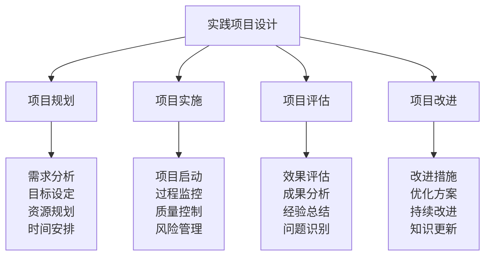

# 实践项目设计

## 🎯 实践项目体系概览

### 项目设计框架

## 📊 项目分类体系

### 按难度分类
| 项目类型 | 难度等级 | 适用对象 | 项目时长 | 核心技能 | 评估标准 |
|----------|----------|----------|----------|----------|----------|
| **基础项目** | 初级 | 初学者 | 1-2周 | 基础技能 | 技能掌握 |
| **进阶项目** | 中级 | 有经验者 | 2-4周 | 进阶技能 | 技能熟练 |
| **高级项目** | 高级 | 进阶者 | 1-3个月 | 高级技能 | 技能精通 |
| **专业项目** | 专业 | 专家级 | 3-6个月 | 专业技能 | 专业认证 |

### 按环境分类
| 项目类型 | 环境特点 | 挑战程度 | 技能要求 | 安全等级 | 推荐指数 |
|----------|----------|----------|----------|----------|----------|
| **城市公园** | 环境友好 | 低 | 基础技能 | 高 | ⭐⭐⭐⭐⭐ |
| **郊外山区** | 自然环境 | 中 | 进阶技能 | 中 | ⭐⭐⭐⭐ |
| **荒野环境** | 原始环境 | 高 | 高级技能 | 中 | ⭐⭐⭐ |
| **极端环境** | 极端条件 | 极高 | 专业技能 | 低 | ⭐⭐ |

### 按目的分类
| 项目类型 | 项目目的 | 学习重点 | 实践内容 | 预期成果 | 适用场景 |
|----------|----------|----------|----------|----------|----------|
| **技能训练** | 技能提升 | 技能熟练 | 技能练习 | 技能掌握 | 日常训练 |
| **团队建设** | 团队协作 | 团队合作 | 团队活动 | 团队凝聚 | 团队活动 |
| **应急演练** | 应急能力 | 应急处理 | 应急演练 | 应急能力 | 安全培训 |
| **文化传承** | 文化传播 | 文化传承 | 文化活动 | 文化影响 | 文化教育 |

## 🎯 基础项目设计

### 项目1：帐篷搭建技能训练
| 项目要素 | 具体内容 | 实施方法 | 评估标准 | 改进措施 |
|----------|----------|----------|----------|----------|
| **项目目标** | 掌握帐篷搭建技能 | 理论+实践 | 90%成功率 | 增加练习次数 |
| **项目内容** | 帐篷选择、搭建、固定 | 分步教学 | 操作熟练 | 提高搭建速度 |
| **项目时间** | 1周 | 每日练习 | 时间控制 | 优化时间安排 |
| **项目环境** | 安全环境 | 模拟环境 | 环境适应 | 增加环境变化 |
| **项目评估** | 技能测试 | 实操测试 | 技能掌握 | 完善评估方法 |

### 项目2：基础营地建设
| 项目要素 | 具体内容 | 实施方法 | 评估标准 | 改进措施 |
|----------|----------|----------|----------|----------|
| **项目目标** | 学会营地建设 | 实践教学 | 85%成功率 | 增加实践机会 |
| **项目内容** | 选址、布局、建设 | 实地操作 | 建设质量 | 提高建设效率 |
| **项目时间** | 2周 | 周末实践 | 时间管理 | 优化时间分配 |
| **项目环境** | 自然环境 | 真实环境 | 环境适应 | 增加环境多样性 |
| **项目评估** | 建设评估 | 质量评估 | 建设效果 | 完善评估体系 |

### 项目3：基础野外生存
| 项目要素 | 具体内容 | 实施方法 | 评估标准 | 改进措施 |
|----------|----------|----------|----------|----------|
| **项目目标** | 掌握基础生存技能 | 技能训练 | 80%成功率 | 加强技能训练 |
| **项目内容** | 方向识别、水源净化 | 实践操作 | 技能熟练 | 提高技能水平 |
| **项目时间** | 3周 | 集中训练 | 技能掌握 | 延长训练时间 |
| **项目环境** | 野外环境 | 真实环境 | 环境适应 | 增加环境挑战 |
| **项目评估** | 生存测试 | 综合测试 | 生存能力 | 完善测试方法 |

## 🚀 进阶项目设计

### 项目4：团队协作露营
| 项目要素 | 具体内容 | 实施方法 | 评估标准 | 改进措施 |
|----------|----------|----------|----------|----------|
| **项目目标** | 培养团队协作能力 | 团队活动 | 75%协作度 | 加强团队训练 |
| **项目内容** | 团队分工、协作完成 | 团队实践 | 协作效果 | 提高协作效率 |
| **项目时间** | 1个月 | 周末活动 | 团队建设 | 增加活动频率 |
| **项目环境** | 复杂环境 | 真实环境 | 环境适应 | 增加环境复杂度 |
| **项目评估** | 团队评估 | 协作评估 | 团队表现 | 完善评估方法 |

### 项目5：应急处理演练
| 项目要素 | 具体内容 | 实施方法 | 评估标准 | 改进措施 |
|----------|----------|----------|----------|----------|
| **项目目标** | 提升应急处理能力 | 应急演练 | 80%处理率 | 增加演练次数 |
| **项目内容** | 伤病处理、天气应对 | 模拟演练 | 处理效果 | 提高处理速度 |
| **项目时间** | 2个月 | 定期演练 | 应急能力 | 优化演练安排 |
| **项目环境** | 模拟环境 | 真实环境 | 环境适应 | 增加环境真实性 |
| **项目评估** | 应急评估 | 处理评估 | 应急能力 | 完善评估体系 |

### 项目6：高级装备使用
| 项目要素 | 具体内容 | 实施方法 | 评估标准 | 改进措施 |
|----------|----------|----------|----------|----------|
| **项目目标** | 掌握高级装备使用 | 装备训练 | 85%熟练度 | 加强装备训练 |
| **项目内容** | GPS、专业装备使用 | 实践操作 | 使用熟练 | 提高使用效率 |
| **项目时间** | 1个月 | 集中训练 | 装备掌握 | 延长训练时间 |
| **项目环境** | 专业环境 | 真实环境 | 环境适应 | 增加环境挑战 |
| **项目评估** | 装备评估 | 使用评估 | 装备能力 | 完善评估方法 |

## 🏆 高级项目设计

### 项目7：极端环境挑战
| 项目要素 | 具体内容 | 实施方法 | 评估标准 | 改进措施 |
|----------|----------|----------|----------|----------|
| **项目目标** | 应对极端环境挑战 | 挑战训练 | 70%成功率 | 加强挑战训练 |
| **项目内容** | 高海拔、极端天气 | 真实挑战 | 挑战能力 | 提高挑战水平 |
| **项目时间** | 3个月 | 长期训练 | 环境适应 | 延长适应时间 |
| **项目环境** | 极端环境 | 真实环境 | 环境适应 | 增加环境挑战 |
| **项目评估** | 挑战评估 | 综合评估 | 挑战能力 | 完善评估体系 |

### 项目8：长期野外生存
| 项目要素 | 具体内容 | 实施方法 | 评估标准 | 改进措施 |
|----------|----------|----------|----------|----------|
| **项目目标** | 进行长期野外生存 | 生存训练 | 65%成功率 | 加强生存训练 |
| **项目内容** | 长期生存、资源管理 | 长期实践 | 生存能力 | 提高生存效率 |
| **项目时间** | 6个月 | 长期实践 | 生存技能 | 延长实践时间 |
| **项目环境** | 荒野环境 | 真实环境 | 环境适应 | 增加环境挑战 |
| **项目评估** | 生存评估 | 长期评估 | 生存能力 | 完善评估方法 |

### 项目9：领导力实践
| 项目要素 | 具体内容 | 实施方法 | 评估标准 | 改进措施 |
|----------|----------|----------|----------|----------|
| **项目目标** | 培养领导力 | 领导实践 | 70%领导力 | 加强领导训练 |
| **项目内容** | 团队领导、决策制定 | 领导实践 | 领导效果 | 提高领导效率 |
| **项目时间** | 4个月 | 持续实践 | 领导能力 | 延长实践时间 |
| **项目环境** | 复杂环境 | 真实环境 | 环境适应 | 增加环境复杂度 |
| **项目评估** | 领导评估 | 综合评估 | 领导能力 | 完善评估体系 |

## 🎓 专业项目设计

### 项目10：专业配置实践
| 项目要素 | 具体内容 | 实施方法 | 评估标准 | 改进措施 |
|----------|----------|----------|----------|----------|
| **项目目标** | 实现专业装备配置 | 配置实践 | 85%专业度 | 加强配置训练 |
| **项目内容** | 专业装备、技术集成 | 专业实践 | 配置效果 | 提高配置效率 |
| **项目时间** | 6个月 | 长期实践 | 专业能力 | 延长实践时间 |
| **项目环境** | 专业环境 | 真实环境 | 环境适应 | 增加环境挑战 |
| **项目评估** | 专业评估 | 综合评估 | 专业能力 | 完善评估方法 |

### 项目11：文化传承实践
| 项目要素 | 具体内容 | 实施方法 | 评估标准 | 改进措施 |
|----------|----------|----------|----------|----------|
| **项目目标** | 承担文化传承责任 | 传承实践 | 75%传承效果 | 加强传承训练 |
| **项目内容** | 文化传播、教育指导 | 传承实践 | 传承效果 | 提高传承效率 |
| **项目时间** | 12个月 | 长期实践 | 传承能力 | 延长实践时间 |
| **项目环境** | 社会环境 | 真实环境 | 环境适应 | 增加环境多样性 |
| **项目评估** | 传承评估 | 社会评估 | 传承能力 | 完善评估体系 |

## 📊 项目评估体系

### 评估维度
| 评估维度 | 评估内容 | 评估方法 | 权重 | 评估标准 |
|----------|----------|----------|------|----------|
| **技能掌握** | 技能熟练度 | 技能测试 | 30% | 80%以上 |
| **问题解决** | 问题解决能力 | 问题测试 | 25% | 75%以上 |
| **团队协作** | 团队协作能力 | 团队测试 | 20% | 75%以上 |
| **创新应用** | 创新应用能力 | 创新测试 | 15% | 70%以上 |
| **安全防护** | 安全防护能力 | 安全测试 | 10% | 90%以上 |

### 评估方法
| 评估方法 | 适用项目 | 评估内容 | 评估标准 | 评估效果 |
|----------|----------|----------|----------|----------|
| **自我评估** | 所有项目 | 自我认知 | 主观评价 | 自我了解 |
| **同伴评估** | 团队项目 | 团队表现 | 同伴评价 | 团队认知 |
| **导师评估** | 专业项目 | 专业能力 | 专业评价 | 专业认知 |
| **社会评估** | 传承项目 | 社会影响 | 社会评价 | 社会认知 |

## 🎓 费曼学习法应用

### 第一步：选择概念
选择"实践项目设计"作为学习概念

### 第二步：教授他人
用简单语言解释：
> "实践项目设计就是把学习内容设计成具体的实践项目，从简单的帐篷搭建到复杂的文化传承，每个项目都有明确的目标、内容、时间和评估标准。"

### 第三步：回顾简化
- **项目规划**：需求分析、目标设定、资源规划、时间安排
- **项目实施**：项目启动、过程监控、质量控制、风险管理
- **项目评估**：效果评估、成果分析、经验总结、问题识别
- **项目改进**：改进措施、优化方案、持续改进、知识更新

### 第四步：组织优化
建立项目与学习的关系：
- 基础项目 → [[01-认知层-基础概念|认知层]]
- 进阶项目 → [[02-理解层-原理机制|理解层]]
- 高级项目 → [[03-应用层-实践技能|应用层]]
- 专业项目 → [[04-创新层-进阶发展|创新层]]

## 🏃‍♂️ 刻意练习要点

### 项目练习策略
1. **基础练习**：从基础项目开始练习
2. **进阶练习**：逐步提升项目难度
3. **综合练习**：综合应用多种技能
4. **创新练习**：创新项目设计方法

### 练习方法
- **项目规划**：练习项目规划能力
- **项目实施**：练习项目实施能力
- **项目评估**：练习项目评估能力
- **项目改进**：练习项目改进能力

### 练习记录
使用[[01-自我评估清单|自我评估清单]]记录项目练习过程和效果

## 📋 项目设计检查清单

### 项目规划检查
- [ ] 项目目标是否明确
- [ ] 项目内容是否合理
- [ ] 项目时间是否充足
- [ ] 项目资源是否到位
- [ ] 项目环境是否安全

### 项目实施检查
- [ ] 项目启动是否顺利
- [ ] 过程监控是否有效
- [ ] 质量控制是否到位
- [ ] 风险管理是否完善
- [ ] 团队协作是否有效

### 项目评估检查
- [ ] 效果评估是否客观
- [ ] 成果分析是否深入
- [ ] 经验总结是否全面
- [ ] 问题识别是否准确
- [ ] 改进措施是否有效

### 项目改进检查
- [ ] 改进措施是否合理
- [ ] 优化方案是否可行
- [ ] 持续改进是否有效
- [ ] 知识更新是否及时
- [ ] 项目效果是否提升

## 🎯 项目设计建议

### 设计原则
1. **目标明确**：项目目标清晰明确
2. **内容合理**：项目内容科学合理
3. **时间充足**：项目时间安排合理
4. **环境安全**：项目环境安全可控
5. **评估完善**：项目评估体系完善

### 设计方法
- **需求分析**：深入分析学习需求
- **目标设定**：科学设定项目目标
- **内容设计**：合理设计项目内容
- **时间安排**：合理安排项目时间
- **环境选择**：选择合适项目环境

## 🔗 相关链接
- [[01-自我评估清单|自我评估清单]]
- [[02-技能等级标准|技能等级标准]]
- [[04-认证与考核|认证与考核]]
- [[03-持续改进/01-学习反思模板|学习反思模板]]