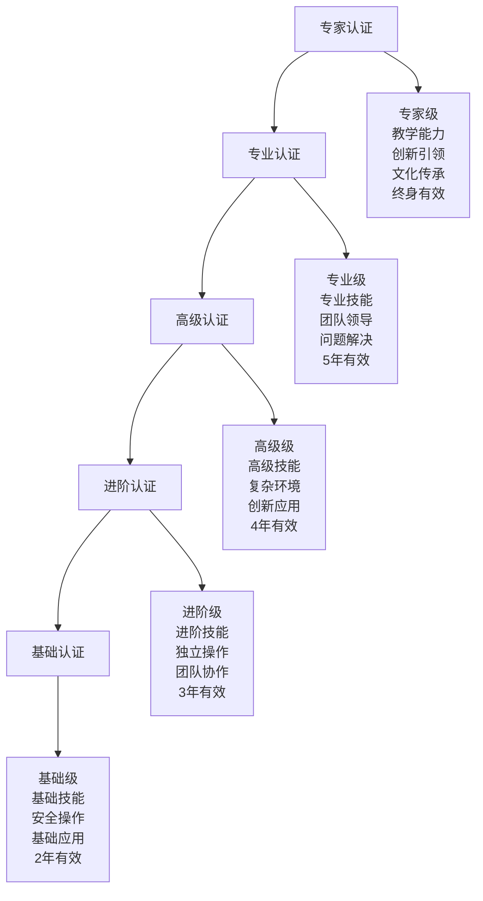
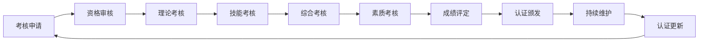
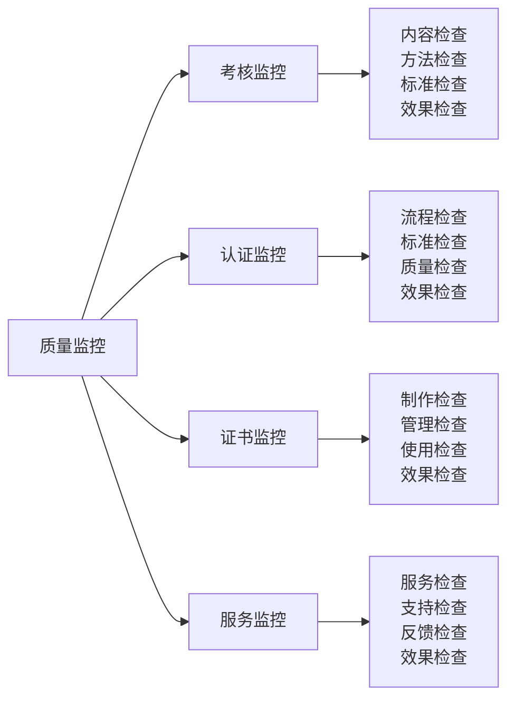

# 认证与考核

## 🏆 认证体系概览

### 认证等级体系

## 📊 认证标准体系

### 基础认证标准
| 认证项目 | 认证内容 | 认证标准 | 认证方法 | 通过条件 |
|----------|----------|----------|----------|----------|
| **理论知识** | 基础概念、安全原则 | 80%正确率 | 笔试测试 | 60分以上 |
| **实践技能** | 基础操作、安全操作 | 85%熟练度 | 实操测试 | 70分以上 |
| **安全意识** | 安全知识、安全行为 | 90%正确率 | 安全测试 | 80分以上 |
| **基础应用** | 基础应用、问题解决 | 75%应用率 | 应用测试 | 65分以上 |

### 进阶认证标准
| 认证项目 | 认证内容 | 认证标准 | 认证方法 | 通过条件 |
|----------|----------|----------|----------|----------|
| **理论知识** | 进阶概念、原理机制 | 75%正确率 | 笔试测试 | 65分以上 |
| **实践技能** | 进阶操作、技能熟练 | 80%熟练度 | 实操测试 | 75分以上 |
| **问题解决** | 问题分析、解决能力 | 75%解决率 | 问题测试 | 70分以上 |
| **团队协作** | 团队合作、沟通协调 | 70%协作度 | 团队测试 | 65分以上 |

### 高级认证标准
| 认证项目 | 认证内容 | 认证标准 | 认证方法 | 通过条件 |
|----------|----------|----------|----------|----------|
| **理论知识** | 高级概念、专业原理 | 70%正确率 | 笔试测试 | 70分以上 |
| **实践技能** | 高级操作、技能精通 | 75%熟练度 | 实操测试 | 80分以上 |
| **复杂环境** | 复杂环境、极端应对 | 70%应对率 | 环境测试 | 75分以上 |
| **创新应用** | 创新思维、应用能力 | 65%创新度 | 创新测试 | 70分以上 |

### 专业认证标准
| 认证项目 | 认证内容 | 认证标准 | 认证方法 | 通过条件 |
|----------|----------|----------|----------|----------|
| **理论知识** | 专业概念、深度原理 | 65%正确率 | 笔试测试 | 75分以上 |
| **实践技能** | 专业技能、专业操作 | 70%熟练度 | 实操测试 | 85分以上 |
| **团队领导** | 领导能力、团队管理 | 70%领导力 | 领导测试 | 75分以上 |
| **专业应用** | 专业应用、专业创新 | 60%专业度 | 专业测试 | 70分以上 |

### 专家认证标准
| 认证项目 | 认证内容 | 认证标准 | 认证方法 | 通过条件 |
|----------|----------|----------|----------|----------|
| **理论知识** | 专家知识、前沿理论 | 60%正确率 | 笔试测试 | 80分以上 |
| **实践技能** | 专家技能、教学能力 | 65%熟练度 | 实操测试 | 90分以上 |
| **创新引领** | 创新能力、引领能力 | 60%创新度 | 创新测试 | 75分以上 |
| **文化传承** | 传承能力、社会影响 | 55%传承度 | 传承测试 | 70分以上 |

## 🎯 考核体系设计

### 考核内容体系
| 考核类型 | 考核内容 | 考核方法 | 考核标准 | 考核权重 |
|----------|----------|----------|----------|----------|
| **理论考核** | 概念、原理、方法 | 笔试、口试 | 知识掌握 | 30% |
| **技能考核** | 操作、应用、创新 | 实操、演示 | 技能熟练 | 40% |
| **综合考核** | 综合应用、问题解决 | 综合测试 | 综合能力 | 20% |
| **素质考核** | 安全意识、团队协作 | 观察、评估 | 综合素质 | 10% |

### 考核方法体系
| 考核方法 | 适用场景 | 考核内容 | 考核标准 | 考核效果 |
|----------|----------|----------|----------|----------|
| **笔试考核** | 理论知识 | 概念理解、原理掌握 | 80%正确率 | 知识掌握 |
| **实操考核** | 实践技能 | 操作熟练、应用灵活 | 75%熟练度 | 技能熟练 |
| **综合考核** | 综合能力 | 问题解决、创新应用 | 70%综合度 | 综合能力 |
| **观察考核** | 综合素质 | 安全意识、团队协作 | 75%素质度 | 综合素质 |

### 考核流程设计

## 📈 认证管理体系

### 认证机构
| 机构类型 | 机构名称 | 认证范围 | 认证标准 | 认证权威性 |
|----------|----------|----------|----------|------------|
| **官方机构** | 中国登山协会 | 专业认证 | 国家标准 | 最高权威 |
| **教育机构** | 体育院校 | 学术认证 | 学术标准 | 学术权威 |
| **培训机构** | 专业培训机构 | 技能认证 | 行业标准 | 行业权威 |
| **社会机构** | 户外组织 | 社会认证 | 社会标准 | 社会认可 |

### 认证流程
| 流程步骤 | 流程内容 | 时间要求 | 负责机构 | 质量保证 |
|----------|----------|----------|----------|----------|
| **申请提交** | 提交认证申请 | 提前1个月 | 认证机构 | 申请审核 |
| **资格审核** | 审核认证资格 | 1周 | 认证机构 | 资格确认 |
| **考核安排** | 安排考核时间 | 1周 | 认证机构 | 时间确认 |
| **考核实施** | 实施认证考核 | 1-3天 | 认证机构 | 考核监督 |
| **成绩评定** | 评定考核成绩 | 1周 | 认证机构 | 成绩确认 |
| **认证颁发** | 颁发认证证书 | 1周 | 认证机构 | 证书制作 |
| **持续维护** | 维护认证资格 | 持续 | 认证机构 | 资格维护 |

### 认证维护
| 维护类型 | 维护内容 | 维护频率 | 维护要求 | 维护效果 |
|----------|----------|----------|----------|----------|
| **继续教育** | 知识更新、技能提升 | 每年 | 40学时 | 知识更新 |
| **实践验证** | 实践能力验证 | 每2年 | 实践考核 | 能力保持 |
| **社会服务** | 社会贡献、志愿服务 | 每年 | 20小时 | 社会贡献 |
| **创新贡献** | 创新成果、技术贡献 | 每3年 | 创新项目 | 创新发展 |

## 🎓 考核内容详解

### 理论考核内容
| 考核层次 | 考核内容 | 考核重点 | 考核方法 | 评分标准 |
|----------|----------|----------|----------|----------|
| **基础理论** | 露营概念、分类、历史 | 概念理解 | 选择题、简答题 | 80%正确率 |
| **进阶理论** | 生存原理、装备原理 | 原理掌握 | 分析题、论述题 | 75%正确率 |
| **高级理论** | 安全机制、环保理念 | 机制理解 | 案例题、应用题 | 70%正确率 |
| **专业理论** | 高级技巧、专业配置 | 专业理解 | 综合题、创新题 | 65%正确率 |

### 技能考核内容
| 考核层次 | 考核内容 | 考核重点 | 考核方法 | 评分标准 |
|----------|----------|----------|----------|----------|
| **基础技能** | 装备准备、帐篷搭建 | 操作熟练 | 实操测试 | 85%熟练度 |
| **进阶技能** | 营地建设、野外生存 | 技能应用 | 实践测试 | 80%熟练度 |
| **高级技能** | 应急处理、团队协作 | 综合应用 | 综合测试 | 75%熟练度 |
| **专业技能** | 专业配置、领导力 | 专业应用 | 专业测试 | 70%熟练度 |

### 综合考核内容
| 考核类型 | 考核内容 | 考核重点 | 考核方法 | 评分标准 |
|----------|----------|----------|----------|----------|
| **问题解决** | 实际问题解决 | 解决能力 | 问题测试 | 75%解决率 |
| **创新应用** | 创新方法应用 | 创新能力 | 创新测试 | 70%创新度 |
| **团队协作** | 团队合作能力 | 协作能力 | 团队测试 | 75%协作度 |
| **领导能力** | 团队领导能力 | 领导能力 | 领导测试 | 70%领导力 |

## 📊 认证质量保证

### 质量保证体系
| 质量维度 | 质量内容 | 质量方法 | 质量标准 | 质量监控 |
|----------|----------|----------|----------|----------|
| **考核质量** | 考核内容、方法 | 考核设计 | 科学合理 | 定期检查 |
| **认证质量** | 认证标准、流程 | 认证管理 | 严格规范 | 持续监控 |
| **证书质量** | 证书制作、管理 | 证书管理 | 规范标准 | 质量检查 |
| **服务质量** | 认证服务、支持 | 服务管理 | 优质高效 | 服务评估 |

### 质量监控机制

### 质量改进措施
| 改进类型 | 改进内容 | 改进方法 | 改进频率 | 改进效果 |
|----------|----------|----------|----------|----------|
| **预防性改进** | 预防质量问题 | 质量预防 | 持续 | 质量稳定 |
| **纠正性改进** | 纠正质量问题 | 问题纠正 | 及时 | 质量提升 |
| **改进性改进** | 改进质量水平 | 质量改进 | 定期 | 质量优化 |
| **创新性改进** | 创新质量方法 | 方法创新 | 持续 | 质量创新 |

## 🎓 费曼学习法应用

### 第一步：选择概念
选择"认证与考核"作为学习概念

### 第二步：教授他人
用简单语言解释：
> "认证与考核就是通过考试来证明你的露营技能水平，从基础到专家分为五个等级，每个等级都有不同的考试内容和标准，通过考试就能获得相应的证书。"

### 第三步：回顾简化
- **认证等级**：基础、进阶、高级、专业、专家
- **考核内容**：理论、技能、综合、素质
- **考核方法**：笔试、实操、综合、观察
- **认证管理**：申请、考核、颁发、维护

### 第四步：组织优化
建立认证与学习的关系：
- 基础认证 → [[01-认知层-基础概念|认知层]]
- 进阶认证 → [[02-理解层-原理机制|理解层]]
- 高级认证 → [[03-应用层-实践技能|应用层]]
- 专业认证 → [[04-创新层-进阶发展|创新层]]

## 🏃‍♂️ 刻意练习要点

### 认证准备策略
1. **理论学习**：系统学习理论知识
2. **技能练习**：大量练习实践技能
3. **综合训练**：综合训练各项能力
4. **模拟考试**：进行模拟考试练习

### 练习方法
- **理论学习**：系统学习认证内容
- **技能练习**：大量练习认证技能
- **综合训练**：综合训练认证能力
- **模拟考试**：模拟考试认证过程

### 练习记录
使用[[01-自我评估清单|自我评估清单]]记录认证准备过程和效果

## 📋 认证准备检查清单

### 基础认证准备
- [ ] 掌握基础概念
- [ ] 熟练基础操作
- [ ] 建立安全意识
- [ ] 具备基础应用能力

### 进阶认证准备
- [ ] 理解进阶原理
- [ ] 掌握进阶技能
- [ ] 具备问题解决能力
- [ ] 具备团队协作能力

### 高级认证准备
- [ ] 掌握高级理论
- [ ] 精通高级技能
- [ ] 具备复杂环境应对能力
- [ ] 具备创新应用能力

### 专业认证准备
- [ ] 掌握专业理论
- [ ] 精通专业技能
- [ ] 具备团队领导能力
- [ ] 具备专业应用能力

### 专家认证准备
- [ ] 掌握专家知识
- [ ] 具备教学能力
- [ ] 具备创新引领能力
- [ ] 具备文化传承能力

## 🎯 认证建议

### 认证策略
1. **循序渐进**：从基础到专家逐步认证
2. **重点突破**：重点突破关键认证
3. **全面发展**：全面发展各项能力
4. **持续提升**：持续提升认证水平

### 认证方法
- **系统学习**：系统学习认证内容
- **大量练习**：大量练习认证技能
- **模拟考试**：进行模拟考试练习
- **持续改进**：持续改进认证方法

## 🔗 相关链接
- [[01-自我评估清单|自我评估清单]]
- [[02-技能等级标准|技能等级标准]]
- [[03-实践项目设计|实践项目设计]]
- [[03-持续改进/01-学习反思模板|学习反思模板]]