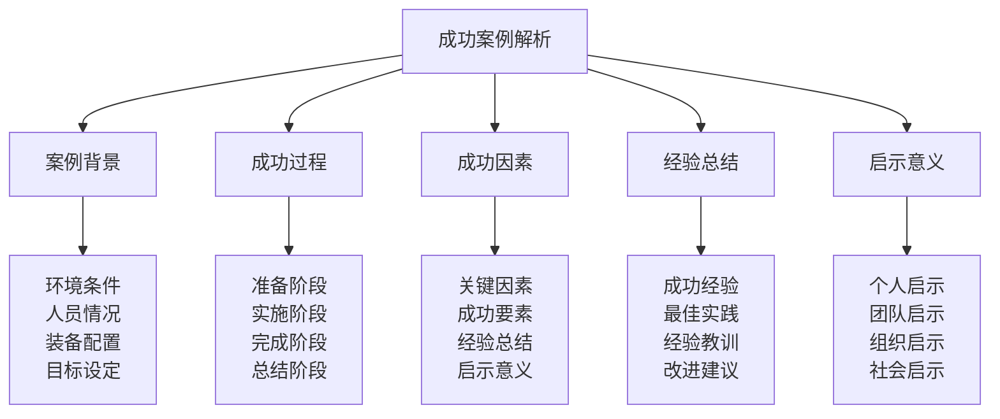

# 成功案例解析

## 🏆 成功案例解析核心框架

### 案例解析金字塔

## 📋 案例背景体系

### 环境条件分析
| 环境要素 | 环境内容 | 环境特点 | 环境影响 | 环境适应 |
|----------|----------|----------|----------|----------|
| **地理环境** | 地形、地貌、海拔 | 复杂多样 | 挑战性强 | 适应良好 |
| **气候环境** | 温度、湿度、风力 | 变化多端 | 影响显著 | 应对有效 |
| **生态环境** | 植被、动物、水源 | 生态丰富 | 资源充足 | 利用合理 |
| **人文环境** | 文化、习俗、语言 | 文化多样 | 交流顺畅 | 尊重理解 |

### 人员情况分析
| 人员要素 | 人员内容 | 人员特点 | 人员优势 | 人员表现 |
|----------|----------|----------|----------|----------|
| **团队规模** | 团队人数、结构 | 规模适中 | 协作高效 | 表现优秀 |
| **技能水平** | 技能等级、经验 | 水平较高 | 技能互补 | 发挥充分 |
| **身体素质** | 体能、健康状况 | 身体良好 | 体能充沛 | 适应良好 |
| **心理素质** | 意志、情绪、压力 | 心理稳定 | 意志坚强 | 情绪稳定 |

### 装备配置分析
| 装备要素 | 装备内容 | 装备特点 | 装备优势 | 装备效果 |
|----------|----------|----------|----------|----------|
| **基础装备** | 帐篷、睡袋、背包 | 装备齐全 | 质量可靠 | 使用有效 |
| **专业装备** | 导航、通讯、急救 | 装备专业 | 技术先进 | 功能完善 |
| **应急装备** | 应急药品、工具 | 装备充分 | 应急可靠 | 保障有效 |
| **生活装备** | 炊具、照明、清洁 | 装备实用 | 使用便捷 | 生活舒适 |

### 目标设定分析
| 目标要素 | 目标内容 | 目标特点 | 目标优势 | 目标达成 |
|----------|----------|----------|----------|----------|
| **总体目标** | 活动总体目标 | 目标明确 | 挑战适中 | 目标达成 |
| **阶段目标** | 各阶段目标 | 目标清晰 | 循序渐进 | 目标达成 |
| **个人目标** | 个人学习目标 | 目标具体 | 个性化强 | 目标达成 |
| **团队目标** | 团队协作目标 | 目标统一 | 协作性强 | 目标达成 |

## 🚀 成功过程体系

### 准备阶段过程
| 准备要素 | 准备内容 | 准备方法 | 准备标准 | 准备效果 |
|----------|----------|----------|----------|----------|
| **计划制定** | 详细活动计划 | 计划周密 | 计划完整 | 准备充分 |
| **技能培训** | 相关技能培训 | 培训充分 | 技能熟练 | 准备充分 |
| **装备检查** | 装备全面检查 | 检查细致 | 装备可靠 | 准备充分 |
| **风险评估** | 风险全面评估 | 评估深入 | 风险可控 | 准备充分 |

### 实施阶段过程
| 实施要素 | 实施内容 | 实施方法 | 实施标准 | 实施效果 |
|----------|----------|----------|----------|----------|
| **团队协作** | 团队高效协作 | 协作顺畅 | 协作有效 | 实施顺利 |
| **技能应用** | 技能熟练应用 | 应用准确 | 技能发挥 | 实施顺利 |
| **问题解决** | 问题及时解决 | 解决迅速 | 解决有效 | 实施顺利 |
| **安全防护** | 安全有效防护 | 防护到位 | 安全可靠 | 实施顺利 |

### 完成阶段过程
| 完成要素 | 完成内容 | 完成方法 | 完成标准 | 完成效果 |
|----------|----------|----------|----------|----------|
| **目标达成** | 目标全面达成 | 达成完整 | 目标实现 | 完成优秀 |
| **质量保证** | 活动质量保证 | 质量优良 | 质量达标 | 完成优秀 |
| **安全完成** | 安全顺利完成 | 安全无事故 | 安全可靠 | 完成优秀 |
| **效果显著** | 活动效果显著 | 效果明显 | 效果良好 | 完成优秀 |

### 总结阶段过程
| 总结要素 | 总结内容 | 总结方法 | 总结标准 | 总结效果 |
|----------|----------|----------|----------|----------|
| **经验总结** | 成功经验总结 | 总结深入 | 总结全面 | 总结有效 |
| **教训总结** | 经验教训总结 | 总结深刻 | 总结客观 | 总结有效 |
| **改进建议** | 改进建议提出 | 建议实用 | 建议可行 | 总结有效 |
| **知识分享** | 知识经验分享 | 分享充分 | 分享有效 | 总结有效 |

## 🎯 成功因素体系

### 关键因素分析
| 因素类型 | 因素内容 | 因素作用 | 因素影响 | 因素价值 |
|----------|----------|----------|----------|----------|
| **领导因素** | 领导能力、决策能力 | 关键作用 | 影响重大 | 价值极高 |
| **团队因素** | 团队协作、沟通配合 | 重要作用 | 影响显著 | 价值很高 |
| **技能因素** | 技能水平、经验积累 | 基础作用 | 影响基础 | 价值很高 |
| **装备因素** | 装备质量、配置合理 | 保障作用 | 影响保障 | 价值较高 |

### 成功要素分析
| 要素类型 | 要素内容 | 要素特点 | 要素优势 | 要素效果 |
|----------|----------|----------|----------|----------|
| **准备充分** | 准备工作充分 | 准备全面 | 准备到位 | 成功基础 |
| **计划周密** | 活动计划周密 | 计划详细 | 计划可行 | 成功保障 |
| **执行到位** | 计划执行到位 | 执行有力 | 执行有效 | 成功关键 |
| **应变灵活** | 应变处理灵活 | 应变及时 | 应变有效 | 成功保障 |

### 经验总结分析
| 经验类型 | 经验内容 | 经验特点 | 经验价值 | 经验应用 |
|----------|----------|----------|----------|----------|
| **成功经验** | 成功做法经验 | 经验宝贵 | 价值很高 | 应用广泛 |
| **最佳实践** | 最佳实践做法 | 实践优秀 | 价值很高 | 应用广泛 |
| **创新做法** | 创新性做法 | 做法创新 | 价值较高 | 应用推广 |
| **团队经验** | 团队协作经验 | 经验丰富 | 价值很高 | 应用广泛 |

### 启示意义分析
| 启示类型 | 启示内容 | 启示特点 | 启示价值 | 启示应用 |
|----------|----------|----------|----------|----------|
| **个人启示** | 个人成长启示 | 启示深刻 | 价值很高 | 应用个人 |
| **团队启示** | 团队建设启示 | 启示重要 | 价值很高 | 应用团队 |
| **组织启示** | 组织管理启示 | 启示系统 | 价值很高 | 应用组织 |
| **社会启示** | 社会发展启示 | 启示深远 | 价值很高 | 应用社会 |

## 📚 经验总结体系

### 成功经验总结
| 经验要素 | 经验内容 | 经验特点 | 经验价值 | 经验传承 |
|----------|----------|----------|----------|----------|
| **准备经验** | 充分准备经验 | 经验丰富 | 价值很高 | 传承有效 |
| **执行经验** | 有效执行经验 | 经验实用 | 价值很高 | 传承有效 |
| **协作经验** | 团队协作经验 | 经验宝贵 | 价值很高 | 传承有效 |
| **创新经验** | 创新实践经验 | 经验创新 | 价值较高 | 传承有效 |

### 最佳实践总结
| 实践要素 | 实践内容 | 实践特点 | 实践价值 | 实践推广 |
|----------|----------|----------|----------|----------|
| **管理实践** | 优秀管理实践 | 实践优秀 | 价值很高 | 推广有效 |
| **技术实践** | 先进技术实践 | 实践先进 | 价值很高 | 推广有效 |
| **团队实践** | 高效团队实践 | 实践高效 | 价值很高 | 推广有效 |
| **创新实践** | 创新性实践 | 实践创新 | 价值较高 | 推广有效 |

### 经验教训总结
| 教训要素 | 教训内容 | 教训特点 | 教训价值 | 教训应用 |
|----------|----------|----------|----------|----------|
| **风险教训** | 风险防范教训 | 教训深刻 | 价值很高 | 应用有效 |
| **管理教训** | 管理改进教训 | 教训重要 | 价值很高 | 应用有效 |
| **技术教训** | 技术应用教训 | 教训实用 | 价值较高 | 应用有效 |
| **团队教训** | 团队协作教训 | 教训宝贵 | 价值很高 | 应用有效 |

### 改进建议总结
| 建议要素 | 建议内容 | 建议特点 | 建议价值 | 建议实施 |
|----------|----------|----------|----------|----------|
| **管理改进** | 管理方法改进 | 建议实用 | 价值很高 | 实施有效 |
| **技术改进** | 技术应用改进 | 建议先进 | 价值很高 | 实施有效 |
| **团队改进** | 团队建设改进 | 建议有效 | 价值很高 | 实施有效 |
| **流程改进** | 工作流程改进 | 建议合理 | 价值较高 | 实施有效 |

## 💡 启示意义体系

### 个人启示意义
| 启示要素 | 启示内容 | 启示特点 | 启示价值 | 启示应用 |
|----------|----------|----------|----------|----------|
| **能力启示** | 个人能力发展启示 | 启示深刻 | 价值很高 | 应用个人 |
| **成长启示** | 个人成长启示 | 启示重要 | 价值很高 | 应用个人 |
| **学习启示** | 学习方法启示 | 启示实用 | 价值较高 | 应用个人 |
| **创新启示** | 创新思维启示 | 启示创新 | 价值较高 | 应用个人 |

### 团队启示意义
| 启示要素 | 启示内容 | 启示特点 | 启示价值 | 启示应用 |
|----------|----------|----------|----------|----------|
| **协作启示** | 团队协作启示 | 启示重要 | 价值很高 | 应用团队 |
| **管理启示** | 团队管理启示 | 启示系统 | 价值很高 | 应用团队 |
| **沟通启示** | 团队沟通启示 | 启示实用 | 价值较高 | 应用团队 |
| **建设启示** | 团队建设启示 | 启示深刻 | 价值很高 | 应用团队 |

### 组织启示意义
| 启示要素 | 启示内容 | 启示特点 | 启示价值 | 启示应用 |
|----------|----------|----------|----------|----------|
| **管理启示** | 组织管理启示 | 启示系统 | 价值很高 | 应用组织 |
| **文化启示** | 组织文化启示 | 启示深刻 | 价值很高 | 应用组织 |
| **发展启示** | 组织发展启示 | 启示重要 | 价值很高 | 应用组织 |
| **创新启示** | 组织创新启示 | 启示创新 | 价值较高 | 应用组织 |

### 社会启示意义
| 启示要素 | 启示内容 | 启示特点 | 启示价值 | 启示应用 |
|----------|----------|----------|----------|----------|
| **发展启示** | 社会发展启示 | 启示深远 | 价值很高 | 应用社会 |
| **文化启示** | 社会文化启示 | 启示深刻 | 价值很高 | 应用社会 |
| **环保启示** | 环境保护启示 | 启示重要 | 价值很高 | 应用社会 |
| **教育启示** | 社会教育启示 | 启示系统 | 价值很高 | 应用社会 |

## 🎓 费曼学习法应用

### 第一步：选择概念
选择"成功案例解析"作为学习概念

### 第二步：教授他人
用简单语言解释：
> "成功案例解析就是分析成功的露营案例，找出成功的原因和经验，包括案例背景、成功过程、成功因素、经验总结、启示意义。关键是学习成功经验，总结最佳实践，获得启示意义。"

### 第三步：回顾简化
- **案例背景**：环境条件、人员情况、装备配置、目标设定
- **成功过程**：准备阶段、实施阶段、完成阶段、总结阶段
- **成功因素**：关键因素、成功要素、经验总结、启示意义
- **经验总结**：成功经验、最佳实践、经验教训、改进建议
- **启示意义**：个人启示、团队启示、组织启示、社会启示

### 第四步：组织优化
建立成功案例与技能的关系：
- 案例背景 → [[01-认知层-基础概念/01-露营概述|露营概述]]
- 成功过程 → [[03-应用层-实践技能|实践技能]]
- 成功因素 → [[04-创新层-进阶发展/03-领导力培养|领导力培养]]
- 经验总结 → [[05-实践与评估/03-持续改进|持续改进]]
- 启示意义 → [[04-创新层-进阶发展/04-文化传承|文化传承]]

## 🏃‍♂️ 刻意练习要点

### 案例解析练习
1. **背景练习**：练习案例背景分析
2. **过程练习**：练习成功过程分析
3. **因素练习**：练习成功因素分析
4. **总结练习**：练习经验总结分析

### 练习方法
- **理论学习**：学习案例解析理论
- **案例分析**：分析成功案例
- **经验总结**：总结成功经验
- **启示应用**：应用启示意义

### 实践验证
- **解析测试**：测试案例解析能力
- **总结验证**：验证经验总结效果
- **启示评估**：评估启示应用效果
- **持续改进**：持续改进解析方法

## 📋 案例解析检查清单

### 案例背景检查
- [ ] 环境条件是否分析全面
- [ ] 人员情况是否了解清楚
- [ ] 装备配置是否分析合理
- [ ] 目标设定是否明确具体

### 成功过程检查
- [ ] 准备阶段是否充分
- [ ] 实施阶段是否顺利
- [ ] 完成阶段是否优秀
- [ ] 总结阶段是否有效

### 成功因素检查
- [ ] 关键因素是否识别准确
- [ ] 成功要素是否分析深入
- [ ] 经验总结是否全面
- [ ] 启示意义是否深刻

### 经验总结检查
- [ ] 成功经验是否总结充分
- [ ] 最佳实践是否识别准确
- [ ] 经验教训是否总结深刻
- [ ] 改进建议是否实用可行

### 启示意义检查
- [ ] 个人启示是否深刻
- [ ] 团队启示是否重要
- [ ] 组织启示是否系统
- [ ] 社会启示是否深远

## 🎯 案例解析策略

### 解析策略
1. **全面分析**：全面分析案例各个方面
2. **深入挖掘**：深入挖掘成功因素
3. **系统总结**：系统总结成功经验
4. **启示应用**：有效应用启示意义

### 发展策略
- **分析发展**：持续发展分析能力
- **总结发展**：持续发展总结能力
- **启示发展**：持续发展启示能力
- **应用发展**：持续发展应用能力

## 🔗 相关链接
- [[02-失败案例学习|失败案例学习]]
- [[03-特殊环境案例|特殊环境案例]]
- [[01-自我评估清单|自我评估清单]]
- [[03-实践项目设计|实践项目设计]]
- [[01-认知层-基础概念/01-露营概述|露营概述]]
- [[03-应用层-实践技能|实践技能]]