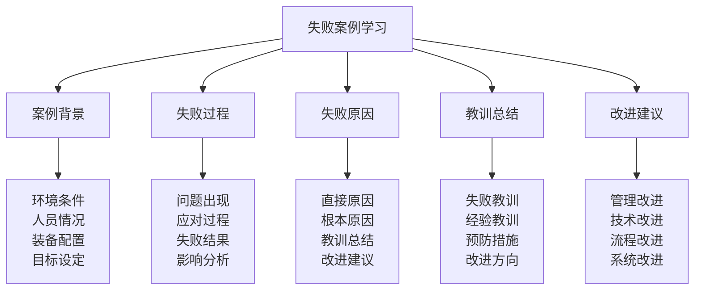

# 失败案例学习

## ⚠️ 失败案例学习核心框架

### 案例学习金字塔

## 📋 案例背景体系

### 环境条件分析
| 环境要素 | 环境内容 | 环境特点 | 环境影响 | 环境问题 |
|----------|----------|----------|----------|----------|
| **地理环境** | 地形、地貌、海拔 | 复杂危险 | 风险较高 | 环境挑战 |
| **气候环境** | 温度、湿度、风力 | 极端变化 | 影响严重 | 气候挑战 |
| **生态环境** | 植被、动物、水源 | 生态脆弱 | 资源缺乏 | 生态挑战 |
| **人文环境** | 文化、习俗、语言 | 文化差异 | 沟通困难 | 文化挑战 |

### 人员情况分析
| 人员要素 | 人员内容 | 人员特点 | 人员问题 | 人员影响 |
|----------|----------|----------|----------|----------|
| **团队规模** | 团队人数、结构 | 规模不当 | 协作困难 | 影响重大 |
| **技能水平** | 技能等级、经验 | 水平不足 | 技能缺乏 | 影响重大 |
| **身体素质** | 体能、健康状况 | 身体不适 | 体能不足 | 影响较大 |
| **心理素质** | 意志、情绪、压力 | 心理脆弱 | 意志薄弱 | 影响重大 |

### 装备配置分析
| 装备要素 | 装备内容 | 装备特点 | 装备问题 | 装备影响 |
|----------|----------|----------|----------|----------|
| **基础装备** | 帐篷、睡袋、背包 | 装备不足 | 质量差 | 影响重大 |
| **专业装备** | 导航、通讯、急救 | 装备缺乏 | 技术落后 | 影响重大 |
| **应急装备** | 应急药品、工具 | 装备不全 | 应急不足 | 影响严重 |
| **生活装备** | 炊具、照明、清洁 | 装备简陋 | 使用不便 | 影响较大 |

### 目标设定分析
| 目标要素 | 目标内容 | 目标特点 | 目标问题 | 目标影响 |
|----------|----------|----------|----------|----------|
| **总体目标** | 活动总体目标 | 目标过高 | 不切实际 | 影响重大 |
| **阶段目标** | 各阶段目标 | 目标模糊 | 不明确 | 影响较大 |
| **个人目标** | 个人学习目标 | 目标冲突 | 不统一 | 影响较大 |
| **团队目标** | 团队协作目标 | 目标分歧 | 不协调 | 影响重大 |

## ⚡ 失败过程体系

### 问题出现过程
| 问题要素 | 问题内容 | 问题特点 | 问题影响 | 问题处理 |
|----------|----------|----------|----------|----------|
| **初期问题** | 活动初期问题 | 问题轻微 | 影响较小 | 处理不当 |
| **中期问题** | 活动中期问题 | 问题严重 | 影响较大 | 处理困难 |
| **后期问题** | 活动后期问题 | 问题严重 | 影响重大 | 处理失败 |
| **突发问题** | 突发意外问题 | 问题紧急 | 影响严重 | 处理不及时 |

### 应对过程分析
| 应对要素 | 应对内容 | 应对特点 | 应对问题 | 应对效果 |
|----------|----------|----------|----------|----------|
| **问题识别** | 问题识别过程 | 识别延迟 | 识别不准确 | 应对无效 |
| **决策制定** | 决策制定过程 | 决策缓慢 | 决策错误 | 应对无效 |
| **资源调配** | 资源调配过程 | 调配困难 | 资源不足 | 应对无效 |
| **执行实施** | 执行实施过程 | 执行不力 | 执行错误 | 应对无效 |

### 失败结果分析
| 结果要素 | 结果内容 | 结果特点 | 结果影响 | 结果处理 |
|----------|----------|----------|----------|----------|
| **目标失败** | 目标未能达成 | 失败严重 | 影响重大 | 处理困难 |
| **安全失败** | 安全事故发生 | 失败严重 | 影响严重 | 处理紧急 |
| **团队失败** | 团队协作失败 | 失败严重 | 影响重大 | 处理困难 |
| **声誉失败** | 声誉受损 | 失败严重 | 影响深远 | 处理困难 |

### 影响分析评估
| 影响要素 | 影响内容 | 影响特点 | 影响程度 | 影响处理 |
|----------|----------|----------|----------|----------|
| **个人影响** | 个人身心影响 | 影响严重 | 影响重大 | 处理困难 |
| **团队影响** | 团队士气影响 | 影响严重 | 影响重大 | 处理困难 |
| **组织影响** | 组织声誉影响 | 影响严重 | 影响重大 | 处理困难 |
| **社会影响** | 社会舆论影响 | 影响严重 | 影响深远 | 处理困难 |

## 🔍 失败原因体系

### 直接原因分析
| 原因类型 | 原因内容 | 原因特点 | 原因影响 | 原因处理 |
|----------|----------|----------|----------|----------|
| **技术原因** | 技术应用错误 | 原因明确 | 影响直接 | 处理相对容易 |
| **管理原因** | 管理决策错误 | 原因明确 | 影响直接 | 处理相对容易 |
| **人员原因** | 人员操作错误 | 原因明确 | 影响直接 | 处理相对容易 |
| **装备原因** | 装备故障问题 | 原因明确 | 影响直接 | 处理相对容易 |

### 根本原因分析
| 原因类型 | 原因内容 | 原因特点 | 原因影响 | 原因处理 |
|----------|----------|----------|----------|----------|
| **系统原因** | 系统设计缺陷 | 原因深层 | 影响根本 | 处理困难 |
| **文化原因** | 文化理念问题 | 原因深层 | 影响根本 | 处理困难 |
| **制度原因** | 制度机制问题 | 原因深层 | 影响根本 | 处理困难 |
| **能力原因** | 能力建设不足 | 原因深层 | 影响根本 | 处理困难 |

### 教训总结分析
| 教训类型 | 教训内容 | 教训特点 | 教训价值 | 教训应用 |
|----------|----------|----------|----------|----------|
| **安全教训** | 安全防范教训 | 教训深刻 | 价值很高 | 应用重要 |
| **管理教训** | 管理改进教训 | 教训重要 | 价值很高 | 应用重要 |
| **技术教训** | 技术应用教训 | 教训实用 | 价值较高 | 应用重要 |
| **团队教训** | 团队协作教训 | 教训宝贵 | 价值很高 | 应用重要 |

### 改进建议分析
| 建议类型 | 建议内容 | 建议特点 | 建议价值 | 建议实施 |
|----------|----------|----------|----------|----------|
| **管理改进** | 管理方法改进 | 建议实用 | 价值很高 | 实施重要 |
| **技术改进** | 技术应用改进 | 建议先进 | 价值很高 | 实施重要 |
| **流程改进** | 工作流程改进 | 建议合理 | 价值较高 | 实施重要 |
| **系统改进** | 系统建设改进 | 建议系统 | 价值很高 | 实施重要 |

## 📚 教训总结体系

### 失败教训总结
| 教训要素 | 教训内容 | 教训特点 | 教训价值 | 教训传承 |
|----------|----------|----------|----------|----------|
| **安全教训** | 安全防范教训 | 教训深刻 | 价值很高 | 传承重要 |
| **管理教训** | 管理改进教训 | 教训重要 | 价值很高 | 传承重要 |
| **技术教训** | 技术应用教训 | 教训实用 | 价值较高 | 传承重要 |
| **团队教训** | 团队协作教训 | 教训宝贵 | 价值很高 | 传承重要 |

### 经验教训总结
| 教训要素 | 教训内容 | 教训特点 | 教训价值 | 教训应用 |
|----------|----------|----------|----------|----------|
| **准备教训** | 准备不足教训 | 教训深刻 | 价值很高 | 应用重要 |
| **执行教训** | 执行不力教训 | 教训重要 | 价值很高 | 应用重要 |
| **协作教训** | 协作失败教训 | 教训宝贵 | 价值很高 | 应用重要 |
| **应变教训** | 应变不足教训 | 教训实用 | 价值较高 | 应用重要 |

### 预防措施总结
| 措施要素 | 措施内容 | 措施特点 | 措施价值 | 措施实施 |
|----------|----------|----------|----------|----------|
| **预防措施** | 风险预防措施 | 措施有效 | 价值很高 | 实施重要 |
| **监控措施** | 过程监控措施 | 措施有效 | 价值很高 | 实施重要 |
| **应急措施** | 应急处理措施 | 措施有效 | 价值很高 | 实施重要 |
| **改进措施** | 持续改进措施 | 措施有效 | 价值较高 | 实施重要 |

### 改进方向总结
| 方向要素 | 方向内容 | 方向特点 | 方向价值 | 方向实施 |
|----------|----------|----------|----------|----------|
| **管理改进** | 管理方法改进 | 方向明确 | 价值很高 | 实施重要 |
| **技术改进** | 技术应用改进 | 方向先进 | 价值很高 | 实施重要 |
| **流程改进** | 工作流程改进 | 方向合理 | 价值较高 | 实施重要 |
| **系统改进** | 系统建设改进 | 方向系统 | 价值很高 | 实施重要 |

## 🔧 改进建议体系

### 管理改进建议
| 改进要素 | 改进内容 | 改进方法 | 改进标准 | 改进效果 |
|----------|----------|----------|----------|----------|
| **决策改进** | 决策制定改进 | 决策优化 | 决策科学 | 改进有效 |
| **组织改进** | 组织结构改进 | 组织优化 | 组织高效 | 改进有效 |
| **流程改进** | 管理流程改进 | 流程优化 | 流程规范 | 改进有效 |
| **制度改进** | 管理制度改进 | 制度完善 | 制度健全 | 改进有效 |

### 技术改进建议
| 改进要素 | 改进内容 | 改进方法 | 改进标准 | 改进效果 |
|----------|----------|----------|----------|----------|
| **技能改进** | 技能水平改进 | 技能提升 | 技能熟练 | 改进有效 |
| **装备改进** | 装备配置改进 | 装备升级 | 装备先进 | 改进有效 |
| **方法改进** | 技术方法改进 | 方法优化 | 方法先进 | 改进有效 |
| **标准改进** | 技术标准改进 | 标准提升 | 标准严格 | 改进有效 |

### 流程改进建议
| 改进要素 | 改进内容 | 改进方法 | 改进标准 | 改进效果 |
|----------|----------|----------|----------|----------|
| **准备流程** | 准备流程改进 | 流程优化 | 流程完善 | 改进有效 |
| **执行流程** | 执行流程改进 | 流程优化 | 流程规范 | 改进有效 |
| **监控流程** | 监控流程改进 | 流程优化 | 流程有效 | 改进有效 |
| **评估流程** | 评估流程改进 | 流程优化 | 流程客观 | 改进有效 |

### 系统改进建议
| 改进要素 | 改进内容 | 改进方法 | 改进标准 | 改进效果 |
|----------|----------|----------|----------|----------|
| **系统设计** | 系统设计改进 | 设计优化 | 设计合理 | 改进有效 |
| **系统实施** | 系统实施改进 | 实施优化 | 实施有效 | 改进有效 |
| **系统维护** | 系统维护改进 | 维护优化 | 维护及时 | 改进有效 |
| **系统升级** | 系统升级改进 | 升级优化 | 升级先进 | 改进有效 |

## 🎓 费曼学习法应用

### 第一步：选择概念
选择"失败案例学习"作为学习概念

### 第二步：教授他人
用简单语言解释：
> "失败案例学习就是分析失败的露营案例，找出失败的原因和教训，包括案例背景、失败过程、失败原因、教训总结、改进建议。关键是学习失败教训，避免重复错误，改进方法。"

### 第三步：回顾简化
- **案例背景**：环境条件、人员情况、装备配置、目标设定
- **失败过程**：问题出现、应对过程、失败结果、影响分析
- **失败原因**：直接原因、根本原因、教训总结、改进建议
- **教训总结**：失败教训、经验教训、预防措施、改进方向
- **改进建议**：管理改进、技术改进、流程改进、系统改进

### 第四步：组织优化
建立失败案例与技能的关系：
- 案例背景 → [[01-认知层-基础概念/01-露营概述|露营概述]]
- 失败过程 → [[03-应用层-实践技能/04-应急处理|应急处理]]
- 失败原因 → [[02-理解层-原理机制/03-安全防护机制|安全防护]]
- 教训总结 → [[05-实践与评估/03-持续改进|持续改进]]
- 改进建议 → [[04-创新层-进阶发展/03-领导力培养|领导力培养]]

## 🏃‍♂️ 刻意练习要点

### 案例学习练习
1. **背景练习**：练习案例背景分析
2. **过程练习**：练习失败过程分析
3. **原因练习**：练习失败原因分析
4. **教训练习**：练习教训总结分析

### 练习方法
- **理论学习**：学习失败案例理论
- **案例分析**：分析失败案例
- **教训总结**：总结失败教训
- **改进应用**：应用改进建议

### 实践验证
- **学习测试**：测试案例学习能力
- **总结验证**：验证教训总结效果
- **改进评估**：评估改进应用效果
- **持续改进**：持续改进学习方法

## 📋 案例学习检查清单

### 案例背景检查
- [ ] 环境条件是否分析全面
- [ ] 人员情况是否了解清楚
- [ ] 装备配置是否分析合理
- [ ] 目标设定是否分析准确

### 失败过程检查
- [ ] 问题出现是否分析清楚
- [ ] 应对过程是否分析深入
- [ ] 失败结果是否分析客观
- [ ] 影响分析是否分析全面

### 失败原因检查
- [ ] 直接原因是否识别准确
- [ ] 根本原因是否分析深入
- [ ] 教训总结是否总结深刻
- [ ] 改进建议是否实用可行

### 教训总结检查
- [ ] 失败教训是否总结充分
- [ ] 经验教训是否总结深刻
- [ ] 预防措施是否制定有效
- [ ] 改进方向是否明确合理

### 改进建议检查
- [ ] 管理改进是否建议实用
- [ ] 技术改进是否建议先进
- [ ] 流程改进是否建议合理
- [ ] 系统改进是否建议系统

## 🎯 案例学习策略

### 学习策略
1. **客观分析**：客观分析失败原因
2. **深入挖掘**：深入挖掘根本原因
3. **系统总结**：系统总结失败教训
4. **有效改进**：有效应用改进建议

### 发展策略
- **分析发展**：持续发展分析能力
- **总结发展**：持续发展总结能力
- **改进发展**：持续发展改进能力
- **预防发展**：持续发展预防能力

## 🔗 相关链接
- [[01-成功案例解析|成功案例解析]]
- [[03-特殊环境案例|特殊环境案例]]
- [[01-自我评估清单|自我评估清单]]
- [[03-实践项目设计|实践项目设计]]
- [[03-应用层-实践技能/04-应急处理|应急处理]]
- [[02-理解层-原理机制/03-安全防护机制|安全防护]]