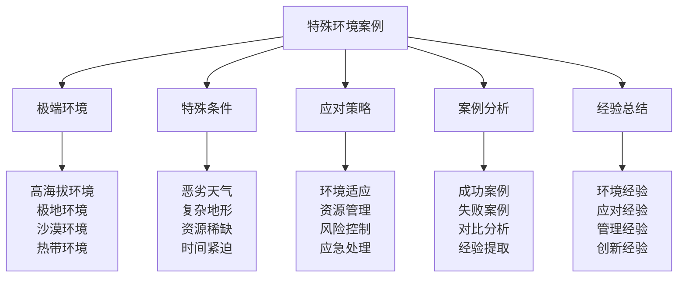

# 特殊环境案例

## 🌍 特殊环境案例核心框架

### 环境案例金字塔

## 🏔️ 极端环境体系

### 高海拔环境案例
| 环境要素 | 环境特点 | 环境挑战 | 应对策略 | 案例结果 |
|----------|----------|----------|----------|----------|
| **海拔高度** | 3000米以上 | 缺氧、低温 | 适应训练、保暖 | 成功适应 |
| **气压变化** | 气压降低 | 高原反应 | 渐进适应、药物 | 有效控制 |
| **温度变化** | 昼夜温差大 | 体温调节 | 分层着装、保温 | 体温稳定 |
| **紫外线** | 紫外线强烈 | 皮肤损伤 | 防晒保护、遮阳 | 防护有效 |
| **风力变化** | 风力强劲 | 行走困难 | 防风装备、技巧 | 行走安全 |

### 极地环境案例
| 环境要素 | 环境特点 | 环境挑战 | 应对策略 | 案例结果 |
|----------|----------|----------|----------|----------|
| **极寒温度** | 零下30度以下 | 冻伤风险 | 保暖装备、技巧 | 安全度过 |
| **冰雪覆盖** | 冰雪环境 | 行走困难 | 雪地装备、技巧 | 行走安全 |
| **极昼极夜** | 光照变化 | 生物钟紊乱 | 光照调节、作息 | 适应良好 |
| **强风暴雪** | 恶劣天气 | 能见度低 | 导航设备、技巧 | 安全导航 |
| **资源稀缺** | 资源匮乏 | 生存困难 | 资源节约、利用 | 资源充足 |

### 沙漠环境案例
| 环境要素 | 环境特点 | 环境挑战 | 应对策略 | 案例结果 |
|----------|----------|----------|----------|----------|
| **高温干燥** | 40度以上高温 | 脱水风险 | 水分管理、遮阳 | 水分充足 |
| **沙尘暴** | 沙尘天气 | 能见度低 | 防护装备、技巧 | 安全度过 |
| **昼夜温差** | 温差巨大 | 体温调节 | 分层着装、保温 | 体温稳定 |
| **水源稀缺** | 水源稀少 | 缺水风险 | 水源寻找、节约 | 水源充足 |
| **地形复杂** | 沙丘地形 | 行走困难 | 导航设备、技巧 | 行走安全 |

### 热带环境案例
| 环境要素 | 环境特点 | 环境挑战 | 应对策略 | 案例结果 |
|----------|----------|----------|----------|----------|
| **高温高湿** | 高温高湿 | 中暑风险 | 降温措施、休息 | 体温正常 |
| **蚊虫叮咬** | 蚊虫众多 | 疾病传播 | 防护措施、药物 | 健康安全 |
| **暴雨频繁** | 降雨频繁 | 装备湿透 | 防水装备、技巧 | 装备干燥 |
| **植被茂密** | 植被茂密 | 行走困难 | 开路工具、技巧 | 行走安全 |
| **野生动物** | 动物威胁 | 安全风险 | 防护措施、避让 | 安全度过 |

## ⚡ 特殊条件体系

### 恶劣天气条件
| 天气类型 | 天气特点 | 天气挑战 | 应对策略 | 应对效果 |
|----------|----------|----------|----------|----------|
| **暴风雨** | 强风暴雨 | 行走困难 | 防风装备、避雨 | 安全度过 |
| **暴雪** | 大雪纷飞 | 能见度低 | 导航设备、保暖 | 安全导航 |
| **沙尘暴** | 沙尘弥漫 | 呼吸困难 | 防护装备、避风 | 安全度过 |
| **雷电** | 雷电交加 | 雷击风险 | 避雷措施、避雷 | 安全避雷 |
| **冰雹** | 冰雹袭击 | 受伤风险 | 防护装备、躲避 | 安全躲避 |

### 复杂地形条件
| 地形类型 | 地形特点 | 地形挑战 | 应对策略 | 应对效果 |
|----------|----------|----------|----------|----------|
| **陡峭山峰** | 坡度陡峭 | 攀登困难 | 攀登装备、技巧 | 攀登成功 |
| **深谷沟壑** | 深度巨大 | 下降困难 | 下降装备、技巧 | 下降安全 |
| **河流湖泊** | 水域环境 | 渡河困难 | 渡河装备、技巧 | 渡河安全 |
| **密林深处** | 植被茂密 | 行走困难 | 开路工具、技巧 | 行走安全 |
| **沼泽湿地** | 地面松软 | 陷落风险 | 探测工具、技巧 | 行走安全 |

### 资源稀缺条件
| 资源类型 | 稀缺程度 | 稀缺影响 | 应对策略 | 应对效果 |
|----------|----------|----------|----------|----------|
| **水源稀缺** | 极度稀缺 | 脱水风险 | 水源寻找、节约 | 水源充足 |
| **食物稀缺** | 极度稀缺 | 饥饿风险 | 食物寻找、节约 | 食物充足 |
| **燃料稀缺** | 极度稀缺 | 取暖困难 | 燃料寻找、节约 | 燃料充足 |
| **装备稀缺** | 极度稀缺 | 功能受限 | 装备自制、替代 | 功能恢复 |
| **药品稀缺** | 极度稀缺 | 医疗困难 | 草药寻找、预防 | 健康安全 |

### 时间紧迫条件
| 时间要素 | 紧迫程度 | 紧迫影响 | 应对策略 | 应对效果 |
|----------|----------|----------|----------|----------|
| **救援时间** | 时间紧迫 | 生命危险 | 快速行动、效率 | 救援成功 |
| **天气窗口** | 时间有限 | 机会错过 | 快速决策、行动 | 机会抓住 |
| **资源耗尽** | 时间紧迫 | 生存困难 | 资源管理、节约 | 资源充足 |
| **体力消耗** | 时间紧迫 | 体力不支 | 体力管理、休息 | 体力恢复 |

## 🛡️ 应对策略体系

### 环境适应策略
| 适应要素 | 适应内容 | 适应方法 | 适应标准 | 适应效果 |
|----------|----------|----------|----------|----------|
| **生理适应** | 身体机能适应 | 渐进适应 | 适应充分 | 适应成功 |
| **心理适应** | 心理状态适应 | 心理调节 | 适应充分 | 适应成功 |
| **技能适应** | 技能水平适应 | 技能训练 | 适应充分 | 适应成功 |
| **装备适应** | 装备使用适应 | 装备熟悉 | 适应充分 | 适应成功 |

### 资源管理策略
| 管理要素 | 管理内容 | 管理方法 | 管理标准 | 管理效果 |
|----------|----------|----------|----------|----------|
| **水源管理** | 水源获取、使用 | 水源规划 | 管理有效 | 水源充足 |
| **食物管理** | 食物获取、使用 | 食物规划 | 管理有效 | 食物充足 |
| **燃料管理** | 燃料获取、使用 | 燃料规划 | 管理有效 | 燃料充足 |
| **装备管理** | 装备使用、维护 | 装备规划 | 管理有效 | 装备完好 |

### 风险控制策略
| 控制要素 | 控制内容 | 控制方法 | 控制标准 | 控制效果 |
|----------|----------|----------|----------|----------|
| **环境风险** | 环境风险控制 | 风险评估 | 控制有效 | 风险可控 |
| **安全风险** | 安全风险控制 | 安全措施 | 控制有效 | 风险可控 |
| **健康风险** | 健康风险控制 | 健康监测 | 控制有效 | 风险可控 |
| **装备风险** | 装备风险控制 | 装备检查 | 控制有效 | 风险可控 |

### 应急处理策略
| 处理要素 | 处理内容 | 处理方法 | 处理标准 | 处理效果 |
|----------|----------|----------|----------|----------|
| **紧急救援** | 紧急救援处理 | 救援程序 | 处理及时 | 救援成功 |
| **医疗急救** | 医疗急救处理 | 急救程序 | 处理及时 | 急救成功 |
| **装备故障** | 装备故障处理 | 故障排除 | 处理及时 | 故障排除 |
| **环境突变** | 环境突变处理 | 应急措施 | 处理及时 | 应对成功 |

## 📊 案例分析体系

### 成功案例分析
| 案例类型 | 案例内容 | 成功因素 | 成功经验 | 案例价值 |
|----------|----------|----------|----------|----------|
| **高海拔成功** | 高海拔环境成功案例 | 适应充分 | 适应经验 | 价值很高 |
| **极地成功** | 极地环境成功案例 | 准备充分 | 准备经验 | 价值很高 |
| **沙漠成功** | 沙漠环境成功案例 | 资源管理 | 管理经验 | 价值很高 |
| **热带成功** | 热带环境成功案例 | 防护有效 | 防护经验 | 价值很高 |

### 失败案例分析
| 案例类型 | 案例内容 | 失败原因 | 失败教训 | 案例价值 |
|----------|----------|----------|----------|----------|
| **高海拔失败** | 高海拔环境失败案例 | 适应不足 | 适应教训 | 价值很高 |
| **极地失败** | 极地环境失败案例 | 准备不足 | 准备教训 | 价值很高 |
| **沙漠失败** | 沙漠环境失败案例 | 资源管理 | 管理教训 | 价值很高 |
| **热带失败** | 热带环境失败案例 | 防护不足 | 防护教训 | 价值很高 |

### 对比分析研究
| 对比要素 | 对比内容 | 对比方法 | 对比标准 | 对比效果 |
|----------|----------|----------|----------|----------|
| **成功失败对比** | 成功失败案例对比 | 对比分析 | 对比客观 | 对比有效 |
| **环境对比** | 不同环境对比 | 对比分析 | 对比客观 | 对比有效 |
| **策略对比** | 不同策略对比 | 对比分析 | 对比客观 | 对比有效 |
| **效果对比** | 不同效果对比 | 对比分析 | 对比客观 | 对比有效 |

### 经验提取研究
| 提取要素 | 提取内容 | 提取方法 | 提取标准 | 提取效果 |
|----------|----------|----------|----------|----------|
| **成功经验** | 成功经验提取 | 经验分析 | 提取准确 | 提取有效 |
| **失败教训** | 失败教训提取 | 教训分析 | 提取准确 | 提取有效 |
| **最佳实践** | 最佳实践提取 | 实践分析 | 提取准确 | 提取有效 |
| **创新方法** | 创新方法提取 | 方法分析 | 提取准确 | 提取有效 |

## 📚 经验总结体系

### 环境经验总结
| 经验类型 | 经验内容 | 经验特点 | 经验价值 | 经验应用 |
|----------|----------|----------|----------|----------|
| **环境适应** | 环境适应经验 | 经验丰富 | 价值很高 | 应用广泛 |
| **环境应对** | 环境应对经验 | 经验实用 | 价值很高 | 应用广泛 |
| **环境利用** | 环境利用经验 | 经验创新 | 价值较高 | 应用推广 |
| **环境保护** | 环境保护经验 | 经验重要 | 价值很高 | 应用重要 |

### 应对经验总结
| 经验类型 | 经验内容 | 经验特点 | 经验价值 | 经验应用 |
|----------|----------|----------|----------|----------|
| **策略应对** | 策略应对经验 | 经验系统 | 价值很高 | 应用广泛 |
| **技术应对** | 技术应对经验 | 经验实用 | 价值很高 | 应用广泛 |
| **管理应对** | 管理应对经验 | 经验有效 | 价值很高 | 应用广泛 |
| **创新应对** | 创新应对经验 | 经验创新 | 价值较高 | 应用推广 |

### 管理经验总结
| 经验类型 | 经验内容 | 经验特点 | 经验价值 | 经验应用 |
|----------|----------|----------|----------|----------|
| **资源管理** | 资源管理经验 | 经验系统 | 价值很高 | 应用广泛 |
| **风险管理** | 风险管理经验 | 经验重要 | 价值很高 | 应用重要 |
| **团队管理** | 团队管理经验 | 经验有效 | 价值很高 | 应用广泛 |
| **应急管理** | 应急管理经验 | 经验关键 | 价值很高 | 应用关键 |

### 创新经验总结
| 经验类型 | 经验内容 | 经验特点 | 经验价值 | 经验应用 |
|----------|----------|----------|----------|----------|
| **方法创新** | 方法创新经验 | 经验创新 | 价值较高 | 应用推广 |
| **技术创新** | 技术创新经验 | 经验先进 | 价值较高 | 应用推广 |
| **管理创新** | 管理创新经验 | 经验有效 | 价值较高 | 应用推广 |
| **应用创新** | 应用创新经验 | 经验实用 | 价值较高 | 应用推广 |

## 🎓 费曼学习法应用

### 第一步：选择概念
选择"特殊环境案例"作为学习概念

### 第二步：教授他人
用简单语言解释：
> "特殊环境案例就是分析在极端环境下的露营案例，包括高海拔、极地、沙漠、热带等环境，以及恶劣天气、复杂地形、资源稀缺、时间紧迫等条件。关键是学习应对策略，总结经验教训。"

### 第三步：回顾简化
- **极端环境**：高海拔环境、极地环境、沙漠环境、热带环境
- **特殊条件**：恶劣天气、复杂地形、资源稀缺、时间紧迫
- **应对策略**：环境适应、资源管理、风险控制、应急处理
- **案例分析**：成功案例、失败案例、对比分析、经验提取
- **经验总结**：环境经验、应对经验、管理经验、创新经验

### 第四步：组织优化
建立特殊环境与技能的关系：
- 极端环境 → [[02-理解层-原理机制/01-户外生存原理|生存原理]]
- 特殊条件 → [[03-应用层-实践技能/04-应急处理|应急处理]]
- 应对策略 → [[04-创新层-进阶发展/01-高级技巧|高级技巧]]
- 案例分析 → [[05-实践与评估/02-案例研究|案例研究]]
- 经验总结 → [[05-实践与评估/03-持续改进|持续改进]]

## 🏃‍♂️ 刻意练习要点

### 环境案例练习
1. **环境练习**：练习环境分析技能
2. **条件练习**：练习条件应对技能
3. **策略练习**：练习应对策略制定
4. **案例练习**：练习案例分析技能

### 练习方法
- **理论学习**：学习特殊环境理论
- **案例分析**：分析特殊环境案例
- **策略制定**：制定应对策略
- **经验总结**：总结环境经验

### 实践验证
- **分析测试**：测试环境分析能力
- **策略验证**：验证应对策略效果
- **案例评估**：评估案例分析能力
- **经验评估**：评估经验总结效果

## 📋 环境案例检查清单

### 极端环境检查
- [ ] 高海拔环境是否分析全面
- [ ] 极地环境是否分析深入
- [ ] 沙漠环境是否分析准确
- [ ] 热带环境是否分析完整

### 特殊条件检查
- [ ] 恶劣天气是否分析清楚
- [ ] 复杂地形是否分析深入
- [ ] 资源稀缺是否分析准确
- [ ] 时间紧迫是否分析客观

### 应对策略检查
- [ ] 环境适应是否策略有效
- [ ] 资源管理是否策略合理
- [ ] 风险控制是否策略完善
- [ ] 应急处理是否策略及时

### 案例分析检查
- [ ] 成功案例是否分析深入
- [ ] 失败案例是否分析客观
- [ ] 对比分析是否分析准确
- [ ] 经验提取是否提取充分

### 经验总结检查
- [ ] 环境经验是否总结充分
- [ ] 应对经验是否总结实用
- [ ] 管理经验是否总结有效
- [ ] 创新经验是否总结创新

## 🎯 环境案例策略

### 分析策略
1. **全面分析**：全面分析环境特点
2. **深入挖掘**：深入挖掘环境挑战
3. **系统应对**：系统制定应对策略
4. **经验总结**：有效总结环境经验

### 发展策略
- **分析发展**：持续发展分析能力
- **应对发展**：持续发展应对能力
- **策略发展**：持续发展策略能力
- **经验发展**：持续发展经验能力

## 🔗 相关链接
- [[01-成功案例解析|成功案例解析]]
- [[02-失败案例学习|失败案例学习]]
- [[01-自我评估清单|自我评估清单]]
- [[03-实践项目设计|实践项目设计]]
- [[02-理解层-原理机制/01-户外生存原理|生存原理]]
- [[03-应用层-实践技能/04-应急处理|应急处理]]