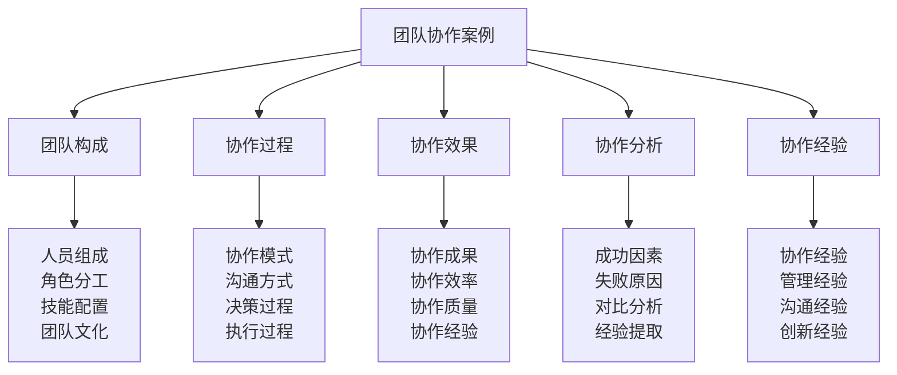

# 团队协作案例

## 🤝 团队协作案例核心框架

### 协作案例金字塔

## 👥 团队构成体系

### 人员组成分析
| 组成要素 | 组成内容 | 组成特点 | 组成优势 | 组成效果 |
|----------|----------|----------|----------|----------|
| **团队规模** | 团队人数、结构 | 规模适中 | 协作高效 | 效果良好 |
| **年龄结构** | 年龄分布、层次 | 结构合理 | 经验互补 | 效果良好 |
| **性别比例** | 男女比例、平衡 | 比例协调 | 优势互补 | 效果良好 |
| **专业背景** | 专业领域、技能 | 背景多样 | 技能互补 | 效果良好 |
| **经验水平** | 经验程度、层次 | 水平分层 | 经验传承 | 效果良好 |

### 角色分工分析
| 角色要素 | 角色内容 | 角色特点 | 角色优势 | 角色效果 |
|----------|----------|----------|----------|----------|
| **领导角色** | 团队领导、决策者 | 领导能力强 | 决策有效 | 效果良好 |
| **执行角色** | 任务执行、操作者 | 执行能力强 | 执行到位 | 效果良好 |
| **协调角色** | 团队协调、沟通者 | 协调能力强 | 协调有效 | 效果良好 |
| **支持角色** | 团队支持、辅助者 | 支持能力强 | 支持到位 | 效果良好 |
| **创新角色** | 创新思维、建议者 | 创新能力强 | 创新有效 | 效果良好 |

### 技能配置分析
| 技能要素 | 技能内容 | 技能特点 | 技能优势 | 技能效果 |
|----------|----------|----------|----------|----------|
| **专业技能** | 专业领域技能 | 技能专业 | 专业优势 | 效果良好 |
| **通用技能** | 通用基础技能 | 技能通用 | 通用优势 | 效果良好 |
| **软技能** | 沟通、协作技能 | 技能软性 | 软性优势 | 效果良好 |
| **创新技能** | 创新思维技能 | 技能创新 | 创新优势 | 效果良好 |
| **领导技能** | 领导管理技能 | 技能领导 | 领导优势 | 效果良好 |

### 团队文化分析
| 文化要素 | 文化内容 | 文化特点 | 文化优势 | 文化效果 |
|----------|----------|----------|----------|----------|
| **价值观** | 共同价值观 | 价值观一致 | 价值认同 | 效果良好 |
| **行为规范** | 行为准则、标准 | 规范明确 | 行为统一 | 效果良好 |
| **团队精神** | 团队意识、精神 | 精神凝聚 | 精神统一 | 效果良好 |
| **团队传统** | 团队习惯、传统 | 传统传承 | 传统延续 | 效果良好 |
| **创新文化** | 创新理念、文化 | 文化创新 | 创新活跃 | 效果良好 |

## 🔄 协作过程体系

### 协作模式分析
| 模式要素 | 模式内容 | 模式特点 | 模式优势 | 模式效果 |
|----------|----------|----------|----------|----------|
| **层级协作** | 层级管理协作 | 层级清晰 | 管理有效 | 效果良好 |
| **矩阵协作** | 矩阵交叉协作 | 协作灵活 | 资源优化 | 效果良好 |
| **网络协作** | 网络扁平协作 | 协作高效 | 沟通便捷 | 效果良好 |
| **项目协作** | 项目导向协作 | 目标明确 | 目标统一 | 效果良好 |
| **自主协作** | 自主管理协作 | 自主性强 | 积极性高 | 效果良好 |

### 沟通方式分析
| 沟通要素 | 沟通内容 | 沟通特点 | 沟通优势 | 沟通效果 |
|----------|----------|----------|----------|----------|
| **正式沟通** | 正式会议、报告 | 沟通正式 | 信息准确 | 效果良好 |
| **非正式沟通** | 私下交流、聊天 | 沟通轻松 | 关系融洽 | 效果良好 |
| **书面沟通** | 邮件、文档沟通 | 沟通记录 | 信息保存 | 效果良好 |
| **口头沟通** | 面对面、电话沟通 | 沟通直接 | 信息及时 | 效果良好 |
| **数字沟通** | 在线平台沟通 | 沟通便捷 | 效率提高 | 效果良好 |

### 决策过程分析
| 决策要素 | 决策内容 | 决策特点 | 决策优势 | 决策效果 |
|----------|----------|----------|----------|----------|
| **决策参与** | 决策参与程度 | 参与充分 | 决策民主 | 效果良好 |
| **决策流程** | 决策制定流程 | 流程规范 | 决策科学 | 效果良好 |
| **决策效率** | 决策制定效率 | 效率较高 | 决策及时 | 效果良好 |
| **决策质量** | 决策制定质量 | 质量较高 | 决策正确 | 效果良好 |
| **决策执行** | 决策执行情况 | 执行到位 | 决策有效 | 效果良好 |

### 执行过程分析
| 执行要素 | 执行内容 | 执行特点 | 执行优势 | 执行效果 |
|----------|----------|----------|----------|----------|
| **任务分配** | 任务分配情况 | 分配合理 | 责任明确 | 效果良好 |
| **进度控制** | 进度控制情况 | 控制有效 | 进度可控 | 效果良好 |
| **质量控制** | 质量控制情况 | 控制严格 | 质量保证 | 效果良好 |
| **协调配合** | 协调配合情况 | 配合默契 | 协作顺畅 | 效果良好 |
| **问题解决** | 问题解决情况 | 解决及时 | 问题可控 | 效果良好 |

## 📊 协作效果体系

### 协作成果分析
| 成果要素 | 成果内容 | 成果特点 | 成果价值 | 成果影响 |
|----------|----------|----------|----------|----------|
| **目标达成** | 团队目标达成 | 达成完整 | 价值很高 | 影响重大 |
| **质量成果** | 工作质量成果 | 质量优良 | 价值很高 | 影响重大 |
| **创新成果** | 创新性成果 | 成果创新 | 价值较高 | 影响较大 |
| **效率成果** | 工作效率成果 | 效率提升 | 价值较高 | 影响较大 |
| **学习成果** | 团队学习成果 | 成果丰富 | 价值很高 | 影响重大 |

### 协作效率分析
| 效率要素 | 效率内容 | 效率特点 | 效率优势 | 效率效果 |
|----------|----------|----------|----------|----------|
| **时间效率** | 时间利用效率 | 效率较高 | 时间节约 | 效果良好 |
| **资源效率** | 资源利用效率 | 效率较高 | 资源优化 | 效果良好 |
| **沟通效率** | 沟通交流效率 | 效率较高 | 沟通顺畅 | 效果良好 |
| **决策效率** | 决策制定效率 | 效率较高 | 决策及时 | 效果良好 |
| **执行效率** | 任务执行效率 | 效率较高 | 执行到位 | 效果良好 |

### 协作质量分析
| 质量要素 | 质量内容 | 质量特点 | 质量优势 | 质量效果 |
|----------|----------|----------|----------|----------|
| **工作质量** | 工作成果质量 | 质量优良 | 质量保证 | 效果良好 |
| **服务质量** | 团队服务质量 | 质量优良 | 服务优质 | 效果良好 |
| **沟通质量** | 沟通交流质量 | 质量优良 | 沟通有效 | 效果良好 |
| **协作质量** | 团队协作质量 | 质量优良 | 协作顺畅 | 效果良好 |
| **创新质量** | 创新成果质量 | 质量优良 | 创新有效 | 效果良好 |

### 协作经验分析
| 经验要素 | 经验内容 | 经验特点 | 经验价值 | 经验应用 |
|----------|----------|----------|----------|----------|
| **成功经验** | 协作成功经验 | 经验宝贵 | 价值很高 | 应用广泛 |
| **最佳实践** | 协作最佳实践 | 实践优秀 | 价值很高 | 应用广泛 |
| **创新经验** | 协作创新经验 | 经验创新 | 价值较高 | 应用推广 |
| **管理经验** | 协作管理经验 | 经验有效 | 价值很高 | 应用广泛 |
| **沟通经验** | 协作沟通经验 | 经验实用 | 价值很高 | 应用广泛 |

## 🔍 协作分析体系

### 成功因素分析
| 因素类型 | 因素内容 | 因素特点 | 因素影响 | 因素价值 |
|----------|----------|----------|----------|----------|
| **领导因素** | 领导能力、决策 | 因素关键 | 影响重大 | 价值极高 |
| **团队因素** | 团队协作、配合 | 因素重要 | 影响重大 | 价值很高 |
| **技能因素** | 技能水平、互补 | 因素基础 | 影响基础 | 价值很高 |
| **文化因素** | 团队文化、氛围 | 因素深层 | 影响深远 | 价值很高 |
| **管理因素** | 管理方法、制度 | 因素系统 | 影响系统 | 价值很高 |

### 失败原因分析
| 原因类型 | 原因内容 | 原因特点 | 原因影响 | 原因处理 |
|----------|----------|----------|----------|----------|
| **沟通原因** | 沟通不畅、误解 | 原因直接 | 影响直接 | 处理相对容易 |
| **协调原因** | 协调不力、冲突 | 原因直接 | 影响直接 | 处理相对容易 |
| **管理原因** | 管理不当、混乱 | 原因系统 | 影响系统 | 处理相对困难 |
| **文化原因** | 文化冲突、分歧 | 原因深层 | 影响深远 | 处理相对困难 |
| **能力原因** | 能力不足、缺乏 | 原因基础 | 影响基础 | 处理相对困难 |

### 对比分析研究
| 对比要素 | 对比内容 | 对比方法 | 对比标准 | 对比效果 |
|----------|----------|----------|----------|----------|
| **成功失败对比** | 成功失败案例对比 | 对比分析 | 对比客观 | 对比有效 |
| **团队对比** | 不同团队对比 | 对比分析 | 对比客观 | 对比有效 |
| **模式对比** | 不同协作模式对比 | 对比分析 | 对比客观 | 对比有效 |
| **效果对比** | 不同协作效果对比 | 对比分析 | 对比客观 | 对比有效 |

### 经验提取研究
| 提取要素 | 提取内容 | 提取方法 | 提取标准 | 提取效果 |
|----------|----------|----------|----------|----------|
| **成功经验** | 协作成功经验提取 | 经验分析 | 提取准确 | 提取有效 |
| **失败教训** | 协作失败教训提取 | 教训分析 | 提取准确 | 提取有效 |
| **最佳实践** | 协作最佳实践提取 | 实践分析 | 提取准确 | 提取有效 |
| **创新方法** | 协作创新方法提取 | 方法分析 | 提取准确 | 提取有效 |

## 📚 协作经验体系

### 协作经验总结
| 经验类型 | 经验内容 | 经验特点 | 经验价值 | 经验应用 |
|----------|----------|----------|----------|----------|
| **团队建设** | 团队建设经验 | 经验系统 | 价值很高 | 应用广泛 |
| **协作管理** | 协作管理经验 | 经验有效 | 价值很高 | 应用广泛 |
| **沟通协调** | 沟通协调经验 | 经验实用 | 价值很高 | 应用广泛 |
| **冲突处理** | 冲突处理经验 | 经验重要 | 价值很高 | 应用重要 |
| **创新协作** | 创新协作经验 | 经验创新 | 价值较高 | 应用推广 |

### 管理经验总结
| 经验类型 | 经验内容 | 经验特点 | 经验价值 | 经验应用 |
|----------|----------|----------|----------|----------|
| **团队管理** | 团队管理经验 | 经验系统 | 价值很高 | 应用广泛 |
| **项目管理** | 项目管理经验 | 经验有效 | 价值很高 | 应用广泛 |
| **资源管理** | 资源管理经验 | 经验实用 | 价值很高 | 应用广泛 |
| **质量管理** | 质量管理经验 | 经验重要 | 价值很高 | 应用重要 |
| **风险管理** | 风险管理经验 | 经验关键 | 价值很高 | 应用关键 |

### 沟通经验总结
| 经验类型 | 经验内容 | 经验特点 | 经验价值 | 经验应用 |
|----------|----------|----------|----------|----------|
| **有效沟通** | 有效沟通经验 | 经验实用 | 价值很高 | 应用广泛 |
| **跨文化沟通** | 跨文化沟通经验 | 经验重要 | 价值很高 | 应用重要 |
| **冲突沟通** | 冲突沟通经验 | 经验关键 | 价值很高 | 应用关键 |
| **创新沟通** | 创新沟通经验 | 经验创新 | 价值较高 | 应用推广 |
| **团队沟通** | 团队沟通经验 | 经验系统 | 价值很高 | 应用广泛 |

### 创新经验总结
| 经验类型 | 经验内容 | 经验特点 | 经验价值 | 经验应用 |
|----------|----------|----------|----------|----------|
| **协作创新** | 协作方式创新 | 经验创新 | 价值较高 | 应用推广 |
| **管理创新** | 管理方法创新 | 经验创新 | 价值较高 | 应用推广 |
| **沟通创新** | 沟通方式创新 | 经验创新 | 价值较高 | 应用推广 |
| **工具创新** | 协作工具创新 | 经验创新 | 价值较高 | 应用推广 |
| **文化创新** | 团队文化创新 | 经验创新 | 价值较高 | 应用推广 |

## 🎓 费曼学习法应用

### 第一步：选择概念
选择"团队协作案例"作为学习概念

### 第二步：教授他人
用简单语言解释：
> "团队协作案例就是分析团队如何一起工作的案例，包括团队构成、协作过程、协作效果、协作分析、协作经验。关键是学习团队协作的成功经验和失败教训。"

### 第三步：回顾简化
- **团队构成**：人员组成、角色分工、技能配置、团队文化
- **协作过程**：协作模式、沟通方式、决策过程、执行过程
- **协作效果**：协作成果、协作效率、协作质量、协作经验
- **协作分析**：成功因素、失败原因、对比分析、经验提取
- **协作经验**：协作经验、管理经验、沟通经验、创新经验

### 第四步：组织优化
建立团队协作与技能的关系：
- 团队构成 → [[04-创新层-进阶发展/03-领导力培养/01-团队管理技能|团队管理]]
- 协作过程 → [[04-创新层-进阶发展/03-领导力培养/04-沟通协调技巧|沟通协调]]
- 协作效果 → [[05-实践与评估/01-技能评估体系|技能评估]]
- 协作分析 → [[05-实践与评估/02-案例研究|案例研究]]
- 协作经验 → [[05-实践与评估/03-持续改进|持续改进]]

## 🏃‍♂️ 刻意练习要点

### 协作案例练习
1. **构成练习**：练习团队构成分析
2. **过程练习**：练习协作过程分析
3. **效果练习**：练习协作效果分析
4. **经验练习**：练习协作经验总结

### 练习方法
- **理论学习**：学习团队协作理论
- **案例分析**：分析团队协作案例
- **经验总结**：总结协作经验
- **实践应用**：应用协作经验

### 实践验证
- **分析测试**：测试协作分析能力
- **总结验证**：验证经验总结效果
- **应用评估**：评估经验应用效果
- **持续改进**：持续改进协作能力

## 📋 协作案例检查清单

### 团队构成检查
- [ ] 人员组成是否分析全面
- [ ] 角色分工是否分析合理
- [ ] 技能配置是否分析准确
- [ ] 团队文化是否分析深入

### 协作过程检查
- [ ] 协作模式是否分析清楚
- [ ] 沟通方式是否分析有效
- [ ] 决策过程是否分析客观
- [ ] 执行过程是否分析完整

### 协作效果检查
- [ ] 协作成果是否分析充分
- [ ] 协作效率是否分析准确
- [ ] 协作质量是否分析客观
- [ ] 协作经验是否总结深入

### 协作分析检查
- [ ] 成功因素是否识别准确
- [ ] 失败原因是否分析深入
- [ ] 对比分析是否分析客观
- [ ] 经验提取是否提取充分

### 协作经验检查
- [ ] 协作经验是否总结充分
- [ ] 管理经验是否总结有效
- [ ] 沟通经验是否总结实用
- [ ] 创新经验是否总结创新

## 🎯 协作案例策略

### 分析策略
1. **全面分析**：全面分析团队协作各个方面
2. **深入挖掘**：深入挖掘协作成功因素
3. **系统总结**：系统总结协作经验
4. **有效应用**：有效应用协作经验

### 发展策略
- **分析发展**：持续发展分析能力
- **总结发展**：持续发展总结能力
- **应用发展**：持续发展应用能力
- **创新发展**：持续发展创新能力

## 🔗 相关链接
- [[01-成功案例解析|成功案例解析]]
- [[02-失败案例学习|失败案例学习]]
- [[03-特殊环境案例|特殊环境案例]]
- [[01-自我评估清单|自我评估清单]]
- [[04-创新层-进阶发展/03-领导力培养/01-团队管理技能|团队管理技能]]
- [[04-创新层-进阶发展/03-领导力培养/04-沟通协调技巧|沟通协调技巧]]