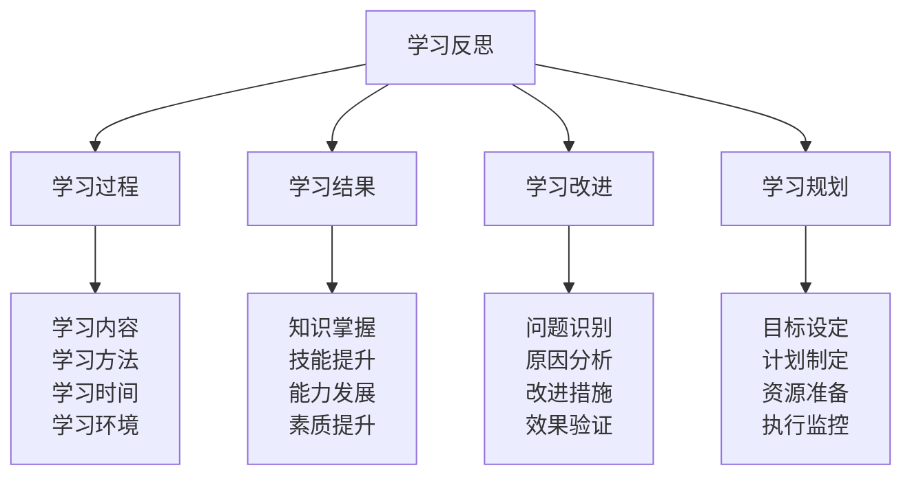
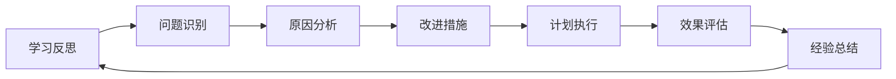

# 学习反思模板

## 📝 学习反思框架

### 反思金字塔结构

## 📅 学习反思记录表

### 基本信息
| 项目 | 内容 | 备注 |
|------|------|------|
| **反思日期** | 2024年___月___日 | |
| **学习周期** | 第___周 | |
| **学习主题** | | |
| **学习时长** | ___小时 | |
| **学习地点** | | |

### 学习过程反思
| 反思维度 | 具体内容 | 评分(1-10) | 反思记录 |
|----------|----------|------------|----------|
| **学习内容** | 学习的具体内容 | ___/10 | |
| **学习方法** | 采用的学习方法 | ___/10 | |
| **学习时间** | 时间安排和利用 | ___/10 | |
| **学习环境** | 学习环境和条件 | ___/10 | |
| **学习专注度** | 学习时的专注程度 | ___/10 | |
| **学习效率** | 学习效率和质量 | ___/10 | |

### 学习结果反思
| 反思维度 | 具体内容 | 评分(1-10) | 反思记录 |
|----------|----------|------------|----------|
| **知识掌握** | 对知识的理解和掌握 | ___/10 | |
| **技能提升** | 技能的提高和熟练 | ___/10 | |
| **能力发展** | 能力的培养和发展 | ___/10 | |
| **素质提升** | 综合素质的提升 | ___/10 | |
| **目标达成** | 学习目标的达成情况 | ___/10 | |
| **价值实现** | 学习价值的实现程度 | ___/10 | |

### 问题识别与分析
| 问题类型 | 具体问题 | 问题原因 | 影响程度 | 解决优先级 |
|----------|----------|----------|----------|------------|
| **学习问题** | | | 高/中/低 | 高/中/低 |
| **方法问题** | | | 高/中/低 | 高/中/低 |
| **时间问题** | | | 高/中/低 | 高/中/低 |
| **环境问题** | | | 高/中/低 | 高/中/低 |
| **能力问题** | | | 高/中/低 | 高/中/低 |
| **其他问题** | | | 高/中/低 | 高/中/低 |

### 改进措施制定
| 问题领域 | 改进目标 | 具体措施 | 时间安排 | 预期效果 | 评估方式 |
|----------|----------|----------|----------|----------|----------|
| **学习方法** | | | | | |
| **时间管理** | | | | | |
| **学习环境** | | | | | |
| **能力提升** | | | | | |
| **其他改进** | | | | | |

## 🎯 深度反思模板

### 学习体验反思
#### 1. 学习感受
- **积极感受**：
  - 最满意的学习体验：
  - 最有成就感的学习时刻：
  - 最享受的学习过程：

- **消极感受**：
  - 最困难的学习挑战：
  - 最沮丧的学习时刻：
  - 最困惑的学习问题：

#### 2. 学习收获
- **知识收获**：
  - 新学到的概念：
  - 理解更深入的理论：
  - 掌握的新技能：

- **能力收获**：
  - 提升的能力：
  - 发展的技能：
  - 增强的素质：

- **思维收获**：
  - 思维方式的改变：
  - 认知模式的更新：
  - 价值观念的发展：

#### 3. 学习挑战
- **技术挑战**：
  - 遇到的技术难题：
  - 解决的技术问题：
  - 未解决的技术问题：

- **认知挑战**：
  - 理解困难的概念：
  - 思维模式的冲突：
  - 知识整合的困难：

- **实践挑战**：
  - 实践中的困难：
  - 技能应用的障碍：
  - 实际操作的挑战：

### 学习策略反思
#### 1. 学习策略评估
| 策略类型 | 使用情况 | 效果评估 | 改进建议 |
|----------|----------|----------|----------|
| **费曼学习法** | 经常/偶尔/很少 | 很好/一般/较差 | |
| **刻意练习** | 经常/偶尔/很少 | 很好/一般/较差 | |
| **知识连接** | 经常/偶尔/很少 | 很好/一般/较差 | |
| **实践应用** | 经常/偶尔/很少 | 很好/一般/较差 | |
| **反思总结** | 经常/偶尔/很少 | 很好/一般/较差 | |

#### 2. 学习效率分析
- **高效学习时段**：
  - 时间段：
  - 学习内容：
  - 效率原因：

- **低效学习时段**：
  - 时间段：
  - 学习内容：
  - 效率原因：

- **效率提升策略**：
  - 时间优化：
  - 方法改进：
  - 环境改善：

### 学习目标反思
#### 1. 目标达成情况
| 目标类型 | 设定目标 | 实际达成 | 达成率 | 差距分析 |
|----------|----------|----------|--------|----------|
| **知识目标** | | | ___% | |
| **技能目标** | | | ___% | |
| **能力目标** | | | ___% | |
| **素质目标** | | | ___% | |

#### 2. 目标调整建议
- **目标过高**：
  - 调整建议：
  - 新的目标：

- **目标过低**：
  - 调整建议：
  - 新的目标：

- **目标偏离**：
  - 调整建议：
  - 新的目标：

## 📊 学习数据统计

### 学习时间统计
| 学习内容 | 计划时间 | 实际时间 | 时间差异 | 效率分析 |
|----------|----------|----------|----------|----------|
| **理论学习** | ___小时 | ___小时 | ___小时 | |
| **实践练习** | ___小时 | ___小时 | ___小时 | |
| **复习巩固** | ___小时 | ___小时 | ___小时 | |
| **反思总结** | ___小时 | ___小时 | ___小时 | |

### 学习效果统计
| 学习项目 | 掌握程度 | 应用能力 | 创新程度 | 综合评分 |
|----------|----------|----------|----------|----------|
| **概念理解** | ___/10 | ___/10 | ___/10 | ___/10 |
| **技能掌握** | ___/10 | ___/10 | ___/10 | ___/10 |
| **能力发展** | ___/10 | ___/10 | ___/10 | ___/10 |
| **素质提升** | ___/10 | ___/10 | ___/10 | ___/10 |

## 🔄 持续改进循环

### 改进循环图

### 改进行动计划
| 改进阶段 | 具体行动 | 时间安排 | 负责人员 | 评估标准 |
|----------|----------|----------|----------|----------|
| **问题识别** | 识别学习中的问题 | 每周 | 自己 | 问题清单 |
| **原因分析** | 分析问题产生原因 | 每周 | 自己 | 原因分析 |
| **改进措施** | 制定改进措施 | 每周 | 自己 | 措施清单 |
| **计划执行** | 执行改进计划 | 持续 | 自己 | 执行记录 |
| **效果评估** | 评估改进效果 | 每月 | 自己 | 效果评估 |
| **经验总结** | 总结改进经验 | 每月 | 自己 | 经验总结 |

## 🎓 费曼学习法应用

### 第一步：选择概念
选择"学习反思"作为学习概念

### 第二步：教授他人
用简单语言解释：
> "学习反思就是学习后回顾一下学习过程，看看学得怎么样，有什么收获，遇到什么问题，然后分析原因，制定改进措施，下次学习时就能做得更好。"

### 第三步：回顾简化
- **学习过程**：内容、方法、时间、环境
- **学习结果**：知识、技能、能力、素质
- **问题识别**：学习问题、方法问题、时间问题
- **改进措施**：方法改进、时间优化、环境改善

### 第四步：组织优化
建立反思与改进的关系：
- 学习过程 → [[02-技能更新记录|技能更新]]
- 学习结果 → [[03-经验总结方法|经验总结]]
- 问题识别 → [[04-知识体系维护|体系维护]]
- 改进措施 → [[raw/哲学/00-导航索引/01-学习路径指南|学习路径]]

## 🏃‍♂️ 刻意练习要点

### 反思技能练习
1. **观察练习**：练习客观观察学习过程
2. **分析练习**：练习深入分析学习问题
3. **总结练习**：练习总结学习经验
4. **改进练习**：练习制定改进措施

### 实践验证
- **定期反思**：定期进行学习反思
- **记录分析**：记录反思结果和分析
- **计划执行**：执行改进计划
- **效果验证**：验证改进效果

## 📋 反思检查清单

### 学习过程检查
- [ ] 学习内容是否合适
- [ ] 学习方法是否有效
- [ ] 学习时间是否合理
- [ ] 学习环境是否良好

### 学习结果检查
- [ ] 知识掌握是否充分
- [ ] 技能提升是否明显
- [ ] 能力发展是否显著
- [ ] 素质提升是否有效

### 问题识别检查
- [ ] 是否识别出主要问题
- [ ] 是否分析出问题原因
- [ ] 是否评估了问题影响
- [ ] 是否确定了解决优先级

### 改进措施检查
- [ ] 是否制定了改进措施
- [ ] 是否安排了时间计划
- [ ] 是否设定了预期效果
- [ ] 是否确定了评估方式

## 🔗 相关链接
- [[02-技能更新记录|技能更新记录]]
- [[03-经验总结方法|经验总结方法]]
- [[04-知识体系维护|知识体系维护]]
- [[raw/哲学/00-导航索引/01-学习路径指南|学习路径指南]]