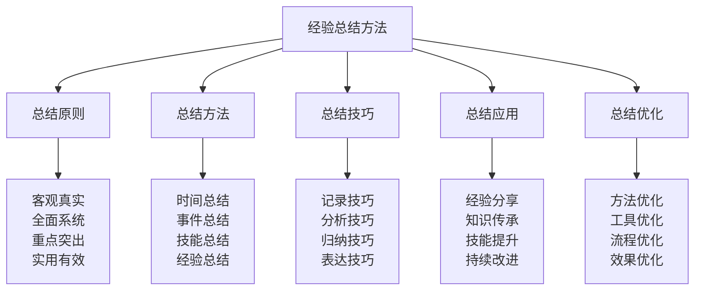

# 经验总结方法

## 📚 经验总结方法核心框架

### 总结方法金字塔

## 🎯 总结原则体系

### 客观真实原则
| 原则要素 | 原则内容 | 原则要求 | 原则标准 | 原则效果 |
|----------|----------|----------|----------|----------|
| **事实准确** | 事实记录准确 | 记录真实 | 事实准确 | 总结可靠 |
| **数据真实** | 数据记录真实 | 数据真实 | 数据准确 | 总结可靠 |
| **感受真实** | 感受记录真实 | 感受真实 | 感受真实 | 总结可靠 |
| **结果真实** | 结果记录真实 | 结果真实 | 结果准确 | 总结可靠 |
| **过程真实** | 过程记录真实 | 过程真实 | 过程完整 | 总结可靠 |

### 全面系统原则
| 原则要素 | 原则内容 | 原则要求 | 原则标准 | 原则效果 |
|----------|----------|----------|----------|----------|
| **内容全面** | 内容覆盖全面 | 覆盖全面 | 内容完整 | 总结全面 |
| **角度全面** | 角度分析全面 | 角度多样 | 角度全面 | 总结全面 |
| **层次全面** | 层次分析全面 | 层次清晰 | 层次完整 | 总结全面 |
| **时间全面** | 时间跨度全面 | 时间完整 | 时间全面 | 总结全面 |
| **空间全面** | 空间范围全面 | 空间完整 | 空间全面 | 总结全面 |

### 重点突出原则
| 原则要素 | 原则内容 | 原则要求 | 原则标准 | 原则效果 |
|----------|----------|----------|----------|----------|
| **关键重点** | 关键问题重点 | 重点突出 | 重点明确 | 总结有效 |
| **核心重点** | 核心内容重点 | 重点突出 | 重点明确 | 总结有效 |
| **价值重点** | 价值内容重点 | 重点突出 | 重点明确 | 总结有效 |
| **创新重点** | 创新内容重点 | 重点突出 | 重点明确 | 总结有效 |
| **应用重点** | 应用内容重点 | 重点突出 | 重点明确 | 总结有效 |

### 实用有效原则
| 原则要素 | 原则内容 | 原则要求 | 原则标准 | 原则效果 |
|----------|----------|----------|----------|----------|
| **方法实用** | 总结方法实用 | 方法实用 | 方法有效 | 总结实用 |
| **内容实用** | 总结内容实用 | 内容实用 | 内容有效 | 总结实用 |
| **工具实用** | 总结工具实用 | 工具实用 | 工具有效 | 总结实用 |
| **流程实用** | 总结流程实用 | 流程实用 | 流程有效 | 总结实用 |
| **应用实用** | 总结应用实用 | 应用实用 | 应用有效 | 总结实用 |

## 🔧 总结方法体系

### 时间总结方法
| 方法要素 | 方法内容 | 方法特点 | 方法标准 | 方法效果 |
|----------|----------|----------|----------|----------|
| **日总结** | 每日经验总结 | 总结及时 | 总结完整 | 方法有效 |
| **周总结** | 每周经验总结 | 总结系统 | 总结深入 | 方法有效 |
| **月总结** | 每月经验总结 | 总结全面 | 总结深入 | 方法有效 |
| **季总结** | 每季经验总结 | 总结宏观 | 总结深入 | 方法有效 |
| **年总结** | 每年经验总结 | 总结全面 | 总结深入 | 方法有效 |

### 事件总结方法
| 方法要素 | 方法内容 | 方法特点 | 方法标准 | 方法效果 |
|----------|----------|----------|----------|----------|
| **成功事件** | 成功事件总结 | 总结积极 | 总结深入 | 方法有效 |
| **失败事件** | 失败事件总结 | 总结客观 | 总结深入 | 方法有效 |
| **重要事件** | 重要事件总结 | 总结重点 | 总结深入 | 方法有效 |
| **创新事件** | 创新事件总结 | 总结创新 | 总结深入 | 方法有效 |
| **学习事件** | 学习事件总结 | 总结学习 | 总结深入 | 方法有效 |

### 技能总结方法
| 方法要素 | 方法内容 | 方法特点 | 方法标准 | 方法效果 |
|----------|----------|----------|----------|----------|
| **技能学习** | 技能学习总结 | 总结学习 | 总结深入 | 方法有效 |
| **技能应用** | 技能应用总结 | 总结应用 | 总结深入 | 方法有效 |
| **技能提升** | 技能提升总结 | 总结提升 | 总结深入 | 方法有效 |
| **技能创新** | 技能创新总结 | 总结创新 | 总结深入 | 方法有效 |
| **技能传承** | 技能传承总结 | 总结传承 | 总结深入 | 方法有效 |

### 经验总结方法
| 方法要素 | 方法内容 | 方法特点 | 方法标准 | 方法效果 |
|----------|----------|----------|----------|----------|
| **成功经验** | 成功经验总结 | 总结成功 | 总结深入 | 方法有效 |
| **失败教训** | 失败教训总结 | 总结教训 | 总结深入 | 方法有效 |
| **最佳实践** | 最佳实践总结 | 总结实践 | 总结深入 | 方法有效 |
| **创新经验** | 创新经验总结 | 总结创新 | 总结深入 | 方法有效 |
| **管理经验** | 管理经验总结 | 总结管理 | 总结深入 | 方法有效 |

## 🎨 总结技巧体系

### 记录技巧方法
| 技巧要素 | 技巧内容 | 技巧特点 | 技巧标准 | 技巧效果 |
|----------|----------|----------|----------|----------|
| **及时记录** | 及时记录技巧 | 记录及时 | 记录完整 | 技巧有效 |
| **详细记录** | 详细记录技巧 | 记录详细 | 记录准确 | 技巧有效 |
| **分类记录** | 分类记录技巧 | 记录分类 | 记录清晰 | 技巧有效 |
| **重点记录** | 重点记录技巧 | 记录重点 | 记录突出 | 技巧有效 |
| **创新记录** | 创新记录技巧 | 记录创新 | 记录新颖 | 技巧有效 |

### 分析技巧方法
| 技巧要素 | 技巧内容 | 技巧特点 | 技巧标准 | 技巧效果 |
|----------|----------|----------|----------|----------|
| **深度分析** | 深度分析技巧 | 分析深入 | 分析透彻 | 技巧有效 |
| **对比分析** | 对比分析技巧 | 分析对比 | 分析客观 | 技巧有效 |
| **因果分析** | 因果分析技巧 | 分析因果 | 分析准确 | 技巧有效 |
| **趋势分析** | 趋势分析技巧 | 分析趋势 | 分析准确 | 技巧有效 |
| **创新分析** | 创新分析技巧 | 分析创新 | 分析新颖 | 技巧有效 |

### 归纳技巧方法
| 技巧要素 | 技巧内容 | 技巧特点 | 技巧标准 | 技巧效果 |
|----------|----------|----------|----------|----------|
| **逻辑归纳** | 逻辑归纳技巧 | 归纳逻辑 | 归纳清晰 | 技巧有效 |
| **分类归纳** | 分类归纳技巧 | 归纳分类 | 归纳清晰 | 技巧有效 |
| **层次归纳** | 层次归纳技巧 | 归纳层次 | 归纳清晰 | 技巧有效 |
| **重点归纳** | 重点归纳技巧 | 归纳重点 | 归纳突出 | 技巧有效 |
| **创新归纳** | 创新归纳技巧 | 归纳创新 | 归纳新颖 | 技巧有效 |

### 表达技巧方法
| 技巧要素 | 技巧内容 | 技巧特点 | 技巧标准 | 技巧效果 |
|----------|----------|----------|----------|----------|
| **清晰表达** | 清晰表达技巧 | 表达清晰 | 表达准确 | 技巧有效 |
| **简洁表达** | 简洁表达技巧 | 表达简洁 | 表达精炼 | 技巧有效 |
| **生动表达** | 生动表达技巧 | 表达生动 | 表达有趣 | 技巧有效 |
| **逻辑表达** | 逻辑表达技巧 | 表达逻辑 | 表达清晰 | 技巧有效 |
| **创新表达** | 创新表达技巧 | 表达创新 | 表达新颖 | 技巧有效 |

## 🚀 总结应用体系

### 经验分享应用
| 应用要素 | 应用内容 | 应用方法 | 应用标准 | 应用效果 |
|----------|----------|----------|----------|----------|
| **团队分享** | 团队经验分享 | 分享交流 | 分享充分 | 应用有效 |
| **社区分享** | 社区经验分享 | 分享交流 | 分享充分 | 应用有效 |
| **网络分享** | 网络经验分享 | 分享传播 | 分享广泛 | 应用有效 |
| **专业分享** | 专业经验分享 | 分享专业 | 分享专业 | 应用有效 |
| **创新分享** | 创新经验分享 | 分享创新 | 分享创新 | 应用有效 |

### 知识传承应用
| 应用要素 | 应用内容 | 应用方法 | 应用标准 | 应用效果 |
|----------|----------|----------|----------|----------|
| **师徒传承** | 师徒知识传承 | 传承教学 | 传承有效 | 应用有效 |
| **团队传承** | 团队知识传承 | 传承培训 | 传承有效 | 应用有效 |
| **组织传承** | 组织知识传承 | 传承制度 | 传承有效 | 应用有效 |
| **社会传承** | 社会知识传承 | 传承传播 | 传承有效 | 应用有效 |
| **文化传承** | 文化知识传承 | 传承文化 | 传承有效 | 应用有效 |

### 技能提升应用
| 应用要素 | 应用内容 | 应用方法 | 应用标准 | 应用效果 |
|----------|----------|----------|----------|----------|
| **个人提升** | 个人技能提升 | 提升训练 | 提升有效 | 应用有效 |
| **团队提升** | 团队技能提升 | 提升培训 | 提升有效 | 应用有效 |
| **组织提升** | 组织技能提升 | 提升发展 | 提升有效 | 应用有效 |
| **行业提升** | 行业技能提升 | 提升推广 | 提升有效 | 应用有效 |
| **社会提升** | 社会技能提升 | 提升普及 | 提升有效 | 应用有效 |

### 持续改进应用
| 应用要素 | 应用内容 | 应用方法 | 应用标准 | 应用效果 |
|----------|----------|----------|----------|----------|
| **方法改进** | 总结方法改进 | 改进优化 | 改进有效 | 应用有效 |
| **工具改进** | 总结工具改进 | 改进优化 | 改进有效 | 应用有效 |
| **流程改进** | 总结流程改进 | 改进优化 | 改进有效 | 应用有效 |
| **系统改进** | 总结系统改进 | 改进优化 | 改进有效 | 应用有效 |
| **文化改进** | 总结文化改进 | 改进优化 | 改进有效 | 应用有效 |

## 🔄 总结优化体系

### 方法优化改进
| 优化要素 | 优化内容 | 优化方法 | 优化标准 | 优化效果 |
|----------|----------|----------|----------|----------|
| **方法创新** | 总结方法创新 | 方法创新 | 创新有效 | 优化有效 |
| **方法整合** | 总结方法整合 | 方法整合 | 整合有效 | 优化有效 |
| **方法简化** | 总结方法简化 | 方法简化 | 简化有效 | 优化有效 |
| **方法标准化** | 总结方法标准化 | 方法标准化 | 标准化有效 | 优化有效 |
| **方法个性化** | 总结方法个性化 | 方法个性化 | 个性化有效 | 优化有效 |

### 工具优化改进
| 优化要素 | 优化内容 | 优化方法 | 优化标准 | 优化效果 |
|----------|----------|----------|----------|----------|
| **工具升级** | 总结工具升级 | 工具升级 | 升级有效 | 优化有效 |
| **工具集成** | 总结工具集成 | 工具集成 | 集成有效 | 优化有效 |
| **工具定制** | 总结工具定制 | 工具定制 | 定制有效 | 优化有效 |
| **工具智能化** | 总结工具智能化 | 工具智能化 | 智能化有效 | 优化有效 |
| **工具移动化** | 总结工具移动化 | 工具移动化 | 移动化有效 | 优化有效 |

### 流程优化改进
| 优化要素 | 优化内容 | 优化方法 | 优化标准 | 优化效果 |
|----------|----------|----------|----------|----------|
| **流程简化** | 总结流程简化 | 流程简化 | 简化有效 | 优化有效 |
| **流程标准化** | 总结流程标准化 | 流程标准化 | 标准化有效 | 优化有效 |
| **流程自动化** | 总结流程自动化 | 流程自动化 | 自动化有效 | 优化有效 |
| **流程智能化** | 总结流程智能化 | 流程智能化 | 智能化有效 | 优化有效 |
| **流程个性化** | 总结流程个性化 | 流程个性化 | 个性化有效 | 优化有效 |

### 效果优化改进
| 优化要素 | 优化内容 | 优化方法 | 优化标准 | 优化效果 |
|----------|----------|----------|----------|----------|
| **效果提升** | 总结效果提升 | 效果提升 | 提升有效 | 优化有效 |
| **效果稳定** | 总结效果稳定 | 效果稳定 | 稳定有效 | 优化有效 |
| **效果扩大** | 总结效果扩大 | 效果扩大 | 扩大有效 | 优化有效 |
| **效果深化** | 总结效果深化 | 效果深化 | 深化有效 | 优化有效 |
| **效果创新** | 总结效果创新 | 效果创新 | 创新有效 | 优化有效 |

## 🎓 费曼学习法应用

### 第一步：选择概念
选择"经验总结方法"作为学习概念

### 第二步：教授他人
用简单语言解释：
> "经验总结方法就是总结学习、工作、生活中经验的方法，包括总结原则、总结方法、总结技巧、总结应用、总结优化。关键是客观真实、全面系统、重点突出、实用有效。"

### 第三步：回顾简化
- **总结原则**：客观真实、全面系统、重点突出、实用有效
- **总结方法**：时间总结、事件总结、技能总结、经验总结
- **总结技巧**：记录技巧、分析技巧、归纳技巧、表达技巧
- **总结应用**：经验分享、知识传承、技能提升、持续改进
- **总结优化**：方法优化、工具优化、流程优化、效果优化

### 第四步：组织优化
建立经验总结与技能的关系：
- 总结原则 → [[05-实践与评估/03-持续改进/01-学习反思模板|学习反思]]
- 总结方法 → [[05-实践与评估/03-持续改进/02-技能更新记录|技能更新]]
- 总结技巧 → [[05-实践与评估/02-案例研究|案例研究]]
- 总结应用 → [[04-创新层-进阶发展/04-文化传承|文化传承]]
- 总结优化 → [[05-实践与评估/03-持续改进/04-知识体系维护|体系维护]]

## 🏃‍♂️ 刻意练习要点

### 经验总结练习
1. **原则练习**：练习总结原则应用
2. **方法练习**：练习总结方法运用
3. **技巧练习**：练习总结技巧掌握
4. **应用练习**：练习总结应用实践

### 练习方法
- **理论学习**：学习经验总结理论
- **实践总结**：实际进行经验总结
- **技巧训练**：训练总结技巧
- **应用实践**：实践总结应用

### 实践验证
- **总结测试**：测试经验总结能力
- **技巧验证**：验证总结技巧效果
- **应用评估**：评估总结应用效果
- **持续优化**：持续优化总结方法

## 📋 经验总结检查清单

### 总结原则检查
- [ ] 客观真实是否做到
- [ ] 全面系统是否完整
- [ ] 重点突出是否明确
- [ ] 实用有效是否达到

### 总结方法检查
- [ ] 时间总结是否及时
- [ ] 事件总结是否深入
- [ ] 技能总结是否准确
- [ ] 经验总结是否充分

### 总结技巧检查
- [ ] 记录技巧是否熟练
- [ ] 分析技巧是否深入
- [ ] 归纳技巧是否清晰
- [ ] 表达技巧是否有效

### 总结应用检查
- [ ] 经验分享是否充分
- [ ] 知识传承是否有效
- [ ] 技能提升是否明显
- [ ] 持续改进是否有效

### 总结优化检查
- [ ] 方法优化是否有效
- [ ] 工具优化是否实用
- [ ] 流程优化是否顺畅
- [ ] 效果优化是否明显

## 🎯 经验总结策略

### 总结策略
1. **原则导向**：以总结原则为导向
2. **方法系统**：运用系统总结方法
3. **技巧熟练**：熟练掌握总结技巧
4. **应用有效**：有效应用总结结果

### 发展策略
- **方法发展**：持续发展总结方法
- **技巧发展**：持续发展总结技巧
- **应用发展**：持续发展总结应用
- **优化发展**：持续发展总结优化

## 🔗 相关链接
- [[露营/05-实践与评估/03-持续改进/01-学习反思模板|学习反思模板]]
- [[02-技能更新记录|技能更新记录]]
- [[04-知识体系维护|知识体系维护]]
- [[02-案例研究/01-成功案例解析|成功案例解析]]
- [[04-创新层-进阶发展/04-文化传承|文化传承]]