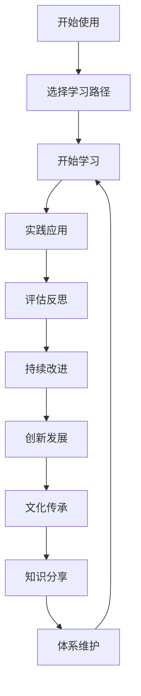
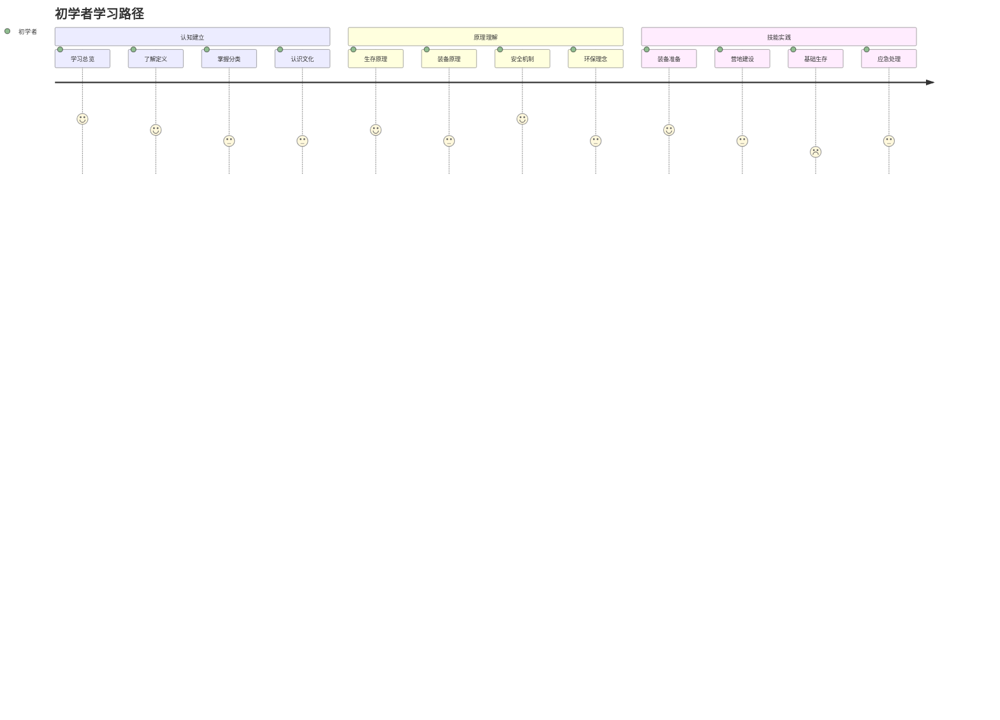
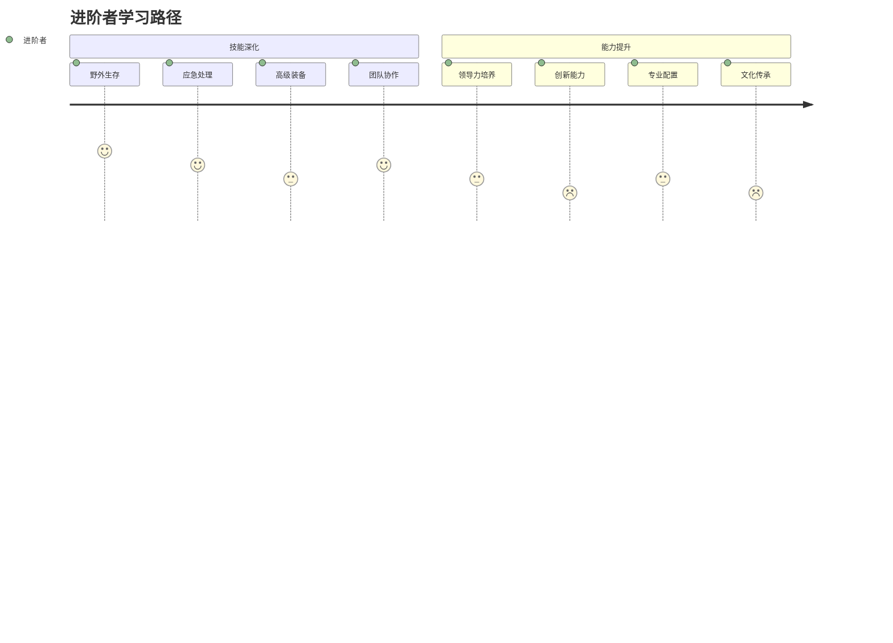
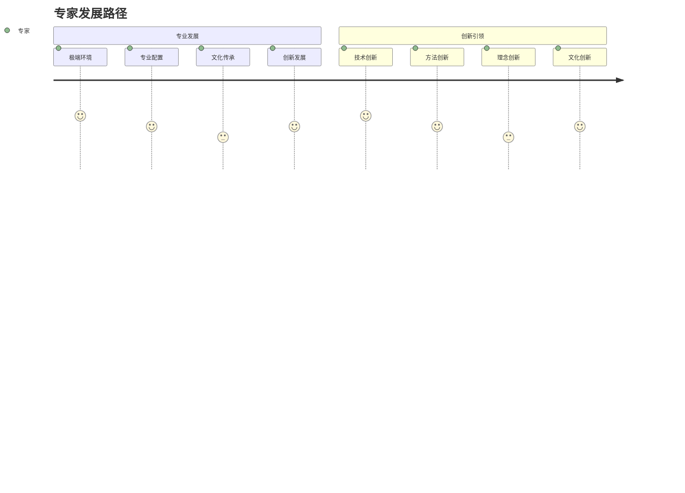
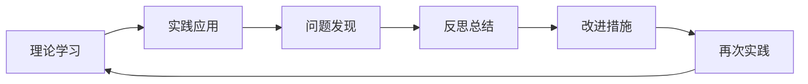

# 🏕️ 露营知识体系使用指南

## 🎯 使用指南概览

### 知识体系使用流程

## 📚 学习路径选择

### 🎯 初学者路径（0-6个月）

**学习建议**：
- 从[[00-总览与索引/00-露营知识体系总览|知识体系总览]]开始
- 按层次顺序学习：认知层 → 理解层 → 应用层
- 重点掌握基础概念和核心技能
- 每学完一个模块进行实践验证

### 🚀 进阶者路径（6个月-2年）

**学习建议**：
- 可以直接从[[03-应用层-实践技能|应用层]]开始
- 重点强化实践技能和团队协作
- 开始关注创新层的内容
- 参与实际露营活动验证技能

### 🏆 专家路径（2年以上）

**学习建议**：
- 重点关注[[04-创新层-进阶发展|创新层]]
- 承担文化传承责任
- 创新发展新的方法和理念
- 指导他人学习和实践

## 🔍 学习方法指导

### 🎓 费曼学习法应用

#### 第一步：选择概念
- 从[[00-总览与索引/05-关键概念速查|关键概念速查]]中选择要学习的概念
- 建议从基础概念开始，逐步深入

#### 第二步：教授他人
- 用简单语言向朋友解释概念
- 制作知识卡片进行自我测试
- 录制讲解视频检验理解程度

#### 第三步：回顾简化
- 识别知识盲点和理解困难
- 重新学习薄弱环节
- 简化复杂概念

#### 第四步：组织优化
- 建立知识点间的连接
- 形成完整的知识体系
- 优化知识结构

### 🏃‍♂️ 刻意练习策略

#### 技能分解练习
1. **基础技能**：[[03-应用层-实践技能/01-装备准备/03-帐篷搭建技巧|帐篷搭建]]
2. **进阶技能**：[[03-应用层-实践技能/03-野外生存/01-方向识别技能|方向识别]]
3. **高级技能**：[[04-创新层-进阶发展/01-高级技巧/01-极端环境露营|极端环境应对]]

#### 练习方法
- **重复练习**：每个技能至少练习10次
- **反馈修正**：记录每次练习的问题
- **逐步提升**：从简单环境到复杂环境

#### 练习记录
使用[[05-实践与评估/03-持续改进/01-学习反思模板|学习反思模板]]记录练习过程和效果

## 📊 学习进度管理

### 📈 进度追踪
使用[[00-总览与索引/04-学习进度追踪|学习进度追踪]]记录学习进度：

| 学习阶段 | 完成状态 | 学习时间 | 评估结果 | 下一步计划 |
|----------|----------|----------|----------|------------|
| **认知层** | ✅ 已完成 | 2-3周 | 优秀 | 进入理解层 |
| **理解层** | 🔄 进行中 | 3-4周 | 良好 | 继续学习 |
| **应用层** | ⏳ 待开始 | 4-6周 | - | 准备开始 |
| **创新层** | ⏳ 待开始 | 6-8周 | - | 等待应用层完成 |

### 🎯 目标设定
- **短期目标**：完成当前层次学习
- **中期目标**：掌握核心技能
- **长期目标**：达到专业水平

### 📋 学习检查
使用[[05-实践与评估/01-技能评估体系/01-自我评估清单|自我评估清单]]定期检查学习效果

## 🔗 知识连接使用

### 🌐 内部连接
- **纵向连接**：四层之间的递进关系
- **横向连接**：同层模块间的协同关系
- **交叉连接**：跨层模块间的深度整合

### 🔍 连接查找
1. **按层次查找**：根据学习阶段选择对应层次
2. **按主题查找**：根据具体需求选择相关主题
3. **按技能查找**：根据技能需求选择相关模块
4. **按问题查找**：根据具体问题查找解决方案

### 📚 资源利用
使用[[00-总览与索引/03-资源索引|资源索引]]查找学习资源：
- 教材资源
- 视频资源
- 实践工具
- 应用软件

## 🛠️ 实践应用指导

### 🎯 实践项目设计
使用[[05-实践与评估/01-技能评估体系/03-实践项目设计|实践项目设计]]规划实践项目：

| 项目类型 | 项目内容 | 项目目标 | 项目时间 | 评估方式 |
|----------|----------|----------|----------|----------|
| **基础项目** | 帐篷搭建练习 | 掌握搭建技能 | 1周 | 技能测试 |
| **进阶项目** | 营地建设实践 | 学会营地建设 | 2周 | 实践评估 |
| **高级项目** | 野外生存挑战 | 掌握生存技能 | 1个月 | 综合评估 |
| **创新项目** | 文化传承活动 | 承担传承责任 | 3个月 | 社会影响 |

### 📊 实践记录
- **实践日志**：记录每次实践的过程和结果
- **问题记录**：记录实践中遇到的问题
- **改进记录**：记录改进措施和效果
- **经验总结**：总结实践经验和教训

### 🔄 实践循环

## 📈 评估与改进

### 🎯 自我评估
使用[[05-实践与评估/01-技能评估体系/01-自我评估清单|自我评估清单]]进行定期评估：

| 评估维度 | 评估内容 | 评估频率 | 改进措施 |
|----------|----------|----------|----------|
| **知识掌握** | 概念理解、原理掌握 | 每月 | 加强理论学习 |
| **技能熟练** | 技能操作、技能应用 | 每月 | 增加实践练习 |
| **能力发展** | 学习能力、实践能力 | 每季度 | 能力培养训练 |
| **综合素质** | 安全意识、环保意识 | 每季度 | 素质提升活动 |

### 🔄 持续改进
使用[[05-实践与评估/03-持续改进/01-学习反思模板|学习反思模板]]进行持续改进：

1. **问题识别**：识别学习中的问题
2. **原因分析**：分析问题产生的原因
3. **改进措施**：制定改进措施
4. **效果验证**：验证改进效果

### 📊 质量保证
使用[[05-实践与评估/03-持续改进/04-知识体系维护|知识体系维护]]保证学习质量：

- **内容质量**：确保学习内容准确
- **方法质量**：确保学习方法有效
- **效果质量**：确保学习效果明显
- **持续质量**：确保持续改进

## 🌟 创新发展指导

### 🚀 创新思维培养
1. **问题导向**：从实际问题出发
2. **多角度思考**：从不同角度分析问题
3. **跨界融合**：融合不同领域的知识
4. **实践验证**：通过实践验证创新想法

### 🎯 创新实践
- **方法创新**：创新学习方法
- **技能创新**：创新技能应用
- **理念创新**：创新教育理念
- **文化创新**：创新文化传承

### 📚 知识分享
- **经验分享**：分享学习经验
- **技能分享**：分享技能技巧
- **理念分享**：分享教育理念
- **文化分享**：分享文化价值

## 🔧 系统维护指导

### 📊 内容维护
- **定期更新**：定期更新过时内容
- **错误修正**：及时修正错误信息
- **内容补充**：补充缺失内容
- **质量检查**：检查内容质量

### 🏗️ 结构维护
- **结构优化**：优化知识结构
- **连接维护**：维护知识连接
- **层次调整**：调整知识层次
- **分类优化**：优化知识分类

### 🔄 更新维护
- **版本管理**：管理知识版本
- **更新记录**：记录更新内容
- **变更追踪**：追踪变更过程
- **回滚机制**：建立回滚机制

## 🎯 使用建议

### 💡 学习效率提升
1. **番茄工作法**：25分钟专注学习
2. **间隔重复**：定期复习已学内容
3. **主动回忆**：不看书回忆知识点
4. **知识连接**：建立知识点间的联系

### 🎯 个性化学习
1. **兴趣导向**：从兴趣点开始学习
2. **问题导向**：从实际问题开始学习
3. **目标导向**：从学习目标开始学习
4. **实践导向**：从实践需求开始学习

### 🔄 学习循环
1. **学习**：学习新知识
2. **实践**：实践应用
3. **反思**：反思总结
4. **改进**：改进提升

## 📞 支持与帮助

### 🤝 社区支持
- **学习交流**：与其他学习者交流
- **经验分享**：分享学习经验
- **问题讨论**：讨论学习问题
- **创新合作**：合作创新发展

### 📧 反馈渠道
- **内容反馈**：对内容质量的反馈
- **功能建议**：对功能改进的建议
- **学习需求**：对学习需求的建议
- **创新发展**：对创新发展的建议

## 🔗 相关链接
- [[00-总览与索引/00-露营知识体系总览|知识体系总览]]
- [[00-总览与索引/01-学习路径指南|学习路径指南]]
- [[00-总览与索引/02-知识地图|知识地图]]
- [[00-总览与索引/03-资源索引|资源索引]]
- [[00-总览与索引/04-学习进度追踪|学习进度追踪]]
- [[00-总览与索引/05-关键概念速查|关键概念速查]]

---

## 🎉 开始您的学习之旅

这个使用指南为您提供了完整的学习指导，帮助您充分利用这个知识体系。无论您是初学者还是专家，都能在这里找到适合的学习方法和路径。

**立即开始**：选择您的学习路径，开始探索露营的精彩世界！

---

*最后更新：2024年*
*版本：1.0*
*作者：AI助手*
*许可证：知识共享*
